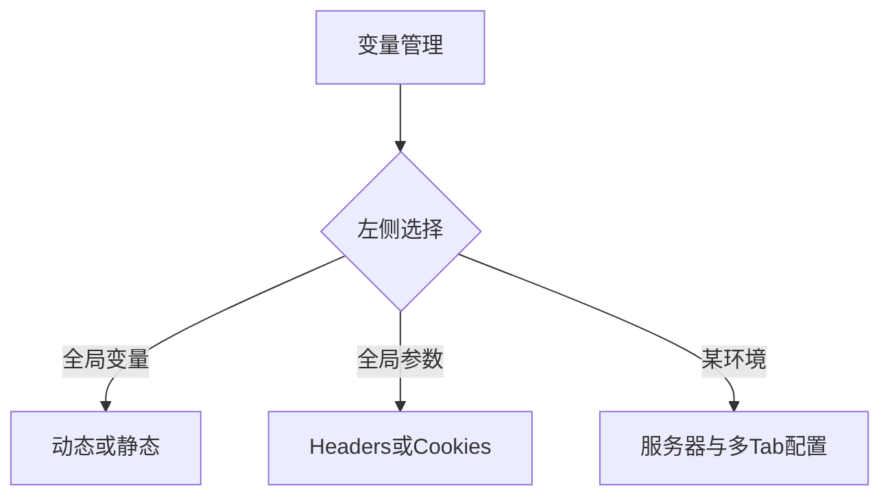
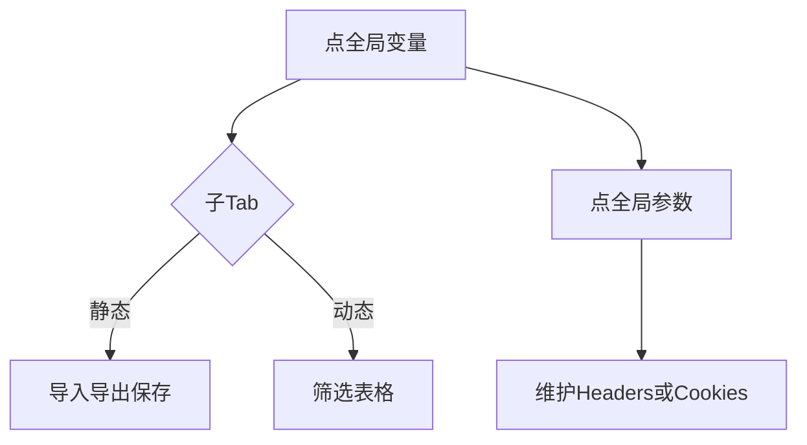
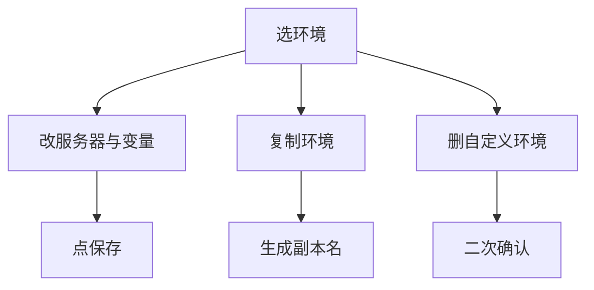

# 1 需求说明

## 1.1 变量管理

### 模块概述

变量管理在同一窗口内维护全局变量、全局参数与多环境变量（含应用服务器、环境级 Headers、设备、中间件固定项等）。目标用户为测试工程师。

**与其他模块的关联关系**：
- **用例管理**：步骤动态值、环境切换依赖本模块。
- **测试运行**：任务运行环境参数来源于本模块。

---

### 1.1.1 全局变量与全局参数

#### 功能概述

左侧上部入口「全局变量」：含动态变量与静态变量两子页签；静态变量支持表格行内编辑、YAML 导入导出、保存与搜索；动态变量提供组合筛选（用例标识、用例名称模糊、变量名、所属模块等），表内用例标识可跳转用例管理并定位。左侧「全局参数」：Headers / Cookies 子页签，工具栏添加与保存，支持搜索。

• **整体业务流程图**

• **用户场景：** 工程师维护跨用例复用的令牌、超时等静态量，并查看由用例回写的动态变量清单。

• **功能描述：** 分层呈现全局范围配置，静态支持文件交换，动态强调只读聚合展示与跳转。

• **优先级：** 高

• **输入/前置条件：** 用户登录后在版本用例开发窗口进入【变量管理】。

• **需求描述：**

1. **功能逻辑说明**

   静态变量：工具栏含添加变量、导出、导入、保存；导入仅接受 `.yaml/.yml`，否则拒绝提示；解析后按约定结构覆盖静态列表。导出生成包含静态与动态段的 YAML 文件下载。动态变量：无整页保存按钮；筛选条件 AND；重置清空。全局参数：两子 Tab 各自维护键值与描述类列。

2. **界面布局与交互**

   左右分栏；右侧标题与工具条随上下文变化；Tab 可附说明类提示。

3. **新增/编辑功能**

   静态/全局参数以行内编辑为主；导入为独立弹窗上传。

4. **删除/危险操作**

   行级删除变量/参数前按实现使用确认或即时删除提示（与 PRD 一致）。

5. **数据处理规则**

   动态变量展示类型文案如「全局变量」；导入结构示例见 PRD。

6. **异常场景**

   a) **网络异常**：保存失败重试提示。  
   b) **权限不足**：导入导出限制说明。  
   c) **数据异常/业务冲突**：YAML 格式错误、重名变量保存失败。

7. **影响范围**

   a) 用例管理：动态值选择器。  
   b) 测试运行：环境参数。

• **输出/后置条件：** 全局配置被保存后即时作用于版本内执行准备。

• **性能指标：** 查询筛选宜 ≤ 1 秒。

• **补充说明：** 无

---

### 1.1.2 环境列表与环境内配置

#### 功能概述

左侧下部为环境列表：内置 DEV/SIT/UAT/PRD 不可删除、不可重命名；自定义环境可添加、复制、重命名、删除。行尾「…」悬停：重命名/复制/删除（内置环境重命名与删除禁用并提示原因）。底部「添加环境」进入新建流程。选中环境后右侧展示：标题区名称 + 编辑图标（仅自定义）+ 保存；应用服务器表格行内编辑；环境配置主 Tab：自定义环境变量、Headers、设备配置（弹窗表单维护设备）、中间件配置（子 Tab Mysql/Clickhouse/Kafka，固定键行，仅值可改）。

• **整体业务流程图**

• **用户场景：** 工程师为多套联调环境复制出一套「预发」副本并改主机与账号。

• **功能描述：** 提供环境级全套配置治理，内置环境保护策略明确。

• **优先级：** 高

• **输入/前置条件：** 已在变量管理页选中某一环境行。

• **需求描述：**

1. **功能逻辑说明**

   添加环境：右侧新建区保存后左侧列表新增，标识规则 `ENV_{环境名}`。复制：生成「原名_副本」，重名递增序号，复制变量/服务器/设备/中间件等（可先占位）。重命名：自定义环境唯一（不区分大小写）。删除：仅自定义，二次确认。

2. **界面布局与交互**

   中间件配置 **不展示** 与其它 Tab 相同的顶栏「添加+搜索」；内层子 Tab + 三列表格。

3. **新增/编辑功能**

   设备配置通过「+ 添加设备」弹窗录入：设备名称、协议、IP、端口、devsn、手机号、车牌号、车牌颜色、备注等。

4. **删除/危险操作**

   删除自定义环境二次确认。

5. **数据处理规则**

   内置环境允许复制与编辑其下配置但不可改名删名；与 PRD 一致。

6. **异常场景**

   a) **网络异常**：保存失败提示。  
   b) **权限不足**：限制对环境的新增删除。  
   c) **数据异常/业务冲突**：重名环境、非法端口格式校验。

7. **影响范围**

   a) 用例管理：环境切换默认主机。  
   b) 测试运行：任务所选运行环境映射本配置。

• **输出/后置条件：** 环境配置保存后任务执行可取最新值。

• **性能指标：** 无

• **补充说明：** 详见 PRD §4.6。

---

# 附录

## 附录A：用户角色说明

| 角色名称 | 角色描述 | 主要权限 | 使用场景 |
|---------|---------|---------|---------|
| 测试工程师 | 配置执行环境 | 变量与环境维护 | 联调 |

## 附录B：术语表

| 术语 | 定义 |
|-----|------|
| 内置环境 | DEV/SIT/UAT/PRD 四类系统预置环境 |

## 附录C：参考文档

- 页面需求与交互规格：`docs/prd/V1.0.0/ATO_V1.0.0-页面需求与交互规格.md`
- 原始页面需求：`prompt/AutoTestOne-V1.0.0 原始页面需求设计.md`
- 模块拆分规则：`.cursor/rules/requirements-module-split.mdc`

## 变更历史

| 版本 | 日期 | 变更类型 | 变更内容 | 变更原因 | 影响范围 |
|------|------|---------|---------|---------|---------|
| V1.0.0 | 2026-04-14 | 新增 | 模块化需求文档 | 对齐 MOD-CASE-VAR | 版本用例开发 |
