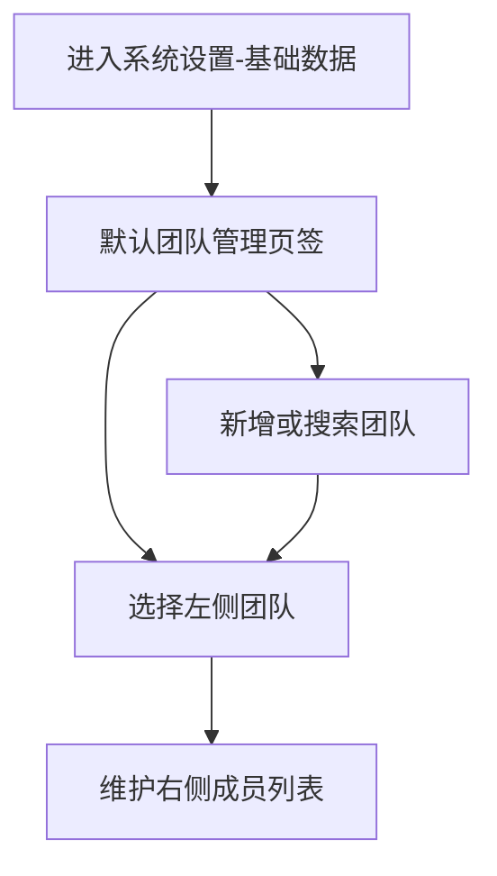
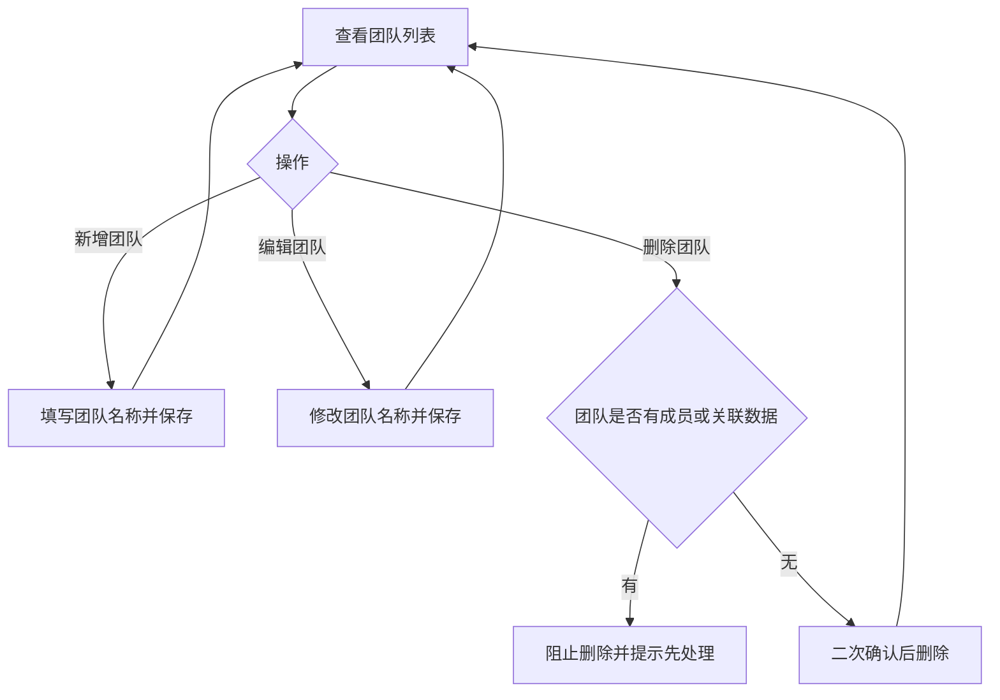
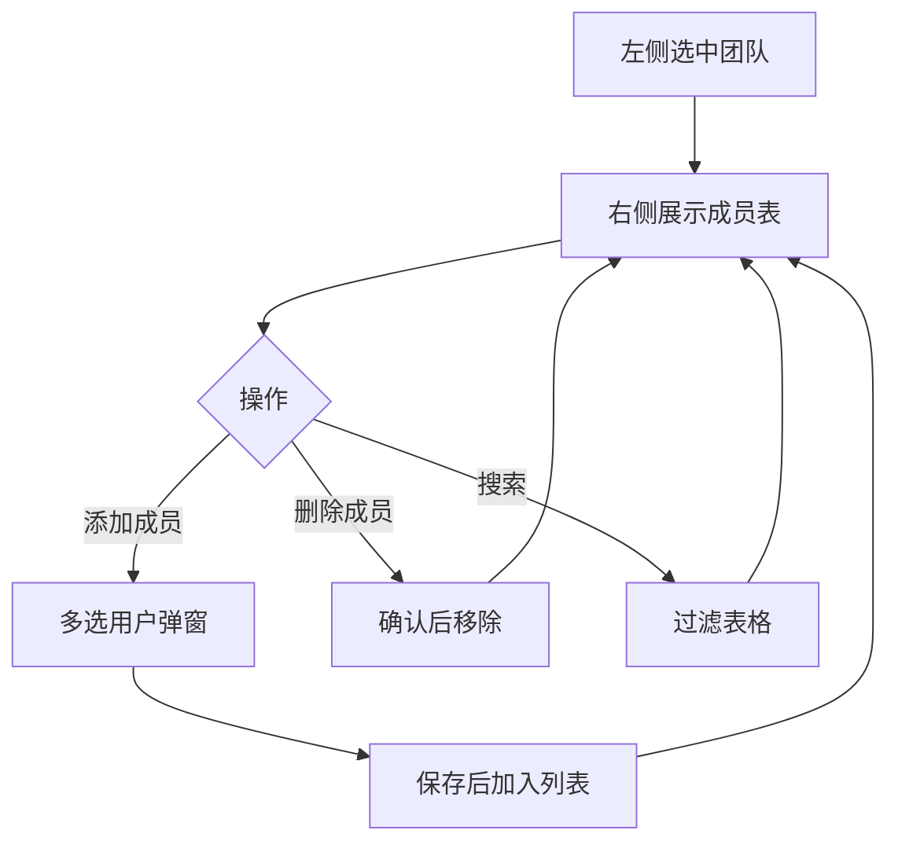

# 1 需求说明

## 1.1 团队管理

### 模块概述

团队管理用于维护组织维度与成员归属，为项目归属、负责人选择等提供基础数据。目标用户为测试负责人、平台管理员。

**与其他模块的关联关系**：
- **用户管理**：添加成员时从已同步用户中选择。
- **项目管理**：项目卡片与新建项目时的「所属团队」依赖本模块团队列表。



---

### 1.1.1 团队目录与团队维护

#### 功能概述

在基础数据页左侧维护团队列表，支持新增、编辑、搜索、删除团队。

• **整体业务流程图**



• **用户场景：** 测试负责人在新小组接入平台时，需要先创建团队名称，以便后续把项目挂到该团队下。

• **功能描述：** 提供团队的增删改查与搜索能力，团队名称在平台内需唯一。

• **优先级：** 高

• **输入/前置条件：** 用户登录后，从左侧菜单进入【系统设置】-【基础数据】页面，且当前页签为【团队管理】。

• **需求描述：**

1. **功能逻辑说明**

   团队列表展示在页面左侧约两成宽度区域；用户通过搜索缩小列表范围。新增团队时校验名称必填与唯一；删除前需判断：若团队下仍有成员，则不允许删除并提示「删除团队请先移除团队下的项目数据！」类指引；无成员时走统一危险操作二次确认（文案「此操作不可恢复，是否继续？」）。编辑团队通过弹窗回显团队名称。

   ```mermaid
   flowchart TD
       A[点击添加团队] --> B[弹窗录入名称]
       B --> C{校验}
       C -->|不通过| B       C -->|通过| D[关闭弹窗并刷新列表]
   ```

2. **界面布局与交互**

左侧为团队列表区：顶部为添加团队按钮与搜索框；列表项展示团队名称、成员数；鼠标悬停列表项时展示编辑、删除入口。空态时引导添加团队。

3. **新增/编辑功能**

   | 字段名称 | 类型 | 必填 | 默认值 | 校验规则 | 业务说明 |
   |---------|------|------|--------|----------|----------|
   | 团队名称 | 文本 | 是 | 无 | 必填；平台内唯一 | 用于项目归属与筛选 |

4. **删除/危险操作**

   删除团队：有成员时警告提示并中止；无成员时二次确认后删除。

5. **数据处理规则**

   团队名称必填且唯一；列表与成员数展示与当前数据一致。

6. **异常场景**

   a) **网络异常**：列表或保存失败时提示重试，避免静默失败。  
   b) **权限不足**：无维护权限时添加/编辑/删除不可用并提示联系管理员。  
   c) **数据异常/业务冲突**：团队存在成员或平台规则不允许删除时阻止删除并说明原因。

7. **影响范围**

   a) 自动化开发-项目管理-项目管理：团队下拉选项与筛选依赖本数据。  
   b) 系统设置-基础数据-用户管理：与成员所属关系间接相关（成员挂在团队下）。

• **输出/后置条件：** 团队列表更新后，项目管理等页面可选用最新团队。

• **性能指标：** 团队列表加载与搜索反馈宜在 1 秒内完成（非硬性合同，以实际环境为准）。

• **补充说明：** 无

---

### 1.1.2 团队成员维护

#### 功能概述

在选中团队后，于右侧维护该团队下的成员：添加成员（多选用户）、搜索、分页浏览、删除成员。

• **整体业务流程图**



• **用户场景：** 测试负责人把新同事加入某团队，以便该同事能被选为项目负责人或在项目中协作。

• **功能描述：** 支持按团队维度维护成员清单，与用户信息主数据配合使用。

• **优先级：** 高

• **输入/前置条件：** 用户登录后在【基础数据】-【团队管理】页签中，已在左侧选中一个团队。

• **需求描述：**

1. **功能逻辑说明**

   未选团队时右侧不展示有效数据或展示引导先选团队。添加成员打开弹窗，支持按工号、姓名等搜索并多选用户。删除成员前确认「确认删除{姓名}成员？」。表格支持分页。

   ```mermaid
   flowchart TD
       A[点击添加成员] --> B[搜索并勾选用户]
       B --> C[确认]
       C --> D[刷新成员表]
   ```

2. **界面布局与交互**

   右侧为成员列表区：顶部左侧为添加成员按钮，右侧为搜索框；表格列包含工号、姓名、用户角色、邮箱、操作（删除）。

3. **新增/编辑功能**

   添加成员为弹窗多选，依赖平台已同步的用户主数据；无单独「编辑成员行」时以删除后重加为替代路径（与现网交互一致）。

4. **删除/危险操作**

   删除成员前弹出确认，避免误删。

5. **数据处理规则**

   成员展示字段与组织口径一致；分页参数与列表总量一致。

6. **异常场景**

   a) **网络异常**：成员列表加载失败时提示重试。  
   b) **权限不足**：添加或删除入口不可用时给予说明。  
   c) **数据异常/业务冲突**：所选用户已在本团队时由系统提示重复或忽略策略以产品定义为准。

7. **影响范围**

   a) 自动化开发-项目管理-项目管理：团队人数或成员变化可被其他模块用于展示或权限（若后续扩展）。  
   b) 系统设置-基础数据-用户管理：用户主数据来源于同步，本页为团队-成员关系维护。

• **输出/后置条件：** 成员表与左侧团队成员数展示一致。

• **性能指标：** 成员列表分页切换宜在 1 秒内。

• **补充说明：** 无

---

# 附录

## 附录A：用户角色说明

| 角色名称 | 角色描述 | 主要权限 | 使用场景 |
|---------|---------|---------|---------|
| 测试负责人 | 规划测试与资源 | 维护团队与成员 | 组织调整时 |
| 平台管理员 | 系统基础配置 | 维护团队与成员 | 初始化或治理 |

## 附录B：术语表

| 术语 | 定义 |
|-----|------|
| 团队 | 组织单元，用于项目归属与成员分组 |

## 附录C：参考文档

- 页面需求与交互规格：`docs/prd/V1.0.0/ATO_V1.0.0-页面需求与交互规格.md`
- 原始页面需求：`prompt/AutoTestOne-V1.0.0 原始页面需求设计.md`
- 模块拆分规则：`.cursor/rules/requirements-module-split.mdc`

## 变更历史

| 版本 | 日期 | 变更类型 | 变更内容 | 变更原因 | 影响范围 |
|------|------|---------|---------|---------|---------|
| V1.0.0 | 2026-04-14 | 新增 | 按功能模块「团队管理」独立成文，与「用户管理」拆分 | 对齐模块拆分清单 | 系统设置-基础数据 |
