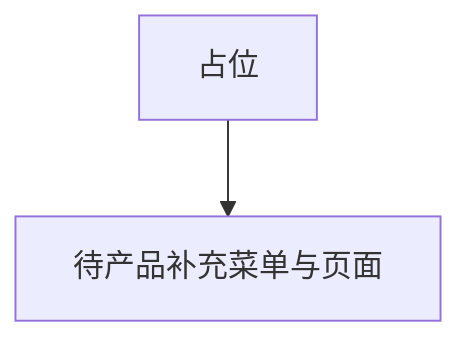
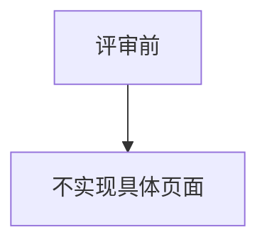

# 1 需求说明

## 1.1 平台自动化

### 模块概述

**范围待评审。** V1.0.0 信息架构主菜单已列「自动化应用 → 平台自动化（待产品补充路径与页面）」，本文件仅占位，**不得与已交付页面矛盾**。

**与其他模块的关联关系：** 待评审。

---

### 1.1.1 范围待评审

#### 功能概述

待产品补充主入口、列表/详情/流程与「项目管理」「测试运行」的边界。

• **整体业务流程图**

• **用户场景：** 产品规划自动化应用域时对齐范围。

• **功能描述：** 占位。

• **优先级：** 低

• **输入/前置条件：** 无

• **需求描述：**

1. **功能逻辑说明** — 无  
2. **界面布局与交互** — 无  
3. **新增/编辑功能** — 无  
4. **删除/危险操作** — 无  
5. **数据处理规则** — 无  
6. **异常场景** — a) **数据异常**：勿将占位当已实现需求验收。  
7. **影响范围** — 无

• **输出/后置条件：** 评审后替换正文。

• **性能指标：** 无

• **补充说明：** 待评审问题：菜单路径？与版本关系？权限？目标迭代？

---

# 附录

## 附录A：用户角色说明

待评审。

## 附录B：术语表

待评审。

## 附录C：参考文档

- 页面需求与交互规格：`docs/prd/V1.0.0/ATO_V1.0.0-页面需求与交互规格.md` §3 信息架构
- 模块拆分规则：`.cursor/rules/requirements-module-split.mdc`

## 变更历史

| 版本 | 日期 | 变更类型 | 变更内容 | 变更原因 | 影响范围 |
|------|------|---------|---------|---------|---------|
| V1.0.0 | 2026-04-14 | 新增 | 占位 MOD-APP-PLAT | 对齐拆分清单 | 自动化应用 |
