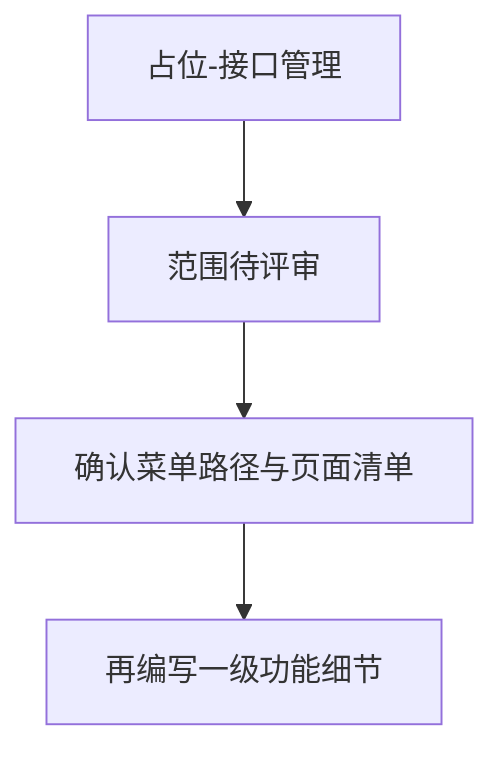
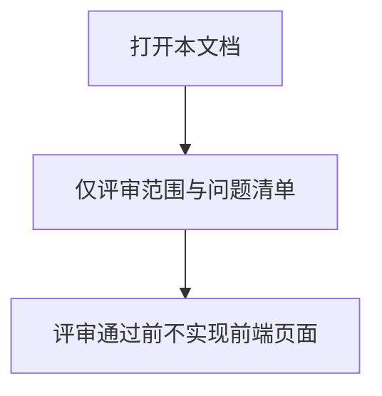

# 1 需求说明

## 1.1 接口管理

### 模块概述

接口管理为 **V1.0.0 规划占位模块**：原始信息架构中主菜单曾出现「接口管理」，但 V1.0.0 强制页面清单未单列该页；具体列表、详情、导入导出范围 **待产品评审确认**。本文档仅保留模块壳与问题清单，**不与已交付页面矛盾**。

**与其他模块的关联关系**：待评审确认后补充；预期与「自动化开发」域内项目管理、版本用例开发存在数据引用关系。

---

### 1.1.1 范围待评审

#### 功能概述

占位条目：待产品补充主入口菜单路径、页面清单、与项目管理/版本的关系。

• **整体业务流程图**

• **用户场景：** 产品/架构在规划下一迭代时对齐「接口管理」是否纳入及边界。

• **功能描述：** 记录待确认项，避免与 V1.0.0 已交付能力冲突。

• **优先级：** 低

• **输入/前置条件：** 无（未进入实现阶段）。

• **需求描述：**

1. **功能逻辑说明**

   本模块不包含可验收的业务流程；待补充 PRD 后再拆分一级功能。

2. **界面布局与交互**

   无

3. **新增/编辑功能**

   无

4. **删除/危险操作**

   无

5. **数据处理规则**

   无

6. **异常场景**

   a) **数据异常/业务冲突**：在范围未定时，禁止将本占位文档当作已实现需求验收。  
   b) **权限不足**：无

7. **影响范围**

   无

• **输出/后置条件：** 评审完成后以新版本 PRD 替换占位正文。

• **性能指标：** 无

• **补充说明：** 待评审问题见下表。

---

# 附录

## 附录A：用户角色说明

待评审。

## 附录B：术语表

待评审。

## 附录C：参考文档

- 页面需求与交互规格：`docs/prd/V1.0.0/ATO_V1.0.0-页面需求与交互规格.md`（§0.1 页面清单未含接口管理页）
- 模块拆分规则：`.cursor/rules/requirements-module-split.mdc`

## 待评审问题清单（≤10）

1. 接口管理是否仍为一级菜单？与「项目管理」的边界是什么？  
2. 是否需要版本维度还是项目维度管理接口资产？  
3. 与用例步骤「请求类」配置是否双向联动？  
4. 是否需要导入导出与审计日志？  
5. 权限模型：与团队/项目的关系？  
6. V1.0.0 是否明确不做，仅占位？  
7. 若后续做，是否独立导航入口还是挂在项目详情内？  
8. 占位数据与真实落库字段谁为主？  
9. 与「公共函数」菜单是否重复？  
10. 预计目标迭代版本号？

## 变更历史

| 版本 | 日期 | 变更类型 | 变更内容 | 变更原因 | 影响范围 |
|------|------|---------|---------|---------|---------|
| V1.0.0 | 2026-04-14 | 新增 | 占位模块文档 | 对齐模块拆分清单之接口管理（规划项） | 自动化开发（规划） |
