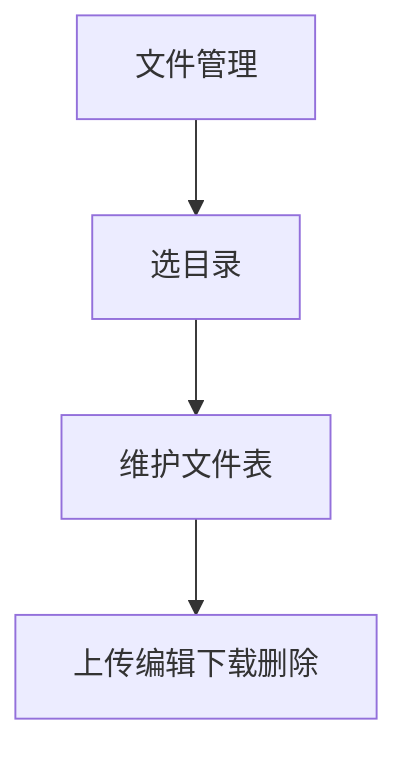
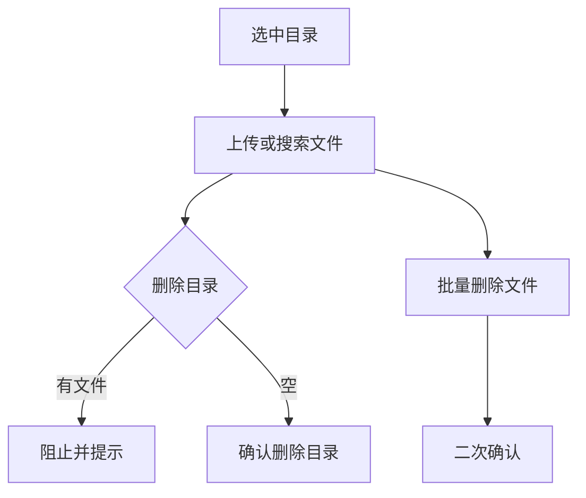

# 1 需求说明

## 1.1 文件管理

### 模块概述

文件管理在版本维度维护上传文件与一级目录结构，为用例步骤中表单文件类参数提供可选文件源。目标用户为测试工程师。

**与其他模块的关联关系**：
- **用例管理**：步骤 Body 表单文件中文件下拉同源本模块数据。

---

### 1.1.1 一级目录与文件列表

#### 功能概述

左侧「文件目录」：搜索框 + 主色图标按钮添加文件夹；目录为**一级扁平**（无子文件夹）；选中目录后右侧展示该目录下文件表。目录行悬停显示「…」：重命名、删除（目录内有文件时禁止删除并轻提示先清空）。右侧工具栏：上传、删除、下载（无勾选禁用）、右侧实时搜索过滤。表格列：文件名称、类型、所属路径、说明、操作（下载、编辑、删除）。分页右下，默认每页 8 条可变。

• **整体业务流程图**

• **用户场景：** 工程师为接口用例上传证书或样本文件，并在步骤里选择。

• **功能描述：** 提供目录—文件双层治理与批量操作。

• **优先级：** 中

• **输入/前置条件：** 用户登录后在版本用例开发窗口进入【文件管理】。

• **需求描述：**

1. **功能逻辑说明**

   添加文件夹弹窗：文件夹名称必填。上传弹窗：所属文件夹必选下拉（全部根目录）、拖拽多文件、说明可选。编辑弹窗：文件名必填，可替换文件。单条删除使用行内气泡确认；批量删除使用二次确认弹窗。下载 V1.0.0 可为占位提示。

2. **界面布局与交互**

   与兄弟页一致：顶条返回+项目+版本；左侧子菜单高亮文件管理。

3. **新增/编辑功能**

   | 场景 | 必填 | 说明 |
   |------|------|------|
   | 添加文件夹 | 文件夹名称 | 根级 |
   | 上传 | 所属文件夹、至少一文件 | 可批量 |
   | 编辑 | 文件名称 | 可替换文件 |

4. **删除/危险操作**

   非空目录不可删；批量删文件确认；单条使用气泡确认。

5. **数据处理规则**

   类型由扩展名推断；搜索覆盖名称、类型、路径、说明（实时）。

6. **异常场景**

   a) **网络异常**：上传失败重试。  
   b) **权限不足**：上传删除禁用。  
   c) **数据异常/业务冲突**：目录非空删除被拦截。

7. **影响范围**

   a) 用例管理：文件树选择器。  
   b) 变量管理：无直接依赖。

• **输出/后置条件：** 文件列表与目录结构一致。

• **性能指标：** 列表加载宜 ≤ 2 秒。

• **补充说明：** 与 PRD §4.7 验收差异表一致处以 PRD 为准。

---

# 附录

## 附录A：用户角色说明

| 角色名称 | 角色描述 | 主要权限 | 使用场景 |
|---------|---------|---------|---------|
| 测试工程师 | 维护附件 | 文件上传 | 用例需要附件 |

## 附录B：术语表

| 术语 | 定义 |
|-----|------|
| 一级目录 | 仅根级文件夹，不嵌套子文件夹 |

## 附录C：参考文档

- 页面需求与交互规格：`docs/prd/V1.0.0/ATO_V1.0.0-页面需求与交互规格.md`
- 原始页面需求：`prompt/AutoTestOne-V1.0.0 原始页面需求设计.md`
- 模块拆分规则：`.cursor/rules/requirements-module-split.mdc`

## 变更历史

| 版本 | 日期 | 变更类型 | 变更内容 | 变更原因 | 影响范围 |
|------|------|---------|---------|---------|---------|
| V1.0.0 | 2026-04-14 | 新增 | 模块化需求文档 | 对齐 MOD-CASE-FILE | 版本用例开发 |
