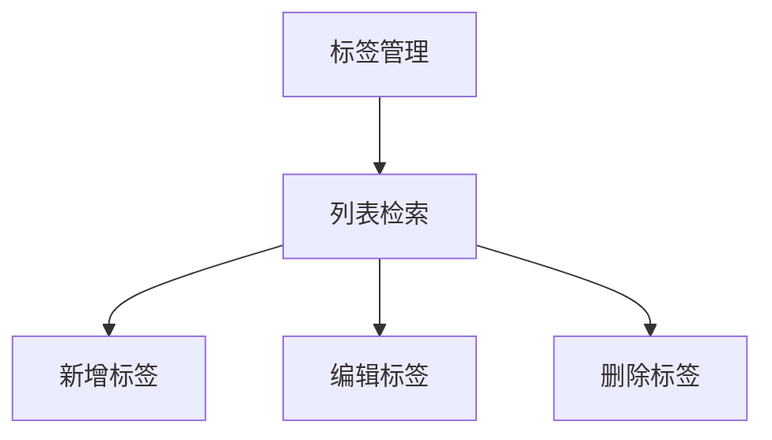
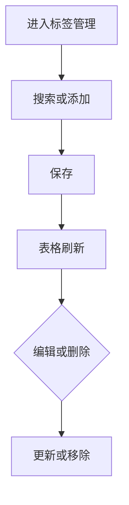

# 1 需求说明

## 1.1 标签管理

### 模块概述

标签管理维护版本内用例标签的名称、颜色与说明，为用例打标、列表筛选与任务圈选提供统一标准。目标用户为测试工程师、测试负责人。

**与其他模块的关联关系**：
- **用例管理**：用例标签引用本列表。
- **测试运行**：任务执行范围可按标签组合。

---

### 1.1.1 标签列表与维护

#### 功能概述

单列表页：左「添加标签」主按钮，右搜索框实时过滤标签名称、颜色串、说明。表格列：标签名称、标签预览（彩色标签）、标签说明、创建时间、操作（编辑、删除）。分页默认每页 10 条。新增弹窗：名称、颜色（取色器默认品牌蓝）、说明可选；名称在当前列表不区分大小写唯一。编辑弹窗：名称只读；可改颜色与说明。删除前使用气泡确认。

• **整体业务流程图**

• **用户场景：** 负责人统一「冒烟」「P0」等标签色与说明，避免各用例随意命名。

• **功能描述：** 提供标签 CRUD 与可视化预览。

• **优先级：** 中

• **输入/前置条件：** 用户登录后在版本用例开发窗口进入【标签管理】。

• **需求描述：**

1. **功能逻辑说明**

   颜色以十六进制存储；预览列用标签组件展示。重名创建警告阻止。

2. **界面布局与交互**

   工具栏左右分区与兄弟列表页一致。

3. **新增/编辑功能**

   | 字段 | 必填 | 说明 |
   |------|------|------|
   | 标签名称 | 是 | 创建后可只读 |
   | 标签颜色 | 是 | 取色器 |
   | 标签说明 | 否 | 多行 |

4. **删除/危险操作**

   删除前使用气泡确认。

5. **数据处理规则**

   搜索实时；名称唯一不区分大小写。

6. **异常场景**

   a) **网络异常**：保存失败重试。  
   b) **权限不足**：按钮禁用。  
   c) **数据异常/业务冲突**：重名；删除时若有引用按产品策略提示（V1.0.0 可占位）。

7. **影响范围**

   a) 用例管理：标签字段。  
   b) 测试运行：范围条件。

• **输出/后置条件：** 标签列表为用例与任务即时可用。

• **性能指标：** 无硬性合同

• **补充说明：** 字段文案以「标签说明」为准（对齐 PRD §4.9）。

---

# 附录

## 附录A：用户角色说明

| 角色名称 | 角色描述 | 主要权限 | 使用场景 |
|---------|---------|---------|---------|
| 测试负责人 | 规范标签体系 | 标签维护 | 回归策略 |

## 附录B：术语表

| 术语 | 定义 |
|-----|------|
| 标签预览 | 列表中彩色展示效果 |

## 附录C：参考文档

- 页面需求与交互规格：`docs/prd/V1.0.0/ATO_V1.0.0-页面需求与交互规格.md`
- 原始页面需求：`prompt/AutoTestOne-V1.0.0 原始页面需求设计.md`
- 模块拆分规则：`.cursor/rules/requirements-module-split.mdc`

## 变更历史

| 版本 | 日期 | 变更类型 | 变更内容 | 变更原因 | 影响范围 |
|------|------|---------|---------|---------|---------|
| V1.0.0 | 2026-04-14 | 新增 | 模块化需求文档 | 对齐 MOD-CASE-TAG | 版本用例开发 |
