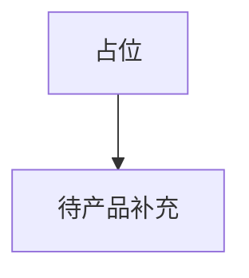
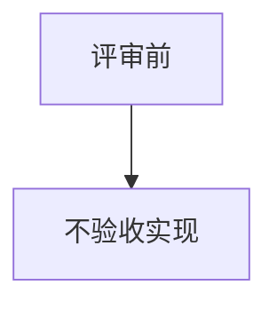

# 1 需求说明

## 1.1 测试日报

### 模块概述

**范围待评审。** 对应拆分清单 MOD-TOOL-DAILY；V1.0.0 信息架构列「测试工具」但未交付具体页，本文档仅占位。

---

### 1.1.1 范围待评审

#### 功能概述

待补充日报维度（项目/版本/任务）、订阅与导出。

• **整体业务流程图**

• **用户场景：** 测试主管希望每日汇总质量数据（待定义）。

• **功能描述：** 占位。

• **优先级：** 低

• **输入/前置条件：** 无

• **需求描述：**

1. **功能逻辑说明** — 无  
2. **界面布局与交互** — 无  
3. **新增/编辑功能** — 无  
4. **删除/危险操作** — 无  
5. **数据处理规则** — 无  
6. **异常场景** — a) **数据异常**：占位非实现。  
7. **影响范围** — 无

• **输出/后置条件：** 无

• **性能指标：** 无

• **补充说明：** 无

---

# 附录

## 附录A：用户角色说明

待评审。

## 附录B：术语表

待评审。

## 附录C：参考文档

- 页面需求与交互规格：`docs/prd/V1.0.0/ATO_V1.0.0-页面需求与交互规格.md`
- 模块拆分规则：`.cursor/rules/requirements-module-split.mdc`

## 变更历史

| 版本 | 日期 | 变更类型 | 变更内容 | 变更原因 | 影响范围 |
|------|------|---------|---------|---------|---------|
| V1.0.0 | 2026-04-14 | 新增 | 占位 MOD-TOOL-DAILY | 对齐拆分清单 | 测试工具 |
