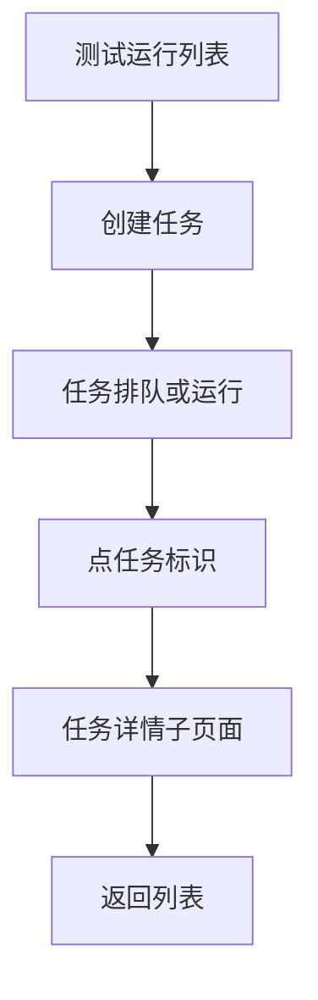
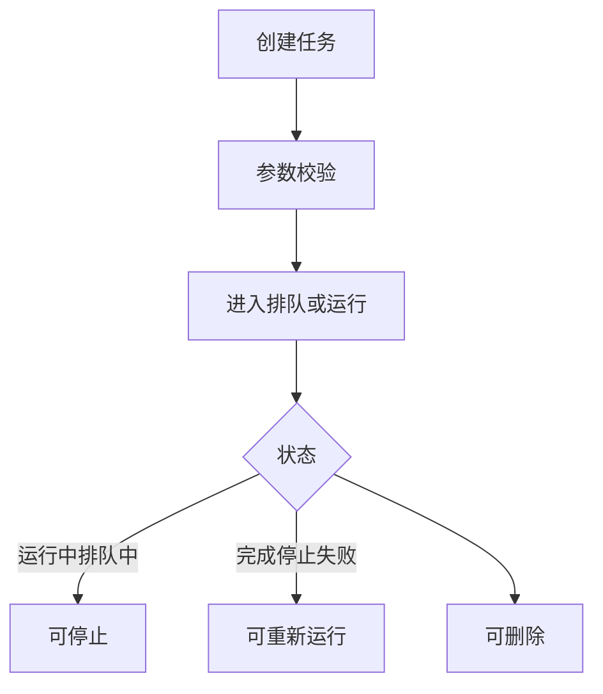
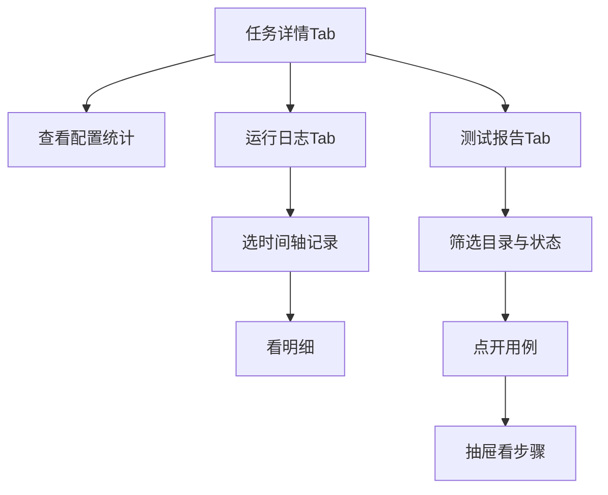

# 1 需求说明

## 1.1 测试运行

### 模块概述

测试运行提供自测任务创建、列表检索、状态与进度展示、运行/停止/删除等控制，并包含**任务详情子页面**（任务详情/运行日志/测试报告），禁止单独拆成模块文档。目标用户为测试负责人、测试工程师。

**与其他模块的关联关系**：
- **用例管理**：任务执行范围来源于目录与标签。
- **变量管理**：运行环境参数映射。

---

### 1.1.1 自测任务列表与运行控制

#### 功能概述

单列表：左上创建自测任务，右上搜索。列：任务标识、任务名称、运行环境、触发时间、完成时间、状态标签、进度、用例总数、覆盖率、通过率、耗时、操作（运行/停止、删除）。状态机：排队中、运行中、已完成、已停止、失败；不同状态可执行操作与 PRD 表格一致。进度：仅运行中任务周期性刷新递增；排队中不涨；已停止保留停止时百分比；已完成固定 100%。创建任务弹窗字段：任务名称、运行环境（DEV/SIT/UAT/PRD/PRE）、运行次数默认 1、失败重试次数默认 1、执行限时（分钟）默认 5、运行完成后是否清空下载目录开关、执行范围（模块双列选择 + 标签多行条件）、并行配置（分组类型、并行线程数默认 1）。

• **整体业务流程图**

• **用户场景：** 发布前负责人创建回归任务并观察进度，必要时停止或重跑。

• **功能描述：** 负责任务全生命周期列表侧能力。

• **优先级：** 高

• **输入/前置条件：** 用户登录后在版本用例开发窗口进入【测试运行】。

• **需求描述：**

1. **功能逻辑说明**

   创建后进入状态机；删除与停止需显著确认；运行中进度刷新间隔与 PRD 一致（如每 10 秒刷新一次的占位策略）。

2. **界面布局与交互**

   列表空态、加载态、无权限态遵循全局规范。

3. **新增/编辑功能**

   创建弹窗字段见概述；必填项标 *。

4. **删除/危险操作**

   删除任务确认；停止操作提示影响。

5. **数据处理规则**

   名称必填；数值型字段范围校验；环境与枚举一致。

6. **异常场景**

   a) **网络异常**：创建或控制失败重试。  
   b) **权限不足**：创建/停止禁用。  
   c) **数据异常/业务冲突**：参数非法阻止创建。

7. **影响范围**

   a) 用例管理：结果反哺。  
   b) 本模块-任务详情子页面：点击任务标识进入。

• **输出/后置条件：** 列表展示最新任务集合。

• **性能指标：** 创建响应宜 ≤ 2 秒。

• **补充说明：** 无

---

### 1.1.2 任务详情（子页面：含运行日志与测试报告）

#### 功能概述

从列表点击**任务标识**进入四级页面：顶条「返回 + 任务标识」；Tab 分「任务详情」「运行日志」「测试报告」。任务详情：基本信息、配置信息、运行统计。运行日志：左时间轴右日志详情。测试报告：左运行记录可折叠；右上汇总面板默认折叠（环形图、成功失败异常跳过统计、耗时、覆盖率等）；右下左目录树（来源于用例管理目录树仅模块节点）+ 右状态筛选 + 用例列表。点击用例名右侧抽屉展示步骤级详情，步骤字段区块可展开收起，断言默认展开，通过/失败图标绿勾红叉。点击用例标识跳转用例管理并带用例定位参数。返回回到测试运行列表。

• **整体业务流程图**

• **用户场景：** 工程师在任务失败后从报告下钻到断言与入参出参，并跳回用例修复。

• **功能描述：** 提供任务级配置、过程、结果三位一体分析能力。

• **优先级：** 高

• **输入/前置条件：** 在【测试运行】列表点击目标任务标识。

• **需求描述：**

1. **功能逻辑说明**

   报告区目录树与状态筛选联动列表；抽屉内展示步骤请求/响应/变量/断言等分组；点击用例标识跳转用例管理对应详情并定位。

2. **界面布局与交互**

   顶条与 Tab 规则见 PRD §4.11；汇总面板可折叠。

3. **新增/编辑功能**

   无表单型新增编辑（本页只读分析为主）。

4. **删除/危险操作**

   无

5. **数据处理规则**

   统计与明细一致；筛选实时刷新列表。

6. **异常场景**

   a) **网络异常**：日志或报告加载失败重试。  
   b) **权限不足**：限制查看报告。  
   c) **数据异常/业务冲突**：日志缺失展示「暂无日志」；报告不完整提示以最新一次为准。

7. **影响范围**

   a) 版本用例开发-用例管理：跳转定位。  
   b) 版本用例开发-测试运行-列表：返回继续操作。

• **输出/后置条件：** 用户完成定位与修复闭环。

• **性能指标：** Tab 切换宜 ≤ 1 秒。

• **补充说明：** 本子页面不得单独拆成模块文档（见 `requirements-module-split.mdc`）。

---

# 附录

## 附录A：用户角色说明

| 角色名称 | 角色描述 | 主要权限 | 使用场景 |
|---------|---------|---------|---------|
| 测试负责人 | 推进回归 | 创建任务、看报告 | 发布前 |
| 测试工程师 | 定位问题 | 查看详情 | 修复用例 |

## 附录B：术语表

| 术语 | 定义 |
|-----|------|
| 自测任务 | 一次批量执行实例 |

## 附录C：参考文档

- 页面需求与交互规格：`docs/prd/V1.0.0/ATO_V1.0.0-页面需求与交互规格.md`
- 原始页面需求：`prompt/AutoTestOne-V1.0.0 原始页面需求设计.md`
- 模块拆分规则：`.cursor/rules/requirements-module-split.mdc`

## 变更历史

| 版本 | 日期 | 变更类型 | 变更内容 | 变更原因 | 影响范围 |
|------|------|---------|---------|---------|---------|
| V1.0.0 | 2026-04-14 | 新增 | 合并任务详情子页面到测试运行模块 | 对齐 MOD-CASE-RUN | 版本用例开发 |
