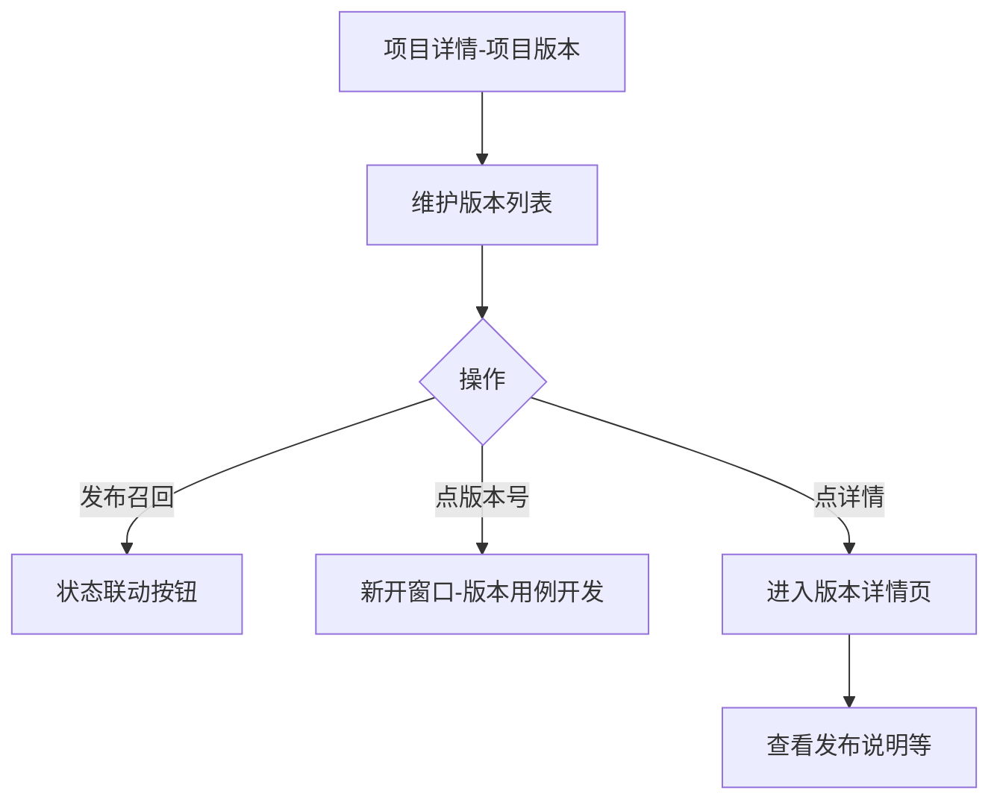
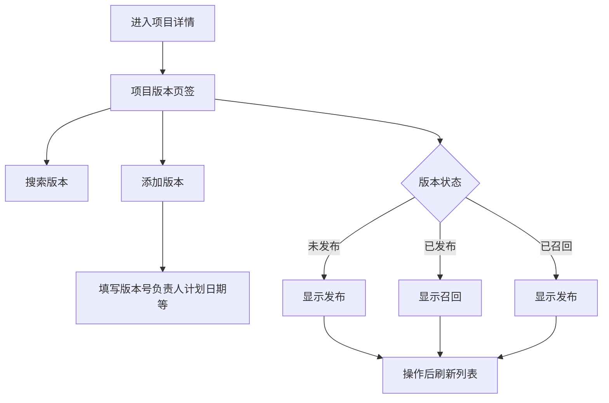
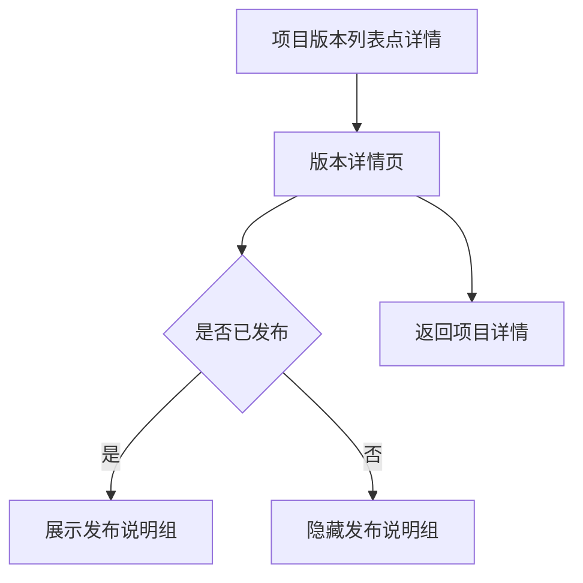

# 1 需求说明

## 1.1 版本管理

### 模块概述

版本管理覆盖「项目详情」中的「项目版本」页签、主框架内的「版本详情」页，以及从版本号进入「版本用例开发」新窗口的衔接。目标用户为测试负责人、测试工程师。

**与其他模块的关联关系**：
- **项目管理**：从项目详情进入本模块；项目信息页签由项目管理模块维护。
- **用例管理（新窗口）**：点击版本号打开新窗口进入用例管理默认页。



---

### 1.1.1 项目版本列表与版本生命周期

#### 功能概述

在项目详情默认页签「项目版本」中维护版本：搜索、添加版本、编辑、删除、发布/召回、点击版本号打开新窗口、点击「详情」进入版本详情页。

• **整体业务流程图**



• **用户场景：** 测试负责人在迭代交付前创建版本、指定负责人与计划发布日，并在合适时机发布或召回版本，同时进入用例开发窗口编写用例。

• **功能描述：** 提供版本全生命周期列表管理，并与状态标签、操作按钮联动。

• **优先级：** 高

• **输入/前置条件：** 用户登录后从【项目管理】进入【项目详情】，当前页签为【项目版本】。

• **需求描述：**

1. **功能逻辑说明**

   操作栏：左上添加版本，右上版本搜索（支持回车或搜索按钮，与 PRD 一致）。表格列包含：版本号（可点击新开窗口）、用例总数、用例覆盖率（百分比）、成功率（百分比）、负责人、版本状态（标签 + 联动按钮）、发布日期、创建时间、操作（详情、发布/召回、编辑、删除）。状态机：未发布 → 已发布 → 已召回 → 可再次发布（与 PRD 状态色与按钮规则一致）。点击版本号：打开独立窗口进入版本用例开发（默认用例管理），顶部展示项目名称与版本号。

   ```mermaid
   flowchart TD
       A[未发布] -->|发布| B[已发布]
       B -->|召回| C[已召回]
       C -->|发布| B
   ```

2. **界面布局与交互**

   顶部返回 + 项目名称；下方 Tabs：项目版本（默认）| 项目信息（项目信息属项目管理模块，此处仅共页容器）。

3. **新增/编辑功能**

   **添加版本弹窗**

   | 字段名称 | 类型 | 必填 | 默认值 | 校验规则 | 业务说明 |
   |---------|------|------|--------|----------|----------|
   | 版本号 | 文本 | 是 | 无 | 如 v1.2.0 | 列表主标识 |
   | 继承版本 | 下拉 | 否 | 空 | 可选 | 来源版本 |
   | 负责人 | 下拉可搜索 | 是 | 无 | 必选 | 来自用户数据 |
   | 计划发布日期 | 日期 | 是 | 无 | 必选 | 计划维度 |

   **编辑版本弹窗**：仅允许编辑负责人、计划发布日期；版本号与继承版本置灰不可改。

4. **删除/危险操作**

   删除版本：二次确认。发布/召回：关键操作需明确成功或失败反馈（以轻提示等形式）。

5. **数据处理规则**

   覆盖率与成功率以百分比展示；版本状态与可操作按钮严格一致；时间格式 `YYYY-MM-DD HH:mm`（计划发布日可按 PRD 用日期型展示）。

6. **异常场景**

   a) **网络异常**：列表或操作失败提示重试。  
   b) **权限不足**：发布/召回/删除不可用并说明。  
   c) **数据异常/业务冲突**：版本号重复禁止保存；状态切换失败保持原状态。

7. **影响范围**

   a) 版本用例开发-用例管理：新窗口上下文依赖 projectId、versionId 等入口参数。  
   b) 项目管理-项目详情-项目信息：项目更新时间可能随版本操作刷新（与实现一致）。  
   c) 项目管理模块：返回列表时项目卡片时间展示。

• **输出/后置条件：** 版本列表与状态与服务端或占位数据一致，并可进入详情或新窗口。

• **性能指标：** 版本操作反馈宜 ≤ 2 秒。

• **补充说明：** 与「项目信息」页签的编辑项目能力见项目管理模块，本模块不重复定义项目字段规则。

---

### 1.1.2 版本详情（只读）

#### 功能概述

在主框架内展示单个版本的基础信息；当版本状态为「已发布」时额外展示发布说明（新增功能、使用注意事项）。

• **整体业务流程图**



• **用户场景：** 测试经理在评审版本是否可对外发布时查看成功率、计划/实际发布时间、发布说明。

• **功能描述：** 文档化展示版本关键指标，支持面包屑返回。

• **优先级：** 中

• **输入/前置条件：** 用户登录后在【项目详情】-【项目版本】点击某一行的【详情】进入【版本详情】。

• **需求描述：**

1. **功能逻辑说明**

   基本信息组：所属项目、版本号、负责人、开始时间（版本创建时间）、计划发布时间、实际发布时间（未发布显示「-」）、版本状态、用例总数、成功率等，与 PRD 表格一致。发布说明组仅在「已发布」时渲染。返回按钮回到项目详情。

2. **界面布局与交互**

   顶部返回 + 版本号；内容区卡片/描述列表分组展示；面包屑可跳转项目管理、项目详情等（与 PRD 一致）。

3. **新增/编辑功能**

   无（不在此页直接编辑版本字段）。

4. **删除/危险操作**

   无

5. **数据处理规则**

   空值统一「-」；时间格式统一；状态标签颜色遵循平台枚举色板。

6. **异常场景**

   a) **网络异常**：加载失败提示重试。  
   b) **权限不足**：提示联系管理员。  
   c) **数据异常/业务冲突**：关键字段缺失时占位并建议返回刷新。

7. **影响范围**

   a) 自动化开发-版本管理-项目版本：详情入口唯一来自列表「详情」。  
   b) 项目管理-项目详情：返回目标为当前项目版本页签。

• **输出/后置条件：** 用户完成版本信息确认后可返回继续维护。

• **性能指标：** 无硬性合同

• **补充说明：** 无

---

# 附录

## 附录A：用户角色说明

| 角色名称 | 角色描述 | 主要权限 | 使用场景 |
|---------|---------|---------|---------|
| 测试负责人 | 版本交付 Owner | 发布召回、建版本 | 发布前 |
| 测试经理 | 质量评审 | 查看版本详情 | 评审 |

## 附录B：术语表

| 术语 | 定义 |
|-----|------|
| 发布/召回 | 版本对外可用状态切换 |

## 附录C：参考文档

- 页面需求与交互规格：`docs/prd/V1.0.0/ATO_V1.0.0-页面需求与交互规格.md`
- 原始页面需求：`prompt/AutoTestOne-V1.0.0 原始页面需求设计.md`
- 模块拆分规则：`.cursor/rules/requirements-module-split.mdc`

## 变更历史

| 版本 | 日期 | 变更类型 | 变更内容 | 变更原因 | 影响范围 |
|------|------|---------|---------|---------|---------|
| V1.0.0 | 2026-04-14 | 新增 | 合并项目版本 Tab与版本详情为「版本管理」模块 | 对齐模块拆分清单 | 自动化开发 |
