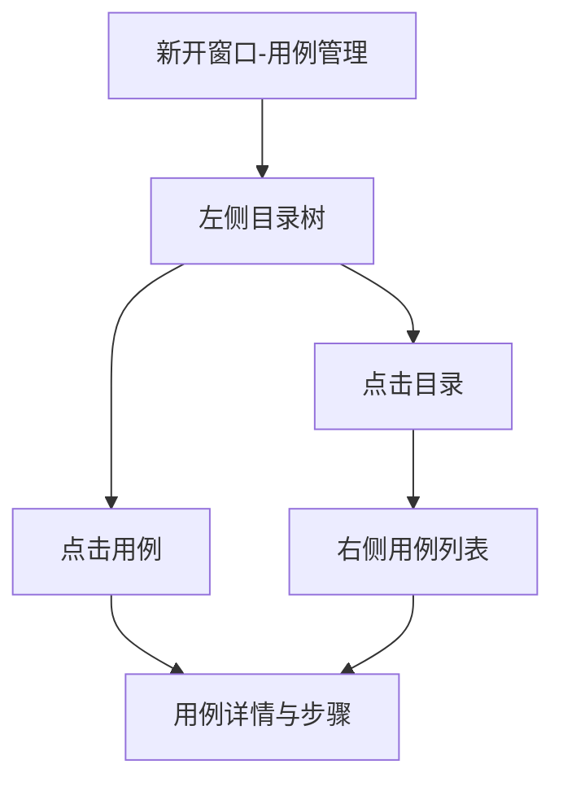
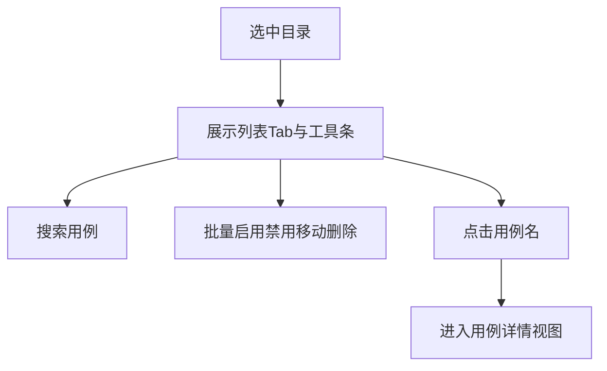
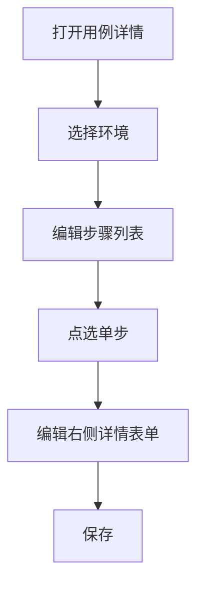

# 1 需求说明

## 1.1 用例管理

### 模块概述

用例管理在「版本用例开发」独立窗口内提供目录树、用例列表、用例详情与步骤编排能力，是版本质量建设核心。目标用户为测试工程师。

**与其他模块的关联关系**：
- **版本管理**：从项目详情点击版本号进入本窗口，默认落本模块。
- **变量管理、文件管理、自定义函数**：步骤配置可引用变量、上传文件、调用函数。
- **测试运行、任务详情**：任务范围与报告可回溯用例。



---

### 1.1.1 目录树与用例列表维护

#### 功能概述

左侧可拖拽宽窄分栏展示目录/用例树，支持搜索与「+」菜单；目录与用例节点在悬停时展示更多操作。右侧在选中目录时展示用例列表，支持批量操作与单条开关启用状态。

• **整体业务流程图**



• **用户场景：** 测试工程师按模块维护目录结构，在目录下批量管理用例启用状态并快速定位用例。

• **功能描述：** 提供树 +表联动，满足结构治理与列表治理。

• **优先级：** 高

• **输入/前置条件：** 用户登录后，从【项目详情】-【项目版本】点击版本号打开新窗口，默认在【用例管理】；顶部展示返回、项目名称、版本号；左侧子菜单高亮用例管理。

• **需求描述：**

1. **功能逻辑说明**

   左侧树：标题区展示当前版本号（优先入口参数中的版本号展示名）；标题与树之间为搜索框与「+」按钮。「+」菜单含：添加测试用例、添加子目录、导出测试用例（V1.0.0 可为占位）。目录节点操作（悬停「…」）：添加测试用例、添加子目录、调试运行、重命名、移动到、启用/禁用（默认文案为「禁用」表示当前为启用态可切换）、删除。用例节点操作：插入测试用例、重命名、移动到、复制、启用/禁用、删除。禁用节点灰显。右侧列表视图：第一行 Tab 为「目录名」「模块前置」「标签/分组」——后两者 V1.0.0 保留入口空态占位。第二行左侧按钮组：添加测试用例、删除、移动到、启用、禁用；右侧搜索用例标识/名称/标签。表格列：用例ID、名称、标签、所属模块、运行结果状态标签、更新时间、状态开关、操作（复制、编辑、删除）。批量按钮无勾选时置灰。

   ```mermaid
   flowchart TD
       A[树操作] --> B{危险操作}
       B -->|删除目录或用例| C[二次确认不可恢复]
       B -->|其它| D[立即生效或弹窗表单]
   ```

2. **界面布局与交互**

   新窗口禁止展示主框架顶栏与主菜单；左侧为版本用例开发子菜单，右侧为内容。主体左右分栏可拖拽分隔条。

3. **新增/编辑功能**

   | 场景 | 字段 | 必填 | 说明 |
   |------|------|------|------|
   | 添加测试用例 | 用例名称、所属模块、标签 | 名称必填 | 弹窗 |
   | 添加子目录 | 目录名称、父级目录 | 名称必填 | 弹窗 |

4. **删除/危险操作**

   删除目录、用例、批量删除：二次确认并强调不可恢复。

5. **数据处理规则**

   运行结果默认「未运行」；列表筛选与勾选状态驱动批量按钮可用性。

6. **异常场景**

   a) **网络异常**：保存或列表失败提示重试。  
   b) **权限不足**：关键操作禁用并说明。  
   c) **数据异常/业务冲突**：移动到无效目标、重名冲突时阻止并提示。

7. **影响范围**

   a) 版本用例开发-变量管理：动态变量表可跳转回本页并定位用例。  
   b) 版本用例开发-测试运行：任务圈选用例范围。  
   c) 版本用例开发-测试运行-任务详情：报告目录树来源于用例目录（模块节点）。

• **输出/后置条件：** 目录与列表状态与当前版本数据一致。

• **性能指标：** 常规操作宜 ≤ 2 秒。

• **补充说明：** 调试运行、导出细节以实现与 PRD 为准。

---

### 1.1.2 用例详情与步骤编排

#### 功能概述

选中用例后右侧进入详情视图：支持多开用例 Tab、环境选择、保存与调试；下方左侧为步骤列表，右侧为步骤详情。步骤类型覆盖请求类、自定义请求类、调用函数、数据库操作、条件判断、循环、等待等（展示名称以 PRD 为准，如自定义请求在列表中可显示为「请求」类文案统一）。

• **整体业务流程图**



• **用户场景：** 测试工程师编排请求步骤、断言与变量提取，并准备调试。

• **功能描述：** 提供步骤级 CRUD、排序、复制到其它用例、以及分类型详情编辑区。

• **优先级：** 高

• **输入/前置条件：** 在用例管理页已选中某一用例或从列表点名称进入详情视图。

• **需求描述：**

1. **功能逻辑说明**

   顶部：用例 Tab 可多开切换；标题区可编辑用例标题；右侧为环境下拉、保存、调试。步骤列表：左侧序号，支持长按约1s 后拖拽排序；悬停显示「…」：复制、复制到、添加、删除。「复制到」弹窗录入目标用例标识（支持中英文逗号分隔批量）。添加步骤：先选类型再创建。步骤详情：顶部可编辑步骤标题；请求类含协议、方式、主机、路径及 Params/Headers/Body/Cookies/变量提取/断言等分区；Body 支持多种模式；JSON 格式化非法时红框与错误信息；form-data 中文件型参数从文件管理选择。调用函数类可选择函数（数据源同自定义函数）。数据库操作类先弹窗选库类型与步骤名，详情含 SQL、变量提取、断言。等待类为秒数整数默认 1。删除步骤二次确认。

   ```mermaid
   flowchart TD
       A[选择步骤类型] --> B[生成默认步骤]
       B --> C[填写详情]
       C --> D[保存用例]
   ```

2. **界面布局与交互**

   未选用例时右侧空态：「请选择用例或新建用例」。步骤列表与详情区纵向铺满。

3. **新增/编辑功能**

   以各步骤类型表单为准；动态值输入能力在各参数值处统一接入（业务表述：支持插入变量/表达式，具体规则见变量管理）。

4. **删除/危险操作**

   删除步骤、删除用例（若从详情触发）均二次确认。

5. **数据处理规则**

   环境切换时默认主机联动更新但不覆盖用户已手改值（与 PRD 一致）。

6. **异常场景**

   a) **网络异常**：保存失败保留编辑态并提示。  
   b) **权限不足**：保存/调试不可用。  
   c) **数据异常/业务冲突**：JSON 非法、断言配置缺失等当场校验。

7. **影响范围**

   a) 变量管理：变量被引用。  
   b) 文件管理：表单文件参数引用。  
   c) 自定义函数：函数调用选择器同源。  
   d) 测试运行：执行读取本页编排结果。

• **输出/后置条件：** 用例步骤保存后可被任务执行消费。

• **性能指标：** 无

• **补充说明：** 字段级细则以 `docs/prd/V1.0.0/ATO_V1.0.0-页面需求与交互规格.md` §4.5 为源头。

---

# 附录

## 附录A：用户角色说明

| 角色名称 | 角色描述 | 主要权限 | 使用场景 |
|---------|---------|---------|---------|
| 测试工程师 | 编写用例 | 用例维护 | 版本迭代 |

## 附录B：术语表

| 术语 | 定义 |
|-----|------|
| 步骤 | 用例中最小可执行单元 |

## 附录C：参考文档

- 页面需求与交互规格：`docs/prd/V1.0.0/ATO_V1.0.0-页面需求与交互规格.md`
- 原始页面需求：`prompt/AutoTestOne-V1.0.0 原始页面需求设计.md`
- 模块拆分规则：`.cursor/rules/requirements-module-split.mdc`

## 变更历史

| 版本 | 日期 | 变更类型 | 变更内容 | 变更原因 | 影响范围 |
|------|------|---------|---------|---------|---------|
| V1.0.0 | 2026-04-14 | 新增 | 模块化需求文档 | 对齐 MOD-CASE-MGT | 版本用例开发 |
