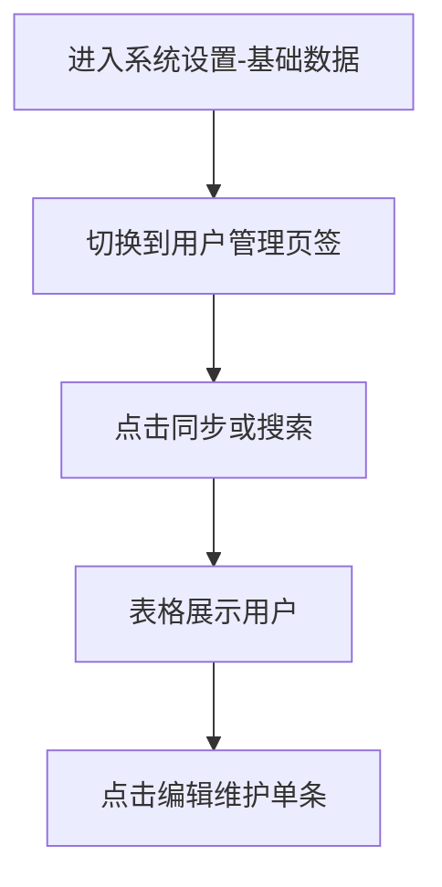
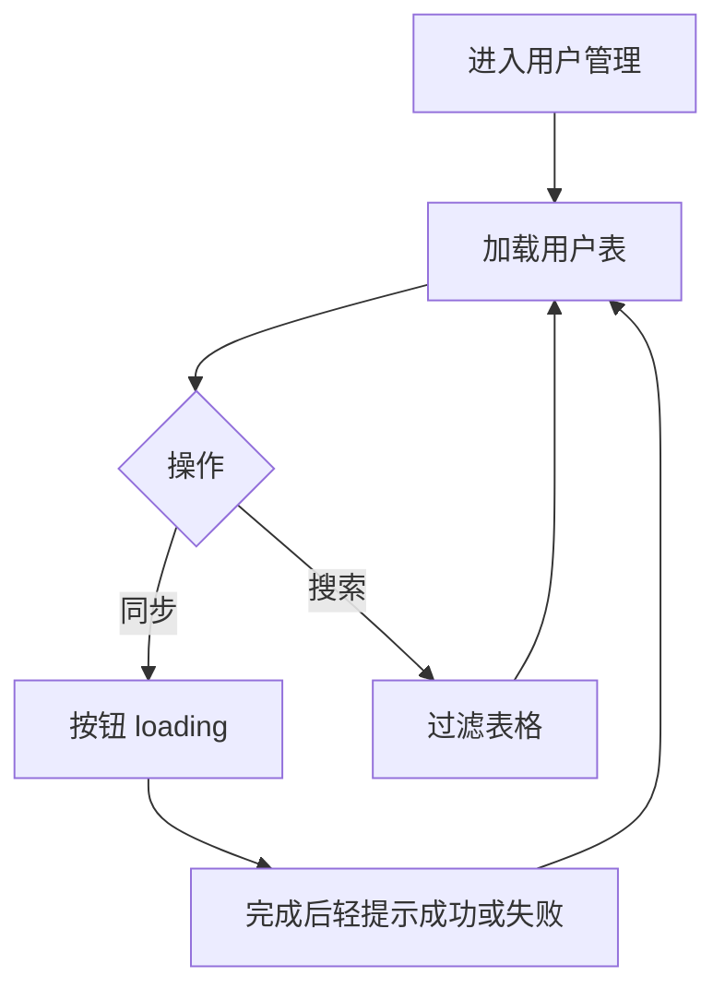
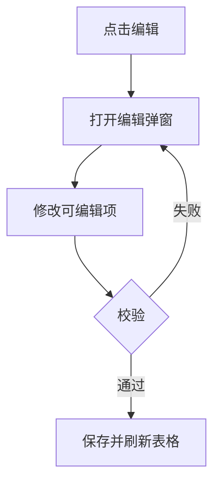

# 1 需求说明

## 1.1 用户管理

### 模块概述

用户管理用于展示平台用户主数据、支持搜索与单条编辑入口，并提供与外部主数据同步的能力。目标用户为测试负责人、平台管理员。

**与其他模块的关联关系**：
- **团队管理**：添加团队成员时依赖本页用户列表数据。
- **版本管理等项目模块**：负责人等下拉选人依赖用户数据。



---

### 1.1.1 用户列表、同步与检索

#### 功能概述

展示用户表格，支持一键同步（加载态与结果提示）、按关键字搜索。

• **整体业务流程图**



• **用户场景：** 平台管理员在人事系统变更后，需要把最新用户同步到本平台，以便团队添加成员时能搜到人。

• **功能描述：** 提供用户主数据列表视图与同步触发能力。

• **优先级：** 高

• **输入/前置条件：** 用户登录后，从左侧菜单进入【系统设置】-【基础数据】页面，并切换到【用户管理】页签。

• **需求描述：**

1. **功能逻辑说明**

   进入页签后加载用户列表。左上角为同步按钮：点击后进入加载态，结束后以轻提示反馈「同步成功/失败」（占位口径可与实现一致）。右上角搜索框支持按展示字段过滤。表格需支持分页（与 PRD 一致）。

   ```mermaid
   flowchart TD
       A[点击同步] --> B[展示加载态]
       B --> C{结果}
       C -->|成功| D[提示成功并刷新列表]
       C -->|失败| E[提示失败]
   ```

2. **界面布局与交互**

   单列表布局：操作栏左上同步、右上搜索；下方表格与分页。

3. **新增/编辑功能**

   本一级功能不包含「新增用户」；用户以同步进入平台为主。单条「编辑」见下一一级功能。

4. **删除/危险操作**

   无（用户删除若不在 V1.0.0 范围则不描述）。

5. **数据处理规则**

   表格列：工号、姓名、角色、邮箱、操作（编辑）；展示与搜索口径一致。

6. **异常场景**

   a) **网络异常**：同步或列表加载失败时提示重试。  
   b) **权限不足**：同步或编辑按钮禁用并说明。  
   c) **数据异常/业务冲突**：同步返回业务错误时在轻提示中展示可读原因。

7. **影响范围**

   a) 系统设置-基础数据-团队管理：添加成员弹窗数据源。  
   b) 自动化开发-版本管理：负责人等选择列表。

• **输出/后置条件：** 列表展示为当前可得的最新用户集合（以同步结果为准）。

• **性能指标：** 列表检索与同步反馈宜在 3 秒内完成。

• **补充说明：** 无

---

### 1.1.2 用户编辑

#### 功能概述

通过操作列「编辑」维护单条用户可编辑字段（以 PRD 与验收稿为准）。

• **整体业务流程图**



• **用户场景：** 管理员需要修正用户展示角色或联系信息，以便版本负责人等信息准确。

• **功能描述：** 提供单用户编辑入口与校验反馈。

• **优先级：** 中

• **输入/前置条件：** 用户登录后在【基础数据】-【用户管理】页签中，表格已加载出目标用户行。

• **需求描述：**

1. **功能逻辑说明**

   点击编辑进入弹窗，回显当前行数据；保存前进行必填与格式校验；成功后关闭弹窗并刷新列表。

2. **界面布局与交互**

   弹窗内字段布局清晰，必填项标「*」；确认前校验，失败时字段级或全局提示。

3. **新增/编辑功能**

   可编辑字段以产品验收稿为准（若仅部分字段可改，需在实现与文档保持一致）。

4. **删除/危险操作**

   无

5. **数据处理规则**

   保存后表格行与详情一致；工号等主键不可随意变更（若业务锁定）。

6. **异常场景**

   a) **网络异常**：保存失败提示重试。  
   b) **权限不足**：无编辑权限时隐藏或禁用编辑。  
   c) **数据异常/业务冲突**：保存冲突时提示用户刷新后重试。

7. **影响范围**

   a) 团队管理-成员维护：展示姓名等一致。  
   b) 版本管理等选人场景：展示名称及时更新。

• **输出/后置条件：** 用户信息更新后在全平台相关选人处可见（以系统刷新策略为准）。

• **性能指标：** 无

• **补充说明：** 若 V1.0.0 编辑字段集合待定，以 `docs/prd/V1.0.0/ATO_V1.0.0-页面需求与交互规格.md` 验收结论为准。

---

# 附录

## 附录A：用户角色说明

| 角色名称 | 角色描述 | 主要权限 | 使用场景 |
|---------|---------|---------|---------|
| 平台管理员 | 维护主数据 | 同步用户、编辑用户 | 组织变更 |

## 附录B：术语表

| 术语 | 定义 |
|-----|------|
| 同步用户 | 从外部主数据拉取并刷新本平台用户列表 |

## 附录C：参考文档

- 页面需求与交互规格：`docs/prd/V1.0.0/ATO_V1.0.0-页面需求与交互规格.md`
- 原始页面需求：`prompt/AutoTestOne-V1.0.0 原始页面需求设计.md`
- 模块拆分规则：`.cursor/rules/requirements-module-split.mdc`

## 变更历史

| 版本 | 日期 | 变更类型 | 变更内容 | 变更原因 | 影响范围 |
|------|------|---------|---------|---------|---------|
| V1.0.0 | 2026-04-14 | 新增 | 按功能模块「用户管理」独立成文 | 对齐模块拆分清单 | 系统设置-基础数据 |
