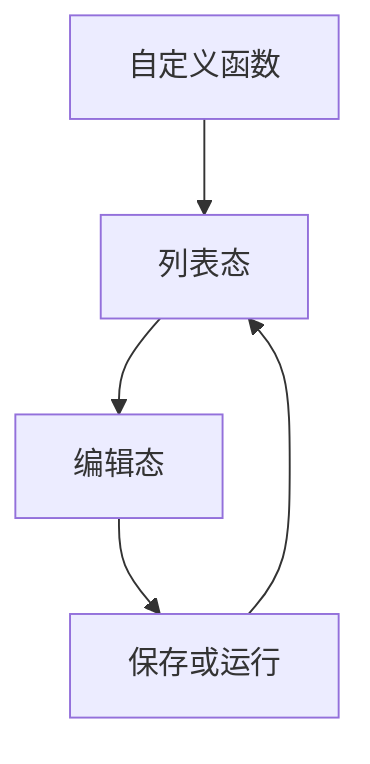
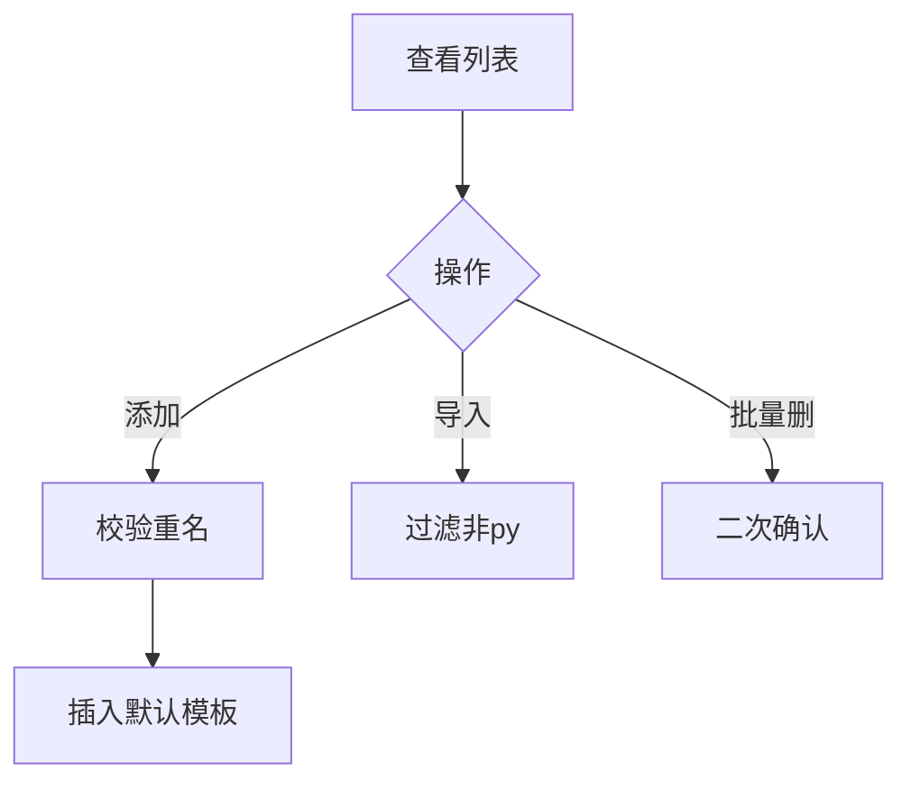
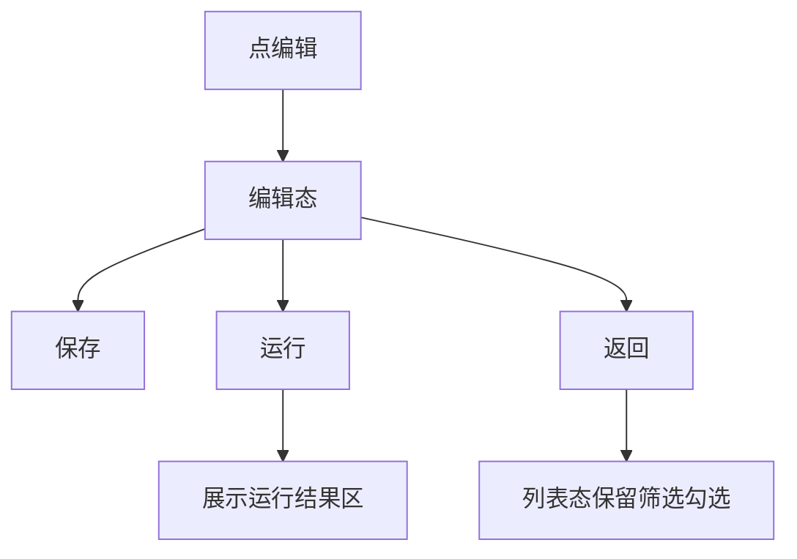

# 1 需求说明

## 1.1 自定义函数

### 模块概述

自定义函数维护版本范围内的 Python 函数文件，支持列表检索、添加、导入、重命名、编辑、运行（占位输出）、删除；与用例步骤「调用函数」共享数据源。目标用户为测试工程师。

**与其他模块的关联关系**：
- **用例管理**：步骤选择函数树同源本模块。

---

### 1.1.1 函数文件列表与导入导出

#### 功能概述

列表态：工具栏左为添加函数、导入函数、批量删除（无勾选禁用）；右为实时搜索（文件名、语言、作者）。表格列：文件名、语言标签（固定 python）、更新时间、作者、操作（编辑、重命名、删除）。分页默认每页 8 条。添加/重命名弹窗：名称必填，自动补全 `.py`，与已有文件名不区分大小写去重否则警告。导入弹窗：多文件拖拽，仅 `.py`，重复或非规范跳过并警告，成功条数提示。单删使用气泡确认。

• **整体业务流程图**

• **用户场景：** 工程师沉淀公共断言或数据处理脚本，多文件批量导入历史脚本。

• **功能描述：** 函数文件级生命周期管理入口侧能力。

• **优先级：** 中

• **输入/前置条件：** 用户登录后在版本用例开发窗口进入【自定义函数】。

• **需求描述：**

1. **功能逻辑说明**

   列表数据与用例步骤函数树一致；搜索不区分大小写；批量删除需确认。

2. **界面布局与交互**

   列表为单 Card；空态 Empty。

3. **新增/编辑功能**

   添加成功后插入默认模板脚本内容（与 PRD 描述一致）。

4. **删除/危险操作**

   批量与单条删除均需确认类交互。

5. **数据处理规则**

   语言列固定展示 python；时间更新随保存刷新。

6. **异常场景**

   a) **网络异常**：导入保存失败提示。  
   b) **权限不足**：操作禁用。  
   c) **数据异常/业务冲突**：重名、非法文件类型。

7. **影响范围**

   a) 用例管理：函数调用选择。  
   b) 文件管理：无

• **输出/后置条件：** 列表变更后函数树即时一致。

• **性能指标：** 无硬性合同

• **补充说明：** 无

---

### 1.1.2 函数编辑与运行验证

#### 功能概述

编辑态与列表互斥：标题行「返回」在「编辑函数：{文件名}」前；右上「运行」「保存」。编辑区多行文本；运行后在卡片底部展开运行结果区（V1.0.0 为占位输出）；保存更新内容与时间。

• **整体业务流程图**

• **用户场景：** 工程师修改函数后快速跑一次看占位输出，确认无语法级问题（真实执行后续接平台能力）。

• **功能描述：** 提供编辑-运行-保存闭环（运行结果为占位模拟输出）。

• **优先级：** 中

• **输入/前置条件：** 列表中点击某行「编辑」。

• **需求描述：**

1. **功能逻辑说明**

   保存成功轻提示；运行成功轻提示并覆盖结果区内容；返回清空运行区状态。

2. **界面布局与交互**

   说明文案灰色辅助；打开结果区后编辑区高度略减以为结果腾挪。

3. **新增/编辑功能**

   编辑即改函数文件内容。

4. **删除/危险操作**

   编辑态不直接删文件（回列表操作）。

5. **数据处理规则**

   作者、时间在占位实现下可按实现固定或更新。

6. **异常场景**

   a) **网络异常**：保存失败重试。  
   b) **权限不足**：保存运行禁用。  
   c) **数据异常/业务冲突**：运行失败展示错误信息文案（占位）。

7. **影响范围**

   a) 用例管理：调用内容版本与保存结果一致。

• **输出/后置条件：** 保存后列表行展示最新时间。

• **性能指标：** 无

• **补充说明：** 详见 PRD §4.8 验收差异表。

---

# 附录

## 附录A：用户角色说明

| 角色名称 | 角色描述 | 主要权限 | 使用场景 |
|---------|---------|---------|---------|
| 测试工程师 | 抽象复用逻辑 | 函数维护 | 多用例复用 |

## 附录B：术语表

| 术语 | 定义 |
|-----|------|
| 函数文件 | 一份 .py 文件作为一个管理单元 |

## 附录C：参考文档

- 页面需求与交互规格：`docs/prd/V1.0.0/ATO_V1.0.0-页面需求与交互规格.md`
- 原始页面需求：`prompt/AutoTestOne-V1.0.0 原始页面需求设计.md`
- 模块拆分规则：`.cursor/rules/requirements-module-split.mdc`

## 变更历史

| 版本 | 日期 | 变更类型 | 变更内容 | 变更原因 | 影响范围 |
|------|------|---------|---------|---------|---------|
| V1.0.0 | 2026-04-14 | 新增 | 模块化需求文档 | 对齐 MOD-CASE-FUNC | 版本用例开发 |
