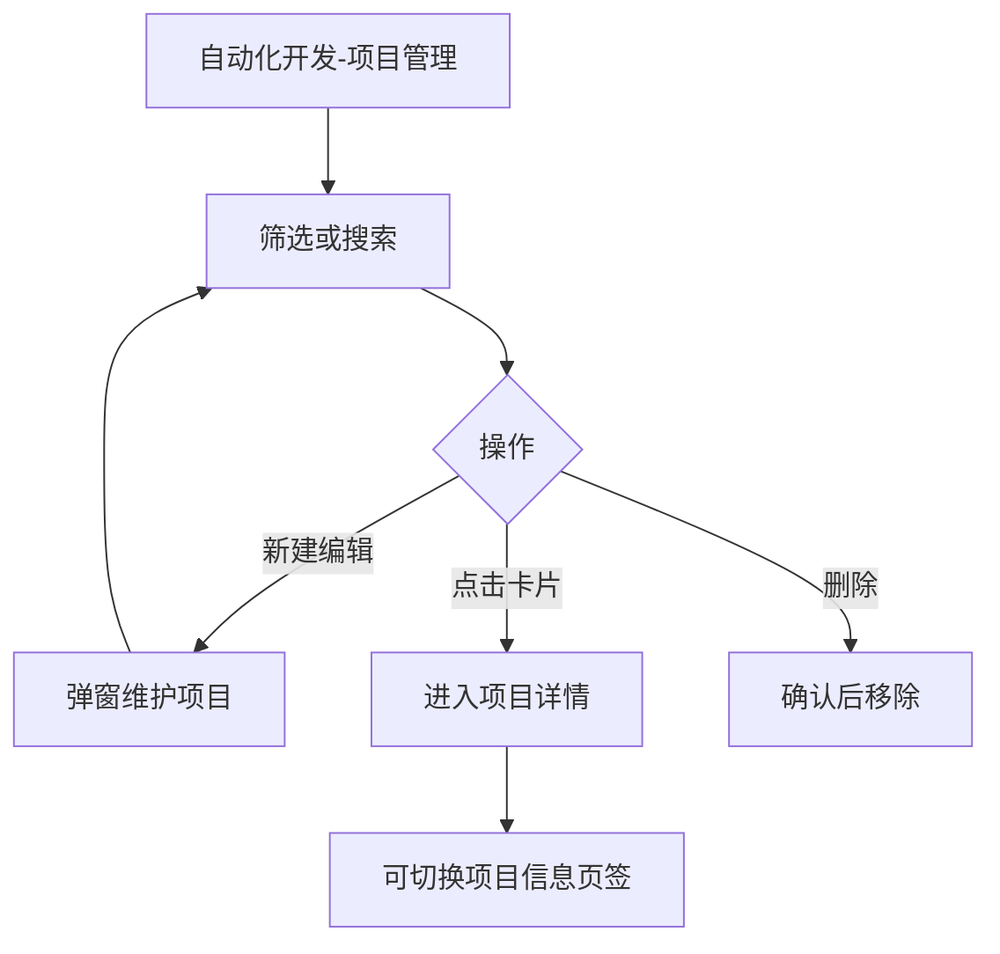
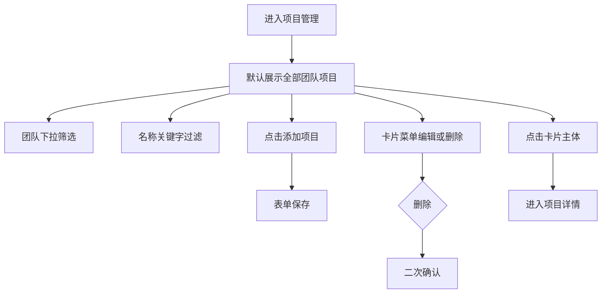
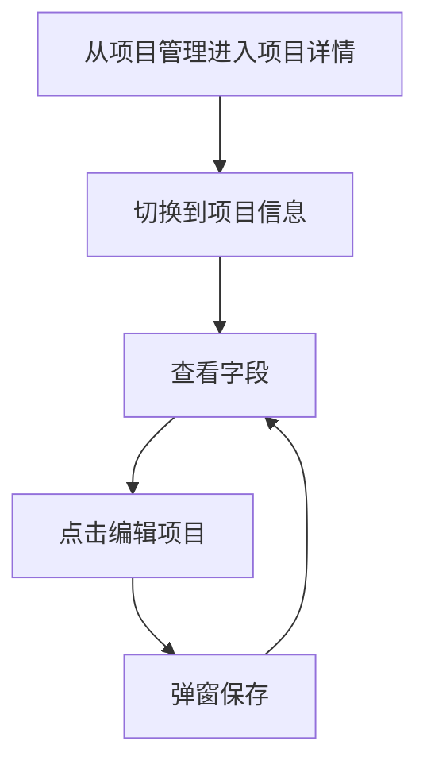

# 1 需求说明

## 1.1 项目管理

### 模块概述

项目管理按团队维度集中管理自动化项目，支持检索、创建、修改、删除与进入项目详情；并在项目详情页的「项目信息」页签中维护项目资料。目标用户为测试工程师、测试负责人。

**与其他模块的关联关系**：
- **团队管理**：「所属团队」下拉依赖团队数据。
- **版本管理**：从本项目进入「项目版本」页签由版本管理模块描述，本模块负责进入项目详情与项目信息维护。



---

### 1.1.1 项目列表与卡片维护

#### 功能概述

以卡片网格展示项目，支持团队筛选、名称关键字过滤、新建/编辑/删除及进入详情。

• **整体业务流程图**



• **用户场景：** 测试工程师在新需求启动时需要建立项目卡片，或在多团队并行时快速筛到自己的项目。

• **功能描述：** 提供项目卡片化列表与完整维护能力，避免误触：编辑/删除放在卡片右上角「…」悬停菜单，点击卡片主体进入详情。

• **优先级：** 高

• **输入/前置条件：** 用户登录后，从左侧菜单进入【自动化开发】-【项目管理】页面。

• **需求描述：**

1. **功能逻辑说明**

   团队筛选默认「全部」；项目名称支持输入即过滤（与 PRD 一致）。新建/编辑使用弹窗，字段包含自动化类型、所属团队、项目名称、项目类型、所在区域（区域可选）；项目名称在同团队内唯一。删除使用统一危险文案二次确认。卡片展示：项目名称、自动化类型标签、项目状态（V1.0.0 为固定「正常」绿色展示）、所属团队、创建与更新时间；**不在卡片展示**项目类型与所在区域，二者仅在弹窗维护。

   ```mermaid
   flowchart TD
       A[打开发起新建] --> B[填写必填项]
       B --> C{同团队重名}
       C -->|是| D[阻止保存并提示]
       C -->|否| E[关闭弹窗并刷新列表]
   ```

2. **界面布局与交互**

   面包屑含「项目管理」；不设与面包屑重复的大标题。工具条：团队下拉、搜索框、添加项目主按钮；主体为响应式卡片网格。卡片右上角「…」悬停展开编辑、删除。

3. **新增/编辑功能**

   | 字段名称 | 类型 | 必填 | 默认值 | 校验规则 | 业务说明 |
   |---------|------|------|--------|----------|----------|
   | 自动化类型 | 下拉 | 是 | 无 | 枚举：接口自动化/UI自动化 | 决定项目能力类型 |
   | 所属团队 | 下拉可搜索 | 是 | 无 | 必选 | 来自团队管理 |
   | 项目名称 | 文本 | 是 | 无 | 同团队唯一 | 卡片主标题 |
   | 项目类型 | 下拉 | 是 | 无 | 平台项目/整机项目 | 仅弹窗维护 |
   | 所在区域 | 下拉 | 否 | 无 | 深圳/重庆/成都 | 仅弹窗维护 |

4. **删除/危险操作**

   删除项目：二次确认，文案「此操作不可恢复，是否继续？」

5. **数据处理规则**

   筛选与搜索对当前列表数据生效；卡片时间格式统一为 `YYYY-MM-DD HH:mm`。

6. **异常场景**

   a) **网络异常**：列表或保存失败提示重试。  
   b) **权限不足**：新建/编辑/删除不可用并说明。  
   c) **数据异常/业务冲突**：重名、校验失败时阻止保存并提示。

7. **影响范围**

   a) 自动化开发-版本管理-项目详情：项目名称、团队等被详情页引用。  
   b) 版本用例开发各页：新窗口顶部展示项目名称依赖进入参数与项目数据。

• **输出/后置条件：** 项目保存后列表与后续详情页可引用最新项目资料。

• **性能指标：** 筛选与搜索反馈宜 ≤ 1 秒。

• **补充说明：** 无

---

### 1.1.2 项目详情-项目信息

#### 功能概述

在项目详情页切换至「项目信息」页签，只读展示项目关键字段，并可通过「编辑项目」打开与项目管理一致的编辑弹窗。

• **整体业务流程图**



• **用户场景：** 测试负责人需要核对自动化类型、团队、项目类型等信息，并在必要时快速修正。

• **功能描述：** 提供项目维度信息总览与一致口径的编辑入口。

• **优先级：** 高

• **输入/前置条件：** 用户登录后在【项目管理】点击目标项目卡片进入【项目详情】，并选择【项目信息】页签。

• **需求描述：**

1. **功能逻辑说明**

   展示项目名称、自动化类型、所属团队、项目类型、所在区域、创建时间、更新时间。编辑项目复用项目管理弹窗字段与校验。保存后本页与项目管理列表展示一致。

2. **界面布局与交互**

   与「项目版本」页签并列；信息区为分组只读展示 + 编辑入口。

3. **新增/编辑功能**

   同「项目列表与卡片维护」弹窗字段表。

4. **删除/危险操作**

   本页签不提供删除项目入口（删除在项目管理列表完成，若产品另有入口则单独补充）。

5. **数据处理规则**

   时间与枚举展示与平台统一格式、统一色板规则一致。

6. **异常场景**

   a) **网络异常**：加载或保存失败提示重试。  
   b) **权限不足**：编辑按钮不可用。  
   c) **数据异常/业务冲突**：保存失败保留弹窗内容并提示。

7. **影响范围**

   a) 自动化开发-项目管理-项目列表：卡片与详情信息一致。  
   b) 自动化开发-版本管理-项目版本：版本列表所属项目信息间接一致。

• **输出/后置条件：** 项目资料更新后，返回列表或停留详情均可见最新值。

• **性能指标：** 无

• **补充说明：** 无

---

# 附录

## 附录A：用户角色说明

| 角色名称 | 角色描述 | 主要权限 | 使用场景 |
|---------|---------|---------|---------|
| 测试工程师 | 维护用例与项目 | 项目维护 | 日常迭代 |
| 测试负责人 | 规划版本 | 项目维护 | 多项目治理 |

## 附录B：术语表

| 术语 | 定义 |
|-----|------|
| 自动化类型 | 接口自动化或 UI 自动化 |

## 附录C：参考文档

- 页面需求与交互规格：`docs/prd/V1.0.0/ATO_V1.0.0-页面需求与交互规格.md`
- 原始页面需求：`prompt/AutoTestOne-V1.0.0 原始页面需求设计.md`
- 模块拆分规则：`.cursor/rules/requirements-module-split.mdc`

## 变更历史

| 版本 | 日期 | 变更类型 | 变更内容 | 变更原因 | 影响范围 |
|------|------|---------|---------|---------|---------|
| V1.0.0 | 2026-04-14 | 新增 | 合并列表与「项目信息」页签到项目管理模块 | 对齐模块拆分清单 | 自动化开发 |
