# 1 需求说明

> **文档状态**：本文档为 V1.0.0 **汇总统览稿**（按历史页面维度串联）。**评审与维护请以模块粒度文档为准**，路径：`docs/prd/V1.0.0/ATO-V1.0.0-{模块名称}_需求文档.md`（模块名称与 `.cursor/rules/requirements-module-split.mdc` 中「功能模块」列一致）。**任务详情**已合并入 `ATO-V1.0.0-测试运行_需求文档.md`，不单独成文。  
> **合入门禁**：未收到「允许合入全量（docs/requirements）」指令前，请勿将模块文档写入 `docs/requirements/`。

## 1.1 自动化测试平台 V1.0.0 页面能力

### 模块概述

本模块用于支撑测试团队完成项目维护、版本管理、用例建设、任务执行与结果追踪的全链路工作。通过统一入口与分层页面，用户可从项目级管理逐步进入版本级执行场景，形成闭环管理。

**与其他模块的关联关系**：
- 与系统设置关联：团队与用户信息会影响项目创建与责任人分配。
- 与版本用例开发关联：项目版本是进入版本用例开发的前置条件。
- 与测试执行结果关联：任务与报告反向指导用例优化与版本评估。

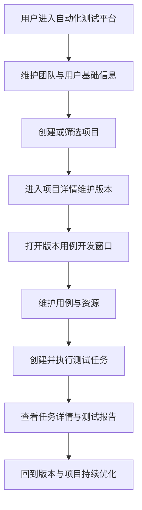

### 1.1.1 系统设置-基础数据

#### 功能概述

用于维护团队与用户基础资料，保障项目、版本、任务中的人员与归属信息准确可用。

• **整体业务流程图**

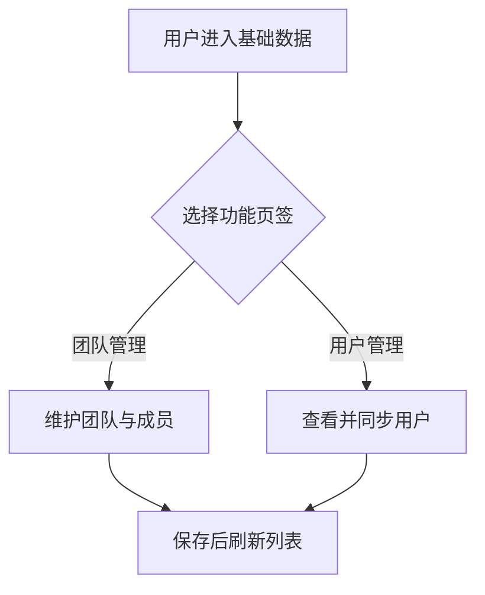

• **用户场景：**

作为测试负责人，在团队成员变化后，需要及时维护团队与用户数据，以便后续项目负责人和执行人可被正确选择。

• **功能描述：**

支持团队新增、修改、删除及成员维护，同时支持用户列表查询与同步，保证组织信息与平台业务保持一致。

• **优先级：** 高

• **输入/前置条件：**

用户登录后，从左侧菜单进入【系统设置】-【基础数据】页面。

• **需求描述：**

1. **功能逻辑说明**
   - 团队管理按“先选团队，再看成员”的方式展示。
   - 删除团队前需判断是否存在成员或关联数据，存在时阻止删除并提示先处理关联项。
   - 用户管理支持主动同步，完成后反馈结果。

2. **界面布局与交互**
   - 页面由团队区与成员区组成；团队区用于定位组织，成员区用于执行成员操作。
   - 用户管理采用列表形式，支持搜索与编辑入口。

3. **新增/编辑功能**
   - 团队：支持新增和修改团队名称，名称必填且不可重复。
   - 成员：支持多选添加成员，并可单条删除。

4. **删除/危险操作**
   - 删除团队与成员均需二次确认。
   - 删除团队失败时需明确说明失败原因。

5. **数据处理规则**
   - 团队名称必填、唯一。
   - 成员与用户信息按工号、姓名、角色、邮箱展示。

6. **异常场景**
   - 网络异常：加载失败，提示重试。
   - 无权限：关键按钮不可用并提示联系管理员。
   - 删除冲突：团队存在关联数据时禁止删除并给出指引。

7. **影响范围**
   - 自动化开发-项目管理：团队数据影响项目归属筛选。
   - 自动化开发-项目详情：负责人选择依赖用户数据。

• **输出/后置条件：**

团队与用户数据更新后，相关页面可使用最新组织信息。

• **性能指标：**

- 页面首次加载时间 <= 3 秒
- 列表检索响应时间 <= 1 秒

• **补充说明：**

无

### 1.1.2 自动化开发-项目管理

#### 功能概述

用于按团队维度集中管理自动化项目，支持快速检索、创建、修改、删除与进入项目详情。

• **整体业务流程图**

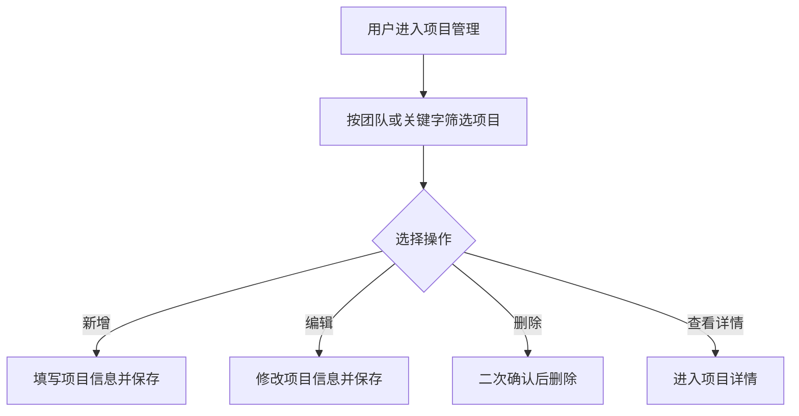

• **用户场景：**

作为测试工程师，在新需求启动或旧项目调整时，需要统一维护项目资料并快速定位目标项目。

• **功能描述：**

提供项目卡片化管理能力，支持筛选、搜索、维护与跳转，帮助用户高效进入后续版本管理。

• **优先级：** 高

• **输入/前置条件：**

用户登录后，从左侧菜单进入【自动化开发】-【项目管理】页面。

• **需求描述：**

1. **功能逻辑说明**
   - 默认展示全部项目。
   - 支持按团队与关键字筛选。
   - 点击项目主体进入项目详情，项目维护操作通过独立入口触发，避免误跳转。

2. **界面布局与交互**
   - 顶部为筛选与主操作区，主体为项目卡片区。
   - 卡片展示项目名称、自动化类型、所属团队、创建与更新时间等关键信息。

3. **新增/编辑功能**
   - 字段包含自动化类型、所属团队、项目名称、项目类型、所在区域。
   - 项目名称必填，且在同团队内唯一。

4. **删除/危险操作**
   - 删除需二次确认，确认后从列表移除。

5. **数据处理规则**
   - 团队筛选默认“全部”。
   - 搜索支持实时生效。

6. **异常场景**
   - 重名校验失败：提示用户更换项目名称。
   - 列表为空：展示空状态并引导创建项目。

7. **影响范围**
   - 自动化开发-项目详情：项目是详情页入口。
   - 版本用例开发窗口：版本所属项目名称在窗口顶部展示。

• **输出/后置条件：**

项目基础信息可被详情页和版本页引用，用户可继续进入版本管理流程。

• **性能指标：**

- 筛选与搜索反馈 <= 1 秒

• **补充说明：**

无

### 1.1.3 自动化开发-项目详情

#### 功能概述

用于在单个项目下维护版本信息与项目信息，是连接项目管理与版本用例开发的核心中转页面。

• **整体业务流程图**

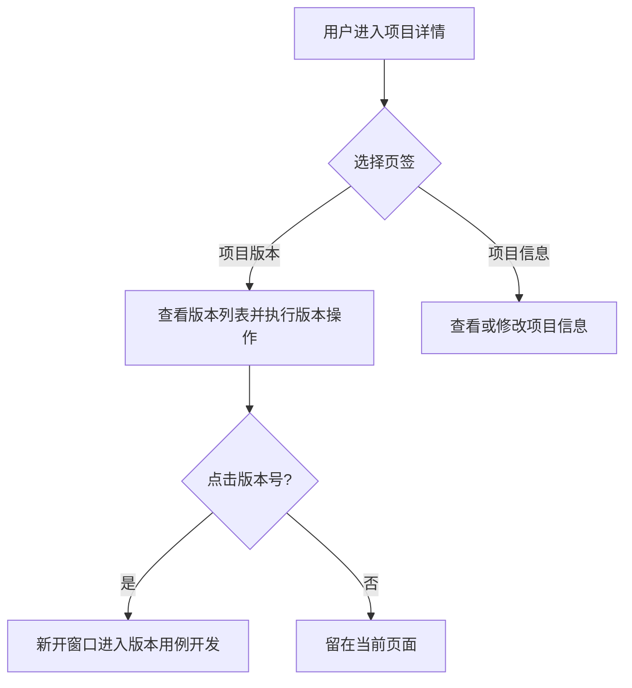

• **用户场景：**

作为测试负责人，在版本交付前，需要创建版本、分配负责人、发布或召回版本，并从版本进入具体用例开发。

• **功能描述：**

支持版本全生命周期管理与项目资料查看，打通“项目到版本”的业务衔接。

• **优先级：** 高

• **输入/前置条件：**

用户登录后，在【项目管理】点击目标项目进入【项目详情】。

• **需求描述：**

1. **功能逻辑说明**
   - 版本区支持新增、编辑、删除、查看详情、发布与召回。
   - 状态流转：未发布 -> 已发布 -> 已召回 -> 可再次发布。
   - 点击版本号进入版本用例开发窗口。

2. **界面布局与交互**
   - 顶部展示返回与项目名；下方通过页签切换版本视图和项目信息视图。

3. **新增/编辑功能**
   - 新增版本需填写版本号、负责人、计划发布日期，可选继承来源。
   - 编辑版本仅允许调整负责人与计划发布日期。

4. **删除/危险操作**
   - 删除版本需二次确认。
   - 发布与召回为关键操作，需明确操作反馈。

5. **数据处理规则**
   - 版本号格式需符合版本命名规范。
   - 版本状态与可执行操作保持联动一致。

6. **异常场景**
   - 版本号重复：禁止保存并提示。
   - 状态切换失败：保留原状态并提示重试。

7. **影响范围**
   - 版本用例开发-用例管理：通过版本号进入该窗口默认页。
   - 项目管理：返回后需反映项目最近更新时间变化。

• **输出/后置条件：**

版本信息可持续维护并可进入版本执行场景。

• **性能指标：**

- 版本操作反馈 <= 2 秒

• **补充说明：**

无

### 1.1.4 自动化开发-版本详情

#### 功能概述

用于展示单个版本的业务信息、发布状态与发布说明，支持用户快速判断版本当前可用性。

• **整体业务流程图**

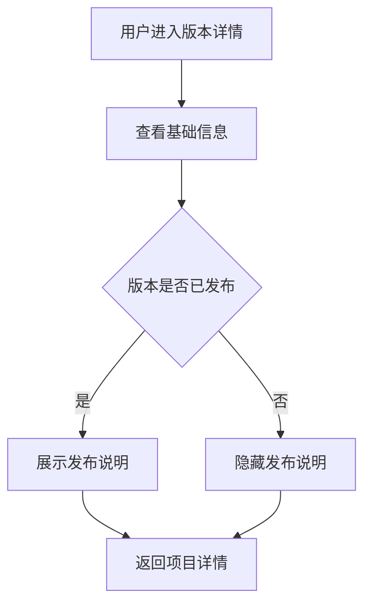

• **用户场景：**

作为测试经理，在评审版本是否可对外使用前，需要查看版本状态、发布时间、成功率和发布说明。

• **功能描述：**

以文档化方式集中展示版本关键指标，帮助用户快速完成版本判断和信息对齐。

• **优先级：** 中

• **输入/前置条件：**

用户登录后，在【项目详情】-【项目版本】点击【详情】进入【版本详情】。

• **需求描述：**

1. **功能逻辑说明**
   - 基础信息长期展示。
   - 发布说明仅在“已发布”状态下展示。

2. **界面布局与交互**
   - 顶部展示返回与版本标识，主体按信息分组展示。

3. **新增/编辑功能**
   - 本页面以查看为主，无直接编辑入口。

4. **删除/危险操作**
   - 无

5. **数据处理规则**
   - 时间按统一格式展示。
   - 空值统一展示为“-”。

6. **异常场景**
   - 版本数据缺失：展示占位并提示返回刷新。
   - 无权限查看：提示联系管理员。

7. **影响范围**
   - 项目详情：返回后继续版本维护流程。

• **输出/后置条件：**

用户完成版本信息确认，可返回上级页面继续操作。

• **性能指标：**

无硬性指标

• **补充说明：**

无

### 1.1.5 版本用例开发-用例管理

#### 功能概述

用于版本维度下的用例目录管理、用例列表维护、步骤编排与调试准备，是版本质量建设的核心页面。

• **整体业务流程图**

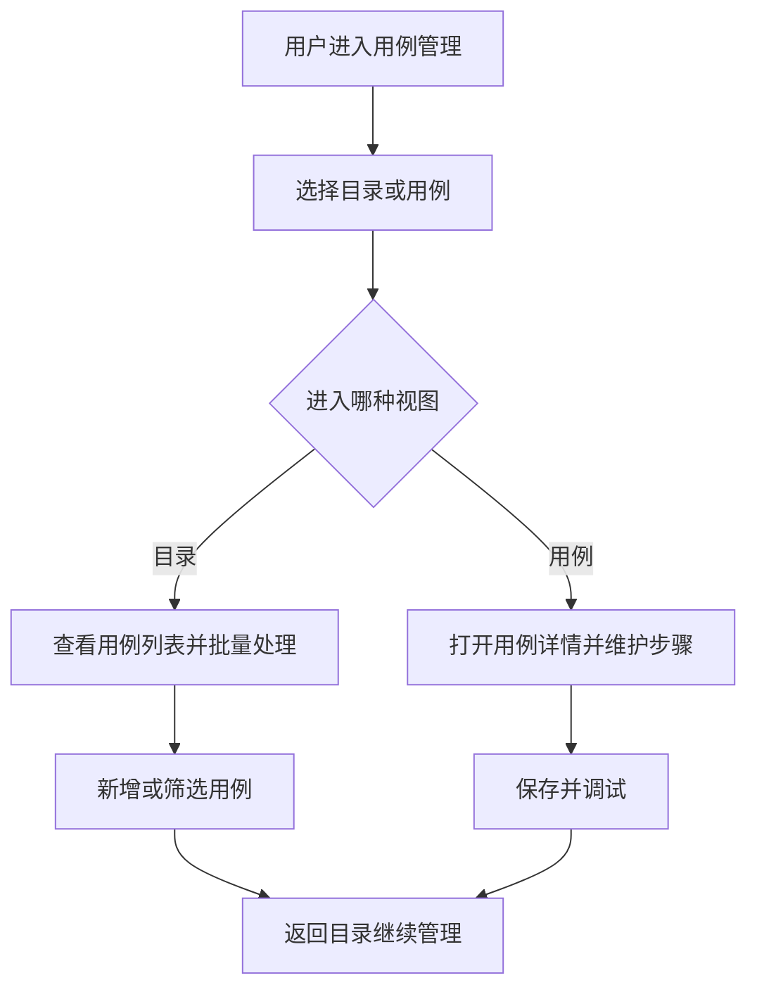

• **用户场景：**

作为测试工程师，在版本回归前，需要组织目录结构、补充用例并完善步骤逻辑，确保可执行性与覆盖率。

• **功能描述：**

支持目录树、用例列表、步骤详情三层协同操作，满足从“结构管理”到“内容编辑”的完整工作流。

• **优先级：** 高

• **输入/前置条件：**

用户登录后，在【项目详情】点击版本号，进入版本用例开发窗口的【用例管理】。

• **需求描述：**

1. **功能逻辑说明**
   - 目录节点与用例节点均支持新增、重命名、移动、启用/禁用、删除。
   - 用例详情支持多标签并行编辑。
   - 步骤支持新增、复制、移动、删除与排序。

2. **界面布局与交互**
   - 左侧为目录树，右侧根据选择切换“用例列表”或“用例详情”。
   - 顶部常驻版本信息与返回入口。

3. **新增/编辑功能**
   - 新增用例需填写名称、所属模块、标签。
   - 步骤编辑支持请求类、函数调用、数据处理、流程控制、等待等类型。

4. **删除/危险操作**
   - 删除目录、用例、步骤均需二次确认并提示不可恢复。

5. **数据处理规则**
   - 节点禁用后以灰态呈现。
   - 列表支持按名称、标识、标签等条件筛选。

6. **异常场景**
   - 保存失败：提示失败原因并保留编辑内容。
   - 目标不存在：复制或移动时目标无效需给出提示。
   - 数据冲突：同名或重复标识需阻止保存。

7. **影响范围**
   - 版本用例开发-变量管理：可被步骤中的动态值引用。
   - 版本用例开发-测试运行：任务执行范围依赖用例数据。
   - 任务详情：用例执行结果可回溯到此页面定位。

• **输出/后置条件：**

版本下用例结构与内容被保存，可直接用于任务执行。

• **性能指标：**

- 常规操作响应 <= 2 秒

• **补充说明：**

无

### 1.1.6 版本用例开发-变量管理

#### 功能概述

用于统一管理全局变量、全局参数与环境变量，保证同一版本在不同环境下的执行一致性。

• **整体业务流程图**

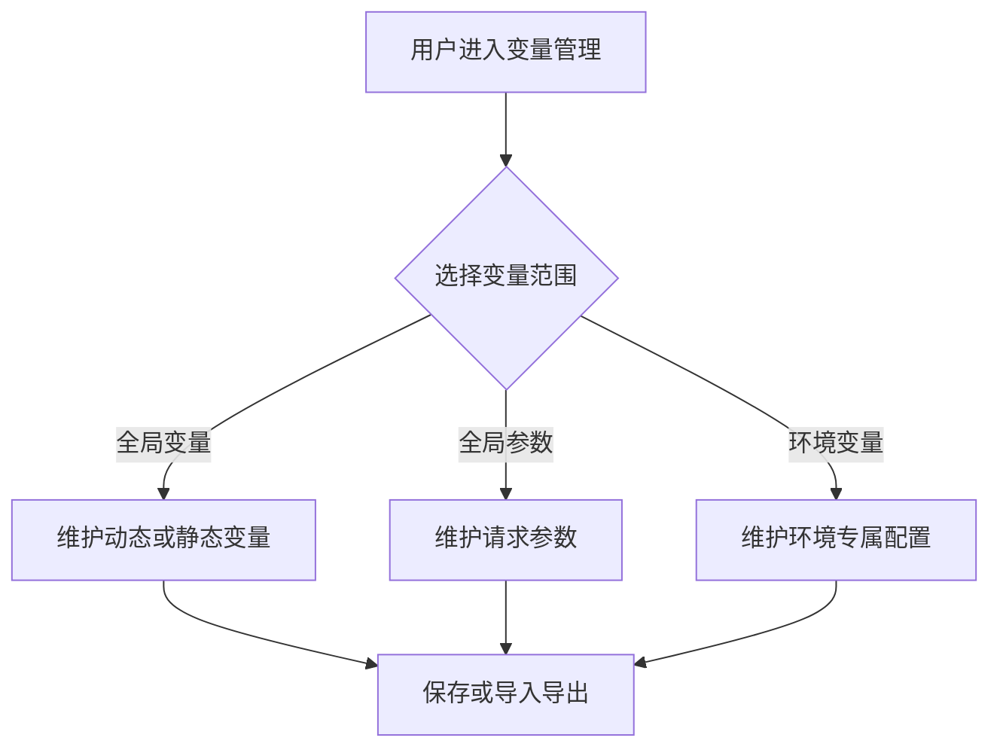

• **用户场景：**

作为测试工程师，在不同测试环境执行同一套用例时，需要快速切换环境参数并保持变量定义一致。

• **功能描述：**

提供分层变量配置能力，支持环境复制、重命名、删除以及静态变量导入导出。

• **优先级：** 高

• **输入/前置条件：**

用户登录后，在版本用例开发窗口进入【变量管理】。

• **需求描述：**

1. **功能逻辑说明**
   - 内置环境不可重命名和删除，自定义环境可维护。
   - 支持从既有环境复制生成副本。
   - 静态变量支持导入与导出；动态变量用于展示来源结果。

2. **界面布局与交互**
   - 左侧为变量导航与环境列表，右侧为对应配置区域。

3. **新增/编辑功能**
   - 支持新增环境、自定义环境重命名、变量与参数行内编辑。

4. **删除/危险操作**
   - 删除自定义环境需二次确认。
   - 删除变量与参数即时生效并可提示结果。

5. **数据处理规则**
   - 环境名称唯一（不区分大小写）。
   - 导入文件格式需符合平台约定。

6. **异常场景**
   - 导入文件格式错误：提示仅支持规范文件。
   - 重名冲突：不允许保存并提示处理建议。

7. **影响范围**
   - 用例管理：步骤中的动态值依赖变量池。
   - 测试运行：任务执行环境参数来源于本页面。

• **输出/后置条件：**

变量与环境配置可被版本内所有用例和任务共享使用。

• **性能指标：**

- 查询与筛选响应 <= 1 秒

• **补充说明：**

无

### 1.1.7 版本用例开发-文件管理

#### 功能概述

用于维护版本运行所需文件资源，支持目录管理、上传、下载、编辑、删除与批量处理。

• **整体业务流程图**

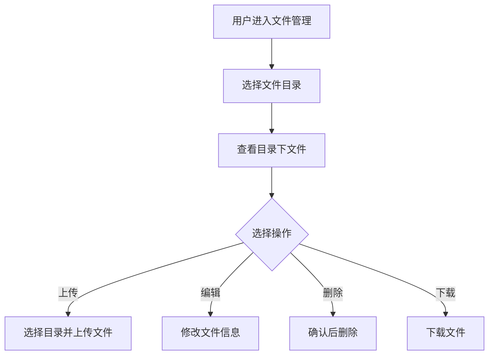

• **用户场景：**

作为测试工程师，在需要上传证书、样本或附件时，需要集中维护版本文件并供用例引用。

• **功能描述：**

支持目录与文件双层管理，提升测试资源管理效率并降低文件查找成本。

• **优先级：** 中

• **输入/前置条件：**

用户登录后，在版本用例开发窗口进入【文件管理】。

• **需求描述：**

1. **功能逻辑说明**
   - 先选目录，再展示对应文件列表。
   - 目录删除前需校验是否存在文件。

2. **界面布局与交互**
   - 左侧为目录区，右侧为文件列表与操作区。

3. **新增/编辑功能**
   - 新增目录需填写名称。
   - 上传文件需选择所属目录并可填写说明。
   - 编辑支持名称与说明调整，可替换文件。

4. **删除/危险操作**
   - 单条和批量删除均需确认。
   - 非空目录不允许删除。

5. **数据处理规则**
   - 文件类型按后缀识别。
   - 搜索覆盖名称、类型、路径、说明。

6. **异常场景**
   - 上传失败：提示失败原因并支持重试。
   - 目录不存在：提示重新选择目录。

7. **影响范围**
   - 用例管理：步骤中涉及文件上传时引用本页面资源。

• **输出/后置条件：**

版本文件资源可被用例步骤按目录检索并使用。

• **性能指标：**

- 列表加载 <= 2 秒

• **补充说明：**

无

### 1.1.8 版本用例开发-自定义函数

#### 功能概述

用于维护可复用函数脚本，支持新增、导入、重命名、编辑、运行与删除。

• **整体业务流程图**

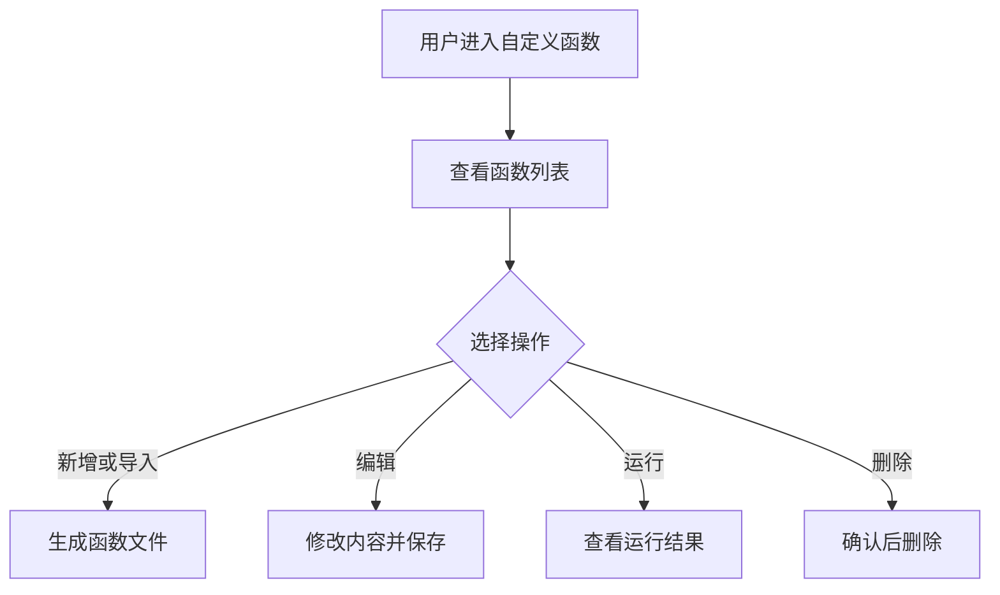

• **用户场景：**

作为测试工程师，在多个用例存在重复处理逻辑时，需要沉淀可复用函数以降低维护成本。

• **功能描述：**

提供函数文件级别的生命周期管理，支持快速沉淀和验证公共逻辑。

• **优先级：** 中

• **输入/前置条件：**

用户登录后，在版本用例开发窗口进入【自定义函数】。

• **需求描述：**

1. **功能逻辑说明**
   - 列表态用于检索与维护。
   - 编辑态用于内容修改与运行验证。

2. **界面布局与交互**
   - 工具栏包含新增、导入、删除与搜索。
   - 编辑态顶部提供返回、运行、保存。

3. **新增/编辑功能**
   - 新增与重命名时需校验名称唯一性并自动补齐扩展名。
   - 导入时仅接受规范类型文件，重复文件自动跳过并提示。

4. **删除/危险操作**
   - 删除需二次确认。

5. **数据处理规则**
   - 文件名称大小写不敏感去重。
   - 保存后更新时间自动刷新。

6. **异常场景**
   - 运行失败：展示失败信息并保留内容。
   - 导入异常：逐条反馈失败原因。

7. **影响范围**
   - 用例管理：步骤中的函数调用来源于本页面函数池。

• **输出/后置条件：**

函数能力可被用例步骤直接复用。

• **性能指标：**

无硬性指标

• **补充说明：**

无

### 1.1.9 版本用例开发-标签管理

#### 功能概述

用于统一维护版本标签体系，支撑用例分类、筛选和执行范围组合。

• **整体业务流程图**

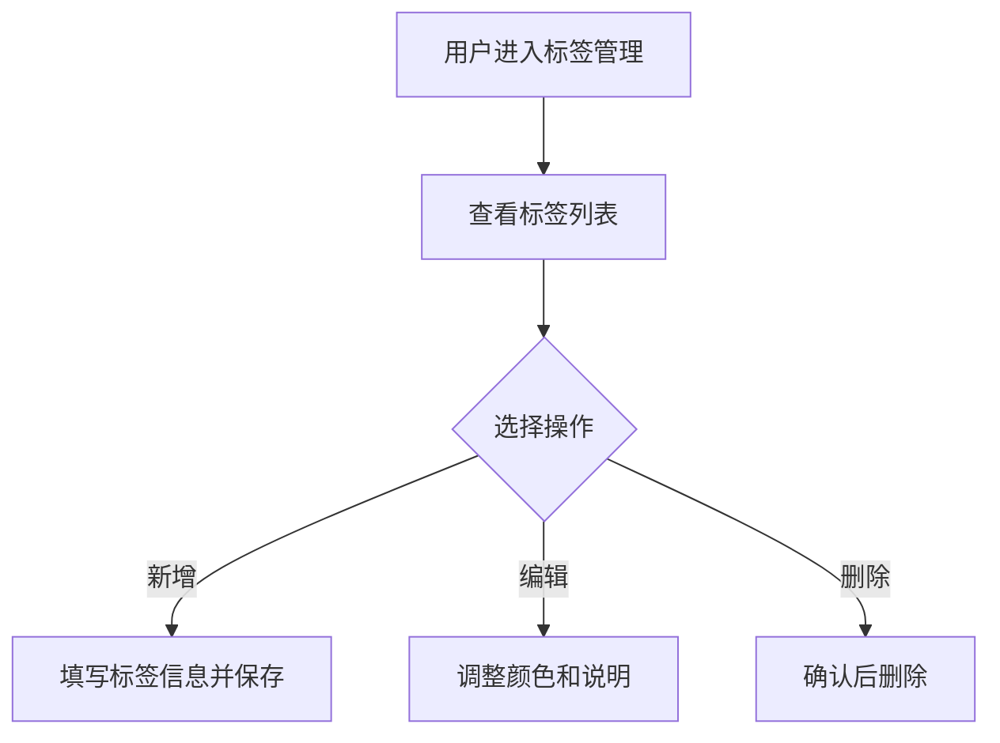

• **用户场景：**

作为测试负责人，在组织回归策略时，需要按业务域、优先级或场景标签快速圈定用例集合。

• **功能描述：**

支持标签新增、修改、删除与检索，为用例治理和任务圈选提供统一标签标准。

• **优先级：** 中

• **输入/前置条件：**

用户登录后，在版本用例开发窗口进入【标签管理】。

• **需求描述：**

1. **功能逻辑说明**
   - 标签名称创建后不可随意变更，避免历史标识混乱。
   - 标签颜色与说明可持续维护。

2. **界面布局与交互**
   - 单列表结构，左侧主操作，右侧搜索。

3. **新增/编辑功能**
   - 新增需填写标签名称与颜色，名称唯一。
   - 编辑仅允许调整颜色与说明。

4. **删除/危险操作**
   - 删除需二次确认。

5. **数据处理规则**
   - 名称唯一性不区分大小写。
   - 搜索支持名称、颜色、说明。

6. **异常场景**
   - 重名创建：阻止保存并提示。
   - 删除失败：提示关联影响并建议先解除引用。

7. **影响范围**
   - 用例管理：用例标签来源于本页面。
   - 测试运行：任务执行范围可按标签圈选。

• **输出/后置条件：**

标签体系可供版本内用例和任务统一引用。

• **性能指标：**

无硬性指标

• **补充说明：**

无

### 1.1.10 版本用例开发-测试运行

#### 功能概述

用于创建并管理自测任务，实时跟踪任务进度与执行状态。

• **整体业务流程图**

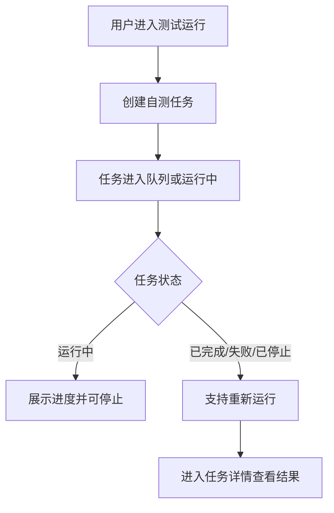

• **用户场景：**

作为测试负责人，在版本发布前，需要快速创建回归任务并观察执行进度，及时判断版本风险。

• **功能描述：**

支持任务创建、运行控制、状态跟踪与结果入口管理。

• **优先级：** 高

• **输入/前置条件：**

用户登录后，在版本用例开发窗口进入【测试运行】。

• **需求描述：**

1. **功能逻辑说明**
   - 创建任务后进入状态机：排队中、运行中、已完成、已停止、失败。
   - 不同状态对应不同可执行操作。
   - 运行中任务持续更新进度，完成后固定为 100%。

2. **界面布局与交互**
   - 顶部为创建与搜索，主体为任务列表与状态信息。

3. **新增/编辑功能**
   - 创建任务需设置名称、环境、执行策略、范围与并行策略。

4. **删除/危险操作**
   - 删除任务需确认。
   - 停止任务属于关键操作，需明显提示影响。

5. **数据处理规则**
   - 名称必填，次数与限时采用数字范围控制。
   - 执行范围支持按模块和标签组合。

6. **异常场景**
   - 参数非法：阻止创建并提示修正。
   - 任务启动失败：保留草稿并提示重试。

7. **影响范围**
   - 任务详情：任务标识是详情页唯一入口。
   - 用例管理：执行结果反哺用例优化。

• **输出/后置条件：**

生成可追踪任务记录并可进入详情查看执行结果。

• **性能指标：**

- 任务创建响应 <= 2 秒
- 状态刷新间隔满足实时观察需求

• **补充说明：**

无

### 1.1.11 版本用例开发-任务详情

#### 功能概述

用于查看单个任务的配置、日志与测试报告，支撑问题定位与结果复盘。

• **整体业务流程图**

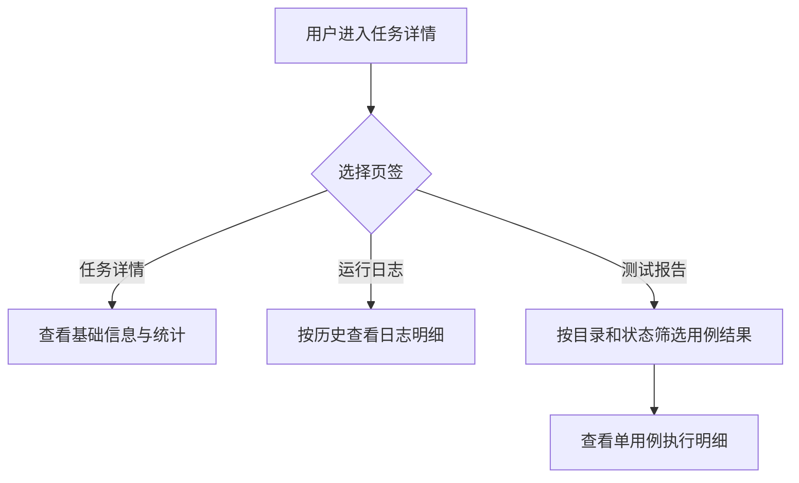

• **用户场景：**

作为测试工程师，在任务完成后，需要快速定位失败用例、查看关键步骤与断言结果，形成修复闭环。

• **功能描述：**

提供任务级全景视图，覆盖配置、过程与结果三类信息，支持从总览下钻到单用例详情。

• **优先级：** 高

• **输入/前置条件：**

用户登录后，在【测试运行】点击任务标识进入【任务详情】。

• **需求描述：**

1. **功能逻辑说明**
   - 通过页签区分“配置统计、运行日志、测试报告”三类信息。
   - 报告区域支持目录与状态双维筛选。
   - 点击用例可查看步骤级执行详情。

2. **界面布局与交互**
   - 顶部展示返回与任务标识。
   - 报告区采用左筛选右结果结构，支持明细抽屉查看。

3. **新增/编辑功能**
   - 本页面以查看和分析为主，无新增编辑表单。

4. **删除/危险操作**
   - 无

5. **数据处理规则**
   - 统计指标与列表明细需保持一致。
   - 报告筛选应实时联动更新。

6. **异常场景**
   - 日志缺失：提示“暂无日志”并引导返回任务列表重试。
   - 报告数据不完整：提示以最新一次结果为准。

7. **影响范围**
   - 用例管理：可从失败详情回溯到具体用例进行修复。
   - 测试运行：返回后用于继续执行或对比历史任务。

• **输出/后置条件：**

用户可完成任务结果研判并形成后续修复行动。

• **性能指标：**

- 详情页切换响应 <= 1 秒

• **补充说明：**

无

# 附录

## 附录A：用户角色说明

| 角色名称 | 角色描述 | 主要权限 | 使用场景 |
|---------|---------|---------|---------|
| 测试工程师 | 负责用例与任务执行 | 维护用例、配置变量、执行任务、查看报告 | 日常回归执行与问题定位 |
| 测试负责人 | 负责计划与质量把控 | 维护项目版本、制定执行范围、跟踪结果 | 版本发布前质量评估 |
| 开发工程师 | 关注变更影响与自检 | 触发任务、查看结果、配合修复 | 提测前或合入前自测 |

## 附录B：术语表

| 术语 | 定义 | 业务说明 |
|-----|------|---------|
| 项目 | 业务测试对象集合 | 版本、用例与任务的上级载体 |
| 版本 | 项目下的交付批次 | 用于组织本次回归范围 |
| 用例 | 可执行测试条目 | 由步骤、变量、标签等组成 |
| 任务 | 一次测试执行实例 | 记录执行过程、状态与结果 |

## 附录C：参考文档

- 页面需求与交互规格：`docs/prd/V1.0.0/ATO_V1.0.0-页面需求与交互规格.md`
- 原始页面需求：`prompt/AutoTestOne-V1.0.0 原始页面需求设计.md`
- 模块拆分规则：`.cursor/rules/requirements-module-split.mdc`
- 生成规则：`.cursor/rules/prd-to-requirements.mdc`
- 生成提示词：`prompt/前端PRD转产品需求文档提示词.md`

## 变更历史

| 版本 | 日期 | 变更类型 | 变更内容 | 变更原因 | 影响范围 |
|------|------|---------|---------|---------|---------|
| V1.0.0 | 2026-04-14 | 优化 | 补充模块文档索引与参考路径；变更历史移至附录 | 对齐 prd-to-requirements 门禁 | 文档结构 |
| V1.0.0 | 2026-04-10 | 新增 | 自动化测试平台 V1.0.0 业务需求基线，覆盖 11 个页面能力 | 统一业务口径，支撑版本落地与协同验收 | 系统设置、自动化开发、版本用例开发 |

---

**文档版本：** V1.0.0  
**最后更新：** 2026-04-14  
**编写人：** AI 产品助手  
**审核人：** 待确认
