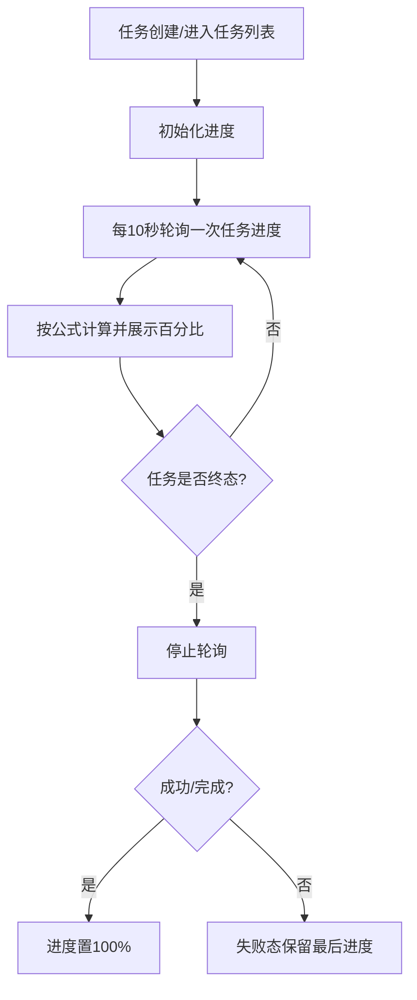
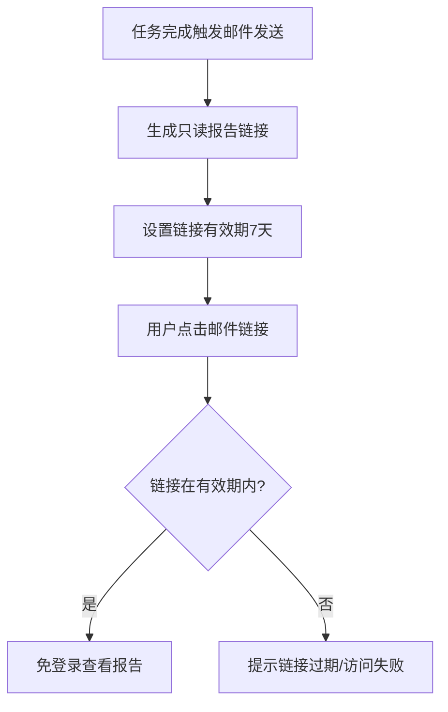

# ATO V1.0.1-P4 平台自动化（新增/优化）

> **模块**：自动化应用 / 平台自动化  
> **类型**：新增 + 优化  
> **来源**：`ATO_V1.0.1-P4-迭代需求规格说明书.md`

---

## 1. 需求范围

- REQ-V1.0.1-P4-032
- REQ-V1.0.1-P4-033

## 2. 功能规格

- 测试任务管理列表增加执行进度实时展示。
- 邮件发送能力优化：正文内容更完整、视觉更清晰、报告链接更易访问。
- 邮件中的报告链接采用免登录访问机制，仅具备查看权限。
- 邮件模板视觉样式以 `docs/prd/V1.0.1-P4/email-template-reference.png` 为基线参考图。
- 邮件模板无固定品牌规范要求（无强制 Logo/主题色/页脚签名），按参考图执行。

## 3. 验收标准

- 任务列表进度展示规则与“版本用例开发/测试运行”保持一致（百分比、状态一致性）。
- 进度计算口径与 REQ-031 保持一致：`已执行用例数 / 已配置运行的用例总数 * 100%`。
- 进度刷新机制与 REQ-031 保持一致：轮询间隔 10 秒，任务终态后停止轮询。
- 邮件正文至少包含：任务名称/任务ID、执行开始时间、执行结束时间（若有）、总数、成功数、失败数、报告访问入口。
- 报告入口在邮件中可直接点击跳转，跳转失败时需有可读提示或兜底访问说明。
- 报告链接不要求登录鉴权，且访问权限为只读查看；链接有效期为 7 天（一周）。
- 邮件模板验收以 `docs/prd/V1.0.1-P4/email-template-reference.png` 视觉布局为准，不校验固定品牌元素一致性。

## 4. 前端交互说明（开发输入）

### 4.1 REQ-032 任务进度展示交互

- **展示位置**：任务列表新增“进度”列，显示 `xx%`。
- **计算口径**：`已执行用例数 / 已配置运行的用例总数 * 100%`。
- **刷新机制**：轮询，间隔 10 秒。
- **终止规则**：任务进入终态（成功/失败）即停止轮询。
- **状态规则**：
  - 运行中：进度单调不减。
  - 成功/完成：进度=100%。
  - 失败：展示最后进度，不强制100%。

### 4.2 REQ-033 邮件模板与报告链接交互

- **邮件模板基线**：`docs/prd/V1.0.1-P4/email-template-reference.png`。
- **品牌规则**：无固定品牌元素强约束（不强制 Logo/主题色/页脚签名）。
- **报告链接**：免登录，仅读权限，有效期 7 天。
- **异常兜底**：链接失效或跳转失败时，邮件中需提供提示文案（如“链接已过期，请重新触发任务或联系管理员”）。

**邮件模板基线图（REQ-033 绑定）**：

## 5. 后端接口契约草案（联调输入）

### 5.1 REQ-032 任务进度查询

- **建议接口**：`GET /api/tasks/{taskId}/progress`
- **响应字段**：
  - `taskId: string`
  - `executedCaseCount: number`
  - `configuredCaseTotal: number`
  - `progressPercent: number`
  - `status: RUNNING | SUCCESS | FAILED`
  - `updatedAt: string`

### 5.2 REQ-033 报告链接下发

- **建议接口**：`POST /api/tasks/{taskId}/report-link`
- **响应字段**：
  - `reportUrl: string`
  - `permission: view_only`
  - `expireAt: string`（创建后7天）
- **约束**：
  - 链接免登录可访问，但只允许查看。
  - 过期后返回可读错误信息。

## 6. 业务实现流程图（Mermaid）

### 6.1 任务进度轮询流程（REQ-032）

### 6.2 邮件报告链接生命周期（REQ-033）

