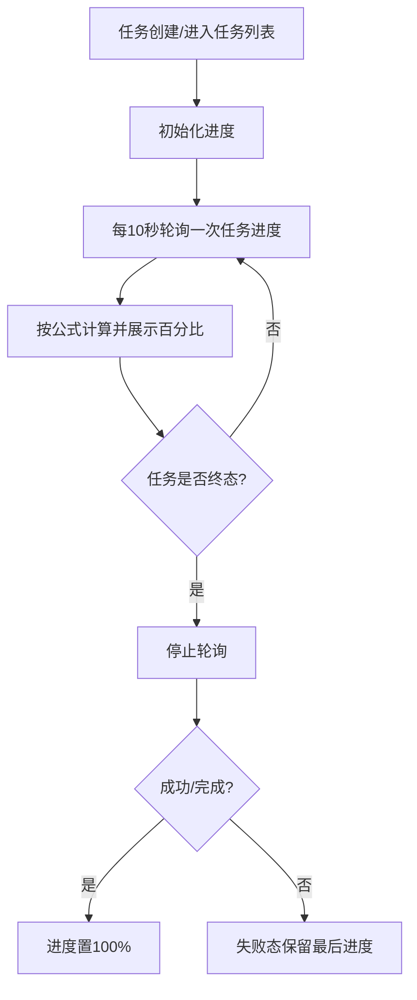

# ATO V1.0.1-P4 测试运行（新增）

> **模块**：版本用例开发 / 测试运行  
> **类型**：新增  
> **来源**：`ATO_V1.0.1-P4-迭代需求规格说明书.md`

---

## 1. 需求范围

- REQ-V1.0.1-P4-031

## 2. 功能规格

- 任务列表新增“进度”百分比实时展示，用户可感知任务执行进展。
- 任务进度计算公式固定为：`已执行用例数 / 已配置运行的用例总数 * 100%`。
- 任务进度刷新机制采用轮询，轮询间隔固定为 10 秒。

## 3. 验收标准

- 任务列表展示进度百分比，取值范围为 `0%~100%`。
- 进度百分比按公式 `已执行用例数 / 已配置运行的用例总数 * 100%` 计算并展示。
- 任务运行中每 10 秒触发一次进度刷新请求；任务进入终态（成功/失败）后停止轮询。
- 任务状态为“运行中”时，进度应单调不减；任务状态为“成功/完成”时进度必须为 `100%`。
- 任务状态为“失败”时保留最后进度并展示失败状态，不允许显示为 `100%` 冒充成功。

## 4. 前端交互说明（开发输入）

### 4.1 REQ-031 任务进度展示交互

- **展示位置**：任务列表新增“进度”列，显示 `xx%`。
- **计算口径**：`已执行用例数 / 已配置运行的用例总数 * 100%`。
- **刷新机制**：轮询，间隔 10 秒。
- **终止规则**：任务进入终态（成功/失败）即停止轮询。
- **状态规则**：
  - 运行中：进度单调不减。
  - 成功/完成：进度=100%。
  - 失败：展示最后进度，不强制100%。

## 5. 后端接口契约草案（联调输入）

### 5.1 REQ-031 任务进度查询

- **建议接口**：`GET /api/tasks/{taskId}/progress`
- **响应字段**：
  - `taskId: string`
  - `executedCaseCount: number`
  - `configuredCaseTotal: number`
  - `progressPercent: number`
  - `status: RUNNING | SUCCESS | FAILED`
  - `updatedAt: string`
- **口径约束**：
  - `progressPercent = executedCaseCount / configuredCaseTotal * 100`
  - 前后端一致采用该口径。
- **错误码建议**：
  - `TASK_001` 任务不存在
  - `TASK_002` 无查看权限
  - `TASK_003` 进度计算异常

## 6. 业务实现流程图（Mermaid）

### 6.1 任务进度轮询流程（REQ-031）

