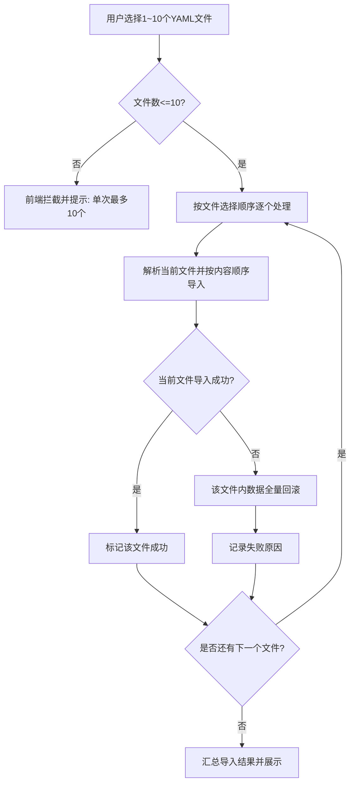

# ATO V1.0.1-P4 用例管理（新增/优化）

> **模块**：版本用例开发 / 用例管理  
> **类型**：新增 + 优化  
> **来源**：`ATO_V1.0.1-P4-迭代需求规格说明书.md`

---

## 1. 需求范围

- REQ-V1.0.1-P4-022 ~ REQ-V1.0.1-P4-027
- REQ-V1.0.1-P4-029 ~ REQ-V1.0.1-P4-030

## 2. 功能规格

- 添加用例支持 YAML 批量导入，单次最多 10 个文件，导入顺序为“文件顺序优先、文件内自上而下”。
- 用例步骤编辑支持断言数据复用（文本/JSON 模式切换）。
- 断言逻辑下拉框支持模糊搜索。
- 变量提取列表新增“变量说明”字段。
- 步骤复制支持跨用例复制，采用前端文本复制粘贴方案。
- 接口请求 Params 支持文本/JSON 模式复用复制。
- 用例运行入口优化，在模块区和列表区均可直接发起批量运行。
- 用例数据导出支持 YAML 格式，模块选择支持名称模糊匹配，目录树操作栏提供导出入口。

## 3. 关键规则

- 导入上限与顺序规则为强约束，不得绕过。
- YAML 批量导入失败策略采用“按文件粒度处理”：已导入成功的 YAML 文件不做回滚；导入失败的 YAML 文件执行该文件内数据全量回滚。
- 跨用例步骤复制允许变量重名，不因变量名重复阻断复制流程。
- 断言与“用例-步骤”强绑定；不引入断言全局唯一 ID 冲突校验规则。
- 用例导出支持按模块（文件目录）导出，导出格式为 YAML。
- 导出文件命名格式固定为：`{模块路径}-{时间戳}.yaml`（示例：`接入-协议管理-2155452262262.yaml`）。
- 由于文件名包含时间戳，不存在同名文件冲突场景。
- 文本/JSON 模式切换需确保双向可编辑且内容不丢失。

## 4. 验收标准

- 批量导入支持 1~10 个 YAML 文件；超过 10 个时前端阻断并提示“单次最多导入10个YAML文件”。
- 导入顺序严格遵循“文件选择顺序 -> 文件内容自上而下”，并可通过导入结果顺序回显验证。
- 当批量导入中某个 YAML 文件失败时，仅该失败文件回滚；已成功导入文件保持成功状态且不回滚。
- 跨用例复制步骤时，存在同名变量不应阻断复制，复制后步骤可正常保存与执行。
- 复制后的断言按目标用例的步骤上下文生效，验证“断言绑定用例-步骤”语义保持正确。
- 断言复用、跨用例步骤复制、Params 复用在至少 2 个不同用例间可重复执行且保存后不丢失。
- 文本/JSON 双模式切换后字段语义保持一致（不新增、不丢失、不串位）。
- 导出入口在目录树操作栏可直达；导出文件名符合 `{模块路径}-{时间戳}.yaml` 规则。

## 5. 前端交互说明（开发输入）

### 5.1 REQ-022 YAML批量导入交互

- **入口**：`用例管理 -> 添加用例 -> YAML批量导入`。
- **选择文件**：支持一次选择 1~10 个 YAML；超过 10 个立即前端拦截并 Toast 提示。
- **导入顺序**：按用户选择文件顺序逐个导入；每个文件内部按 YAML 内容从上到下处理。
- **结果反馈**：导入完成后展示“成功文件数/失败文件数”；失败项需展示文件名和失败原因。
- **失败回滚**：按文件粒度回滚；失败文件全量回滚，成功文件不回滚。
- **异常态**：网络异常、格式异常、权限不足均需有可读提示，且不清空已完成的成功结果。

### 5.2 REQ-030 用例导出交互（按模块目录）

- **入口**：`用例管理目录树操作栏 -> 导出`。
- **导出范围**：按当前所选模块（文件目录）导出。
- **命名规则**：`{模块路径}-{时间戳}.yaml`。
- **示例**：`接入-协议管理-2155452262262.yaml`。
- **下载行为**：点击后触发文件下载；失败时提示失败原因并允许重试。

## 6. 后端接口契约草案（联调输入）

### 6.1 REQ-022 批量导入

- **建议接口**：`POST /api/case-management/import-yaml-batch`
- **请求体（示例）**：
  - `modulePath: string`
  - `files: File[]`（1~10）
- **响应体（示例）**：
  - `successCount: number`
  - `failedCount: number`
  - `results: [{ fileName, status, reason? }]`
- **错误码建议**：
  - `IMPORT_001` 文件数超限
  - `IMPORT_002` YAML解析失败
  - `IMPORT_003` 权限不足
  - `IMPORT_004` 系统异常

### 6.2 REQ-030 模块导出

- **建议接口**：`GET /api/case-management/export-yaml`
- **请求参数**：
  - `modulePath: string`（必填）
- **返回**：
  - `application/x-yaml` 文件流
  - `filename: {模块路径}-{时间戳}.yaml`
- **错误码建议**：
  - `EXPORT_001` 模块不存在
  - `EXPORT_002` 无导出权限
  - `EXPORT_003` 导出失败

## 7. 业务实现流程图（Mermaid）

### 7.1 YAML批量导入流程（REQ-022）

