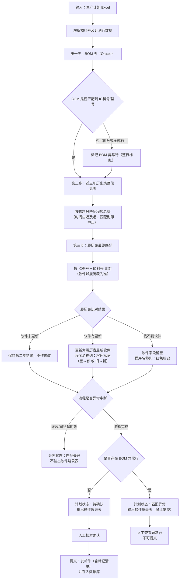

# ATO V1.0.1-P4 计划管理（新增）

> **模块**：产测软件管理 / 计划管理  
> **类型**：新增  
> **SRS（迭代 PRD）**：`ATO_V1.0.1-P4-计划管理-需求规格说明书.md`（本文件内容已继承至 SRS，**本文件保留不删**）  
> **对齐基线**：`ATO_V1.0.1-P4-页面需求与交互规格.md`（4.1/4.2/4.4） + `src/pages/ProductionPlanList.tsx` + `src/pages/ProductionPlanDetail.tsx` + `src/pages/HistoricalPlanDataManagement.tsx`

---

## 1. 需求范围

- REQ-V1.0.1-P4-001 ~ REQ-V1.0.1-P4-010、REQ-V1.0.1-P4-035 ~ REQ-V1.0.1-P4-041（含历史计划数据管理及非功能性要求）
- 覆盖页面：计划列表 ` /ptsw/plans `、计划详情 ` /ptsw/plans/:planId `、历史计划数据管理 ` /ptsw/plans/history `

## 2. 功能需求清单（按功能维度）

### 2.1 计划列表

- **功能目标**：展示计划数据并提供检索与入口操作。
- **列表字段**：ID、计划名称、周次、状态、变更次数、创建日期、提交日期、变更日期、创建人、操作。
- **状态枚举**：`匹配中`、`待确认`、`已提交`、`匹配异常`、`匹配失败`（口径见 **§2.10**）。
- **操作栏**：新建计划、周次筛选、状态筛选、关键字搜索（ID/计划名称，支持回车）、分页（10/20/50）；右上角 **「历史计划数据管理」** 按钮（见 §2.12）。
- **UI交互**：计划名称可点击进入详情；提交/变更日期空值显示 `-`；空态显示“去新建计划”。
- **限制与异常**：查询为空时仅显示空态引导，不报错。

### 2.2 创建计划

- **功能目标**：创建新的板卡产测计划并触发软件烧录表匹配流程。
- **输入项**：计划名称（必填）、生产计划 Excel（必传，仅 `.xlsx/.xls`）。
- **创建结果**：新记录写入列表，初始状态为 `匹配中`。
- **后台处理约束**：异步执行 **§3 板卡产测软件烧录匹配流程**；完成后回写 **`待确认`**、**`匹配异常`** 或 **`匹配失败`**（见 §2.10）。
- **限制与异常**：未上传 Excel 时阻断创建并提示“请上传生产计划 Excel 文件”。

### 2.3 计划详情

- **功能目标**：查看并维护计划下的烧录、日志、生产计划明细。
- **页签结构（固定）**：软件烧录表、操作日志、生产计划表。
- **顶部操作**：保存、提交（或提交变更）、返回。
- **软件烧录表字段**（REQ-V1.0.1-P4-035 优化后）：生产任务单编号、物料代码、物料名称、数量、IC料号、IC型号、程序名称、checksum值、是否烧录、软件存放路径。
- **软件烧录表列说明**：
  - **物料名称**：原「物料描述」，只读展示。
  - **程序名称**：原「软件名称」；可编辑输入框；**履历表匹配结果 UI 标记见 §2.9**。
  - **checksum值**：原「软件状态」列位；字符串类型；可编辑输入框，**双击单元格**进入编辑；匹配生成时可预填，允许手工修正。
  - **是否烧录**：枚举「是 / 否」；程序名称为空时置空。
  - **软件存放路径**：新增末列；字符串；只读展示（匹配自履历表/软件库）；Mock 示例 `\\192.168.1.30\firmware\ASH\V262B107`。
  - **已删除**：「烧录阶段」列；原「软件状态=已下架」红色高亮规则一并移除。
- **一对多展示**：同一 **生产任务单编号 + 物料代码 + 物料名称 + 数量** 可对应多条 IC 明细行；表格前置公共列（任务单、物料代码、物料名称、数量）按组 **`rowSpan` 合并**展示，IC 及软件列不合并。
- **IC 数据口径**：**IC料号与 IC型号一一对应**（同一 IC料号在全库仅对应唯一 IC型号）；**IC型号可对应多个 IC料号**（替代料/多源料号场景）。BOM 与历史数据、烧录表 Mock 须遵守该约束。
- **提交校验**（首次提交与变更提交均适用）：
  - 存在「需烧录但无程序名称」的行时阻断提交并提示明细数量；
  - 存在 **§3 第三步「找不到软件」** 标记且程序名称仍为空的行（**红色输入框**）时**必须阻断提交**，须人工补齐程序名称后方可提交；
  - **橙色输入框**（软件有更新，含 **空→有**、**旧→新** 两种场景，见 §2.9）为提示性标记，不单独阻断提交。
  - 提交成功后发送邮件时，**邮件正文须列出所有橙色/红色标记的板卡明细**（见 **§2.11**）。
- **生产计划表字段**：周次、生产任务单编号、物料代码、名称、数量。
- **通用交互**：Tab1/Tab3 支持搜索与导出；Tab2 只读展示日志。
- **限制与异常**：
  - 计划不存在时展示空态并提供返回列表按钮；
  - **`匹配失败`**：Tab「软件烧录表」**不展示**预览列表，显示空态说明；
  - **`匹配异常`**：展示软件烧录表预览，**禁止提交**；BOM 异常行 **整行标红**（见 §2.10）。

### 2.4 计划编辑

- **功能目标**：修正计划基础信息并重新触发匹配。
- **入口**：列表“编辑”按钮（非已提交状态）。
- **编辑项**：计划名称（必填）、生产计划 Excel（必传，重新上传）。
- **保存结果**：状态置为 `匹配中`，匹配完成后更新为 `待确认`。
- **限制与异常**：
  - `已提交` 状态不可编辑，提示“已提交计划不可编辑”；
  - 未上传新 Excel 时阻断保存并提示“请重新上传生产计划 Excel 文件”。

### 2.5 计划变更

- **功能目标**：对既有计划进行变更并走变更提交流程。
- **入口**：列表“变更”按钮跳转详情 `?mode=changeEdit`。
- **变更信息**：变更原因（默认`迭代更新/bug修复`，支持新增）、影响范围（必填）、备注（选填）。
- **变更交互**：变更态下改动行高亮；提交弹窗支持发送人/抄送/按团队带出成员；联系人信息可回填复用。
- **提交校验**：与 §2.3 提交校验一致；存在红色标记且程序名称为空的行时阻断提交。
- **限制与异常**：变更态提交使用“提交变更”语义，提交后进入审批/通知流程（当前页面按 Mock 展示结果）；变更邮件正文同样须包含 **§2.11** 标记清单。

### 2.6 删除计划

- **功能目标**：删除未提交且无需保留的计划记录。
- **入口**：列表“删除”按钮。
- **确认机制**：二次确认文案固定为 `此操作不可恢复，是否继续？`。
- **限制与异常**：
  - `已提交` 状态不可删除，按钮禁用并提示“已提交不可删除”；
  - 删除成功后列表即时移除并提示成功信息。

### 2.7 重新匹配

- **功能目标**：对匹配失败、匹配异常或待确认计划重新执行匹配流程。
- **入口**：列表“重新匹配”按钮。
- **可执行状态**：`匹配失败`、`匹配异常`、`待确认`。
- **执行结果**：状态先置为 `匹配中`，按 **§3 板卡产测软件烧录匹配流程** 重新匹配，完成后回写 `待确认`、`匹配异常` 或 `匹配失败`（当前为 Mock）。
- **限制与异常**：
  - `已提交` 不可刷新；
  - 非允许状态点击提示“当前状态不可刷新”。

## 3. 板卡产测软件烧录匹配流程图

> **输入**：生产计划 Excel（周计划）。  
> **输出**：计划详情 Tab「软件烧录表」行数据（**`匹配失败` 时不输出**）；终态为 `待确认` / `匹配异常` / `匹配失败`，其中 `待确认` 经人工确认提交后入库并发送邮件。

**匹配步骤（后台异步）**：

1. **第一步 — BOM 表（Oracle 数据库）**：按 Excel 中的**物料号**查询 BOM，获取 **IC料号**、**IC型号**、**是否烧录**。
2. **第二步 — 近三年历史烧录信息表（数据库）**：按**物料号**匹配**程序名称**；检索范围限定近 **3 年**，**时间由近及远**，**匹配到即中止**。
3. **第三步 — 履历表最终匹配**：按 **IC型号 + IC料号** 与履历表比对，**软件信息以履历表为准**：
   - 软件**未更新**：保持第二步结果，不作修改；
   - 软件**有更新**：履历表匹配到的软件与第二步结果不一致，或第二步程序名称为空而履历表匹配到软件；更新为履历表最新软件（程序名称、checksum值、软件存放路径等），并**做橙色标记**（两种子场景见 §2.9）；
   - **找不到软件**：第二步与履历表均未得到有效程序名称，程序名称等软件字段**留空**，并**做红色标记**。
4. **第四步 — 输出周板卡烧录计划表**：汇总上述结果；若流程正常完成则生成详情「软件烧录表」预览数据，并根据是否存在 BOM 异常行决定计划终态为 **`待确认`** 或 **`匹配异常`**；若环境/网络等原因流程中断则为 **`匹配失败`** 且不输出烧录表。
5. **人工确认与提交**：仅 **`待确认`** 计划允许提交；用户在详情页核对/修正后**提交**（发送邮件），并将最终数据**存入数据库**；邮件正文**必须**附带橙色/红色标记板卡清单（§2.11）。

### 2.8 软件烧录表字段优化（REQ-V1.0.1-P4-035）

- **功能目标**：按生产现场口径调整软件烧录表列名与控件，补齐 checksum 与存放路径展示。
- **列变更对照**：

| 原列名 | 优化后 | 控件 / 类型 | 说明 |
|--------|--------|-------------|------|
| 物料描述 | 物料名称 | 只读文本 | 列名变更 |
| 软件名称 | 程序名称 | 可编辑输入框 | 列名变更 |
| 软件状态 | checksum值 | 字符串；可编辑输入框（双击编辑） | 由枚举下拉改为自由文本 |
| 烧录阶段 | — | — | **删除** |
| — | 软件存放路径 | 只读文本（末列） | **新增**；Mock：`\\192.168.1.30\firmware\ASH\V262B107` |

- **联动规则**：程序名称为空时，checksum值、是否烧录置空显示（不再联动烧录阶段）。
- **搜索 / 导出**：关键词检索与导出列头同步使用新列名。
- **限制与异常**：只读态下 checksum值 不可编辑；编辑态下双击 checksum 单元格方可输入。

### 2.9 履历表匹配结果 UI 标记（REQ-V1.0.1-P4-036）

> 对应 **§3 第三步** 履历表最终匹配在「周板卡烧录计划表」（详情 Tab「软件烧录表」）上的前端展示规则。

- **功能目标**：在列表「程序名称」列直观区分履历表比对结果，引导人工核对与补录。
- **行级匹配标记**（后台写入，前端只读展示样式；用户手工修改程序名称后可清除或保留标记，**以是否仍为空决定能否提交**）：

| §3 第三步结果 | 行标记值（示例） | 程序名称列 UI | 提交约束 |
|---------------|------------------|---------------|----------|
| 软件未更新 | `unchanged` / 无标记 | 默认输入框样式 | 按 §2.3 通用校验 |
| 软件有更新 | `updated` | **橙色**边框/背景（输入框 `status="warning"` 或等价 Token） | 不单独阻断；提示用户核对已更新软件 |
| 找不到软件 | `not_found` | **红色**边框/背景（输入框 `status="error"` 或等价 Token） | **程序名称为空时阻断提交**；补齐后允许提交 |

- **「软件有更新」两种子场景**（均置 `programMatchStatus=updated`，程序名称列 **橙色**）：

| 子场景 | 第二步（历史烧录表） | 第三步（履历表） | 处理 |
|--------|----------------------|------------------|------|
| **空 → 有** | 程序名称为空或未匹配到 | 匹配到有效软件 | 以履历表软件回填程序名称等字段，**橙色标记** |
| **旧 → 新** | 已有程序名称 A | 匹配到程序名称 B（B ≠ A） | 更新为履历表最新软件 B，**橙色标记**；可选记录 `previousProgramName=A` 供邮件/审计 |

- **「找不到软件」**：第二步与履历表均未得到有效程序名称，程序名称留空，**红色标记**（`not_found`）。

- **展示范围**：仅对 **需烧录**（`是否烧录=是`）或 BOM/匹配流程判定需维护程序名称的行生效；不烧录行不适用橙色/红色标记。
- **交互细则**：
  - 标记作用于 **程序名称** 输入框本身，不额外增加列；
  - 用户在红色标记行 **录入程序名称** 后，提交校验通过（Mock 阶段可在 `programName.trim()` 非空时视为已修正）；
  - 用户在橙色标记行修改程序名称后，样式可保持橙色直至重新匹配或保存，**不强制清除**。
- **验收可测**：
  1. 匹配完成后，「空→有」「旧→新」两类「有更新」行程序名称输入框均为 **橙色**；
  2. 「找不到软件」行程序名称输入框为 **红色** 且值为空；
  3. 存在红色且程序名称为空的行时点击「提交」，弹窗阻断并提示须补齐；
  4. 红色行补齐程序名称后可正常提交；
  5. 提交发邮件后，正文包含 §2.11 规定的橙色/红色标记板卡清单。

### 2.11 提交邮件正文标记清单（REQ-V1.0.1-P4-038）

> 适用于 **首次提交** 与 **变更提交** 触发的通知邮件（含「是否带 Excel 附件=否」仅正文场景）。

- **功能目标**：收件方在邮件正文中即可看到需重点关注的板卡行，与详情页橙/红标记一致。
- **强制要求**：邮件正文 **必须** 单独列出所有带 **橙色**（`updated`）或 **红色**（`not_found`）标记的行；无标记行时可省略该节或写「本计划无标记行」。
- **清单字段**（每行至少包含）：

| 字段 | 说明 |
|------|------|
| 标记类型 | `软件有更新（空→有）` / `软件有更新（旧→新）` / `找不到软件` |
| 生产任务单编号 | |
| 物料代码 | |
| 物料名称 | |
| IC料号 | |
| IC型号 | |
| 程序名称 | 提交时的最终值；「旧→新」场景另列 **原程序名称**（若有） |
| checksum值 | 可选 |
| 软件存放路径 | 可选 |

- **正文结构建议**：
  1. 计划摘要（计划名称、周次、提交人、提交时间）；
  2. **标记板卡明细**（表格或列表，按标记类型分组：先橙色后红色）；
  3. 其余说明 / 附件提示（若带 Excel 附件须说明附件为完整烧录表）。
- **与 UI 一致性**：以提交瞬间软件烧录表行上的 `programMatchStatus` 为准；用户提交前手工修正程序名称 **不改变** 标记类型，但邮件中的程序名称取 **提交时最终值**。
- **验收可测**：
  1. 含橙色「空→有」行时，邮件正文列出该行且标记类型正确；
  2. 含橙色「旧→新」行时，邮件正文列出该行且含原/新程序名称；
  3. 含红色行（提交时已补齐程序名称）时，邮件正文仍列出该行并标注「找不到软件（已人工补齐）」或等价文案；
  4. 无任何橙/红标记时，正文说明无标记行或不展示该节。

### 2.10 计划状态口径（REQ-V1.0.1-P4-037）

| 状态 | 含义 | 软件烧录表预览 | 是否允许提交 | 列表 Tag 色（建议） |
|------|------|----------------|--------------|---------------------|
| **匹配中** | 后台异步匹配进行中 | 不展示 / 加载占位 | 否 | 蓝色 processing |
| **待确认** | 匹配流程已完成，待人工核对确认 | **展示** | **是** | 橙色 warning |
| **已提交** | 人工确认无问题并已提交 | 展示（只读） | 否（走变更流程） | 绿色 success |
| **匹配异常** | 流程已走完，但部分物料在 Oracle BOM **匹配不到 IC料号/IC型号**，导致后续履历表也无法匹配；**极少出现** | **展示**；BOM 异常行 **整行标红** | **否** | 火山色 volcano |
| **匹配失败** | 环境异常（如网络超时）导致匹配 **中途失败** | **不展示** | 否 | 红色 error |

- **BOM 异常行标记**：行字段 `bomMatchFailed=true`；IC料号、IC型号、程序名称等后续字段为空；表格 **整行背景标红**，与 §2.9 程序名称列红框区分（后者为履历表找不到软件）。
- **Mock 样例**：`PLN-2026W18-004`（国内工厂）状态为 **匹配异常**，详情页含至少 2 条 BOM 异常行。
- **重新匹配**：`匹配失败`、`匹配异常`、`待确认` 均可触发；`已提交` 不可。

### 2.12 历史计划数据管理（REQ-V1.0.1-P4-039）

> **定位**：§3 **第二步「近三年历史烧录信息表」** 的线上数据源；承接原线下 Excel 维护。

- **功能目标**：集中维护已归档的历史板卡烧录计划行，供新建/重匹配计划时按物料号检索程序名称（时间由近及远）。
- **入口**：计划列表页工具栏 **右上角**「历史计划数据管理」→ 路由 `/ptsw/plans/history`（携带 `factory=CN|VN`，与计划列表工厂 Tab 一致）。
- **默认展示**：进入页面后默认筛选 **当年** + **上一周**（周次非必填；Mock：`2026` 年 + `W15`）。
- **列表字段**：计划日期、周次、生产任务单编号、物料代码、物料名称、数量、IC料号、IC型号、程序名称、checksum值、是否烧录、软件存放路径、操作（编辑）。
- **数据过滤**：
  - **年份**：下拉选择，默认 **当年**；可选范围与线上一致（Mock：**近十年**）；
  - **周次**：下拉「Wxx」，**非必填**；默认 **上一周**；清空后展示所选年份下全部周次数据。
- **数据查询**：关键词检索（回车/查询按钮），匹配 **生产任务单编号、物料代码、IC料号、IC型号**（任一命中即可）。
- **数据导出**：
  - 工具栏「导出 Excel」打开范围选择弹窗；
  - 支持选择 **年份**、**周次**（可多选）；可一次导出多周或整年（Mock 提示成功）；
  - 导出列与列表字段一致。
- **行编辑**（Modal）：
  - 可编辑项：**程序名称**、**checksum值**、**软件存放路径**；
  - 其余字段只读；保存后 Toast 成功（Mock 即时更新列表）。
- **列表展示（一对多 + 行合并）**：
  - 同一 **生产任务单编号 + 物料代码 + 物料名称** 可对应多条 IC 行（与计划详情烧录表一致）；
  - 以下列按组 **`rowSpan` 合并**：**计划日期、周次、生产任务单编号、物料代码、物料名称、数量**；
  - **IC料号、IC型号、程序名称、checksum值、是否烧录、软件存放路径、操作** 不合并，逐行展示。
- **IC 数据口径**：**IC料号 → IC型号** 一一对应；**IC型号 → IC料号** 可一对多；入库与 Mock 不得出现同料号不同型号。
- **与匹配流程关系**：计划匹配第二步按 **物料号** 检索本表，**时间由近及远**，命中即中止；本表数据由已提交计划归档及人工维护共同构成（归档逻辑后台实现，原型以 Mock 静态数据演示）。
- **非功能性需求**（REQ-V1.0.1-P4-040 / REQ-V1.0.1-P4-041）：
  - **存储保留（040）**：历史板卡烧录计划数据在库中 **在线保留不少于 10 年**（以计划周次/归档日期为基准滚动计算）；超期数据的归档或清理策略由后台配置，**不得在未评审的情况下缩短保留周期**；列表筛选「年份」可选范围与保留策略一致（Mock 近十年）。
  - **数据安全与备份（041）**：须 **异地定期备份** 历史计划数据（含人工维护与计划提交归档写入的数据），降低单点服务器故障、磁盘损坏、勒索病毒等导致 **数据不可恢复** 的风险；备份周期、保留份数、恢复演练与审计留痕要求与 **REQ-V1.0.1-P4-019（履历表备份）** 同级对齐，可采用企业备份/弘毅备份等既有方案，**备份范围须覆盖历史计划独立表（或等价存储）**。
- **验收可测**：
  1. 计划列表右上角可见入口并可跳转；
  2. 默认展示当年上一周数据；年份下拉为近十年；周次可清空；
  3. 年份/周次筛选与关键词查询生效；
  4. 导出弹窗支持年+多周选择；
  5. 编辑三项字段保存后列表更新；
  6. 同一物料多 IC 时，计划日期/周次/任务单/物料/数量列合并，IC 列分行；
  7. 全库无「同 IC料号、不同 IC型号」数据；
  8. **（后台/NFR）** 数据保留策略文档或配置可证明 ≥10 年；备份任务可查询执行记录且具备异地副本与恢复验证依据。

## 4. 验收口径

- 十一类功能及历史计划数据 **非功能性要求**（存储、备份）、**行合并与 IC 口径** 均有明确说明或可测依据。
- 文档中的状态口径、操作禁用逻辑、校验提示与当前页面实现一致。
- 功能拆分维度可直接映射研发任务与测试用例编写。
