# 文档说明

> **文档类型**：需求规格说明书（SRS），即本仓库流程中的 **迭代级 PRD（交付研发与测试）**。经 **产品经理审核定稿** 后，供 **研发**（方案与实现）、**测试**（验收、用例与回归口径）、**AI**（spec-coding / 辅助实现）使用。  
> **交付物文件名**：`ATO_V1.0.1-P4-计划管理-需求规格说明书.md`（`{一级需求描述}` 与迭代需求清单「一级需求」列 **计划管理** 一致；模块级能力条文亦覆盖清单中 **二级需求描述** 为计划管理子能力的全部 REQ）。

> **《页面需求与交互规格》的定位**（`docs/prd/V1.0.1-P4/ATO_V1.0.1-P4-页面需求与交互规格.md`）：用于 **HTML 页面原型 / 线框落地**（布局、控件、§ 章节锚点）；**不是**迭代产品的唯一真源。可与本正文 **§ / REQ** 交叉对照；**研发、测试与实现验收口径以本 SRS 为准**。

> **本文档的定位**：承载 **一级需求「计划管理」** 的完整条文；章节与迭代清单二/三级及 REQ-ID 可追溯。详见 **附录 E**。**文档粒度（必读）**：**一份 SRS 仅覆盖迭代清单中的一个一级需求**（本稿为 **计划管理** 模块下 REQ 聚合稿）。

**章节引用约定**：正文中的 `## 1.1`、`§1.1.x` **仅在本文档内有效**；跨文档沟通请使用 **文件名 + REQ-ID**（示例：`ATO_V1.0.1-P4-计划管理-需求规格说明书.md` + **REQ-V1.0.1-P4-003**）。

**编号约定**：

- `## 1.1` — 对应迭代清单 **一级需求描述** 聚合域：**计划管理**（产测软件管理 / 计划管理）
- `### 1.1.x` — 对应迭代清单 **二级需求描述**；三级为空且一行一 REQ 时，REQ 编号写入 `###` 标题（§7.1 方案 1）

**页面聚合（本稿）**

| SRS § | REQ-ID | 主要页面 / 路由 | 说明 |
|-------|--------|-----------------|------|
| §1.1.1 | 001 | `/ptsw/plans` Modal | 新建计划 |
| §1.1.2 | 002 | `/ptsw/plans` | 列表、编辑/变更/删除/重新匹配、历史入口 |
| §1.1.3 | 003 | `/ptsw/plans/:planId` Tab1 | 确认、提交、校验 |
| §1.1.4 | 004 | 列表 → 详情 `?mode=changeEdit` | 变更流程 |
| §1.1.5 | 005 | 详情 Tab2 | 操作日志（只读） |
| §1.1.6 | 006 | 详情三 Tab | 信息查看 |
| §1.1.7 | 007 | 详情 Tab1/Tab3 | 导出 |
| §1.1.8 | 008 | `/ptsw/plans` | 列表搜索 |
| §1.1.9 | 009 | 详情 Tab1 | 烧录表搜索 |
| §1.1.10 | 010 | 详情三 Tab | Tab 结构与字段 |
| §1.1.11 | 035 | 详情 Tab1 | 烧录表字段优化 |
| §1.1.12 | 036 | 详情 Tab1 | 履历匹配 UI 标记 |
| §1.1.13 | 037 | 列表 + 详情 | 计划状态口径 |
| §1.1.14 | 038 | 详情提交弹窗 | 邮件正文标记清单 |
| §1.1.15 | 039 | `/ptsw/plans/history` | 历史计划数据管理 |
| §1.1.16 | 040 | 后台存储 | 十年保留 NFR |
| §1.1.17 | 041 | 后台备份 | 异地备份 NFR |

**需求描述结构（固定小节，勿删节）**：各功能点须含 **`• **原型：**`**、**`• **需求描述：**`** 下 **`1. 正常流程` → `2. 异常场景` → `3. 限制条件`**；REQ 元字段含 **`• **需求类型：**`**。

**文档状态**：**待评审草稿（AI 按 SRS 规则 v1 重生成 · 2026-06-25）**

**验收基线**（版本 V1.0.1-P4）

- **迭代级权威**：**本 SRS（定稿后）**；业务口径与验收以本文件为准。  
- **REQ 覆盖**：本稿覆盖计划管理相关 **REQ-V1.0.1-P4-001～010、035～041**；其中 **036～038** 条文继承自 `ATO-V1.0.1-P4-计划管理-新增.md`，**已登记迭代清单**。  
- **需求类型分流**：**新增类为主**（001～010、039～041）；**035 为优化**；036～038 按 **优化/增量** 口径编写。  
- **原型截图**：UI=是 的 REQ 已配置 `srs-screenshot-scenarios.yaml` 并执行 Playwright；manifest `errors: []`（16 张 png，037 含 list/detail 各 1 张）。  
- **裁决规则**：冲突时 **以已定稿 SRS 为准** 并回写页面 PRD / 清单；禁止 silent drift。  
- **外部系统**：Oracle BOM、邮件、审批流、历史计划库表 — 字段语义以后台/接口文档为准；前端以可观测行为验收。

**文档生成依据 — 新增类**

1. **迭代需求清单**：`docs/prd/V1.0.1-P4/ATO_V1.0.1-P4迭代需求清单.md`  
2. **页面需求与交互规格（已验收/草稿）**：`docs/prd/V1.0.1-P4/ATO_V1.0.1-P4-页面需求与交互规格.md`  
3. **模块 PRD（继承源，不删除）**：`docs/prd/V1.0.1-P4/ATO-V1.0.1-P4-计划管理-新增.md`  
4. **Playwright 产出**：`docs/prd/V1.0.1-P4/assets/srs-screenshots/manifest.json`（REQ-001～010、035～039；040/041 `ui: false`）  
5. **源码核对**：`ProductionPlanList.tsx`、`ProductionPlanDetail.tsx`、`HistoricalPlanDataManagement.tsx`、`mocks/data.ts`  
6. **`docs/requirements/`**：已检索 — **NOT FOUND**「计划管理」独立历史模块文档

**本稿绑定**：版本 **V1.0.1-P4**；一级需求 **计划管理**；REQ **001～010、035～041**；路径 **`docs/prd/V1.0.1-P4/ATO_V1.0.1-P4-计划管理-需求规格说明书.md`**；页面交互规格：`docs/prd/V1.0.1-P4/ATO_V1.0.1-P4-页面需求与交互规格.md`；主要页面：`src/pages/ProductionPlanList.tsx`、`ProductionPlanDetail.tsx`、`HistoricalPlanDataManagement.tsx`。

---

# 1 需求说明

## 1.1 计划管理

### 模块概述

**计划管理** 支撑产测软件管理中的 **板卡周生产计划** 录入、**软件烧录表** 自动匹配、人工确认提交、变更审批与通知，以及 **历史烧录计划数据** 的线上维护（匹配第二步数据源）。

**解决的问题**：

- 周生产计划转烧录清单依赖人工 Excel，易错、难追溯；  
- 烧录软件匹配需串联 BOM、历史烧录、履历表多源数据；  
- 历史烧录信息长期线下维护，无法支撑系统化匹配与十年追溯；  
- 提交前难以直观识别「软件有更新」「找不到软件」等待核对行。

**目标用户**：

- 生产测试工程师（计划创建、核对、提交、变更）；  
- 生产测试 PL / 管理员（审批、权限）；  
- 只读查看者（列表/详情查看，无编辑）。

**入口**：

- 主菜单：**产测软件管理 → 计划管理** → `/ptsw/plans?factory=CN|VN`  
- **计划详情**：列表点击计划名称 → `/ptsw/plans/:planId`  
- **历史计划数据管理**：列表右上角 → `/ptsw/plans/history?factory=CN|VN`  
- **变更编辑态**：列表「变更」→ `/ptsw/plans/:planId?mode=changeEdit`

**模块业务逻辑说明**：

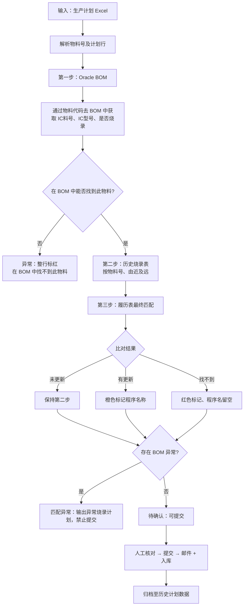

> BOM 匹配按行处理：**在 BOM 中找不到此物料**的行整行标红；其余匹配成功的行在 BOM 匹配完成后继续第二步。

**IC 数据口径（全模块）**：**IC料号 → IC型号** 一一对应；**IC型号 → IC料号** 可一对多。BOM、烧录表、历史计划数据须一致。

---

### 1.1.1 新建计划（REQ-V1.0.1-P4-001）

• **背景与动机：**

将周生产计划自动转换为可执行烧录清单，减少人工整理成本并降低错误率。

• **用户场景：**

生产测试工程师在新周次开始前，上传工厂提供的板卡周生产计划 Excel，创建计划并触发后台烧录匹配。

• **需求类型：** 新增

• **优先级：** 高

• **输入/前置条件：**

- 用户具备计划管理 **编辑权限**；  
- 已选择工厂 Tab（国内/越南）；  
- 本地持有符合模板的 `.xlsx` / `.xls` 生产计划文件。

• **原型：**

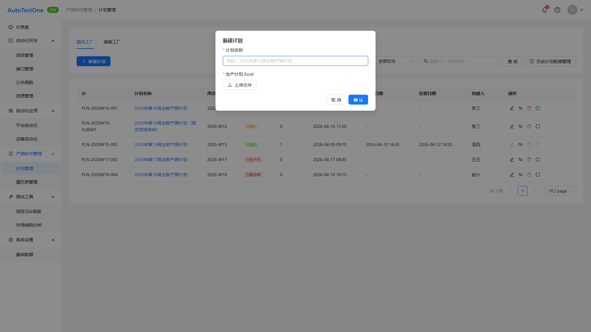

• **需求描述：**

1. **正常流程**

   - 列表点击 **「+ 新增计划」** 打开 Modal；  
   - **计划名称**：文本输入，**必填**；  
   - **生产计划 Excel**：Upload，**必传**，仅 `.xlsx` / `.xls`；  
   - 确认后列表新增记录，状态 **匹配中**；后台异步执行 **模块概述** 匹配流程；完成后状态为 **待确认** / **匹配异常** / **匹配失败**；  
   - BOM 查询失败时接口层 **重试 3 次**（页面 PRD §1.5）。

2. **异常场景**

   - 未上传 Excel：阻断创建，提示「请上传生产计划 Excel 文件」；  
   - BOM 仍失败：阻断或标记失败，可读错误信息；  
   - 无编辑权限：隐藏或禁用新建。

3. **限制条件**

   - 依赖工厂生产系统 **物料 BOM 查询接口**（Oracle）；  
   - 创建成功不等于可提交，须待匹配完成。

• **补充说明：**

匹配四步口径详见 **§1.1.13** 与模块概述流程图；输出为详情 Tab「软件烧录表」行数据（匹配失败时不输出）。

• **验收标准：**

- [ ] 必填校验生效，上传非 Excel 被拒绝或提示  
- [ ] 创建后列表可见「匹配中」计划  
- [ ] 匹配完成后状态符合 §1.1.13 规则  
- [ ] BOM 失败重试策略可验证（Mock/联调）

---

### 1.1.2 计划列表展示（REQ-V1.0.1-P4-002）

• **背景与动机：**

支撑计划全生命周期可视化与快速操作。

• **用户场景：**

工程师在计划列表查看各周计划状态，进入详情、编辑、变更、删除或重新匹配，并进入历史数据管理。

• **需求类型：** 新增

• **优先级：** 高

• **输入/前置条件：**

- 已登录；工厂 Tab 已选（CN/VN）。

• **原型：**

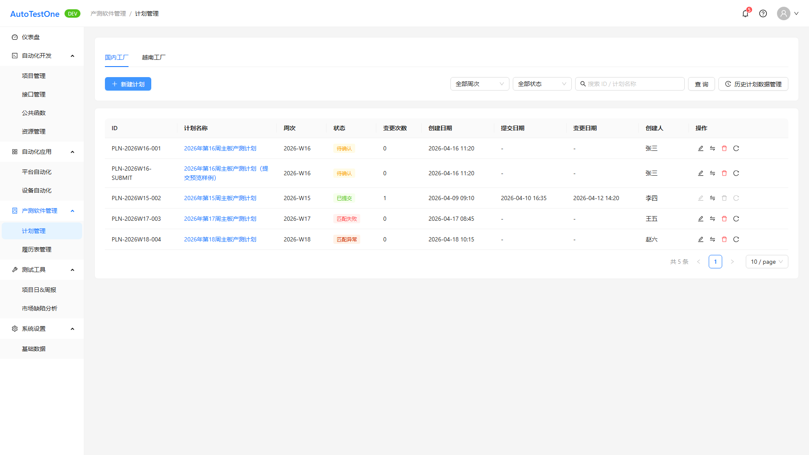

• **需求描述：**

1. **正常流程**

   **列表字段**：

   | 列名 | 说明 |
   |------|------|
   | ID | 计划标识 |
   | 计划名称 | 可点击进详情 |
   | 周次 | 如 2026-W16 |
   | 状态 | 见 §1.1.13 |
   | 变更次数 | 数字 |
   | 创建日期 | |
   | 提交日期 | 未提交显示 `-` |
   | 变更日期 | 无变更显示 `-` |
   | 创建人 | |
   | 操作 | 编辑、变更、删除、重新匹配、查看等 |

   **筛选**：周次 Select、状态 Select（含全部/匹配中/匹配失败/匹配异常/待确认/已提交）、关键词（ID/计划名称，回车查询）、分页 10/20/50。

   **工具栏**：左 **新建计划**；右筛选 + **历史计划数据管理**（跳转 §1.1.15）。

   **操作规则（继承旧 PRD §2.4/2.6/2.7）**：

   - **编辑**：非 **已提交** 可用；修正计划名称与重传 Excel；保存后 **匹配中** → 待确认/异常/失败；已提交提示不可编辑；  
   - **变更**：已提交计划进入 `?mode=changeEdit`（§1.1.4）；  
   - **删除**：`Modal.confirm` 文案「此操作不可恢复，是否继续？」；**已提交不可删**；  
   - **重新匹配**：允许 **匹配失败、匹配异常、待确认**；先置 **匹配中** 再异步匹配；**已提交不可**。

2. **异常场景**

   - 查询无结果：空态引导「去新建计划」，不报错；  
   - 非法状态操作：Toast 提示（如「当前状态不可刷新」）。

3. **限制条件**

   - 工厂 Tab 切换后列表仅展示当前工厂数据，Query `factory` 保持。

• **补充说明：**

列表状态 Tag 颜色见 §1.1.13。

• **验收标准：**

- [ ] 列字段与筛选、分页符合上表  
- [ ] 计划名称可进详情；日期空值 `-`  
- [ ] 编辑/删除/重新匹配状态门禁正确  
- [ ] 历史计划数据管理入口可见且带 factory 参数

---

### 1.1.3 计划确认、提交（REQ-V1.0.1-P4-003）

• **背景与动机：**

保证提交流程数据完整，避免无软件版本的板卡进入生产。

• **用户场景：**

匹配完成后，工程师在详情页核对烧录表，修正程序名称/checksum，提交并发送邮件。

• **需求类型：** 新增

• **优先级：** 高

• **输入/前置条件：**

- 计划状态 **待确认**；用户有编辑权限；Tab1 软件烧录表已加载。

• **原型：**

• **需求描述：**

1. **正常流程**

   - 详情顶栏：**保存**、**提交**、**返回**；  
   - Tab 顺序固定：**软件烧录表 → 操作日志 → 生产计划表**；  
   - 用户在 Tab1 编辑可编辑列（程序名称、checksum 等，见 §1.1.11）；  
   - 点击 **提交**：校验通过后状态 → **已提交**，触发邮件（附件可选 Excel，见页面 PRD）；  
   - 提交成功后计划 **不可再编辑**（走变更 §1.1.4）。

   **提交校验**：

   - 存在「需烧录但无程序名称」行 → **阻断**并提示数量；  
   - 存在 **红色标记**（找不到软件）且程序名称为空 → **阻断**（§1.1.12）；  
   - **橙色标记**（软件有更新）→ 提示性，不单独阻断；  
   - 邮件正文须含橙/红标记清单（§1.1.14）。

2. **异常场景**

   - **匹配失败**：Tab1 **不展示**烧录表，空态说明；  
   - **匹配异常**：展示烧录表但 **禁止提交**；  
   - 计划不存在：空态 + 返回列表。

3. **限制条件**

   - 仅 **待确认** 可首次提交；已提交只读查看。

• **补充说明：**

烧录表一对多 rowSpan、IC 口径见 §1.1.11 与模块概述。

• **验收标准：**

- [ ] 待确认可提交；已提交不可再编辑  
- [ ] 三类校验阻断行为正确  
- [ ] 匹配失败/异常时分流正确  
- [ ] 提交后邮件任务触发（Mock/联调）

---

### 1.1.4 计划变更：软件更新、下架（REQ-V1.0.1-P4-004）

• **背景与动机：**

支撑量产期间软件版本调整，保障变更可追踪与同步。

• **用户场景：**

已提交计划在量产中需更新软件，工程师发起变更、填写变更说明、编辑烧录表并提交变更审批。

• **需求类型：** 新增

• **优先级：** 高

• **输入/前置条件：**

- 计划状态 **已提交**；从列表「变更」进入 `mode=changeEdit`。

• **原型：**

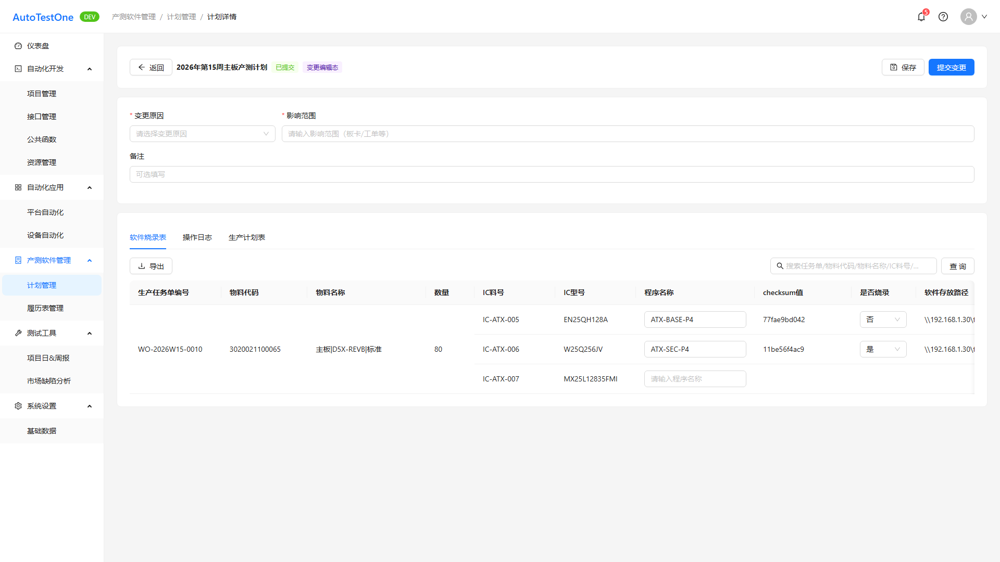

• **需求描述：**

1. **正常流程**

   - 列表点击 **变更** → 直接进入详情 Tab1 编辑态（不再单独选变更类型弹窗，见页面 PRD §7 差异表）；  
   - **变更详情**：变更原因（下拉默认「迭代更新/bug修复」，可新增）、影响范围（**必填**）、备注（选填）；  
   - 变更行 **底色高亮**；  
   - **提交变更** → 审批流（生产测试 PL）→ 通过后自动邮件（附件 + 变更详情）；  
   - 提交弹窗：发送人/抄送、按团队带出成员；联系人 **回填** 上次提交信息；  
   - 校验同 §1.1.3；邮件标记清单同 §1.1.14。

2. **异常场景**

   - 审批驳回：状态与提示以后台为准（原型 Mock 展示结果）；  
   - 校验失败：保持编辑态。

3. **限制条件**

   - 变更非独立路由页；语义由烧录表行内容承载。

• **补充说明：**

无

• **验收标准：**

- [ ] 变更入口与 changeEdit 模式正确  
- [ ] 变更表单必填校验  
- [ ] 提交变更校验与 §1.1.3 一致  
- [ ] 变更邮件含标记清单

---

### 1.1.5 操作日志（REQ-V1.0.1-P4-005）

• **背景与动机：**

满足审计追踪与问题回溯要求。

• **用户场景：**

用户查看计划创建、编辑、提交、变更、删除、导出等操作记录。

• **需求类型：** 新增

• **优先级：** 中

• **输入/前置条件：**

- 已进入计划详情 Tab2。

• **原型：**

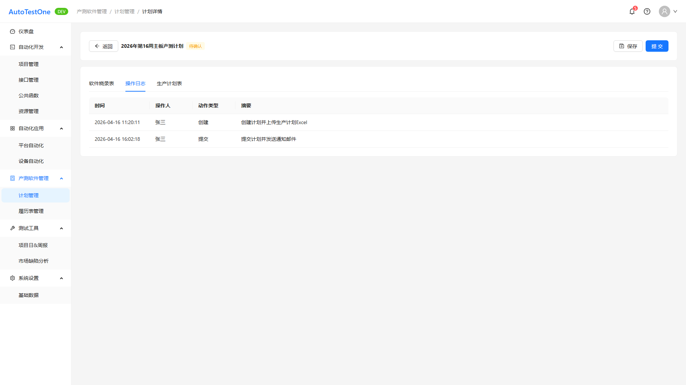

• **需求描述：**

1. **正常流程**

   - Tab2 **操作日志** **只读**；  
   - 字段建议：时间、操作人、动作类型、摘要、结果（以后台为准）；  
   - 创建、流转、变更、导出、邮件结果等须留痕。

2. **异常场景**

   - 无日志：空态或「暂无记录」。

3. **限制条件**

   - 前端展示以后台日志 API 为准；本 REQ **是否涉及 UI=否** 指不单独建设日志管理页，详情 Tab 为查看入口。

• **补充说明：**

无

• **验收标准：**

- [ ] Tab2 只读不可编辑  
- [ ] 关键操作均有日志条目（联调）

---

### 1.1.6 信息查看（REQ-V1.0.1-P4-006）

• **背景与动机：**

提升计划核对效率，减少导出依赖。

• **用户场景：**

用户打开计划详情，查看烧录表、日志、生产计划表内容。

• **需求类型：** 新增

• **优先级：** 中

• **输入/前置条件：**

- 有效 `planId`；有查看权限。

• **原型：**

• **需求描述：**

1. **正常流程**

   - 三 Tab 均可查看；Tab2 只读；Tab1/Tab3 在已提交时为只读（无保存/提交）；  
   - 计划不存在时空态 + 返回按钮。

2. **异常场景**

   - 无

3. **限制条件**

   - 与 §1.1.10 Tab 结构一致。

• **补充说明：**

与 007/009/010 共用详情页，按 Tab 分工。

• **验收标准：**

- [ ] 三 Tab 可切换且内容正确加载  
- [ ] 已提交计划只读

---

### 1.1.7 信息导出（REQ-V1.0.1-P4-007）

• **背景与动机：**

便于线下流转、归档及跨团队沟通。

• **用户场景：**

用户在详情 Tab1 或 Tab3 导出 Excel。

• **需求类型：** 新增

• **优先级：** 中

• **输入/前置条件：**

- 已进入对应 Tab；有数据可导出。

• **原型：**

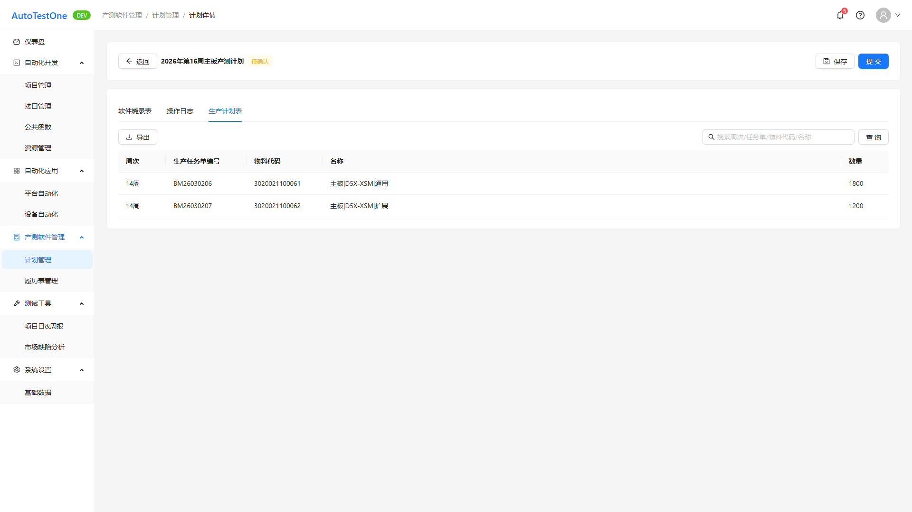

• **需求描述：**

1. **正常流程**

   - Tab1 **软件烧录表**、Tab3 **生产计划表** 提供 **导出**；  
   - 导出列头与当前 Tab 字段一致（烧录表列名以 §1.1.11 为准）；  
   - 导出中 loading；成功 Toast；写操作日志。

2. **异常场景**

   - 导出失败：Toast + 可重试。

3. **限制条件**

   - Tab2 不提供导出。

• **补充说明：**

无

• **验收标准：**

- [ ] Tab1/Tab3 导出入口可用  
- [ ] 导出文件列与页面一致

---

### 1.1.8 计划表信息搜索（REQ-V1.0.1-P4-008）

• **背景与动机：**

提升大量计划数据场景下的检索效率。

• **用户场景：**

用户在计划列表按 ID 或计划名称搜索。

• **需求类型：** 新增

• **优先级：** 中

• **输入/前置条件：**

- 位于计划列表页。

• **原型：**

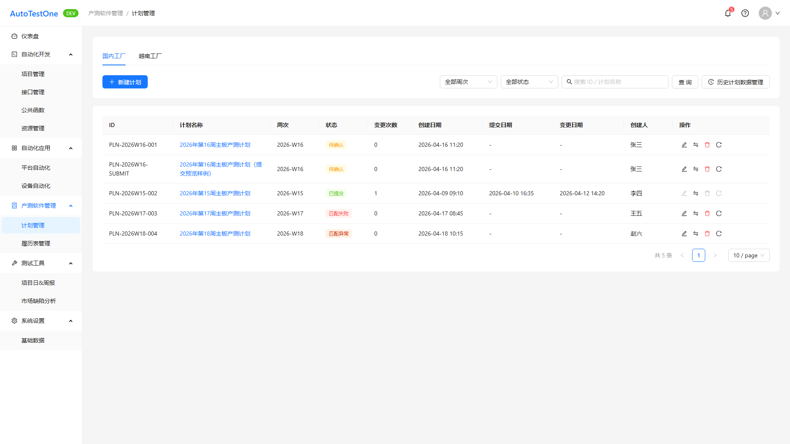

• **需求描述：**

1. **正常流程**

   - 搜索框 placeholder「搜索 ID / 计划名称」；  
   - 支持 **回车** 与 **查询** 按钮；  
   - 与周次、状态筛选 **组合** 生效；  
   - 结果分页重置。

2. **异常场景**

   - 无匹配：空态引导。

3. **限制条件**

   - 关键词不区分大小写（Mock 实现口径）。

• **补充说明：**

合并在 §1.1.2 列表工具栏。

• **验收标准：**

- [ ] ID/名称模糊匹配  
- [ ] 与筛选、分页联动

---

### 1.1.9 详情 tab 页「软件烧录表」信息搜索（REQ-V1.0.1-P4-009）

• **背景与动机：**

提升详情页中软件项核对与定位效率。

• **用户场景：**

用户在计划详情 Tab1 按任务单、物料、IC 等关键词过滤烧录行。

• **需求类型：** 新增

• **优先级：** 中

• **输入/前置条件：**

- Tab1 有烧录表数据（非匹配失败空态）。

• **原型：**

• **需求描述：**

1. **正常流程**

   - Tab1 工具栏关键词搜索（回车触发）；  
   - 匹配范围：生产任务单编号、物料代码、IC料号、IC型号、程序名称等（与实现一致）；  
   - 过滤后表格刷新，rowSpan 按过滤结果重算。

2. **异常场景**

   - 无匹配行：表格空态。

3. **限制条件**

   - 搜索不改变服务端数据，仅前端过滤（Mock）。

• **补充说明：**

列名使用 §1.1.11 优化后名称。

• **验收标准：**

- [ ] Tab1 搜索框可用  
- [ ] 关键词过滤正确

---

### 1.1.10 计划详情信息查看（tab 页）（REQ-V1.0.1-P4-010）

• **背景与动机：**

优化信息分区与查看体验，并统一烧录数据口径。

• **用户场景：**

用户通过三个 Tab 分区查看计划相关全部信息。

• **需求类型：** 新增

• **优先级：** 中

• **输入/前置条件：**

- 已进入计划详情。

• **原型：**

• **需求描述：**

1. **正常流程**

   - Tab 顺序固定：**软件烧录表 | 操作日志 | 生产计划表**（从左至右）；  
   - Tab1 含 **提交**（待确认/变更态）；  
   - **软件烧录表字段** 以 **REQ-035** 为准（非清单历史列：板卡号/软件版本/烧录阶段等已废弃）；  
   - **生产计划表字段**：周次、生产任务单编号、物料代码、名称、数量。

2. **异常场景**

   - 无

3. **限制条件**

   - 010 与 035 冲突时 **以 035 列定义为准**（清单备注）。

• **补充说明：**

Tab 壳层与 §1.1.6/007/009 聚合。

• **验收标准：**

- [ ] 三 Tab 顺序与命名正确  
- [ ] 生产计划表字段符合上表  
- [ ] Tab1 字段符合 §1.1.11

---

### 1.1.11 软件烧录表字段调整（REQ-V1.0.1-P4-035）

• **背景与动机：**

用户试用后反馈列名与生产口径不一致，checksum 与存放路径为核对关键信息，需与履历表及线下烧录表对齐。

• **用户场景：**

工程师在 Tab1 核对程序名称、checksum、存放路径，并按一对多 IC 结构查看。

• **需求类型：** 优化

• **优先级：** 高

• **输入/前置条件：**

- 计划匹配已完成且非「匹配失败」。

• **原型：**

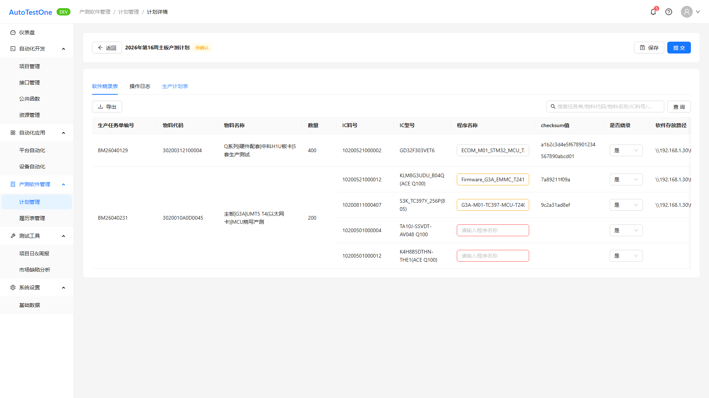

• **需求描述：**

1. **正常流程**

   **列定义**：

   | 列名 | 控件 | 说明 |
   |------|------|------|
   | 生产任务单编号 | 只读 | |
   | 物料代码 | 只读 | |
   | 物料名称 | 只读 | 原「物料描述」 |
   | 数量 | 只读 | |
   | IC料号 | 只读 | |
   | IC型号 | 只读 | |
   | 程序名称 | 可编辑输入框 | 原「软件名称」 |
   | checksum值 | 字符串输入框，**双击**编辑 | 原「软件状态」列位 |
   | 是否烧录 | 枚举 是/否 | 程序名为空则置空 |
   | 软件存放路径 | 只读 | 新增；Mock：`\\192.168.1.30\firmware\ASH\V262B107` |

   - **已删除**：烧录阶段；原「软件状态=已下架」红色规则移除；  
   - **一对多**：同一 **任务单+物料代码+物料名称+数量** 多 IC 行；前置四列 **rowSpan** 合并；  
   - **联动**：程序名称为空 → checksum、是否烧录置空；  
   - 搜索/导出/校验文案同步新列名。

2. **异常场景**

   - 只读态不可编辑 checksum；匹配失败无表可编辑。

3. **限制条件**

   - IC料号与 IC型号须满足模块 IC 口径。

• **补充说明：**

Mock 样例物料 `3020010A0D0045` 多 IC 行。

• **验收标准：**

- [ ] 列名、控件与上表一致  
- [ ] rowSpan 合并正确  
- [ ] 双击 checksum 可编辑（编辑态）  
- [ ] 程序名为空联动置空

---

### 1.1.12 履历表匹配结果 UI 标记（REQ-V1.0.1-P4-036）

• **背景与动机：**

匹配第三步履历表比对结果需在界面上直观可见，引导人工核对「有更新」与「找不到软件」的板卡行，降低漏检风险。

• **用户场景：**

匹配完成后，工程师在 Tab1 通过程序名称输入框颜色快速识别需重点核对行。

• **需求类型：** 优化

• **优先级：** 高

• **输入/前置条件：**

- 行上存在 `programMatchStatus` 标记（后台匹配写入）。

• **原型：**

• **需求描述：**

1. **正常流程**

   | 第三步结果 | 标记值 | 程序名称 UI | 提交 |
   |------------|--------|-------------|------|
   | 软件未更新 | unchanged/无 | 默认 | 通用校验 |
   | 软件有更新 | updated | **橙色** warning | 不单独阻断 |
   | 找不到软件 | not_found | **红色** error，空值 | **空值阻断** |

   **「软件有更新」子场景**：

   - **空→有**：历史无程序名，履历表回填 → 橙色；  
   - **旧→新**：程序名 A→B，橙色，可记录 `previousProgramName` 供邮件。

   - 标记作用于 **程序名称输入框**；不新增列；  
   - 用户补齐红色行程序名后可提交；橙色修改后不强制清标记。

2. **异常场景**

   - 不烧录行不适用橙/红标记。

3. **限制条件**

   - 与 §1.1.3 提交校验联动。

• **补充说明：**

继承 `ATO-V1.0.1-P4-计划管理-新增.md` §2.9。

• **验收标准：**

- [ ] 空→有、旧→新均为橙色  
- [ ] not_found 空值为红色且阻断提交  
- [ ] 补齐后可提交

---

### 1.1.13 计划状态口径（REQ-V1.0.1-P4-037）

• **背景与动机：**

需区分「匹配进行中」「可提交」「已归档」「BOM 异常可查看不可提交」「环境失败无表」等终态，避免误操作与.support 口径混乱。

• **用户场景：**

工程师通过列表状态 Tag 与详情行为判断下一步操作（提交/重新匹配/仅查看）。

• **需求类型：** 优化

• **优先级：** 高

• **输入/前置条件：**

- 计划已创建。

• **原型：**

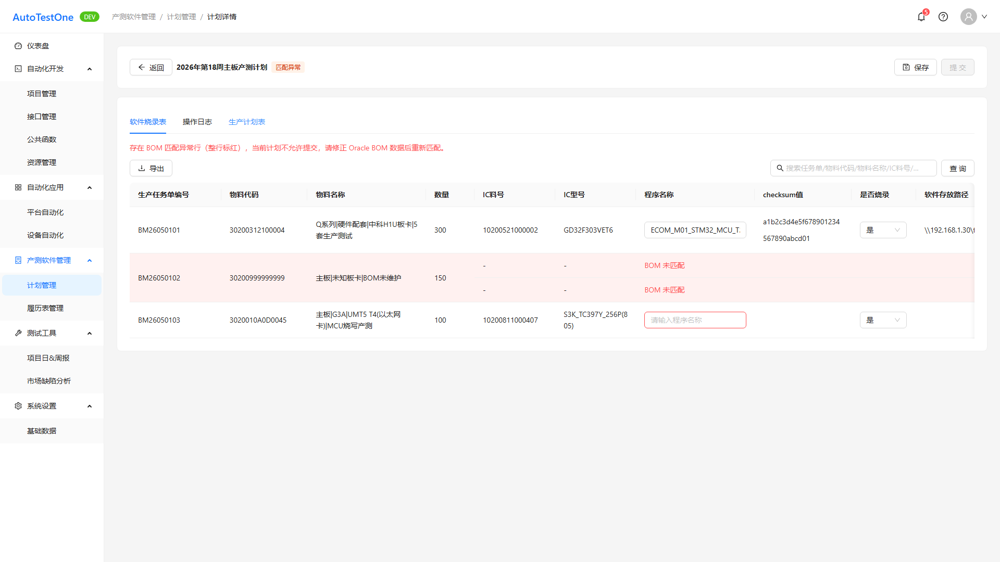

• **需求描述：**

1. **正常流程**

   | 状态 | 含义 | 烧录表 | 可提交 | Tag 色 |
   |------|------|--------|--------|--------|
   | 匹配中 | 异步匹配中 | 不展示/占位 | 否 | processing |
   | 待确认 | 待人工核对 | 展示 | **是** | warning |
   | 已提交 | 已确认提交 | 只读 | 否 | success |
   | 匹配异常 | BOM 缺 IC，极少 | 展示；BOM 行 **整行标红** | **否** | volcano |
   | 匹配失败 | 环境/网络中断 | **不展示** | 否 | error |

   - BOM 异常：`bomMatchFailed=true`，IC/程序名为空，**整行背景红**（区别于程序名列红框）；  
   - **重新匹配**：匹配失败/异常/待确认可触发；已提交不可；  
   - Mock：`PLN-2026W18-004` 匹配异常样例。

2. **异常场景**

   - 非允许状态点重新匹配：提示「当前状态不可刷新」。

3. **限制条件**

   - 列表筛选须含全部五态。

• **补充说明：**

继承旧 PRD §2.10。

• **验收标准：**

- [ ] 五态 Tag 与行为表一致  
- [ ] 匹配异常 BOM 整行标红且不可提交  
- [ ] 匹配失败详情无烧录表

---

### 1.1.14 提交邮件正文标记清单（REQ-V1.0.1-P4-038）

• **背景与动机：**

收件方需在邮件正文中直接看到需重点关注的板卡行，与详情橙/红标记一致，减少打开附件成本。

• **用户场景：**

提交或变更提交时，用户在弹窗预览邮件正文中的标记板卡明细。

• **需求类型：** 优化

• **优先级：** 高

• **输入/前置条件：**

- 触发提交/提交变更且校验通过。

• **原型：**

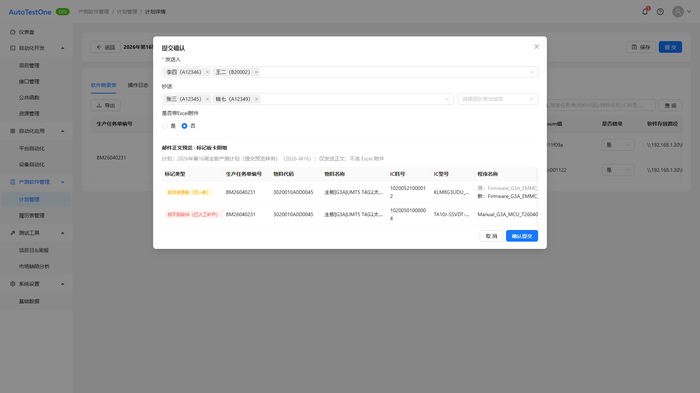

• **需求描述：**

1. **正常流程**

   - 提交弹窗展示 **邮件正文预览**；  
   - 正文 **必须** 列出所有 **橙色**（updated）与 **红色**（not_found）行；无标记时可写「本计划无标记行」；  
   - 每行至少含：标记类型、生产任务单编号、物料代码、物料名称、IC料号、IC型号、程序名称（旧→新须含原程序名）、checksum（可选）、软件存放路径（可选）；  
   - 结构：计划摘要 → 标记明细（先橙后红）→ 附件说明；  
   - 「是否带 Excel 附件=否」时仍须正文清单。

2. **异常场景**

   - 邮件发送失败：Toast/日志（占位）。

3. **限制条件**

   - 标记类型以提交瞬间 `programMatchStatus` 为准；程序名取提交最终值。

• **补充说明：**

继承旧 PRD §2.11。

• **验收标准：**

- [ ] 预览含橙/红清单  
- [ ] 旧→新含 previousProgramName  
- [ ] 无标记时有说明

---

### 1.1.15 历史计划数据管理（REQ-V1.0.1-P4-039）

• **背景与动机：**

① 作为匹配流程第二步「近三年历史烧录信息表」的 **线上匹配源**；② 将原线下 Excel 维护迁移至系统，支撑长期追溯。

• **用户场景：**

工程师维护历史板卡烧录行，按年/周查询、导出，并修正程序名称/checksum/路径。

• **需求类型：** 新增

• **优先级：** 高

• **输入/前置条件：**

- 从计划列表进入；`factory` Query 与列表一致。

• **原型：**

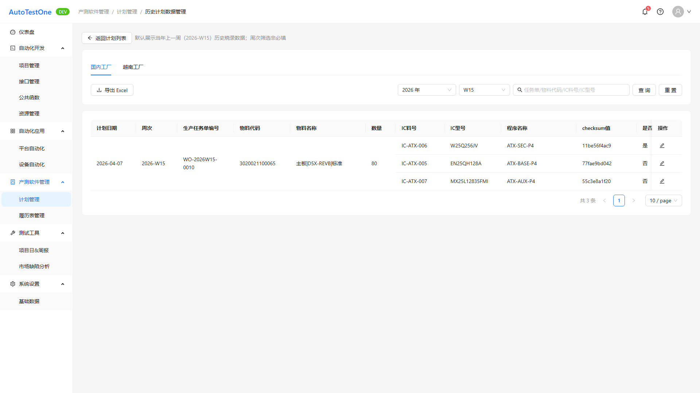

• **需求描述：**

1. **正常流程**

   - 路由 `/ptsw/plans/history`（注册于 `:planId` 之前）；  
   - 顶栏 **返回计划列表** + 辅助说明（默认当年上一周）；  
   - 工厂 Tab CN/VN；  
   - **筛选**：年份下拉（默认 **当年**，**近十年**）；周次 `Wxx`（**非必填**，默认 **上一周**，可清空）；关键词（任务单/物料代码/IC料号/IC型号）；查询/重置；  
   - **列表字段**：计划日期、周次、生产任务单编号、物料代码、物料名称、数量、IC料号、IC型号、程序名称、checksum值、是否烧录、软件存放路径、操作；  
   - **行合并**：同 **任务单+物料代码+物料名称** 时，合并 **计划日期、周次、任务单、物料、名称、数量**；IC 及右侧列不合并；  
   - **行编辑** Modal：可改 **程序名称、checksum值、软件存放路径**（均必填）；`FormModal` 防误关；  
   - **导出 Excel** Modal：选 **年份 + 多周次**；Mock 成功 Toast；  
   - 分页 10/20/50。

2. **异常场景**

   - 无数据：Empty「{工厂}暂无历史数据」；  
   - 选无数据年份：列表空，不报错。

3. **限制条件**

   - **IC料号→IC型号** 一一对应；Mock 须含 G3A 一物料多 IC 样例；  
   - 匹配第二步按 **物料号**、**由近及远** 检索本表；数据来自提交归档 + 人工维护。

• **补充说明：**

NFR 见 §1.1.16、§1.1.17。

• **验收标准：**

- [ ] 入口、路由、factory 上下文正确  
- [ ] 年/周筛选与默认行为正确  
- [ ] rowSpan 与 IC 分列正确  
- [ ] 编辑三项保存成功  
- [ ] 导出弹窗多周选择可用

---

### 1.1.16 历史计划数据存储（REQ-V1.0.1-P4-040）

• **背景与动机：**

匹配第二步依赖历史烧录信息；线下 Excel 曾长期积累，线上须满足同等可追溯周期。

• **用户场景：**

系统管理员配置存储策略；测试验证超十年数据可查（或归档可恢复）。

• **需求类型：** 新增

• **优先级：** 高

• **输入/前置条件：**

- 历史计划数据表/等价存储已上线。

• **原型：**

无

• **需求描述：**

1. **正常流程**

   - 历史板卡烧录计划数据 **在线保留 ≥10 年**（以计划周次/归档日期滚动）；  
   - 前端年份筛选范围与保留策略一致（Mock **近十年**）；  
   - 超期归档或清理 **须评审**，不得擅自缩短周期。

2. **异常场景**

   - 无

3. **限制条件**

   - 后台实现；前端 Mock 仅模拟年份列表。

• **补充说明：**

与 REQ-039 配套；继承旧 PRD §2.12 NFR。

• **验收标准：**

- [ ] 保留策略文档/配置 ≥10 年  
- [ ] 年份下拉与策略一致

---

### 1.1.17 历史计划数据备份（REQ-V1.0.1-P4-041）

• **背景与动机：**

避免单点服务器损坏、磁盘故障、勒索病毒等导致历史烧录匹配源永久丢失。

• **用户场景：**

运维按策略执行异地备份与恢复演练；审计可查备份记录。

• **需求类型：** 新增

• **优先级：** 高

• **输入/前置条件：**

- 历史计划独立表（或等价存储）已上线。

• **原型：**

无

• **需求描述：**

1. **正常流程**

   - 对历史计划数据（**提交归档 + 人工维护**）实施 **异地定期备份**；  
   - 周期、异地副本份数、恢复演练、审计留痕与 **REQ-019 履历表备份** 同级；  
   - 可采用企业备份/弘毅备份等既有方案；  
   - 备份范围 **须覆盖** 历史计划独立存储。

2. **异常场景**

   - 备份失败：告警与重试（运维口径）。

3. **限制条件**

   - DFX 能力；不在计划管理 UI 展示。

• **补充说明：**

见 `ATO-V1.0.1-P4-DFX安全需求-新增.md` 扩展说明。

• **验收标准：**

- [ ] 备份任务可追踪  
- [ ] 异地副本可验证  
- [ ] 恢复演练记录可审计

---

# 待评审和澄清

> Playwright 失败、清单缺口、冲突等待决项。P0 阻断 L2 定稿。

| 序号 | 关联 REQ 或 § | 问题类型 | 问题描述 | 建议动作 |
|------|----------------|----------|----------|----------|
| C03 | REQ-004 | 口径 | 清单仍描述「变更类型弹窗」，页面 PRD/SRS 已改为直接进入 changeEdit | 以本 SRS 为准，回写清单 |
| C04 | REQ-002 | 口径 | 清单状态枚举为「生成中」，SRS/实现为 **匹配中** | 产品确认统一术语 |
| C05 | REQ-010 | 口径 | 清单列定义含已废弃字段，以 **REQ-035** 为准 | 回写清单备注（已有）并 L2 确认 |

---

# 附录

## 变更历史

| 版本 | 日期 | 变更类型 | 变更内容 | 变更原因 | 影响范围 |
|------|------|----------|----------|----------|----------|
| V1.0.1-P4 | 2026-06-25 | 新增 | 初稿：由 `ATO-V1.0.1-P4-计划管理-新增.md` 继承重写为 SRS 体裁 | 迭代 Step 6 SRS 交付 | 计划管理全 REQ |

## 附录A：用户角色说明

| 角色名称 | 角色描述 | 主要权限 | 使用场景 |
| -------- | -------- | -------- | -------- |
| 生产测试工程师 | 产测计划日常维护 | 计划/履历/历史数据编辑（受 DFX 约束） | 新建、核对、提交、变更 |
| 生产测试 PL | 审批与监督 | 变更审批 | 变更提交后审批 |
| 管理员 | 系统管理 | 同编辑 + 配置 | 权限例外、运维配合 |
| 只读用户 | 查看 | 列表/详情只读 | 进度跟踪 |

## 附录B：术语表

| 术语 | 定义 | 业务说明 |
| ------ | ---- | -------- |
| 软件烧录表 | 计划详情 Tab1 表格 | 周板卡产测软件烧录匹配输出 |
| 程序名称 | 原软件名称 | 烧录程序文件名或包名 |
| checksum值 | 原软件状态列位 | 字符串，可手工修正 |
| 匹配异常 | 计划终态之一 | BOM 缺 IC，有表不可提交 |
| 历史计划数据 | 独立页维护的数据集 | 匹配第二步数据源 |

## 附录C：参考文档

- `docs/prd/V1.0.1-P4/ATO-V1.0.1-P4-计划管理-新增.md`（**继承源，保留不删**）  
- `docs/prd/V1.0.1-P4/ATO_V1.0.1-P4-页面需求与交互规格.md`  
- `docs/prd/V1.0.1-P4/ATO_V1.0.1-P4迭代需求清单.md`  
- `docs/prd/V1.0.1-P4/ATO-V1.0.1-P4-DFX安全需求-新增.md`  
- `template/ATO_V1.0.1-P5-需求规格说明书-范例-市场缺陷分析.md`  
- `docs/prd/SRS生成规则-v1.md`

## 附录D：编写规范（引用黄金范例）

三级需求子功能分述、前置条件与异常分工、算法与验收捆绑等见 P5 范例 **附录 D**；本稿按 **§7.1 方案 1** 采用 `### 1.1.x 二级名（REQ-xxx）` 编排。

## 附录E：文档粒度规范（暂行）

本文件 **仅覆盖一级需求「计划管理」** 在清单中的 REQ 聚合；履历表、变量管理等 **其他一级需求** 须独立 SRS 文件。

---

**文档版本：** V1.0.1-P4（待评审草稿）  
**最后更新：** 2026-06-26  
**编写人：** AI（按 SRS 生成提示词 v1）  
**审核人：** 待产品审核
