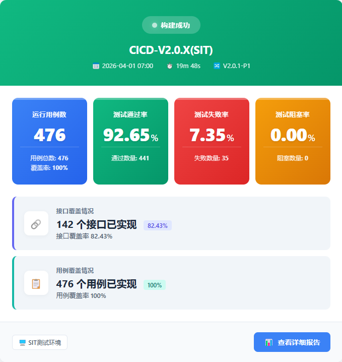
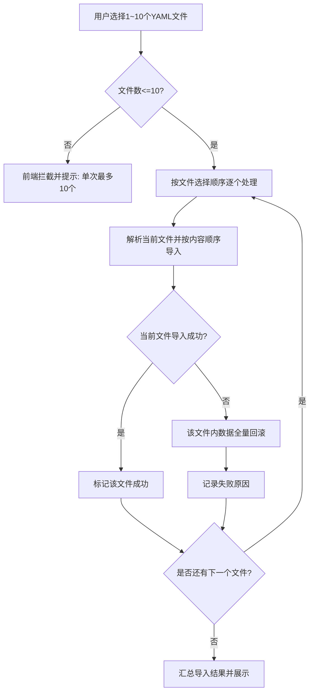
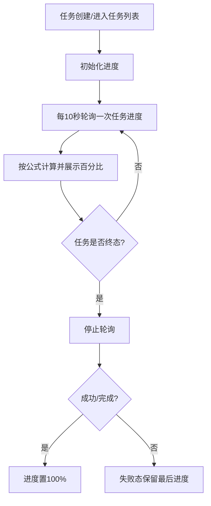
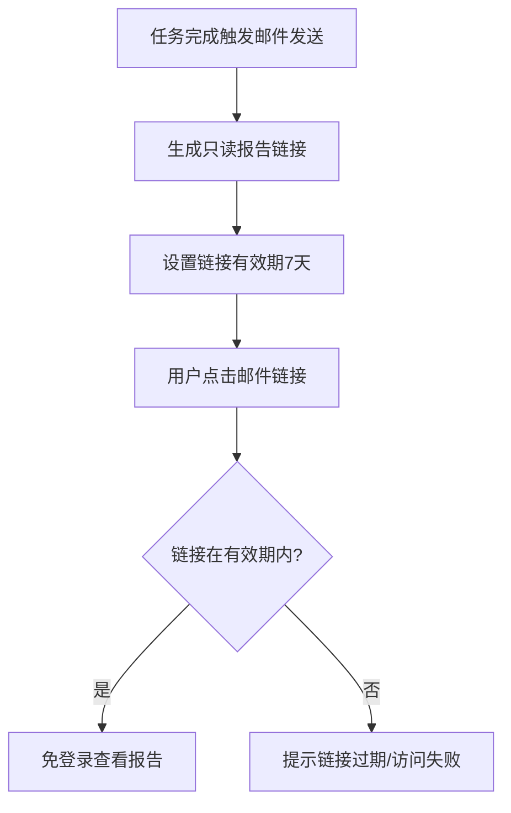

# AutoTestOne V1.0.1-P4 迭代需求规格说明书

> **文档定位**：版本级需求规格说明书（迭代范围、模块需求、验收与约束）  
> **版本号**：V1.0.1-P4  
> **状态**：待评审草稿  
> **来源基线**：`docs/prd/V1.0.1-P4/迭代需求清单.md`（REQ-V1.0.1-P4-001~034，已剔除 REQ-V1.0.1-P4-028）  
> **适用读者**：产品、研发、测试、项目管理

---

## 1. 迭代目标与范围

### 1.1 迭代目标

本迭代围绕“版本用例开发效率提升 + 任务可视化 + 自动化应用入口整合 + 产测与DFX能力补齐”展开，目标为：

- 降低用例编辑、导入导出、断言配置、变量维护的人力成本。
- 提升任务执行过程可视化程度（进度实时可见）。
- 优化邮件通知和自动化应用入口可达性。
- 延续并固化产测软件管理和安全能力的规范化交付基线。

### 1.2 范围边界

**本次纳入范围**：

- 版本用例开发：`变量管理`、`用例管理`、`测试运行`
- 自动化应用：`平台自动化`、`设备自动化`
- 产测软件管理：`计划管理`、`履历表管理`（沿用既有条目）
- DFX安全需求：`权限控制`、`数据备份`（沿用既有条目）

**本次不纳入范围**：

- 未在需求清单中出现的新增业务域或新模块。
- 需新增独立审批系统的流程平台建设（仅保留接口/流程占位）。
- 后端数据模型重构（仅定义前后端契约与行为要求）。

---

## 2. 需求分层（P0/P1/P2）

> 映射规则：高优先级=🔴P0，中优先级=🟡P1，低优先级=🟢P2。

### 2.1 核心业务流程（🔴 P0）

- 产测软件管理：计划创建、计划提交、计划变更、履历表核心维护。
- 版本用例开发：YAML 批量导入、断言复用、跨用例复制、批量运行入口优化。
- 测试运行/任务管理：任务进度实时展示。
- 平台自动化：任务执行进度实时展示。

### 2.2 用户端重要功能（🟡 P1）

- 变量导入导出与变量说明增强。
- 断言逻辑模糊搜索、请求参数复用。
- 用例导出能力增强（模块模糊匹配、目录树入口）。
- 邮件内容可读性与报告可达性优化。
- 设备自动化菜单直达跳转。

### 2.3 管理端优化能力（🟢 P2）

- 本期需求清单未定义低优先级（P2）新增项，默认按 P0/P1 实施。

---

## 3. 功能模块需求规格

## 3.1 版本用例开发 / 变量管理

### 3.1.1 需求范围

- REQ-V1.0.1-P4-020（新增）
- REQ-V1.0.1-P4-021（优化）

### 3.1.2 功能规格

- 提供独立 MCP 工具（独立于 AutoTestOne 系统主应用），供 Cursor 调用并连接自动化测试平台数据库。
- MCP 工具按“项目 + 用例版本”访问用例库数据，支持历史用例变量提取信息查询，服务于 YAML 用例维护场景。
- 变量查询字段固定为：用例ID、用例名称、变量名、变量提取表达式、变量说明、所属模块、接口Path。
- 全局变量支持导入和导出，用于线上与线下数据快速同步。

### 3.1.3 关键规则

- 变量信息提取必须支持结构化字段输出，不允许仅返回自由文本。
- MCP 工具查询目标限定为“自动化测试平台用例数据库”，按项目和用例版本维度检索。
- MCP 工具设计目标为提升 Cursor 维护 YAML 用例时的变量复用效率，不作为系统内常规页面功能入口。
- 全局变量导出格式固定为 YAML。
- 全局变量导入格式固定为 YAML。
- 全局变量导出文件命名规则固定为：`{项目名称}-{用例版本号}-全局变量-{时间戳}`。
- 全局变量字段必填项固定为：变量名、变量值、变量说明。
- 全局变量导入主校验字段固定为：变量名、变量值（缺失任一字段即判定该记录无效并给出字段级提示）。
- 导入需校验字段完整性；导出需保证编码与格式一致性（避免二次导入失败）。

### 3.1.4 验收标准

- 在变量管理页可完成“导入成功 -> 列表可见 -> 导出成功 -> 导出文件可再次导入成功”的闭环验证。
- MCP 变量提取结果必须包含以下字段且非空：用例ID、用例名称、变量名、变量提取表达式、变量说明、所属模块、接口Path。
- 当提取字段缺失时，页面需给出可读错误提示，且本次提取结果不落库。
- 全局变量导出文件后缀为 `.yaml`，文件名符合 `{项目名称}-{用例版本号}-全局变量-{时间戳}` 规则。
- 导出的全局变量数据中，变量名、变量值、变量说明均为必填；缺失任一字段时导入阶段应给出字段级错误提示。
- 全局变量导入仅支持 `.yaml` 文件；导入校验至少包含“变量名、变量值”两个主字段。

## 3.2 版本用例开发 / 用例管理

### 3.2.1 需求范围

- REQ-V1.0.1-P4-022 ~ REQ-V1.0.1-P4-027、REQ-V1.0.1-P4-029 ~ REQ-V1.0.1-P4-030

### 3.2.2 功能规格

- 添加用例支持 YAML 批量导入，单次最多 10 个文件，导入顺序为“文件顺序优先、文件内自上而下”。
- 用例步骤编辑支持断言数据复用（文本/JSON 模式切换）。
- 断言逻辑下拉框支持模糊搜索。
- 变量提取列表新增“变量说明”字段。
- 步骤复制支持跨用例复制，采用前端文本复制粘贴方案。
- 接口请求 Params 支持文本/JSON 模式复用复制。
- 用例运行入口优化，在模块区和列表区均可直接发起批量运行。
- 用例数据导出支持 YAML 格式，模块选择支持名称模糊匹配，目录树操作栏提供导出入口。

### 3.2.3 关键规则

- 导入上限与顺序规则为强约束，不得绕过。
- YAML 批量导入失败策略采用“按文件粒度处理”：已导入成功的 YAML 文件不做回滚；导入失败的 YAML 文件执行该文件内数据全量回滚。
- 跨用例步骤复制允许变量重名，不因变量名重复阻断复制流程。
- 断言与“用例-步骤”强绑定；不引入断言全局唯一 ID 冲突校验规则。
- 用例导出支持按模块（文件目录）导出，导出格式为 YAML。
- 导出文件命名格式固定为：`{模块路径}-{时间戳}.yaml`（示例：`接入-协议管理-2155452262262.yaml`）。
- 由于文件名包含时间戳，不存在同名文件冲突场景。
- 文本/JSON 模式切换需确保双向可编辑且内容不丢失。

### 3.2.4 验收标准

- 批量导入支持 1~10 个 YAML 文件；超过 10 个时前端阻断并提示“单次最多导入10个YAML文件”。
- 导入顺序严格遵循“文件选择顺序 -> 文件内容自上而下”，并可通过导入结果顺序回显验证。
- 当批量导入中某个 YAML 文件失败时，仅该失败文件回滚；已成功导入文件保持成功状态且不回滚。
- 跨用例复制步骤时，存在同名变量不应阻断复制，复制后步骤可正常保存与执行。
- 复制后的断言按目标用例的步骤上下文生效，验证“断言绑定用例-步骤”语义保持正确。
- 断言复用、跨用例步骤复制、Params 复用在至少 2 个不同用例间可重复执行且保存后不丢失。
- 文本/JSON 双模式切换后字段语义保持一致（不新增、不丢失、不串位）。
- 导出入口在目录树操作栏可直达；导出文件名符合 `{模块路径}-{时间戳}.yaml` 规则。

## 3.3 版本用例开发 / 测试运行

### 3.3.1 需求范围

- REQ-V1.0.1-P4-031

### 3.3.2 功能规格

- 任务列表新增“进度”百分比实时展示，用户可感知任务执行进展。
- 任务进度计算公式固定为：`已执行用例数 / 已配置运行的用例总数 * 100%`。
- 任务进度刷新机制采用轮询，轮询间隔固定为 10 秒。

### 3.3.3 验收标准

- 任务列表展示进度百分比，取值范围为 `0%~100%`。
- 进度百分比按公式 `已执行用例数 / 已配置运行的用例总数 * 100%` 计算并展示。
- 任务运行中每 10 秒触发一次进度刷新请求；任务进入终态（成功/失败）后停止轮询。
- 任务状态为“运行中”时，进度应单调不减；任务状态为“成功/完成”时进度必须为 `100%`。
- 任务状态为“失败”时保留最后进度并展示失败状态，不允许显示为 `100%` 冒充成功。

## 3.4 自动化应用 / 平台自动化

### 3.4.1 需求范围

- REQ-V1.0.1-P4-032
- REQ-V1.0.1-P4-033

### 3.4.2 功能规格

- 测试任务管理列表增加执行进度实时展示。
- 邮件发送能力优化：正文内容更完整、视觉更清晰、报告链接更易访问。
- 邮件中的报告链接采用免登录访问机制，仅具备查看权限。
- 邮件模板视觉样式以 `docs/prd/V1.0.1-P4/email-template-reference.png` 为基线参考图。
- 邮件模板无固定品牌规范要求（无强制 Logo/主题色/页脚签名），按参考图执行。

**邮件模板基线图（REQ-033 绑定）**：

### 3.4.3 验收标准

- 任务列表进度展示规则与“版本用例开发/测试运行”保持一致（百分比、状态一致性）。
- 进度计算口径与 REQ-031 保持一致：`已执行用例数 / 已配置运行的用例总数 * 100%`。
- 进度刷新机制与 REQ-031 保持一致：轮询间隔 10 秒，任务终态后停止轮询。
- 邮件正文至少包含：任务名称/任务ID、执行开始时间、执行结束时间（若有）、总数、成功数、失败数、报告访问入口。
- 报告入口在邮件中可直接点击跳转，跳转失败时需有可读提示或兜底访问说明。
- 报告链接不要求登录鉴权，且访问权限为只读查看；链接有效期为 7 天（一周）。
- 邮件模板验收以 `docs/prd/V1.0.1-P4/email-template-reference.png` 视觉布局为准，不校验固定品牌元素一致性。

## 3.5 自动化应用 / 设备自动化

### 3.5.1 需求范围

- REQ-V1.0.1-P4-034

### 3.5.2 功能规格

- 点击“设备自动化”菜单后跳转到 `http://10.20.160.11/#board`。
- 设备自动化跳转地址为固定值，不按测试/预发/生产环境做可配置化处理。

### 3.5.3 验收标准

- 点击“设备自动化”菜单后，默认在新标签页打开 `http://10.20.160.11/#board`。
- 当浏览器拦截或目标地址不可达时，需提示“设备自动化入口暂不可用，请稍后重试或联系管理员”。
- 配置项中不提供环境化地址切换能力，所有环境均使用固定地址 `http://10.20.160.11/#board`。

## 3.6 产测软件管理（继承项）

### 3.6.1 需求范围

- 计划管理：REQ-V1.0.1-P4-001 ~ 010、REQ-V1.0.1-P4-035
- 履历表管理：REQ-V1.0.1-P4-011 ~ 015

### 3.6.2 规格说明

- 本说明书继承并追踪产测软件管理既有规格，并将关键实现要点在本节展开；页面级完整细节可与 `ATO_V1.0.1-P4-页面需求与交互规格.md` 交叉校验。

### 3.6.3 计划管理（P4-1/P4-2）展开要求

- **页面与路由**：
  - 计划列表：`/ptsw/plans`
  - 计划详情：`/ptsw/plans/:planId`
- **计划列表核心字段**：ID、计划名称、周次、状态（生成中/待确认/已提交）、变更次数、创建日期、提交日期、变更日期、创建人。
- **列表操作约束**：
  - 编辑：仅未提交计划可编辑；已提交隐藏或置灰并提示。
  - 变更：走“软件更新/软件下架”变更流程，进入详情编辑态。
  - 删除：已提交计划不可删除。
- **创建与再生成流程**：
  - 新建时上传生产计划 Excel，创建后状态先为“生成中”。
  - 后端异步生成软件烧录表，成功回写状态，失败按 BOM 重试策略处理。
  - 编辑支持重传 Excel 并重新生成软件烧录表。
- **计划详情页签结构（顺序固定）**：
  - Tab1：软件烧录表
  - Tab2：操作日志（只读）
  - Tab3：生产计划表
- **软件烧录表字段锁定**（REQ-V1.0.1-P4-035 优化后）：生产任务单编号、物料代码、物料名称、数量、IC料号、IC型号、程序名称、checksum值（字符串，双击可编辑）、是否烧录、软件存放路径。
- **提交与变更规则**：
  - 提交前校验：若存在“要烧录但无程序名称”，阻断提交并返回明细。
  - 提交成功后状态为已提交，并发送邮件（附件含软件烧录表）。
  - 变更流程需填写变更详情（原因/影响范围/备注），经 PL 审批通过后自动发邮件。
- **计划管理验收要点**：
  - 形成“创建 -> 编辑/重传 -> 提交 -> 变更 -> 留痕 -> 导出/查询”闭环。
  - 关键操作（创建、编辑、提交、变更、导出）均有日志记录。

### 3.6.4 履历表管理（P4-3）展开要求

- **页面与路由**：履历表管理页 ` /ptsw/resume`（主框架内）。
- **表格字段（顺序固定）**：板卡料号、板卡型号、芯片料号、芯片型号、软件版本、checksum(MD5，系统生成只读)、描述、发布人、备注。
- **核心交互**：
  - 新增：支持新增板卡履历记录。
  - 编辑：行级编辑，修改后即时生效并留痕。
  - 删除：二次确认后执行删除。
  - 查询：支持板卡料号、板卡型号、芯片料号、芯片型号、软件版本等维度检索。
  - 批量替换：支持基于选中行或当前筛选范围批量更新指定字段。
- **范围口径**：
  - 本期以“批量替换”替代“同软件同步更新”能力。
  - checksum 为系统自动生成字段，不允许手工编辑。
- **履历管理验收要点**：
  - 满足“增删改查 + 批量替换 + 字段一致性”要求。
  - 批量替换结果可追溯（操作人、时间、影响范围、结果）。

## 3.7 DFX 安全需求（继承项）

### 3.7.1 需求范围

- REQ-V1.0.1-P4-018（权限控制）
- REQ-V1.0.1-P4-019（数据备份）

### 3.7.2 规格说明

- 编辑类能力受“生产测试团队成员+管理员”权限约束。
- 履历表执行按周覆盖备份，支持异地或企业备份方案。

---

## 3.8 前端交互说明（开发输入）

> 本节用于补齐页面级交互行为，供前端页面设计与联调实现使用。

### 3.8.1 REQ-022 YAML批量导入交互（用例管理）

- **入口**：`用例管理 -> 添加用例 -> YAML批量导入`。
- **选择文件**：支持一次选择 1~10 个 YAML；超过 10 个立即前端拦截并 Toast 提示。
- **导入顺序**：按用户选择文件顺序逐个导入；每个文件内部按 YAML 内容从上到下处理。
- **结果反馈**：导入完成后展示“成功文件数/失败文件数”；失败项需展示文件名和失败原因。
- **失败回滚**：按文件粒度回滚；失败文件全量回滚，成功文件不回滚。
- **异常态**：网络异常、格式异常、权限不足均需有可读提示，且不清空已完成的成功结果。

### 3.8.2 REQ-030 用例导出交互（按模块目录）

- **入口**：`用例管理目录树操作栏 -> 导出`。
- **导出范围**：按当前所选模块（文件目录）导出。
- **命名规则**：`{模块路径}-{时间戳}.yaml`。
- **示例**：`接入-协议管理-2155452262262.yaml`。
- **下载行为**：点击后触发文件下载；失败时提示失败原因并允许重试。

### 3.8.3 REQ-031/032 任务进度展示交互

- **展示位置**：任务列表新增“进度”列，显示 `xx%`。
- **计算口径**：`已执行用例数 / 已配置运行的用例总数 * 100%`。
- **刷新机制**：轮询，间隔 10 秒。
- **终止规则**：任务进入终态（成功/失败）即停止轮询。
- **状态规则**：
  - 运行中：进度单调不减。
  - 成功/完成：进度=100%。
  - 失败：展示最后进度，不强制100%。

### 3.8.4 REQ-033 邮件模板与报告链接交互

- **邮件模板基线**：`docs/prd/V1.0.1-P4/email-template-reference.png`。
- **品牌规则**：无固定品牌元素强约束（不强制 Logo/主题色/页脚签名）。
- **报告链接**：免登录，仅读权限，有效期 7 天。
- **异常兜底**：链接失效或跳转失败时，邮件中需提供提示文案（如“链接已过期，请重新触发任务或联系管理员”）。

### 3.8.5 REQ-034 设备自动化菜单跳转交互

- **菜单行为**：点击“设备自动化”后新标签页打开 `http://10.20.160.11/#board`。
- **配置策略**：地址固定，不做环境化可配置。
- **失败提示**：无法打开时提示“设备自动化入口暂不可用，请稍后重试或联系管理员”。

---

## 3.9 业务实现流程图（Mermaid）

### 3.9.1 YAML批量导入流程（REQ-022）

### 3.9.2 任务进度轮询流程（REQ-031/032）

### 3.9.3 邮件报告链接生命周期（REQ-033）

---

## 3.10 后端接口契约草案（联调输入）

> 说明：以下为联调契约草案，最终路径以后端实现为准；字段与错误码需至少满足本节约束。

### 3.10.1 REQ-022 批量导入

- **建议接口**：`POST /api/case-management/import-yaml-batch`
- **请求体（示例）**：
  - `modulePath: string`
  - `files: File[]`（1~10）
- **响应体（示例）**：
  - `successCount: number`
  - `failedCount: number`
  - `results: [{ fileName, status, reason? }]`
- **错误码建议**：
  - `IMPORT_001` 文件数超限
  - `IMPORT_002` YAML解析失败
  - `IMPORT_003` 权限不足
  - `IMPORT_004` 系统异常

### 3.10.2 REQ-030 模块导出

- **建议接口**：`GET /api/case-management/export-yaml`
- **请求参数**：
  - `modulePath: string`（必填）
- **返回**：
  - `application/x-yaml` 文件流
  - `filename: {模块路径}-{时间戳}.yaml`
- **错误码建议**：
  - `EXPORT_001` 模块不存在
  - `EXPORT_002` 无导出权限
  - `EXPORT_003` 导出失败

### 3.10.3 REQ-031/032 任务进度查询

- **建议接口**：`GET /api/tasks/{taskId}/progress`
- **响应字段**：
  - `taskId: string`
  - `executedCaseCount: number`
  - `configuredCaseTotal: number`
  - `progressPercent: number`
  - `status: RUNNING | SUCCESS | FAILED`
  - `updatedAt: string`
- **口径约束**：
  - `progressPercent = executedCaseCount / configuredCaseTotal * 100`
  - 前后端一致采用该口径。
- **错误码建议**：
  - `TASK_001` 任务不存在
  - `TASK_002` 无查看权限
  - `TASK_003` 进度计算异常

### 3.10.4 REQ-033 报告链接下发

- **建议接口**：`POST /api/tasks/{taskId}/report-link`
- **响应字段**：
  - `reportUrl: string`
  - `permission: view_only`
  - `expireAt: string`（创建后7天）
- **约束**：
  - 链接免登录可访问，但只允许查看。
  - 过期后返回可读错误信息。

### 3.10.5 REQ-034 固定跳转地址

- **后端要求**：无必须新增接口；前端使用固定地址配置。
- **可选配置接口（如后续需要）**：若新增配置平台，需保持默认固定值与当前需求一致。

---

## 4. 非功能需求

### 4.1 可用性与易用性

- 高频操作路径应减少多层跳转，批量操作入口前置。
- 模糊搜索类交互应支持键盘回车触发和空态提示。

### 4.2 性能与稳定性

- 批量导入与批量运行场景需具备可观测进度与可追踪日志。
- 列表进度展示应避免阻塞主线程或导致页面明显卡顿。
- 任务进度接口异常时，不得导致列表白屏；应保留上次有效进度并提示“进度更新异常”。

### 4.3 安全与审计

- 权限校验需覆盖前端显示态与后端接口态双重防护。
- 关键操作（导入、导出、复制、提交、变更）应可留痕追踪。

### 4.4 兼容性与数据一致性

- YAML 导入导出需保证格式兼容与字段一致。
- 文本/JSON 双模式转换需确保语义一致和可逆。
- 对于无法解析的 YAML 文件，需返回文件级错误信息（至少含文件名与失败原因）。

---

## 5. 需求追踪矩阵（可执行版）

| REQ         | 模块           | 当前状态 | 可直接验收要点                              |
| ----------- | ------------ | ---- | ------------------------------------ |
| REQ-001~010 | 产测软件管理/计划管理  | 继承   | 以页面级规格为准，保持创建-提交-变更-留痕闭环             |
| REQ-011~015 | 产测软件管理/履历表管理 | 继承   | 以页面级规格为准，保持增删改查与字段一致性                |
| REQ-018~019 | DFX安全需求      | 继承   | 编辑权限受控，备份策略可执行可追踪                    |
| REQ-020     | 版本用例开发/变量管理  | 已补齐  | MCP 提取字段齐全、缺失阻断落库                    |
| REQ-021     | 版本用例开发/变量管理  | 已补齐  | 导入导出均固定YAML；导出命名固定；导入主校验字段为变量名/变量值   |
| REQ-022     | 版本用例开发/用例管理  | 已补齐  | 批量导入 1~10、超限阻断、顺序可验证                 |
| REQ-023     | 版本用例开发/用例管理  | 已补齐  | 断言复用支持文本/JSON切换且保存不丢失                |
| REQ-024     | 版本用例开发/用例管理  | 已补齐  | 断言逻辑支持模糊搜索与结果定位                      |
| REQ-025     | 版本用例开发/用例管理  | 已补齐  | 变量提取列表新增变量说明字段并可展示                   |
| REQ-026     | 版本用例开发/用例管理  | 已补齐  | 允许变量重名；断言按用例-步骤绑定，不做全局唯一ID冲突校验       |
| REQ-027     | 版本用例开发/用例管理  | 已补齐  | Params 复用可跨模式复制且语义一致                 |
| REQ-029     | 版本用例开发/用例管理  | 已补齐  | 批量运行入口在模块区与列表区均可直达                   |
| REQ-030     | 版本用例开发/用例管理  | 已补齐  | 按模块目录导出，命名 `{模块路径}-{时间戳}.yaml`，无重名冲突 |
| REQ-031     | 版本用例开发/测试运行  | 已补齐  | 进度口径与轮询机制已确认（10秒轮询，终态停止）             |
| REQ-032     | 自动化应用/平台自动化  | 已补齐  | 进度口径与 REQ-031 对齐，采用10秒轮询、终态停止        |
| REQ-033     | 自动化应用/平台自动化  | 已补齐  | 邮件链接规则与模板样式已确认（无固定品牌要求，按参考图执行）       |
| REQ-034     | 自动化应用/设备自动化  | 已补齐  | 固定地址跳转，明确不做环境化可配置                    |

---

## 6. 默认执行规则（本版先冻结）

在你未补充答复前，研发与测试可先按以下规则执行，避免需求空窗：

- 默认失败处理：用户可感知提示 + 保留现场数据，不做静默吞错。
- 默认进度显示：仅展示 `0%~100%` 整数百分比，且与任务状态保持一致。
- 默认操作留痕：导入、导出、复制、提交、变更均记录日志（至少记录操作人、时间、对象、结果）。
- 默认可回归性：所有新增入口均需可由 UI 自动化脚本定位（稳定的选择器或测试ID）。

---

## 7. 里程碑与交付要求

### 7.1 交付物

- 版本级规格说明书（本文档）。
- 页面级交互规格（已有文档，按本次需求增量更新）。
- 对应模块开发任务单与测试用例清单。

### 7.2 验收门禁

- 需求评审通过后方可进入开发排期。
- 每条 REQ 需有对应实现记录与测试结果。
- 未关闭“待确认问题”的需求不得宣称正式验收完成。

---

## 8. 待评审问题清单

> 本节已迁移至文末“待确认需求清单（需产品答复）”。

---

## 9. 变更记录

| 版本        | 日期         | 变更类型 | 说明                                                                     |
| --------- | ---------- | ---- | ---------------------------------------------------------------------- |
| V1.0.1-P4 | 2026-04-23 | 新建   | 基于迭代需求清单生成版本级需求规格说明书（含新增需求 REQ-020~034 与继承需求汇总）                        |
| V1.0.1-P4 | 2026-04-23 | 优化   | 补齐可执行验收口径、增加可执行追踪矩阵、冻结默认执行规则，并将未决策项收敛到文末清单                             |
| V1.0.1-P4 | 2026-04-23 | 需求收敛 | 根据产品确认，移除本迭代 REQ-028（用例复制，已实现）及其关联描述/待确认项                              |
| V1.0.1-P4 | 2026-04-23 | 规则确认 | 确认 REQ-030 导出按模块目录命名 `{模块路径}-{时间戳}.yaml`，移除命名冲突待确认项                    |
| V1.0.1-P4 | 2026-04-23 | 规则确认 | 确认 REQ-031/032 进度计算公式为 `已执行用例数/已配置运行的用例总数*100%`                        |
| V1.0.1-P4 | 2026-04-23 | 规则确认 | 确认 REQ-031/032 进度刷新机制为轮询，间隔10秒，任务终态停止轮询                                |
| V1.0.1-P4 | 2026-04-23 | 规则确认 | 确认 REQ-033 报告链接免登录、只读访问、有效期7天                                          |
| V1.0.1-P4 | 2026-04-23 | 文档绑定 | 新增 REQ-033 邮件模板基线图引用：`docs/prd/V1.0.1-P4/email-template-reference.png` |
| V1.0.1-P4 | 2026-04-23 | 规则确认 | 确认 REQ-033 无固定品牌样式要求，模板按参考图执行                                          |
| V1.0.1-P4 | 2026-04-23 | 规则确认 | 确认 REQ-034 跳转地址固定，不做环境化可配置                                             |
| V1.0.1-P4 | 2026-04-23 | 规则确认 | 确认跨模块进度规则：业务域口径不统一；可复用UI组件；产测软件管理无进度百分比展示需求                            |
| V1.0.1-P4 | 2026-04-23 | 设计补齐 | 新增前端交互说明、Mermaid业务流程图、后端接口契约草案，提升前后端可实施性                               |
| V1.0.1-P4 | 2026-04-23 | 规则确认 | 确认 REQ-021 导入仅支持YAML，主校验字段为变量名/变量值                                     |
| V1.0.1-P4 | 2026-04-23 | 内容增强 | 展开 3.6 产测软件管理模块需求，补齐计划管理/履历表管理的字段、交互、规则与验收要点                           |

---

## 10. 待确认需求清单（需产品答复）

以下问题会影响最终实现方案，请你逐条回复结论；收到答复后将进行下一轮定稿优化：

1. **REQ-020/021（已确认）**：变量提取 MCP 工具为系统外独立工具，供 Cursor 使用；连接自动化测试平台数据库并按项目+用例版本查询历史变量信息（字段：用例ID、用例名称、变量名、变量提取表达式、变量说明、所属模块、接口Path）。
2. **REQ-021（已确认）**：全局变量导入导出均采用 YAML；导出命名为 `{项目名称}-{用例版本号}-全局变量-{时间戳}`；导入主校验字段为变量名、变量值（导出字段继续包含变量名/变量值/变量说明）。
3. **REQ-022（已确认）**：批量导入按文件粒度处理；成功文件保持成功不回滚，失败文件执行该文件内数据全量回滚。
4. **REQ-026（已确认）**：跨用例步骤复制允许变量重名；断言按“用例-步骤”绑定，不存在断言全局唯一ID冲突处理需求。
5. **REQ-030（已确认）**：用例导出按模块（文件目录）导出，文件命名为 `{模块路径}-{时间戳}.yaml`（示例：`接入-协议管理-2155452262262.yaml`），不存在重名冲突。
6. **REQ-031/032（已确认）**：任务进度计算方式为 `已执行用例数 / 已配置运行的用例总数 * 100%`。
7. **REQ-031/032（已确认）**：进度刷新机制采用轮询，间隔 10 秒。
8. **REQ-033（已确认）**：邮件报告链接不要求登录鉴权，仅具备查看权限，有效期为 7 天（一周）。
9. **REQ-033（已确认）**：无固定品牌样式要求，按参考图执行。
10. **REQ-034（已确认）**：设备自动化跳转地址不需要按环境可配置，统一使用固定地址。
11. **跨模块共性（已确认）**：产测软件管理与版本用例开发业务域不相干；UI可复用统一组件，但计算口径不统一；且本迭代产测软件管理无进度百分比展示需求。
