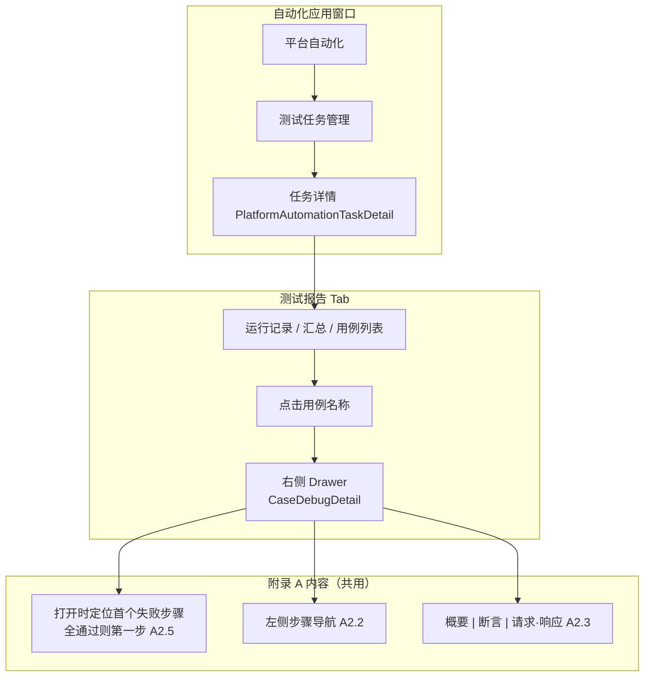
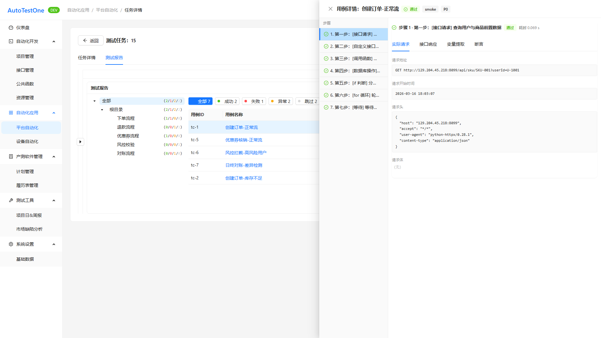

# 文档说明

> **文档类型**：需求规格说明书（SRS），即本仓库流程中的 **迭代级 PRD（交付研发与测试）**。经 **产品经理审核定稿** 后，供 **研发**（方案与实现）、**测试**（验收、用例与回归口径）、**AI**（spec-coding / 辅助实现）使用。  
> **交付物文件名**：`ATO_V1.0.1-P6-测试任务管理-需求规格说明书.md`（`{一级需求描述}` 与迭代需求清单「一级需求」列 **测试任务管理** 一致）。

> **《页面需求与交互规格》的定位**：**优化类不适用**（本类型不读页面 PRD / 原始页面设计）。用例运行详情交互以 **迭代清单附录 A** 与本 SRS 为准。

> **本文档的定位**：承载 **单个一级需求「测试任务管理」** 的完整条文（见 **附录 E**）；本稿 **仅 REQ-V1.0.1-P6-009**（从属 **REQ-007** 主 REQ）。**REQ-007、008** 分属其它一级需求，条文见对应 SRS 或清单附录 A。

**章节引用约定**：正文中的 `## 1.1`、`§1.1.x` **仅在本文档内有效**；跨文档沟通请使用 **文件名 + REQ-ID** 或 **文件名 + §**。**附录 A** 权威真源 = `ATO_V1.0.1-P6-需求清单.md` **§6**。

**编号约定**：

- `## 1.1` — 一级需求：**测试任务管理**
- `### 1.1.1 报告查看（REQ-V1.0.1-P6-009）` — 二级需求 + REQ（清单三级为空，**方案 1**，见 `docs/prd/SRS生成规则-v1.md` §7.1）

**需求描述结构（固定小节，勿删节）**：各功能点须依次包含 **`• **原型：**`**（在 **需求描述** 之前）、**`• **需求描述：**`** 下 **`1. 正常流程` → `2. 异常场景` → `3. 限制条件`**。详见 **`docs/prd/SRS生成规则-v1.md`**。

**前置门禁**：**需求类型=优化**；Playwright 截图 manifest 中 **REQ-009** png 已产出（errors 为空）。

**文档状态**：**待评审草稿（AI 按 SRS 规则 v1 重生成 · 2026-06-04）**

**验收基线**（版本 V1.0.1-P6）

- **迭代级权威**：**当前迭代本 SRS（定稿后）**；与 REQ-ID 对应的条文以实现与测试对本 SRS 为准。  
- **REQ 覆盖**：本稿覆盖一级需求「测试任务管理」在清单中的 **REQ-V1.0.1-P6-009**；**REQ-007** 为附录 A 主 REQ，交互条文 **引用附录 A / 附录 F**，不在本稿重复展开 007 全文。  
- **需求类型分流**：**优化** — **不读** 页面 PRD、原始页面设计；以 **清单 + 源码 + 截图 manifest** 为准。  
- **原型截图**：清单 `是否涉及UI=是` → 本 REQ 已嵌入 Playwright 原型（见 §1.1.1）。  
- **裁决规则**：清单附录 A 与本 SRS、源码 **冲突** 时：默认以 **已定稿 SRS** 为准并回写；临时以代码为准须 **显式记载**。  
- **外部系统 / 接口边界**：运行详情字段语义以 **后台 / 接口文档** 为准；P6 前端 **Mock**（`reportCaseDetailMock.ts`）；**禁止 silent drift**。

**文档生成依据 — 优化类**（需求类型=优化）

1. **迭代需求清单**：`docs/prd/V1.0.1-P6/ATO_V1.0.1-P6-需求清单.md`（REQ-009、附录 A、§2.1）。  
2. **页面 PRD / 原始页面设计**：**不适用**（优化类不读）。  
3. **Playwright 产出**：`docs/prd/V1.0.1-P6/assets/srs-screenshots/manifest.json`（REQ-009：`REQ-V1.0.1-P6-009-drawer.png`）。  
4. **源码核对**：`src/pages/PlatformAutomationTaskDetail.tsx`、`src/components/CaseDebugDetail.tsx`、`src/constants/reportCaseDetailMock.ts`、`src/mocks/data.ts`。  
5. **`docs/requirements/`**：已按 §4.2 检索 — 文件名 **「测试任务管理」NOT FOUND**；语义相关文档 **`docs/requirements/自动化应用/平台自动化/自动化应用-平台自动化_需求文档.md`**（§4.5 任务管理，非本迭代 009 专用条文）。

**本稿绑定**：版本 **V1.0.1-P6**；一级需求 **测试任务管理**；REQ 范围 **REQ-V1.0.1-P6-009**；路径 **`docs/prd/V1.0.1-P6/ATO_V1.0.1-P6-测试任务管理-需求规格说明书.md`**；业务域 **自动化应用** / 业务模块 **平台自动化**；主要实现 **`PlatformAutomationTaskDetail`**、**`CaseDebugDetail`**。

---

# 1 需求说明

## 1.1 测试任务管理

### 模块概述

在 **自动化应用** 窗口的 **平台自动化** 主框架下，**测试任务管理** 支撑平台级自动化任务的执行监控与 **报告查看**。本迭代 P6 优化 **任务报告** 中用例 **运行详情** UI，与用例调试（007）、测试运行报告（008）共用 **清单附录 A** 交互规范；本 SRS 仅覆盖 **009** 在 **平台自动化报告** 场景下的 **入口** 差异（P6 三端容器均为 **右侧 Drawer**）。

**解决的问题**：

- 平台自动化任务报告用例步骤较多时，难以快速定位 **首个失败步骤** 及断言、请求/响应数据（动机同 REQ-007「同 007」）。

**目标用户**：

- 测试工程师、自动化运维人员（查看平台自动化任务报告、分析失败用例）。

**入口**：

- **自动化应用（新窗口）** → 主框架 **平台自动化** → **测试任务管理** → 任务详情 → **测试报告** Tab（存量路由，§2.1 **改动存量**）。  
- 示例路由（P6 Mock）：**`/application/platform/tasks/:taskId`**（`:taskId` 为平台任务 ID，fixtures 示例 `15`）。  
- **用例运行详情**：测试报告 Tab 内点击用例名称 → **右侧 Drawer** 展示运行详情。

**模块业务逻辑说明**：

**说明**：报告数据 P6 来自 **`REPORT_CASE_DETAIL_BY_ID`** Mock；生产环境以任务运行 API 为权威源。

---

### 1.1.1 报告查看（REQ-V1.0.1-P6-009）

• **背景与动机：**

平台自动化 **任务报告** 中，用例步骤较多时，测试人员难以快速定位 **首个失败步骤** 以及断言、请求/响应等关键信息（与 REQ-V1.0.1-P6-007 同源动机：下弹详情步骤多时难定位失败与断言/请求数据；本 REQ 场景为 **平台自动化 · 任务报告入口**）。

• **用户场景：**

作为测试工程师，我在 **平台自动化** 的 **任务报告** 中打开某用例详情，右侧 Drawer 应 **自动定位首个失败步骤**（若无失败则 **第一步**），并可点击左侧步骤导航切换查看各步 **概要 / 断言 / 请求·响应**。

• **需求类型：** 优化

• **优先级：** 高

• **输入/前置条件：**

1. 用户已进入 **自动化应用 → 平台自动化 → 测试任务管理**，并打开目标任务 **详情页**。  
2. 当前位于 **测试报告** Tab，且已选择一条 **运行记录**（P6 Mock 有多条运行记录折叠区）。  
3. 用例列表中存在 **可查看详情** 的运行结果行。  
4. 用户点击该用例 **名称链接**（`.report-case-name-link`）触发详情 Drawer。

• **原型：**

• **需求描述：**

**导读**：本 REQ 分 **1. 入口与容器**、**2. 附录 A 共用交互** 两节；008 仅入口窗口不同，交互一致。

1. **正常流程 — 入口与容器**

   1. 用户在 **任务详情 · 测试报告** Tab 浏览 **用例列表**（可按目录树、状态筛选，存量能力）。  
   2. 点击用例 **名称**（链接样式，class `report-case-name-link`）打开 **用例详情**。  
   3. 系统以 **右侧 Drawer** 展示（`placement="right"`；宽度 P6 约 `min(900px, 60vw)`，**可下放** A.3）。  
   4. Drawer **标题**含用例名与 **总结果 Tag**（通过 ✅ / 失败 ❌）。  
   5. Drawer **内容区**为 **左右分栏**：  
      - **左侧**（约 220px）：竖向 **步骤列表**；步骤序号前展示 **通过 ✅ / 失败 ❌**；当前选中步骤 **高亮**（底色 `#bae0ff` + 左侧蓝色指示条，与用例调试一致）。  
      - **右侧**：**`DebugStepResultHeader`** + **`DebugStepDetailTabs`**（共用 `CaseDebugDetail.tsx`）。  
   6. 实现须传入正确 props（`result: DebugStepResult`）；**禁止**误传 `step` 导致详情恒为「暂无运行结果」（V1.0.2 修复项）。

2. **正常流程 — 附录 A 共用交互**

   1. **A2.1**：存在失败步骤时，打开 Drawer 后 **自动选中并展示首个失败步骤** 详情（**A.5-1**：**3 秒内** 视区内可见该步详情，无需手动查找）。  
   2. **A2.5**：**全部通过** 时默认选中并展示 **第一步**。  
   3. **A2.2**：点击左侧任一步骤 → 右侧主区 **同步切换** 该步数据（**A.5-2**）。  
   4. **A2.3**：右侧按步骤类型分 Tab：**概要**（状态/耗时/错误摘要）+ **断言** + **请求·响应**（Tab 顺序与用例调试共用组件一致）。  
   5. **A2.4**：失败步骤在导航列表 **高亮/失败标识**；与 **REQ-004** 联动的「已继续」等标记在 Mock 样例中可识别。  
   6. **A.5-3～5**：失败标识可见；断言 Tab 展示本步 **全部断言及失败原因**；请求·响应 Tab 展示 **请求方法、URL、响应状态码及 body**（Mock 可固定样例）。

2. **异常场景**

   a) **无详情数据**  
      i. 触发条件：用例无 `DebugStepResult` 映射。  
      ii. 系统反馈：Drawer 内 **Empty** 或「暂无运行结果」类文案。  
      iii. 用户指引：关闭 Drawer，选择其它用例或重新运行任务。

   b) **加载失败**  
      i. 触发条件：详情数据请求异常（生产环境）。  
      ii. 系统反馈：错误提示，可关闭 Drawer 重试。  
      iii. 用户指引：刷新页面或联系运维。

3. **限制条件**

   a) **不得偏离附录 A 已定决策**（清单 §5-4）。  
      i. 影响说明：A2.1～A2.5、A.5 验收条为 **不可推迟**。  
      ii. 关联：007/008/009 三端须 **内容组件统一**（`CaseDebugDetail`）。

   b) **A.3 可下放**  
      i. 影响说明：Drawer 精确宽度、动画、Tab 默认展开层级、JSON 折叠等。  
      ii. 依据：清单 §6 A.3。

   c) **业务域与窗口边界**  
      i. 影响说明：本 REQ 属 **自动化应用 / 平台自动化**，**非** 版本用例开发窗口内 **测试运行（008）**；两窗口路由与 API 上下文须隔离。  
      ii. 关联：008 SRS 单独描述测试运行入口。

   d) **P6 不新增测试任务管理路由**  
      i. 影响说明：本迭代为 **改动存量** 报告详情交互，不新增一级菜单或独立详情路由。

• **补充说明：**

- **三端容器对照（A.4）**：

  | 入口 | 容器 | REQ |
  | ---- | ---- | --- |
  | 用例调试运行 | 步骤详情区右侧 Drawer | 007 |
  | 测试运行 → 测试报告 | 右侧 Drawer | 008 |
  | **平台自动化 → 任务报告** | **右侧 Drawer** | **009** |

- Mock 样例用例：**tc-1「创建订单-正常流」**，覆盖 7 种步骤类型（`reportCaseDetailMock.ts`）。  
- 历史 requirements：`自动化应用-平台自动化_需求文档.md` §4.5 **任务管理** 描述存量任务 CRUD，**不含** 本迭代 Drawer 交互细则。

• **验收标准：**

- [ ] 从 **平台自动化任务详情 · 测试报告** 点击用例名，打开 **右侧 Drawer**，布局为左步骤列表 + 右详情 Tab。  
- [ ] 满足附录 **A.5** 全部 5 条（与 008 相同口径）。  
- [ ] 存在失败步骤时，打开后 **3 秒内** 视区可见 **首个失败步骤** 详情（A.5-1）。  
- [ ] 全部通过时默认展示 **第一步**（A2.5）。  
- [ ] 步骤导航点击后右侧内容 **同步切换**（A.5-2）。  
- [ ] Drawer 标题含用例总结果 Tag；失败步骤在列表中有 **失败标识**（A.5-3）。  
- [ ] 入口路径与 **版本窗口 · 测试运行 → 测试报告** 可区分，不产生错误挂载。  
- [ ] 未在本迭代新增 **测试任务管理** 相关独立路由（改动存量回归）。

---

# 待评审和澄清

> 汇集 **Playwright 截图失败**、**依据不足**、**清单/代码冲突**、**质量自检 P0** 等需产品或研发 **逐条裁决** 的事项。

| 序号 | 关联 REQ 或 § | 问题类型 | 问题描述 | 建议动作 |
|------|----------------|----------|----------|----------|
| C01 | REQ-009 | 口径缺失 | 「报告查看」与任务详情 **测试报告 Tab** 的菜单文案 / 路由 path 以 `PlatformAutomationTaskDetail` 与 `docs/spec/01-信息架构与路由.md` 为准，清单仅产品表述 | 定稿时在 spec 或本 SRS 入口节固化一条 canonical 路径 |
| C02 | REQ-009 | 冲突风险 | 平台自动化与版本窗口 **测试运行** 报告是否共用同一详情 API 与字段模型 | 接口评审，避免 008/009 Mock 与生产字段不一致 |
| C03 | 模块概述 | 历史文档 | `docs/requirements/` 无「测试任务管理」独立文档；仅平台自动化总文档 §4.5 | 合入全量库时登记 MOD-APP-PLAT 子能力映射 |

---

# 附录

## 变更历史

| 版本 | 日期 | 变更类型 | 变更内容 | 变更原因 | 影响范围 |
|------|------|----------|----------|----------|----------|
| V1.0.1-P6 | 2026-06-04 | 规范 | REQ-007 容器回写清单/SRS：三端 **右侧 Drawer**；关闭待澄清 C04 | 产品裁决 C01（用例管理） | 补充说明 A.4、清单 |
| V1.0.1-P6 | 2026-06-04 | 规范 | 方案 1 章节层级：`### 1.1.1 报告查看（REQ-009）`，删除虚构 `####` | SRS 规则 v1 §7.1 | §1.1.1、文首编号约定 |
| V1.0.1-P6 | 2026-06-04 | 规范 | 背景与动机对齐清单「需求动机」（009 展开 REQ-007 原文）；从属/容器差异移至补充说明 | 动机对齐规范落地 | §1.1.1 |
| V1.0.1-P6 | 2026-06-04 | 规范 | 按 SRS 规则 v1 重生成：优化类文档生成依据、嵌入 REQ-009 原型图、「待评审和澄清」节、扩充模块概述与验收条 | v1 试点 | 全文 |
| V1.0.1-P6 | 2026-06-03 | 新增 | 初稿（REQ-009） | 迭代清单 | 平台自动化报告用例详情 |

**变更类型说明**：新增 / 优化 / 修复 / 删除 / 重构 / 规范。

---

## 附录A：用户角色说明

| 角色名称 | 角色描述 | 主要权限 | 使用场景 |
| -------- | -------- | -------- | -------- |
| 测试工程师 | 查看自动化任务结果 | 报告查看、用例详情 Drawer | 分析失败用例 |
| 自动化运维 | 维护平台自动化任务 | 同上 | 批量任务失败排查 |

## 附录B：术语表

| 术语 | 定义 | 业务说明 |
| ------ | ---- | -------- |
| 平台自动化 | 自动化应用主框架模块 | 与「版本用例开发」窗口区分 |
| 测试任务管理 | 平台自动化子能力 | 含任务列表、任务详情、报告查看 |
| 任务报告 | 任务详情 · 测试报告 Tab | 009 入口上下文 |
| 附录 A | 清单 §6 | 007/008/009 交互真源 |
| CaseDebugDetail | 共用详情组件 | `DebugStepResultHeader` + `DebugStepDetailTabs` |

## 附录C：参考文档

- 迭代需求清单：`docs/prd/V1.0.1-P6/ATO_V1.0.1-P6-需求清单.md`  
- SRS 模版：`template/需求规格说明书-模版.md`  
- SRS 黄金范例：`template/ATO_V1.0.1-P5-需求规格说明书-范例-市场缺陷分析.md`  
- SRS 规则 v1：`docs/prd/SRS生成规则-v1.md`  
- 截图 manifest：`docs/prd/V1.0.1-P6/assets/srs-screenshots/manifest.json`  
- 业务模块拆分：`.cursor/rules/requirements-module-split.mdc`（MOD-APP-PLAT）  
- 历史 requirements（相关）：`docs/requirements/自动化应用/平台自动化/自动化应用-平台自动化_需求文档.md`

## 附录D：编写规范（引用黄金范例）

见黄金范例 **附录 D**；本 REQ 采用 **D.2** 分子节写法（正常流程 1/2 分述入口与附录 A）。

## 附录E：文档粒度规范

本文件仅 **测试任务管理** + **REQ-009**。**REQ-007**（用例管理）、**REQ-008**（测试运行）须见各自 SRS 或清单附录 A。

## 附录F：附录 A 摘录（用例运行详情统一规范）

> 权威真源：`ATO_V1.0.1-P6-需求清单.md` §6。

### F.1 适用范围

007 / 008 / **009（本平台自动化报告）** 共用同一套详情 **内容与交互**；P6 **仅入口不同**，三端均为 **右侧 Drawer**。

### F.2 交互决策（A2.1～A2.5）

| # | 决策 | P6 默认 |
|---|------|---------|
| A2.1 | 打开详情时自动定位首个失败步骤 | **是** |
| A2.2 | 步骤导航（列表点击跳转） | **是**，左侧竖向列表 |
| A2.3 | 信息分区 | **概要** + **断言** + **请求·响应**（Tab） |
| A2.4 | 步骤行视觉 | 失败 **高亮**；未阻塞继续 **区分标记** |
| A2.5 | 全部通过时 | 默认展开 **第一步** |

### F.3 本 REQ 容器（A.4）

| 入口 | 容器 | REQ |
|------|------|-----|
| **平台自动化报告** | **右侧 Drawer** | **009** |

### F.4 验收要点（A.5）

1. 存在失败步骤时，打开详情 **3 秒内** 视区内可见首个失败步骤详情。  
2. 点击步骤导航任一步，主区同步切换该步数据。  
3. 失败步骤在导航列表中有 **失败** 标识。  
4. 断言 Tab 展示本步全部断言及失败原因。  
5. 请求·响应 Tab 展示请求方法与 URL、响应状态码及 body。

---

**文档版本：** V1.0.1-P6  
**最后更新：** 2026-06-04  
**编写人：** AI（待产品审核）  
**审核人：** [待填写]
