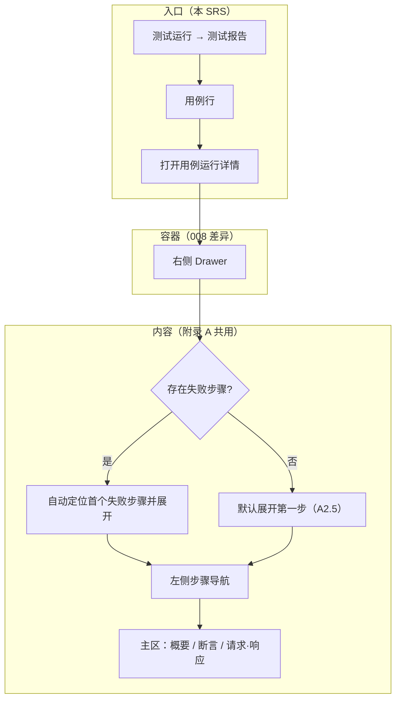
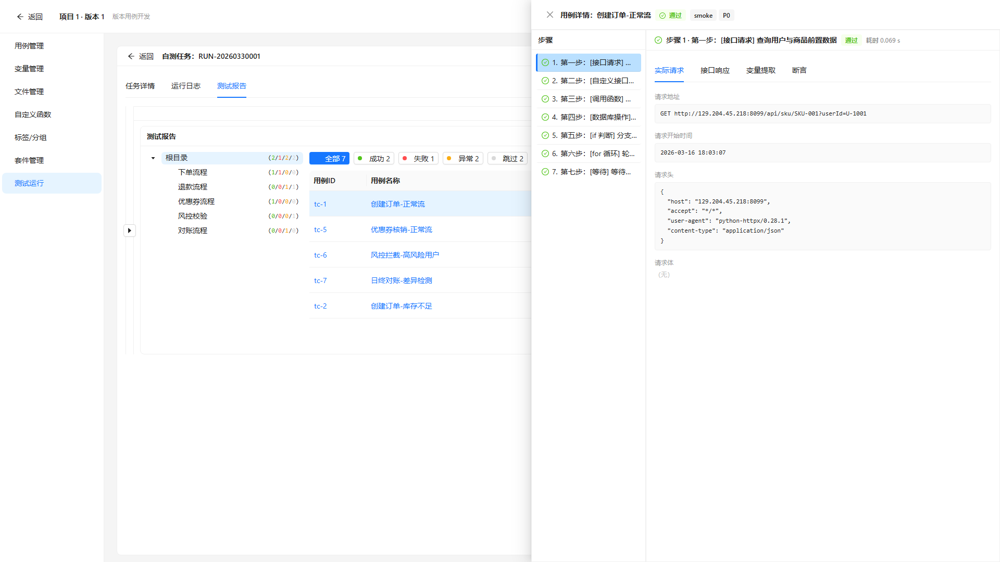

# 文档说明

> **文档类型**：需求规格说明书（SRS），即本仓库流程中的 **迭代级 PRD（交付研发与测试）**。经 **产品经理审核定稿** 后，供 **研发**（方案与实现）、**测试**（验收、用例与回归口径）、**AI**（spec-coding / 辅助实现）使用。  
> **交付物文件名**：`ATO_V1.0.1-P6-测试运行-需求规格说明书.md`（`{一级需求描述}` 与迭代需求清单「一级需求」列 **测试运行** 一致）。

> **《页面需求与交互规格》的定位**（`docs/prd/V1.0.1-P6/ATO_V1.0.1-P6-页面需求与交互规格.md`）：用于 **HTML 页面原型 / 线框落地**；**优化类本稿不读**（见 `docs/prd/SRS生成规则-v1.md` §2）。本能力为 **改动存量** 页面，用例运行详情交互以 **迭代清单附录 A** 与本 SRS 为准。

> **本稿的定位**：承载 **一级需求「测试运行」** 的完整条文；本稿仅 **REQ-V1.0.1-P6-008**（从属 **REQ-007**，共用附录 A）。详见 **附录 E**。**文档粒度（必读）**：**一份 SRS 仅覆盖迭代清单中的一个一级需求**。

**章节引用约定**：正文中的 `## 1.1`、`§1.1.x` **仅在本文档内有效**；跨文档沟通请使用 **文件名 + REQ-ID**（示例：`ATO_V1.0.1-P6-测试运行-需求规格说明书.md` + **REQ-V1.0.1-P6-008**）。**附录 A** 指 `ATO_V1.0.1-P6-需求清单.md` **§6 附录 A**。

**编号约定**（正文 `##` / `###` / `####` 与清单列对应）：

- `## 1.1` — 对应迭代清单 **一级需求**：**测试运行**
- `### 1.1.1` — 对应迭代清单 **二级需求**：**测试报告**
- `#### 1.1.1.1` — 对应迭代清单 **三级需求**：**用例运行详情 UI 交互优化**（REQ-008）

**需求描述结构（固定小节，勿删节）**：各功能点须依次包含 **`• **原型：**`**（在 **需求描述** 之前）、**`• **需求描述：**`** 下 **`1. 正常流程` → `2. 异常场景` → `3. 限制条件`**。无异常条目时 **保留 `2. 异常场景` 标题**，正文写 **「无」**。

**前置门禁**：**需求类型=优化**；允许生成 SRS；**先图后文** — Playwright manifest **errors 为空**（REQ-008 `drawer` 截图已产出）。

**文档状态**：**待评审草稿（AI 按 SRS 规则 v1 重生成 · 2026-06-04）**

**验收基线**（版本 V1.0.1-P6）

- **迭代级权威（研发 / 测试 / AI）**：**当前迭代本 SRS（定稿后）**。业务口径、验收勾选项、与 REQ-ID 对应的条文 **以实现与测试对本 SRS 为准**。  
- **REQ 覆盖（完整性）**：本稿覆盖一级需求「测试运行」在迭代清单中的 **REQ-V1.0.1-P6-008**；**REQ-007** 条文不在本文件展开，但 **附录 A** 全文适用于 008。  
- **主 REQ 关系**：008 为 **REQ-007** 从属；交互细则以 **附录 A** 为单一真源（清单 §5-4）。  
- **容器（P6 已定）**：入口 **测试运行 → 测试报告**；外层 **右侧 Drawer**（与 007/009 一致，三端统一）。  
- **原型截图**：清单 `是否涉及UI=是` → **REQ-008** 条文节嵌入 `assets/srs-screenshots/REQ-V1.0.1-P6-008-drawer.png`（manifest 已登记）。  
- **裁决规则**：当 **原型截图**、**源码** 与 **清单附录 A** 冲突时：**默认以已定稿 SRS 为准**；**禁止 silent drift**。

**文档生成依据 — 优化类**（需求类型=优化）

1. **迭代需求清单**：`docs/prd/V1.0.1-P6/ATO_V1.0.1-P6-需求清单.md`（REQ-008、**附录 A**、§2.1 改动存量）  
2. **页面 PRD / 原始页面设计**：**不适用**（优化类不读）  
3. **Playwright 产出**：`docs/prd/V1.0.1-P6/assets/srs-screenshots/manifest.json`（REQ-008 → `REQ-V1.0.1-P6-008-drawer.png`；`errors: []`）  
4. **源码核对**：版本用例开发窗口内 **测试运行** / **测试报告** 相关 `src/pages/`、`mocks/`（仅作可观测核对）  
5. **`docs/requirements/`**：已按 §4.2 检索 — **NOT FOUND**「测试运行」独立历史模块文档（平台用例开发子能力见 `requirements-module-split.mdc`）

**本稿绑定（交付前填写）**：版本 **V1.0.1-P6**；一级需求 **测试运行**；REQ 范围 **REQ-V1.0.1-P6-008**；路径 **`docs/prd/V1.0.1-P6/ATO_V1.0.1-P6-测试运行-需求规格说明书.md`**；页面交互规格：**不适用（优化类）**；附录 A 真源：同目录需求清单 §6。

---

# 1 需求说明

## 1.1 测试运行

### 模块概述

**测试运行** 提供版本维度下的任务执行与 **测试报告** 查看。本迭代优化 **测试报告** 中用例 **运行详情** 的展示与定位能力，与用例调试（REQ-007）、平台自动化报告（REQ-009）**共用附录 A** 交互规范；P6 三端均为 **右侧 Drawer**，**仅入口** 不同。

**解决的问题**：

- 测试报告用例详情步骤较多时，测试人员难以快速定位 **首个失败步骤** 以及断言、请求/响应等关键信息（与 REQ-007 同源动机；本 REQ 场景为 **测试运行 · 测试报告** 入口）。

**目标用户**：

- 测试工程师、自动化工程师（查看测试运行报告、分析失败用例）。

**入口**：

- **版本用例开发（新窗口）** → **平台用例开发** → **测试运行** → **测试报告**（存量路由，清单 §2.1 **改动存量**）。  
- **用例运行详情**：测试报告列表/表格中 **用例行** → 打开 **详情** → **右侧 Drawer**。

**模块业务逻辑说明**：

---

### 1.1.1 测试报告

本二级需求覆盖 **测试报告** 内用例运行详情 UI 优化；三级需求 **用例运行详情 UI 交互优化** 对应 **REQ-V1.0.1-P6-008**（从属 **REQ-007**）。

#### 1.1.1.1 用例运行详情 UI 交互优化（REQ-V1.0.1-P6-008）

• **背景与动机：**

下弹/抽屉详情步骤较多时，测试人员难以快速定位 **首个失败步骤** 以及断言、请求/响应等关键信息（与 REQ-V1.0.1-P6-007 同源动机；本 REQ 场景为 **测试运行 · 测试报告** 入口）。

• **用户场景：**

作为测试工程师，我在 **测试报告** 中点击某用例的详情，右侧 Drawer 打开后，应 **自动定位到首个失败步骤** 并展示断言与请求响应；我可通过左侧步骤列表切换任一步骤查看数据。

• **需求类型：** 优化

• **优先级：** 高

• **输入/前置条件：**

1. 用户已进入 **测试运行 → 测试报告**，且存在至少一条 **已执行完成**（或可查详情）的用例运行记录。  
2. 用户对该用例行触发 **查看详情**（按钮/链接文案沿用存量，本迭代不强制改名）。

• **原型：**

• **需求描述：**

本 REQ（REQ-V1.0.1-P6-008）从属 **REQ-007**；交互规范以迭代清单 **附录 A** 为准，下列 **1～2** 为子功能分述：**1** 为入口与容器差异；**2** 为附录 A 共用交互（不可推迟）。

1. **正常流程 — 入口与容器**

   1. 用户在 **测试报告** 页面定位目标 **用例行**。  
   2. 点击该行 **详情**（或等价操作）。  
   3. 系统从 **右侧** 滑出 **Drawer**，展示该用例 **运行详情**（宽度/动画可下放实现阶段，见附录 A.3）。  
   4. Drawer 内布局与 **附录 A** 一致：**左侧（或约定位置）步骤导航** + **主区** 分 **概要 / 断言 / 请求·响应**（Tab 切换，见 A2.3）。

2. **正常流程 — 附录 A 交互（不可推迟）**

   1. **打开定位（A2.1）**：若存在 **失败步骤**，打开后 **自动定位首个失败步骤** 并展开其详情；视区内 **3 秒内** 可见该步详情（**A.5-1**，无需手动翻页查找）。  
   2. **全部通过（A2.5）**：若无失败步骤，默认展开 **第一步**。  
   3. **步骤导航（A2.2）**：左侧竖向步骤列表；点击任一步，主区 **同步切换** 该步数据（**A.5-2**）。  
   4. **信息分区（A2.3）**：主区含 **概要**（状态/耗时/错误摘要）、**断言** Tab、**请求·响应** Tab。  
   5. **步骤行视觉（A2.4）**：失败步骤 **高亮**；导航列表有 **失败** 标识（**A.5-3**）。  
   6. **断言 Tab（A.5-4）**：展示本步 **全部断言** 及失败原因。  
   7. **请求·响应 Tab（A.5-5）**：展示请求方法、URL、响应状态码及 body（P6 可 Mock 固定样例）。  
   8. **与 REQ-004 联动**：因未勾选「失败阻塞」而继续的步骤/断言，须有 **可识别标记**（如「已继续」，具体文案下放实现阶段）。

2. **异常场景**

   a) **无运行详情数据**  
      i. 触发条件：用例未执行、详情接口无数据。  
      ii. 系统反馈：Drawer 内 **空态** 或等价提示（文案下放实现阶段）。  
      iii. 用户指引：确认用例已执行完成。

   b) **详情加载失败**  
      i. 触发条件：接口错误/超时。  
      ii. 系统反馈：错误提示，Drawer 可关闭重试。  
      iii. 用户指引：重试或联系运维。

3. **限制条件**

   a) **从属 REQ-007**  
      i. 影响说明：不得在本迭代单独改写附录 A 决策；若 007 变更，008 须同步。  
      ii. 组件：与 007/009 **共用** 详情内容组件（`CaseDebugDetail`）；三端均为 **右侧 Drawer**，**仅入口** 不同（清单 A.4，2026-06-04 回写）。

   b) **可下放项（A.3）**  
      i. Drawer 宽度、全屏、动画、Tab 顺序、JSON 折叠层级、代码高亮。  
      ii. 内网原型 URL 仅作参考，非唯一真源。

• **补充说明：**

- **关联页面/入口**：测试运行 → 测试报告（清单列）。  
- **REQ 主从**：**REQ-V1.0.1-P6-007** 主 REQ；008 在正文展开 **附录 A** 适用条文，**入口与容器差异** 见上文 **1. 正常流程 — 入口与容器**。  
- **附录 A 权威路径**：`docs/prd/V1.0.1-P6/ATO_V1.0.1-P6-需求清单.md` §6；本稿 **附录 F** 为阅读便利摘录，冲突以清单为准。

• **验收标准：**

- [ ] 从 **测试报告** 用例行打开详情，容器为 **右侧 Drawer**。  
- [ ] 存在失败步骤时，打开后 **3 秒内** 视区内可见 **首个失败步骤** 详情（**A.5-1**）。  
- [ ] 点击步骤导航任一步，主区同步切换（**A.5-2**）。  
- [ ] 失败步骤在导航列表有 **失败** 标识（**A.5-3**）。  
- [ ] 断言 Tab 展示本步全部断言及失败原因（**A.5-4**）。  
- [ ] 请求·响应 Tab 展示方法、URL、状态码、body（**A.5-5**；Mock 可验收）。  
- [ ] 全部通过时用例默认展开 **第一步**（**A2.5**）。  
- [ ] 与 007/009 共用组件时，**仅入口** 不同，内容区行为与附录 A 一致。  

---

# 待评审和澄清

> 汇集 **Playwright 截图失败**、**依据不足**、**清单/页面 PRD/代码冲突**、**质量自检 P0** 等需产品或研发 **逐条裁决** 的事项。关闭后：将结论 **回写** 正文对应 REQ/§，并 **删除或清空** 本表。

| 序号 | 关联 REQ 或 § | 问题类型 | 问题描述 | 建议动作 |
|------|----------------|----------|----------|----------|
| C01 | REQ-008 | 口径缺失 | 测试报告「用例行 → 详情」精确控件（链接/图标/列名）清单未写 | 对照存量页面或补一条至后续页面 PRD |
| C02 | REQ-008 | 技术不确定 | 与 REQ-007 是否强制同一 React 组件包名/目录未定义 | 研发拆分方案评审 |

---

# 附录

## 变更历史

| 版本 | 日期 | 变更类型 | 变更内容 | 变更原因 | 影响范围 |
| ---- | ---- | -------- | -------- | -------- | -------- |
| V1.0.1-P6 | 2026-06-04 | 规范 | REQ-007 容器回写：三端均为 **右侧 Drawer**（清单 A.4；产品裁决以实现为准） | 关闭用例管理 C01 | 文首、附录 F |
| V1.0.1-P6 | 2026-06-04 | 规范 | 按 SRS 规则 v1 重生成：三级需求 `#### 1.1.1.1`；嵌入 Playwright 原型；优化类文档生成依据；背景与动机与附录 A 分工；「待评审和澄清」节 | v1 试点 | 全文、文首 |
| V1.0.1-P6 | 2026-06-03 | 新增 | 初稿（REQ-008 + 附录 A 摘录） | 迭代清单 | 测试报告用例详情右侧 Drawer |

**变更类型说明**：新增 / 优化 / 修复 / 删除 / 重构 / 规范。

---

## 附录A：用户角色说明

| 角色名称 | 角色描述 | 主要权限 | 使用场景 |
| -------- | -------- | -------- | -------- |
| 测试工程师 | 执行与查看测试运行 | 测试报告、用例详情 | 分析失败用例、查看断言与请求响应 |
| 自动化工程师 | 同上 | 同上 | 调试批量任务结果 |

---

## 附录B：术语表

| 术语 | 定义 | 业务说明 |
| ---- | ---- | -------- |
| 测试报告 | 测试运行子能力 | 本 REQ 入口 |
| 用例运行详情 | Drawer 内展示体 | 步骤导航 + 概要/断言/请求·响应 |
| 附录 A | 清单 §6 规范 | 007/008/009 共用交互真源 |
| 右侧 Drawer | 容器形态 | 007/008/009 运行详情（P6 三端统一） |

---

## 附录C：参考文档

- 迭代需求清单：`docs/prd/V1.0.1-P6/ATO_V1.0.1-P6-需求清单.md`（**附录 A 全文**、REQ-007/008、§2.1）  
- SRS 模版：`template/需求规格说明书-模版.md`  
- SRS 黄金范例：`template/ATO_V1.0.1-P5-需求规格说明书-范例-市场缺陷分析.md`  
- SRS 生成规则：`docs/prd/SRS生成规则-v1.md`  
- 截图 manifest：`docs/prd/V1.0.1-P6/assets/srs-screenshots/manifest.json`  
- 业务模块：`.cursor/rules/requirements-module-split.mdc` — 平台用例开发 / 测试运行

---

## 附录D：编写规范（引用黄金范例）

见黄金范例附录 **D.1～D.6**。本 REQ 在「正常流程」内用 **1./2.** 分子功能（入口 vs 附录 A 内容），符合 **D.2**。

---

## 附录E：文档粒度规范（暂行）

本文件仅覆盖一级需求 **测试运行** 与 **REQ-V1.0.1-P6-008**；**REQ-007** 若另立 SRS 须引用同一附录 A；**REQ-009** 见 `ATO_V1.0.1-P6-测试任务管理-需求规格说明书.md`（若编制）。

---

## 附录F：附录 A 摘录（用例运行详情统一规范）

> **权威真源**：`ATO_V1.0.1-P6-需求清单.md` §6；冲突以清单为准。本附录便于单文件阅读。

### F.1 适用范围

用例调试（007）、**测试报告（008）**、平台自动化报告（009）共用；P6 **仅入口不同**，三端均为 **右侧 Drawer**。

### F.2 不可推迟的交互决策

| # | 决策 | P6 默认 |
|---|------|---------|
| A2.1 | 打开时自动定位首个失败步骤 | **是** |
| A2.2 | 步骤导航（列表点击跳转） | **是**，左侧竖向列表 |
| A2.3 | 信息分区 | **概要** + **断言** + **请求·响应**（Tab） |
| A2.4 | 步骤行视觉 | 失败高亮；未阻塞继续有区分标记（与 004 联动） |
| A2.5 | 全部通过时 | 默认展开 **第一步** |

### F.3 三端差异（A.4 摘录）

| 入口 | 容器 | REQ |
|------|------|-----|
| 用例调试运行 | **右侧 Drawer** | 007 |
| **测试报告** | **右侧 Drawer** | **008** |
| 平台自动化报告 | **右侧 Drawer** | 009 |

### F.4 验收要点（A.5）

1. 存在失败步骤时，打开详情 **3 秒内** 视区内可见首个失败步骤详情。  
2. 点击步骤导航任一步，主区同步切换。  
3. 失败步骤在导航列表有失败标识。  
4. 断言 Tab 展示本步全部断言及失败原因。  
5. 请求·响应 Tab 展示方法、URL、状态码、body。

---

**文档版本：** V1.0.1-P6  
**最后更新：** 2026-06-04  
**编写人：** AI（待产品审核）  
**审核人：** （待产品经理填写）
