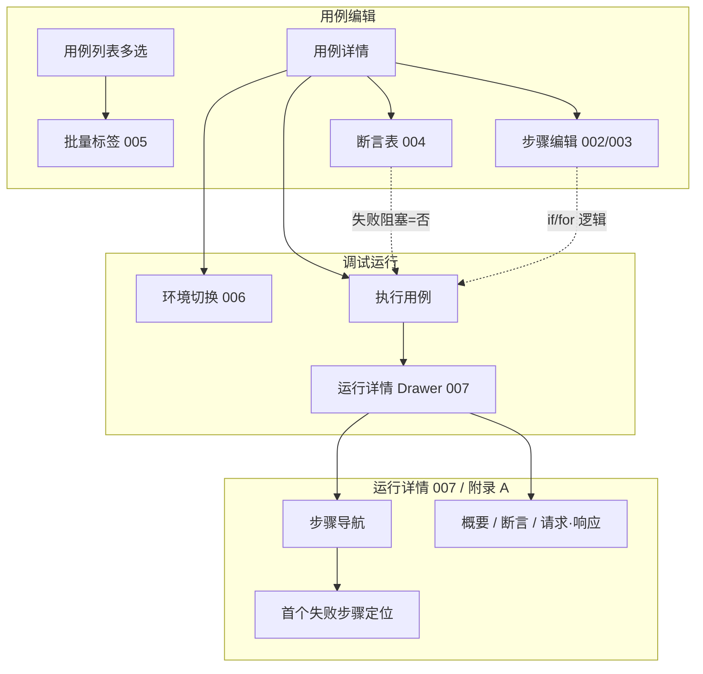
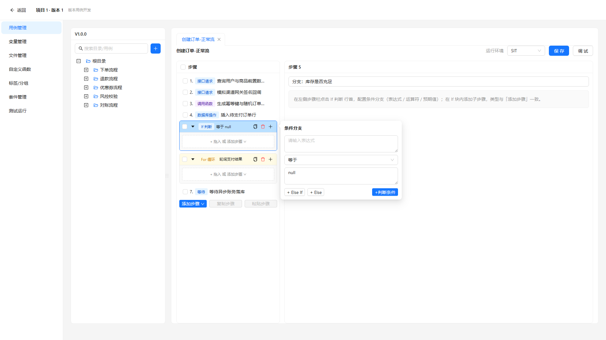
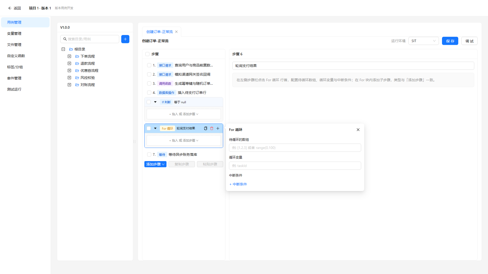
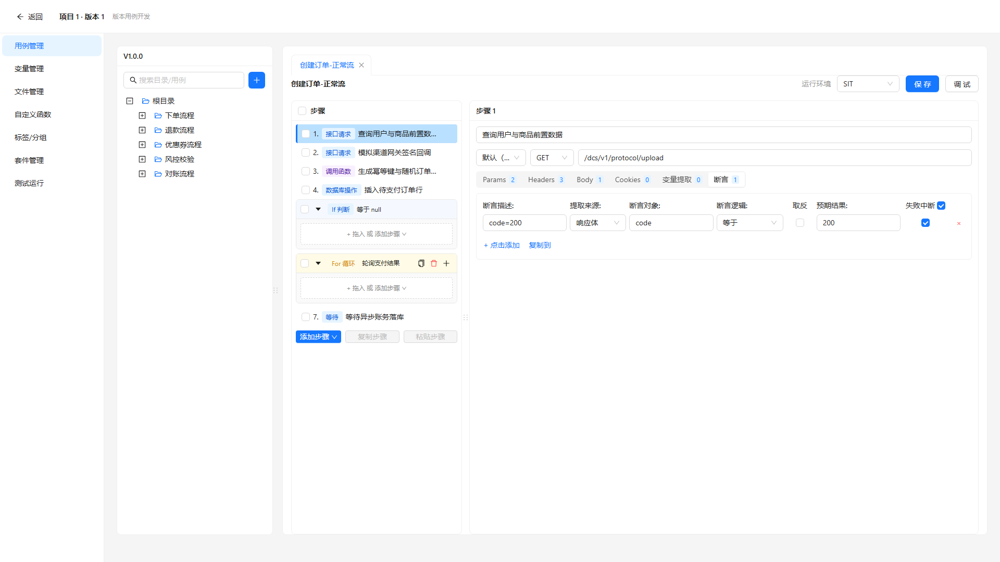
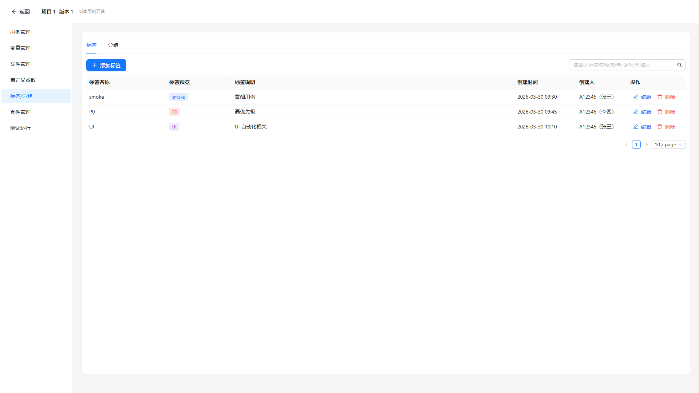
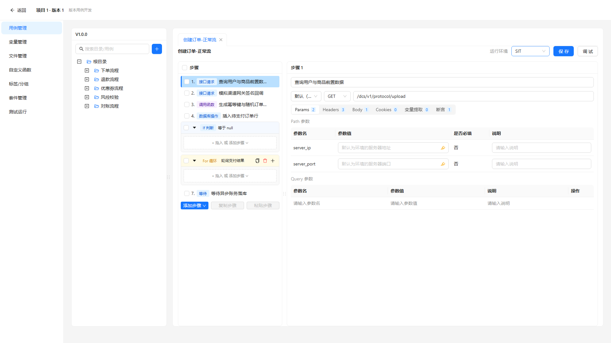
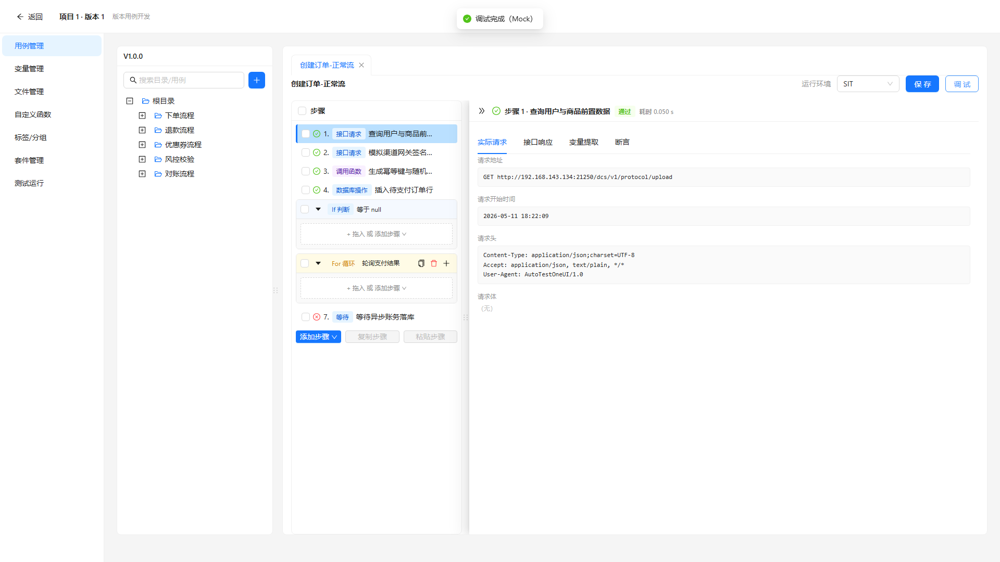

# 文档说明

> **文档类型**：需求规格说明书（SRS），即本仓库流程中的 **迭代级 PRD（交付研发与测试）**。经 **产品经理审核定稿** 后，供 **研发**（方案与实现）、**测试**（验收、用例与回归口径）、**AI**（spec-coding / 辅助实现）使用。  
> **交付物文件名**：`ATO_V1.0.1-P6-用例管理-需求规格说明书.md`（`{一级需求描述}` 与迭代需求清单「一级需求」列 **用例管理** 一致）。

> **《页面需求与交互规格》的定位**：**优化类不适用**（本类型不读页面 PRD / 原始页面设计）。条文与验收以 **本 SRS + 迭代需求清单** 为准。

> **本文档的定位**：承载 **单个一级需求「用例管理」** 的完整条文（见 **附录 E**）；章节与迭代清单二/三级严格对应。体裁参照 `template/ATO_V1.0.1-P5-需求规格说明书-范例-市场缺陷分析.md` 与 `template/需求规格说明书-模版.md`。

**章节引用约定**：正文中的 `## 1.1`、`§1.1.x` **仅在本文档内有效**；跨文档沟通请使用 **文件名 + REQ-ID** 或 **文件名 + §**（示例：`ATO_V1.0.1-P6-用例管理-需求规格说明书.md` + **REQ-V1.0.1-P6-004**）。

**编号约定**：

- `## 1.1` — 一级需求：**用例管理**
- `### 1.1.x` — 二级需求：**用例步骤编辑** / **测试用例编辑** / **用例调试运行**
- `#### 1.1.x.y` — 与清单 **三级需求** 及 **REQ-ID** 一一对应

**页面聚合**：本一级需求下 **无** 多 REQ 合并同一 `####` 的例外；002/003/004 同属 `### 1.1.1` 下三个 `####`；005 在 `### 1.1.2`；006/007 在 `### 1.1.3`。

**需求描述结构（固定小节，勿删节）**：各 REQ 条文节须依次包含 **`• **原型：**`**（在 **需求描述** 之前）、**`• **需求描述：**`** 下 **`1. 正常流程` → `2. 异常场景` → `3. 限制条件`**；**`• **需求类型：**`** 写在 **用户场景** 之后、**优先级** 之前。详见 **`docs/prd/SRS生成规则-v1.md`**。

**REQ 覆盖（完整性）**：本稿覆盖 **REQ-V1.0.1-P6-002、003、004、005、006、007**（共 6 条）。REQ-008、009 属其他一级需求（测试运行 / 测试任务管理），交互规范与清单 **附录 A** 共用，正文不在此稿展开。

**验收基线**（版本 V1.0.1-P6）

- **迭代级权威**：**当前迭代本 SRS（定稿后）**；与 REQ-ID 对应的条文以实现与测试对本 SRS 为准。  
- **需求类型分流**：**优化** — **不读** 页面 PRD、原始页面设计；以 **清单 + 源码 + 截图 manifest** 为准。  
- **原型截图**：清单 `是否涉及UI=是` 的 REQ 已嵌入 Playwright 原型（manifest `errors` 为空）。  
- **裁决规则**：清单、附录 A 与本 SRS、源码 **冲突** 时：默认以 **已定稿 SRS** 为准并回写；临时以代码为准须 **显式记载** 于 **待评审和澄清**。  
- **外部系统 / 接口边界**：标签主数据、运行结果字段语义以 **后台 / 接口文档** 为准；P6 前端 **Mock**；**禁止 silent drift**。

**前置门禁**：**需求类型=优化**；Playwright 截图 manifest 中 **REQ-002～007** png 已产出（`errors: []`）。

**文档状态**：**待评审草稿（AI 按 SRS 规则 v1 重生成 · 2026-06-04）**

**文档生成依据 — 优化类**（需求类型=优化）

1. **迭代需求清单**：`docs/prd/V1.0.1-P6/ATO_V1.0.1-P6-需求清单.md`（REQ-002～007、§6 附录 A、§2.1）。  
2. **页面 PRD / 原始页面设计**：**不适用**（优化类不读）。  
3. **Playwright 产出**：`docs/prd/V1.0.1-P6/assets/srs-screenshots/manifest.json`（REQ-002～007 各 1 张 png）。  
4. **源码核对**：`src/pages/CaseManagement.tsx`、`src/components/CaseIfStepBlock.tsx`、`src/components/CaseForStepBlock.tsx`、`src/components/CaseDebugDetail.tsx`、`src/utils/caseIfStep.ts`、`src/utils/caseForStep.ts` 等 — **非默认真源**，差异写入 **待评审和澄清**。  
5. **`docs/requirements/`**：已按 §4.2 检索 — 路径 `docs/requirements/版本用例开发/平台用例开发/版本用例开发-平台用例开发-用例管理_需求文档.md` 及 `*用例管理*_需求文档.md` **NOT FOUND**（全库无命中）。

**本稿绑定**：版本 **V1.0.1-P6**；一级需求 **用例管理**；业务域 **版本用例开发** / 业务模块 **平台用例开发**；REQ 范围 **REQ-V1.0.1-P6-002～007**；路径 **`docs/prd/V1.0.1-P6/ATO_V1.0.1-P6-用例管理-需求规格说明书.md`**；关联入口 **版本用例开发（新窗口）→ 平台用例开发 → 用例管理**（清单 §2.1 **改动存量**，不新增路由）；主要页面 **`CaseManagement.tsx`**。

---

# 1 需求说明

## 1.1 用例管理

### 模块概述

在 **版本用例开发** 窗口内的 **用例管理** 存量能力上，增强 **步骤编排**（多条件 if、for 中断或逻辑、断言/步骤失败是否阻塞）、**用例列表批量标签**、**调试运行区环境展示** 与 **运行结果详情** 可读性，降低复杂用例调试与批量运维成本。

**解决的问题**：

- 单条件 if、固定「与」的 for 中断无法满足分支与循环控制业务。  
- 断言失败后一律阻塞导致后置「关闭」等步骤被跳过、设备状态异常。  
- 批量打标签效率低；环境长地址挤压接口路径展示。  
- 调试/运行详情步骤多时难以定位首个失败步骤及断言、请求数据。

**目标用户**：测试开发工程师、自动化用例维护人员在版本窗口内编排与调试用例。

**入口**：

- **菜单路径**：自动化开发 → 进入项目/版本 → **版本用例开发（新窗口）** → **平台用例开发** → **用例管理**。  
- **路由**：沿用版本窗口内既有用例管理路由（清单 §2.1：**改动存量**，不新增路由）。  
- **子入口（本稿 REQ 映射）**：  
  - 用例详情 → **步骤编辑区** / **断言编辑** → REQ-002～004；  
  - 用例 **列表** 多选工具栏 → REQ-005；  
  - 用例详情 → **调试运行区** → REQ-006、007。

**模块业务逻辑说明**：

**说明**：运行详情规范与 REQ-008、009 **共用清单附录 A**；三端均为 **右侧 Drawer**，**仅入口** 不同；008/009 条文见各自 SRS。

---

### 1.1.1 用例步骤编辑

本二级需求覆盖 **if 判断**、**for 循环** 步骤条件编辑及 **断言/步骤失败阻塞** 策略，对应 **REQ-V1.0.1-P6-002、003、004**。

#### 1.1.1.1 if 判断步骤，判断条件支持多个（REQ-V1.0.1-P6-002）

• **背景与动机：**

当前 P5 仅支持 **单条** 判断条件，不满足多条件组合判断的业务场景；测试开发在编排分支逻辑时需要 **最多 2 条** 条件及条件间 **与 / 或** 组合能力。

• **用户场景：**

作为测试开发，在编辑 **if 判断** 步骤时，希望配置 **最多 2 条** 判断条件及 **与/或** 组合，以便表达「A 且 B」或「A 或 B」类分支，且旧用例数据仍可正常打开编辑。

• **需求类型：** 优化

• **优先级：** 中

• **输入/前置条件：**

1. 用户已打开某用例的 **用例详情**，并选中或新增 **步骤类型 = if 判断** 的步骤。  
2. 用户打开该步骤的 **判断条件** 编辑入口（Popover / 面板等，具体控件位置下放实现，本 SRS 不锁定布局）。

• **原型：**

• **需求描述：**

1. **正常流程**

   **1. 条件条数**

   - 支持 **1～2** 条判断条件；达到 2 条后 **不可再增** 第三条（无「添加条件」或等效入口置灰/隐藏）。  
   - 仅 1 条时：展示该条件的字段编辑区；**不展示** 条件间逻辑（与/或）选择控件（**隐藏**，非禁用占位）。

   **2. 条件间逻辑**

   - 当存在 **2** 条条件时，展示 **一个** 逻辑选择：**与** / **或**。  
   - **默认值**：**与**。  
   - 逻辑作用于 **两条条件整体**（非逐对嵌套）。

   **3. 条件字段（每条）**

   | 要素 | 说明 |
   |------|------|
   | 左值 / 变量 | 与 P5 单条件一致，支持动态值输入 |
   | 比较符 | 与 P5 枚举一致 |
   | 右值 | 与 P5 一致 |

   - **保存时**该条条件内所有必填项须 **非空**。

   **4. 保存**

   - 用户点击保存/确认条件：校验 **每一条** 已展示条件的必填项均已填写；否则 **阻断保存** 并提示（如「请完善判断条件」类文案，具体下放实现）。  
   - 保存成功后，步骤标题/摘要应能反映条件条数或逻辑（展示规则下放实现）。

   **5. 数据兼容（P5 → P6）**

   - 历史 **仅 1 条条件** 的 if 步骤：加载后展示为 **1 条条件 + 默认逻辑「与」**（逻辑控件隐藏）；用户可增至 2 条并选择或逻辑。

2. **异常场景**

   - 第二条条件必填项未填即保存：阻断并字段级或全局提示。  
   - 网络/接口保存失败：保持编辑态，Toast 或 Message 提示失败原因。

3. **限制条件**

   - **最多 2 条** 判断条件，硬上限。  
   - 本 REQ **不包含** elseif/else 分支链路的规则变更。  
   - 控件具体坐标、Popover 宽度等 **可下放** 实现层。

• **补充说明：**

- 清单备注「主 REQ；控件位置下放」— 本稿仅约束 **条数、逻辑、校验、兼容**。  
- 与 **REQ-003** 共用步骤编辑上下文，但 **不共用** 数据模型（if 条件 vs for 中断条件）。

• **验收标准：**

- [ ] 单条件 if：仅 1 条条件编辑区，**无** 与/或 逻辑控件。  
- [ ] 双条件 if：可切换 **与/或**，默认 **与**；保存后重开数据一致。  
- [ ] 保存时任一条条件必填项为空则 **不可保存**。  
- [ ] P5 旧数据打开为 1 条条件，逻辑默认为 **与**，无报错、无数据丢失。  
- [ ] 不可添加第 3 条条件。

---

#### 1.1.1.2 for 循环步骤，中断条件支持或逻辑（REQ-V1.0.1-P6-003）

• **背景与动机：**

当前多 **中断条件** 固定为 **与** 关系，不满足「满足任一即中断」等业务；需在 for 循环步骤中为全部中断条件提供 **共用的** 与/或 逻辑选择。

• **用户场景：**

作为测试开发，在 **for 循环** 步骤中配置多条 **中断条件** 时，希望用 **一个** 与/或 开关控制「全部满足才中断」或「满足其一即中断」，且仅一条中断条件时界面简洁。

• **需求类型：** 优化

• **优先级：** 中

• **输入/前置条件：**

1. 用户已打开用例详情，并编辑 **步骤类型 = for 循环** 的步骤。  
2. 用户打开 **循环配置 / 中断条件** 编辑入口。

• **原型：**

• **需求描述：**

1. **正常流程**

   **1. 中断条件列表**

   - 支持 **1 条或多条** 中断条件（条数上限 **保持 P5 上限**，本 REQ 不提高条数上限）。

   **2. 共用逻辑**

   - 多条中断条件时，展示 **一个** 逻辑选择：**与** / **或**（**非** 条件两两之间的逐对连接）。  
   - **默认值**：**与**（与改前行为一致）。  
   - 语义示例：  
     - **与**：所有已配置的中断条件均满足时触发中断；  
     - **或**：任一中断条件满足即触发中断。

   **3. 单条中断条件**

   - 仅 **1** 条中断条件时：**隐藏** 与/或 逻辑选择（不占位禁用）。

   **4. 中断条件字段（每条）**

   | 要素 | 说明 |
   |------|------|
   | 左值 | 与 P5 一致 |
   | 比较符 | 与 P5 枚举一致 |
   | 右值 | 与 P5 一致 |

   **5. 保存**

   - 每条中断条件的必填项规则与 P5 一致；保存校验失败则阻断。

2. **异常场景**

   - 保存失败：保持编辑态并提示。  
   - 删除至 0 条中断条件：行为与 P5 一致（若 P5 不允许则无中断条件即不触发中断）。

3. **限制条件**

   - 逻辑控件 **仅一个**，作用于 **当前步骤全部中断条件**。  
   - 不改变 for 循环体、迭代变量等非本 REQ 范围能力。

• **补充说明：**

- 与 REQ-002 **对称** 的交互原则（单条隐藏逻辑、默认「与」），但数据字段独立。

• **验收标准：**

- [ ] 2 条及以上中断条件：显示 **与/或**，默认 **与**；切换为 **或** 后保存重开一致。  
- [ ] 仅 1 条中断条件：**不显示** 逻辑选择。  
- [ ] 运行/调试时中断语义与所选逻辑一致（需联调执行引擎，Mock 阶段可固定样例验证 UI 配置落库）。

---

#### 1.1.1.3 用例步骤支持断言失败不阻塞（REQ-V1.0.1-P6-004）

• **背景与动机：**

后置「关闭」等步骤因 **前置断言失败被跳过**，导致设备或业务状态异常；需要按断言行与步骤级非断言异常 **可配置** 是否在失败/异常后阻塞后续步骤执行。

• **用户场景：**

作为测试开发，在某步骤的 **断言编辑表** 中，希望对部分断言勾选/取消 **失败阻塞**；并对该步骤配置：发生 **非断言类异常** 时是否仍继续执行后续步骤；运行结果中可识别「因未阻塞而继续」的步骤。

• **需求类型：** 优化

• **优先级：** 高

• **输入/前置条件：**

1. 用户在用例详情中打开某 **步骤**，进入 **断言编辑**（或等价面板）。  
2. 用例已保存或允许编辑断言表（权限与 P5 一致）。

• **原型：**

• **需求描述：**

1. **正常流程**

   **1. 断言表字段**

   | 字段名 | 含义 | 控件 | 必填 | 默认值 |
   |--------|------|------|------|--------|
   | （既有断言字段） | 断言表达式、比较等 | 与 P5 一致 | 按 P5 | — |
   | **失败阻塞** | 该条断言失败或本步骤非断言异常是否中断后续步骤 | 勾选框 | 否 | **勾选（阻塞）** |

   - **粒度**：**每一行断言** 一列 **「失败阻塞」**。

   **2. 断言失败语义**

   - **勾选**：该条断言 **失败** 时，**阻塞** 后续步骤执行（与改前一致）。  
   - **未勾选**：该条断言 **失败** 时，**不阻塞** 后续步骤执行。

   **3. 非断言类步骤异常（已定，与第 2 点同一列）**

   - **未勾选**「失败阻塞」：该步骤发生 **非断言类异常**（如接口超时、步骤执行错误等）时，**不阻塞** 后续步骤。  
   - **勾选**：非断言异常时 **阻塞** 后续步骤（与改前一致）。

   **4. 运行结果展示**

   - 因 **未勾选**「失败阻塞」而 **继续执行** 的后续步骤/断言，须有 **可识别标记**（清单建议标签如 **「已继续」**；具体文案、颜色下放实现，须与 REQ-007 步骤导航 **失败/跳过/继续** 视觉区分，见清单附录 A §A.2.4）。

   **5. 保存**

   - 断言表保存后，「失败阻塞」勾选状态持久化；再次打开一致。

2. **异常场景**

   - 无断言行的步骤：若仅有步骤级异常语义，须在步骤属性区或等价位置提供 **失败阻塞** 勾选（具体落点见 **待评审和澄清** C02）。  
   - 执行引擎不支持「不阻塞」：保存可成功但运行前须校验或降级提示（接口契约待后台确认，见 **待评审和澄清** C03）。

3. **限制条件**

   - 默认 **勾选**，保证升级后行为与 P5 默认一致。  
   - 标记文案、Badge 样式 **可下放** 实现层；**须有** 可观测区分。

• **补充说明：**

- 与 **REQ-007 / 清单附录 A §A.2.4** 联动：导航列表须区分 **失败**、**跳过**、**未阻塞继续** 等状态。  
- P6 清单已定：**断言与非断言异常语义已定**（同一列控制）。

• **验收标准：**

- [ ] 断言表每行有 **失败阻塞** 列，默认 **勾选**。  
- [ ] 取消某行勾选后，该断言失败时后续步骤 **仍执行**（用例级联调或 Mock 日志验证）。  
- [ ] 取消勾选后，该步骤 **非断言异常** 时后续步骤 **仍执行**。  
- [ ] 保持勾选时，失败/异常仍 **阻塞**（回归 P5）。  
- [ ] 运行详情（007）中「已继续」类步骤有 **可识别标记**。

---

### 1.1.2 测试用例编辑

本二级需求覆盖用例列表 **批量标签** 运维，对应 **REQ-V1.0.1-P6-005**。

#### 1.1.2.1 用例批量添加标签（REQ-V1.0.1-P6-005）

• **背景与动机：**

批量迁移或日常运维时 **逐条打标签效率低**；需在列表多选后通过工具栏统一 **新增** 或 **移除** 标签，提升批量运维效率。

• **用户场景：**

作为测试开发，在用例列表勾选多条用例，点击 **标签**，选择 **新增** 或 **移除**，在弹框中 **多选** 标签并确认，期望新增时 **追加** 且不重复同名标签，移除时仅删除所选标签，部分失败时有汇总反馈。

• **需求类型：** 优化

• **优先级：** 中

• **输入/前置条件：**

1. 用户位于 **用例管理** 用例列表（某目录/模块上下文中）。  
2. 列表支持多选（与 P5 批量能力一致）。

• **原型：**

• **需求描述：**

1. **正常流程**

   **1. 入口与禁用态**

   | 控件 | 行为 |
   |------|------|
   | 工具栏 **「标签」** | 未选用例时 **禁用**；已选 ≥1 条时可用 |
   | 点击后 | 弹出配置层（Popover / Modal，形态下放实现） |

   **2. 模式选择**

   - **新增**：在所选用例上 **追加** 弹框所选标签。  
   - **移除**：仅从用例 **删除** 弹框所选标签。

   **3. 标签选择**

   - 弹框内 **多选** 标签（选项来源：本版本标签主数据 / 既有标签池，与 P5 一致）。

   **4. 确认 — 新增（已定）**

   - 对每条选中用例：将弹框所选标签 **追加** 到用例已有标签集合。  
   - 用例 **已存在同名标签**：**不重复追加**，**保留** 该用例其它标签不变。

   **5. 确认 — 移除**

   - 对每条选中用例：仅 **删除** 弹框所选标签。  
   - 用例 **原无** 某标签：对该标签 **跳过**（不报错中断整批）。

   **6. 结果反馈**

   - **全部成功**：Toast 成功（如「已为 n 条用例更新标签」）。  
   - **部分失败**：Toast **汇总** — **成功 n 条 / 失败 m 条**（失败原因细则须可区分部分失败）。

2. **异常场景**

   - 未选标签即确认：提示请选择标签（或阻断确认按钮）。  
   - 接口超时/失败：汇总失败条数；默认 **按条提交**（是否事务回滚见 **待评审和澄清** C04）。  
   - 无列表编辑权限：「标签」隐藏或禁用并提示。

3. **限制条件**

   - 本 REQ **不** 包含单条用例编辑表单内标签控件规则变更（若有，沿用 P5）。  
   - 图标、Popover 宽度 **可下放** 实现层。  
   - P6 口径 **新增=追加且不重复**（与 P5「同名覆盖」不同，以清单为准）。

• **补充说明：**

- 清单 §7 速查：**005 批量标签：新增=追加且不重复（已定）**。

• **验收标准：**

- [ ] 未选用例时「标签」**禁用**。  
- [ ] 新增：用例原有标签保留；仅 **追加** 新选标签；同名 **不重复**。  
- [ ] 移除：仅删除所选标签；用例无该标签时 **跳过** 且整批可完成。  
- [ ] 部分失败时 Toast 含 **成功 n / 失败 m**。  
- [ ] 与 P5 覆盖策略回归：确认 P6 不再「覆盖」同名标签。

---

### 1.1.3 用例调试运行

本二级需求覆盖调试区 **环境切换展示** 与 **运行结果详情** 交互，对应 **REQ-V1.0.1-P6-006、007**。

#### 1.1.3.1 环境切换选择，地址不在界面中展示（REQ-V1.0.1-P6-006）

• **背景与动机：**

环境 **完整 URL 过长**，挤压 **接口路径** 展示区域，影响调试时阅读路径与切换环境的效率；需在主界面仅展示环境名称，完整地址按需查看。

• **用户场景：**

作为测试开发，在用例 **调试运行** 区切换环境时，希望主界面只见环境名、悬停可见完整地址，且接口路径区域尽量完整显示路径。

• **需求类型：** 优化

• **优先级：** 中

• **输入/前置条件：**

1. 用户打开用例详情 **调试运行** 区域。  
2. 系统已配置至少一个调试环境（名称 + 完整 base URL，来源与 P5 一致）。

• **原型：**

• **需求描述：**

1. **正常流程**

   **1. 环境切换控件展示**

   | 项 | 要求 |
   |----|------|
   | 展示内容 | **仅环境名称** |
   | 禁止 | 选项文案或选中态中拼接 host、path、端口等完整地址 |

   **2. 完整地址查看（已定）**

   - 鼠标 **悬停** 环境名称时，通过 **Tooltip** 展示 **完整地址**（含协议、host、端口、路径前缀等，与后台配置一致）。  
   - **不使用** 单独「查看地址」链接按钮。

   **3. 接口路径区域**

   - 调试区 **接口路径** 输入/展示区域：**优先保证路径字符串完整可见**（如换行、横向滚动、弹性布局等，具体下放实现）。  
   - 环境切换 **不应** 挤占路径区主要宽度。

2. **异常场景**

   - 环境列表为空：切换控件禁用并提示配置环境（与 P5 一致）。  
   - Tooltip 内容过长：允许换行或最大宽度限制（下放实现）。

3. **限制条件**

   - 不改变环境切换后的 **实际请求目标** 逻辑（仅展示层）。  
   - 完整地址 **仅** Tooltip，不在其它常驻文案区重复长串。

• **补充说明：**

- 清单备注：**完整地址用 Tooltip（已定）**。

• **验收标准：**

- [ ] 环境选项与选中态 **仅显示名称**，无 URL 片段。  
- [ ] 悬停名称出现 Tooltip，内容与后台该环境地址一致。  
- [ ] 无单独「查看地址」入口。  
- [ ] 接口路径区在最长路径样例下 **可读**（不被环境控件挤没）。

---

#### 1.1.3.2 用例调试、运行结果详情展示优化（REQ-V1.0.1-P6-007）

• **背景与动机：**

用例 **调试运行** 结束后，运行结果详情中 **步骤数量较多** 时，测试开发人员难以快速定位 **首个失败步骤**，以及在 **断言、请求/响应** 等分区中查看关键诊断信息，影响调试与问题排查效率。

• **用户场景：**

作为测试开发，单用例调试完成后打开 **运行结果详情**，希望 **自动定位首个失败步骤**、通过 **步骤导航** 跳转、在 **概要 / 断言 / 请求·响应** 分区查看数据；全部通过时默认查看 **第一步**。

• **需求类型：** 优化

• **优先级：** 高

• **输入/前置条件：**

1. 用户已完成 **单用例调试运行**（或从调试历史打开最近一次结果）。  
2. 存在可展示的步骤级运行结果（成功/失败/跳过等）。

• **原型：**

• **需求描述：**

**导读**：本 REQ 为清单 **附录 A 主 REQ**；下列 **1. 正常流程** 分 **1～7** 子节展开不可推迟交互；与 REQ-008、009 **共用** 详情内容与交互，差异见 **§7** 与 **补充说明**。

1. **正常流程**

   **1. 适用范围与容器（附录 A §A.1、§A.4）**

   | 项 | 要求 |
   |----|------|
   | 共用规范 | 与 REQ-008（测试报告）、REQ-009（平台自动化报告）**共用** 详情内容与交互 |
   | 本入口 | 用例管理 → 用例调试运行 |
   | **容器（P6 已定）** | **右侧 Drawer**（`placement="right"`；与 008/009 及 `CaseManagement.tsx` 存量实现一致；共用 `CaseDebugDetail`） |

   **2. 打开详情 — 自动定位（附录 A §A.2.1、§A.2.5）**

   - 存在 **至少一个失败步骤** 时：打开 Drawer 后 **自动定位首个失败步骤**，并 **展开** 该步详情（用户无需手动翻页查找）。  
   - **全部通过** 时：**默认展开第一步**（非空白、非最后一步）。

   **3. 布局 — 步骤导航（附录 A §A.2.2）**

   - 提供 **步骤导航** 列表，支持 **点击任一步** 跳转主区内容。  
   - P6 建议默认：**左侧竖向列表**（窄屏可改为顶部横向，下放实现）。  
   - 导航项须含：**步骤序号/名称**、**结果状态**（成功/失败/跳过等）。  
   - **失败步骤** 在导航中有 **失败** 标识（图标/颜色，下放实现）。  
   - 与 REQ-004 联动：**跳过 / 未阻塞继续** 须有 **区分标记**（附录 A §A.2.4）。

   **4. 布局 — 主区信息分区（附录 A §A.2.3）**

   主区通过 **Tab** 切换下列分区：

   | Tab / 分区 | 内容（可观测最小集） |
   |------------|---------------------|
   | **概要** | 步骤 **状态**、**耗时**、**错误摘要**（失败时） |
   | **断言** | 本步 **全部断言** 列表；每条含 **通过/失败** 及 **失败原因** |
   | **请求·响应** | **请求方法**、**URL**；**响应状态码**；**响应 body**（Mock 可固定样例） |

   **5. 交互 — 导航与主区联动**

   - 点击导航任一步：主区 **同步切换** 为该步的概要/断言/请求·响应数据。  
   - 当前选中步在导航上有 **选中态**。

   **6. 性能与可见性（附录 A §A.5-1）**

   - 存在失败步骤时，打开详情后 **3 秒内**，用户视区内 **可见** 首个失败步骤的详情内容（无需手动滚动查找）。

   **7. 与 008/009 差异（仅索引）**

   | 入口 | 容器 | REQ |
   |------|------|-----|
   | 用例调试运行 | **右侧 Drawer** | **007** |
   | 测试报告 | **右侧 Drawer** | 008 |
   | 平台自动化报告 | **右侧 Drawer** | 009 |

   - **内容与 Tab 结构一致**；P6 三端容器均为 **右侧 Drawer**，**仅入口** 不同。

2. **异常场景**

   - 无步骤数据：Empty + 说明文案。  
   - 仅一步且失败：仍满足自动展开该步。  
   - Drawer 关闭后再次打开：仍执行「首个失败 / 全部通过第一步」定位规则（以 **最近一次** 运行结果为准）。  
   - 加载中：Loading 骨架，加载完成后执行定位逻辑。

3. **限制条件**

   - **附录 A §A.3 可下放**：Drawer 宽度、是否全屏、动画；Tab 顺序；高亮样式细节；JSON 默认折叠层级。  
   - 内网原型 URL（清单所列）**非唯一真源**；验收 **不依赖** 外网地址。  
   - 容器方位以 **P6 存量实现** 为准：**右侧 Drawer**（2026-06-04 产品裁决，已回写清单附录 A §A.4）。

• **补充说明：**

- **主 REQ**；008/009 从属，交互真源 **清单 §6 附录 A**（本稿不另设附录 F，查阅清单）。  
- 可与 P5「总结果 + 步骤 ✅/❌」**叠加**；左侧结果标识若保留，须与导航失败标识 **语义一致**。  
- 共用组件建议：`CaseDebugDetail.tsx`（`DebugStepResultHeader` + `DebugStepDetailTabs`）。

• **验收标准：**

（对齐清单附录 A §A.5）

- [ ] **A.5-1**：存在失败步骤时，打开详情 **3 秒内** 视区内可见 **首个失败步骤** 详情。  
- [ ] **A.5-2**：点击步骤导航任一步，主区同步切换该步数据。  
- [ ] **A.5-3**：失败步骤在导航列表有 **失败** 标识。  
- [ ] **A.5-4**：**断言** Tab 展示本步全部断言及失败原因。  
- [ ] **A.5-5**：**请求·响应** Tab 展示请求方法、URL、响应状态码及 body（Mock 可固定样例）。  
- [ ] **全部通过** 时默认展开 **第一步**（A2.5）。  
- [ ] 容器为 **右侧 Drawer**（用例调试入口；`placement="right"`）。  
- [ ] REQ-004「已继续」标记在导航/概要可区分。

---

# 待评审和澄清

> 汇集 **Playwright 截图失败**、**依据不足**、**清单/代码冲突**、**质量自检 P0** 等需产品或研发 **逐条裁决** 的事项。关闭后：将结论 **回写** 正文对应 REQ/§，并 **删除或清空** 本表。

| 序号 | 关联 REQ 或 § | 问题类型 | 问题描述 | 建议动作 |
|------|----------------|----------|----------|----------|
| C02 | REQ-004 | 口径缺失 | 无断言行的步骤如何展示「失败阻塞」（步骤级 vs 断言表） | 确认控件落点并回写 §1.1.1.3 |
| C03 | REQ-004 | 技术不确定 | 执行引擎是否支持「断言失败/非断言异常不阻塞」 | 与后端确认契约；不支持则修订 SRS 或分期 |
| C04 | REQ-005 | 口径缺失 | 批量标签部分失败时是否 **按条提交** 或 **事务回滚** | 确认并补充异常场景条文 |
| C05 | REQ-002 | 冲突 | 源码 `caseIfStep.ts` 默认 combineLogic 为 **「或」**；清单要求默认 **「与」** | 以清单为准改代码，或走变更修订清单 |
| C06 | 模块概述 | 口径缺失 | 清单仅写「版本窗口内既有用例管理路由」，未写 canonical pathname | 对照 `docs/spec/01-信息架构与路由.md` 或 routes 常量补全入口节 |

---

# 附录

## 变更历史

> **说明**：本文档采用「全量文档 + 版本标记」策略；每次更新在表顶追加记录。

| 版本 | 日期 | 变更类型 | 变更内容 | 变更原因 | 影响范围 |
|------|------|----------|----------|----------|----------|
| V1.0.1-P6 | 2026-06-04 | 规范 | REQ-007 容器口径：**右侧 Drawer**（以实现为准）；回写清单附录 A §A.4；关闭待澄清 C01 | 产品裁决 C01 | §1.1.3.2、清单 |
| V1.0.1-P6 | 2026-06-04 | 规范 | 按 SRS 规则 v1 完整重生成：优化类文档生成依据、嵌入 REQ-002～007 原型图、007 动机与附录 A 分工、「待评审和澄清」替代待审清单 | v1 规则落地 | 全文 |
| V1.0.1-P6 | 2026-06-04 | 规范 | 背景与动机对齐清单「需求动机」；007 附录 A 条文仅写入需求描述 | 动机对齐 P0 | §1.1.x |
| V1.0.1-P6 | 2026-06-03 | 新增 | 初稿：用例管理一级需求 SRS（REQ-002～007） | 迭代 Gate B 文档化 | 用例管理存量页 |

**变更类型说明**：新增 / 优化 / 修复 / 删除 / 重构 / 规范。

---

## 附录A：用户角色说明

| 角色名称 | 角色描述 | 主要权限 | 使用场景 |
| -------- | -------- | -------- | -------- |
| 测试开发工程师 | 维护版本内自动化用例 | 用例与步骤编辑、调试运行、批量标签 | 编排步骤、调试失败用例 |
| 测试负责人 | 评审用例质量 | 只读或编辑（与平台权限一致） | 审核标签与运行结果 |

## 附录B：术语表

| 术语 | 定义 | 业务说明 |
| ------ | ---- | -------- |
| 失败阻塞 | 断言失败或步骤非断言异常后是否中断后续步骤 | REQ-004 列名 |
| 右侧 Drawer | 自屏幕右缘滑出的抽屉面板 | REQ-007/008/009 运行详情容器（P6 三端统一） |
| 附录 A | 清单 §6 用例运行详情统一规范 | 007/008/009 交互真源 |
| 追加标签 | 批量新增时不覆盖、不重复同名 | REQ-005 P6 口径 |

## 附录C：参考文档

- 迭代需求清单：`docs/prd/V1.0.1-P6/ATO_V1.0.1-P6-需求清单.md`  
- SRS 模版：`template/需求规格说明书-模版.md`  
- SRS 黄金范例：`template/ATO_V1.0.1-P5-需求规格说明书-范例-市场缺陷分析.md`  
- SRS 规则 v1：`docs/prd/SRS生成规则-v1.md`  
- SRS 生成与验收清单：`docs/prd/SRS生成与验收清单.md`  
- 截图 manifest：`docs/prd/V1.0.1-P6/assets/srs-screenshots/manifest.json`  
- 截图工程：`scripts/srs-screenshots/README.md`  
- 业务模块拆分：`.cursor/rules/requirements-module-split.mdc`（MOD-CASE-PLAT）

## 附录D：编写规范（引用黄金范例）

三级需求下 **子功能分述**、**前置条件与异常场景分工**、**算法与验收捆绑**、**章节编号与清单层级** 等细则，见黄金范例 **`template/ATO_V1.0.1-P5-需求规格说明书-范例-市场缺陷分析.md`** 文末 **附录 D**（含 **D.6** 跨文档引用、页面 PRD 输入与外部系统边界）。本稿已落实：**异常场景** 标题不可删；REQ-007 多子流程在 **1. 正常流程** 内 **1～7** 分节；**背景与动机** 仅映射清单「需求动机」。

## 附录E：文档粒度规范（暂行）

> **适用范围**：本仓库《需求规格说明书》（迭代 PRD）的编制与评审。

### E.1 一份 SRS 仅允许对应一个一级需求

- **严格要求**：**一份** SRS **只能覆盖迭代需求清单中的某一个一级需求** 及其下属二、三级需求。  
- **本稿**：`## 1.1 用例管理` 仅描述 **用例管理**；REQ 范围 **002～007**。REQ-008、009 须见各自一级需求 SRS 或清单附录 A。

### E.2 与全量需求库拆分的衔接

- 合入 `docs/requirements/` 时遵循 `.cursor/rules/requirements-module-split.mdc`；本能力归属 **版本用例开发 → 平台用例开发** 模块（MOD-CASE-PLAT）。  
- 当前 `docs/requirements/` **未检索到** 用例管理独立历史文档（见文首文档生成依据）。

---

**文档版本：** V1.0.1-P6  
**最后更新：** 2026-06-04  
**编写人：** AI（待产品审核）  
**审核人：** [待填写]
