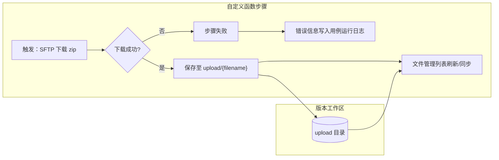

# 文档说明

> **文档类型**：需求规格说明书（SRS），即本仓库流程中的 **迭代级 PRD（交付研发与测试）**。经 **产品经理审核定稿** 后，供 **研发**（方案与实现）、**测试**（验收、用例与回归口径）、**AI**（spec-coding / 辅助实现）使用。  
> **交付物文件名**：`ATO_V1.0.1-P6-自定义函数管理-需求规格说明书.md`（`{一级需求描述}` 与迭代需求清单「一级需求」列 **自定义函数管理** 一致）。

> **《页面需求与交互规格》的定位**（`docs/prd/V1.0.1-P6/ATO_V1.0.1-P6-页面需求与交互规格.md`）：用于 **HTML 页面原型 / 线框落地**；**优化类本稿不读**（见 `docs/prd/SRS生成规则-v1.md` §2）。本一级需求 **不涉及 UI 新增页**，验收以本 SRS 与迭代清单为准。

> **本稿的定位**：承载 **一级需求「自定义函数管理」** 的完整条文；详见 **附录 E**。**文档粒度（必读）**：**一份 SRS 仅覆盖迭代清单中的一个一级需求**。

**章节引用约定**：正文中的 `## 1.1`、`§1.1.x` **仅在本文档内有效**；跨文档沟通请使用 **文件名 + REQ-ID**（示例：`ATO_V1.0.1-P6-自定义函数管理-需求规格说明书.md` + **REQ-V1.0.1-P6-001`）。

**编号约定**（正文 `##` / `###` / `####` 与清单列对应）：

- `## 1.1` — 对应迭代清单 **一级需求**：**自定义函数管理**
- `### 1.1.x {二级名}（REQ-xxx）` — 对应迭代清单 **二级需求** + 唯一 REQ（本一级需求 **三级列为 —**，采用 **方案 1**，见 `docs/prd/SRS生成规则-v1.md` §7.1）
- `#### 1.1.x.y` — **本稿不使用**（清单无三级需求列）

**需求描述结构（固定小节，勿删节）**：各功能点须依次包含 **`• **原型：**`**（在 **需求描述** 之前）、**`• **需求描述：**`** 下 **`1. 正常流程` → `2. 异常场景` → `3. 限制条件`**。无异常条目时 **保留 `2. 异常场景` 标题**，正文写 **「无」**。

**前置门禁**：**需求类型=优化**；允许生成 SRS；**不读** 页面 PRD / 原始页面设计。

**文档状态**：**待评审草稿（AI 按 SRS 规则 v1 重生成 · 2026-06-04）**

**验收基线**（版本 V1.0.1-P6）

- **迭代级权威（研发 / 测试 / AI）**：**当前迭代本 SRS（定稿后）**。业务口径、验收勾选项、与 REQ-ID 对应的条文 **以实现与测试对本 SRS 为准**。  
- **REQ 覆盖（完整性）**：本稿覆盖一级需求「自定义函数管理」在迭代清单中的 **REQ-V1.0.1-P6-001**；无推迟/合并例外。  
- **原型截图**：清单 `是否涉及UI=否` → 各 REQ 条文节 **原型：** 写 **「无」**（本稿不适用 Playwright 嵌入）。  
- **裁决规则**：当 **源码/Mock**、**历史 requirements** 与本 SRS **冲突**时：**默认以已定稿 SRS 为准** 并回写相关文档；**禁止 silent drift**。  
- **外部系统 / 接口边界**：SFTP 下载、版本 **upload 目录**、**文件管理** 列表同步以 **后台 / 版本工作区存储** 为权威；前端 **文件管理** 为可观测同步点；错误回传 **用例运行日志**。

**文档生成依据 — 优化类**（需求类型=优化）

1. **迭代需求清单**：`docs/prd/V1.0.1-P6/ATO_V1.0.1-P6-需求清单.md`（REQ-001；§2.1 页面增量 **不含** REQ-001）  
2. **页面 PRD / 原始页面设计**：**不适用**（优化类不读）  
3. **Playwright 产出**：**不适用**（REQ-001 `是否涉及UI=否`）  
4. **源码核对**：版本用例开发窗口内 **自定义函数**、**文件管理** 相关 `src/pages/`、`mocks/`（仅作可观测核对，非默认真源）  
5. **`docs/requirements/`**：已按 §4.2 检索 — 命中 `docs/requirements/版本用例开发/平台用例开发/版本用例开发-平台用例开发-自定义函数_需求文档.md`（存量 UI/函数管理；**本 REQ 为 SFTP 落盘增量**，不覆盖历史全文）

**本稿绑定（交付前填写）**：版本 **V1.0.1-P6**；一级需求 **自定义函数管理**；REQ 范围 **REQ-V1.0.1-P6-001**；路径 **`docs/prd/V1.0.1-P6/ATO_V1.0.1-P6-自定义函数管理-需求规格说明书.md`**；页面交互规格：**不适用（优化类）**；迭代清单：`docs/prd/V1.0.1-P6/ATO_V1.0.1-P6-需求清单.md`。

---

# 1 需求说明

## 1.1 自定义函数管理

### 模块概述

在 **版本用例开发** 窗口内，测试人员通过 **自定义函数** 编排用例步骤；当协议包等依赖需与 S17 等外部包版本对齐时，须先将匹配版本的 zip 通过 **SFTP 下载** 至当前版本的 **upload 目录**，供后续用例上传接口使用。本迭代 **不新增专用 UI 页**，强化 **后端/SFTP 落盘** 与 **文件管理列表可见性**。

**解决的问题**：

- S17 协议包持续更新，须先下载匹配版本协议包再上传；自定义函数执行下载后，文件须进入版本 **upload** 目录且 **文件管理** 中立即可见，避免「步骤已成功但列表无文件」的运维断层。

**目标用户**：

- 测试工程师、自动化工程师（在版本窗口内维护自定义函数与用例）。

**入口**：

- **版本用例开发（新窗口）** → **平台用例开发** → **自定义函数**（存量菜单/路由，本迭代不新增路由，清单 §2.1 不含 REQ-001）。  
- **可观测关联**：**文件管理**（同版本窗口内 upload 目录文件列表；下载成功后须 **立即可见**）。

**模块业务逻辑说明**：

**说明**：`{filename}` 为下载文件 **原名**；同路径同名 **覆盖**；不要求本迭代新增专用 UI 页展示下载进度（失败信息通过 **运行日志** 回传）。

---

### 1.1.1 自定义函数支持文件下载到 upload 目录（REQ-V1.0.1-P6-001）

• **背景与动机：**

S17 协议包持续更新，须先下载匹配版本协议包再上传；自定义函数下载后需供用例上传接口使用，且运维须在 **文件管理** 中确认文件已落盘至当前版本 **upload** 目录。

• **用户场景：**

作为测试工程师，我在自定义函数步骤中配置 SFTP 下载 zip；步骤成功后，我打开同版本的 **文件管理**，应能 **立即** 看到 `upload/{filename}` 对应条目，无需手工刷新服务器目录或等待异步索引。

• **需求类型：** 优化

• **优先级：** 中

• **输入/前置条件：**

1. 用户已进入 **某一项目版本** 的用例开发上下文（版本 ID / 工作区有效）。  
2. 自定义函数步骤已配置 SFTP 连接参数及远程 zip 路径（具体配置形态沿用存量，本迭代不新增配置页）。  
3. 版本 **upload 目录** 在存储侧可写。

• **原型：**

无

• **需求描述：**

1. **正常流程**

   1. 用例或调试运行执行至 **自定义函数** 步骤，触发 **SFTP 下载 zip**。  
   2. 下载成功后，系统将文件保存至当前版本 **upload 目录**，相对路径为 **`upload/{filename}`**（`{filename}` = 下载文件原名）。  
   3. 若目标路径已存在同名文件，执行 **覆盖** 写入。  
   4. 保存成功后，**文件管理** 列表与 upload 目录数据 **同步/刷新**，新文件 **立即可见**（不要求新增专用页面）。  
   5. 后续用例 **上传** 类步骤可引用该 upload 路径下的文件（沿用存量上传能力）。

2. **异常场景**

   a) **SFTP 下载失败**  
      i. 触发条件：连接失败、认证失败、远程文件不存在、传输中断等。  
      ii. 系统反馈：该 **步骤失败**；错误信息 **可回传** 至用例 **运行日志**（不要求本迭代新增专用 UI 页）。  
      iii. 用户指引：检查 SFTP 配置与远程路径；查看运行日志定位原因。

   b) **落盘失败**（下载成功但写入 upload 失败）  
      i. 触发条件：磁盘满、权限不足、路径非法等。  
      ii. 系统反馈：步骤失败；错误信息可回传运行日志。  
      iii. 用户指引：联系运维检查版本工作区存储。

   c) **文件管理列表未同步**（落盘成功但列表不可见）  
      i. 触发条件：列表缓存未刷新、索引延迟（视为缺陷）。  
      ii. 系统反馈：验收不通过；须修复同步机制。  
      iii. 用户指引：无（属系统一致性要求）。

3. **限制条件**

   a) **无新增 UI 页**  
      i. 影响说明：本迭代 **不** 为下载能力单独增加菜单或路由（清单 §2.1 不含 REQ-001）。  
      ii. 可观测性：通过 **文件管理** 列表 + **运行日志** 验证。

   b) **路径规则已定**  
      i. 影响说明：仅支持相对路径 **`upload/{filename}`**，不引入多级自定义子目录（除非存量已支持且与本 REQ 无冲突）。  
      ii. 扩展说明：若需子目录规则，须另立变更需求。

• **补充说明：**

- **是否涉及 UI**：否（清单列）；**文件管理** 为存量列表页，本 REQ 约束 **数据一致性**，非新页面。  
- SFTP 连接池、超时、重试次数下放 **接口/运维设计**；本 SRS 约束 **业务可见结果**：落盘路径、覆盖规则、失败可见性、列表可见。  
- 与 **用例上传** 的步骤衔接沿用 P5 及以前口径；本迭代不重新定义上传 API 字段。  
- 对照历史文档：`docs/requirements/版本用例开发/平台用例开发/版本用例开发-平台用例开发-自定义函数_需求文档.md` 描述存量函数管理 UI；**本 REQ 仅增量 SFTP→upload**，不重复展开函数列表/编辑交互。

• **验收标准：**

- [ ] 配置有效的 SFTP 下载步骤后，zip 成功落盘至 **`upload/{filename}`**（`filename` 与远程原名一致，可通过存储侧或文件管理列表核对）。  
- [ ] 同路径再次下载同名文件时，内容为 **覆盖** 后最新一次下载结果。  
- [ ] SFTP 或落盘失败时，步骤状态为 **失败**，且运行日志中 **可查到** 错误摘要（无需专用 UI 页）。  
- [ ] 下载成功后 **无需离开版本窗口**，在 **文件管理** 列表中 **立即可见** 新文件（与 upload 目录一致；禁止仅落盘不刷新列表）。  
- [ ] 本迭代 **未** 新增自定义函数或文件管理相关路由（回归：菜单与路由与改前一致）。

---

# 待评审和澄清

> 汇集 **Playwright 截图失败**、**依据不足**、**清单/页面 PRD/代码冲突**、**质量自检 P0** 等需产品或研发 **逐条裁决** 的事项。关闭后：将结论 **回写** 正文对应 REQ/§，并 **删除或清空** 本表。

| 序号 | 关联 REQ 或 § | 问题类型 | 问题描述 | 建议动作 |
|------|----------------|----------|----------|----------|
| C01 | REQ-001 | 口径缺失 | SFTP 步骤配置字段（主机、端口、路径变量等）是否完全沿用 P5 存量 schema，本清单未展开 | 确认沿用或补充字段表至接口文档 |
| C02 | REQ-001 | 技术不确定 | 「文件管理立即可见」的刷新机制：推送 / 轮询 / 步骤完成后主动 invalidate 未在清单定义 | 确认前端刷新策略或接受实现方按存量列表刷新约定 |

---

# 附录

## 变更历史

| 版本 | 日期 | 变更类型 | 变更内容 | 变更原因 | 影响范围 |
| ---- | ---- | -------- | -------- | -------- | -------- |
| V1.0.1-P6 | 2026-06-04 | 规范 | 按 SRS 规则 v1 重生成：方案 1 合并 REQ 至 `### 1.1.1（REQ-001）`、删除虚构 `####`；优化类文档生成依据；各 REQ 补 **原型：无**、**需求类型**；「待评审和澄清」节 | v1 试点 | 全文、文首 |
| V1.0.1-P6 | 2026-06-03 | 新增 | 初稿（REQ-001） | 迭代清单驱动 SRS | 自定义函数 SFTP 落盘与文件管理可见性 |

**变更类型说明**：新增 / 优化 / 修复 / 删除 / 重构 / 规范。

---

## 附录A：用户角色说明

| 角色名称 | 角色描述 | 主要权限 | 使用场景 |
| -------- | -------- | -------- | -------- |
| 测试工程师 | 维护版本用例与自定义函数 | 版本窗口内编辑用例、执行调试/运行 | 配置 SFTP 下载步骤、在文件管理核对 upload 文件 |
| 自动化工程师 | 同上 | 同上 | 协议包对齐、用例上传前置文件准备 |

---

## 附录B：术语表

| 术语 | 定义 | 业务说明 |
| ---- | ---- | -------- |
| upload 目录 | 版本工作区内相对路径根 | 本 REQ 落盘为 `upload/{filename}` |
| 自定义函数 | 用例步骤类型 | 可编排 SFTP 下载等操作 |
| 文件管理 | 平台用例开发子能力 | 展示 upload 等目录文件列表，本 REQ 要求与落盘同步可见 |
| S17 协议包 | 外部协议依赖包 | 动机来源；版本匹配由业务配置 |

---

## 附录C：参考文档

- 迭代需求清单：`docs/prd/V1.0.1-P6/ATO_V1.0.1-P6-需求清单.md`（REQ-001、§2.1、§5 约束）  
- SRS 模版：`template/需求规格说明书-模版.md`  
- SRS 黄金范例：`template/ATO_V1.0.1-P5-需求规格说明书-范例-市场缺陷分析.md`  
- SRS 生成规则：`docs/prd/SRS生成规则-v1.md`  
- 历史模块文档：`docs/requirements/版本用例开发/平台用例开发/版本用例开发-平台用例开发-自定义函数_需求文档.md`  
- 业务模块拆分：`.cursor/rules/requirements-module-split.mdc`（平台用例开发 — 含自定义函数、文件管理）

---

## 附录D：编写规范（引用黄金范例）

三级需求子功能分述、前置条件与异常分工、禁止 silent drift 等见黄金范例 **附录 D（D.1～D.6）**。本稿 **无 UI 表单/列表新增**，D.2 多子功能分述不适用。

---

## 附录E：文档粒度规范（暂行）

本文件 **仅** 覆盖一级需求 **「自定义函数管理」** 及 **REQ-V1.0.1-P6-001**。与全量库 `docs/requirements/` 的合入映射以评审为准。

---

**文档版本：** V1.0.1-P6  
**最后更新：** 2026-06-04  
**编写人：** AI（待产品审核）  
**审核人：** （待产品经理填写）
