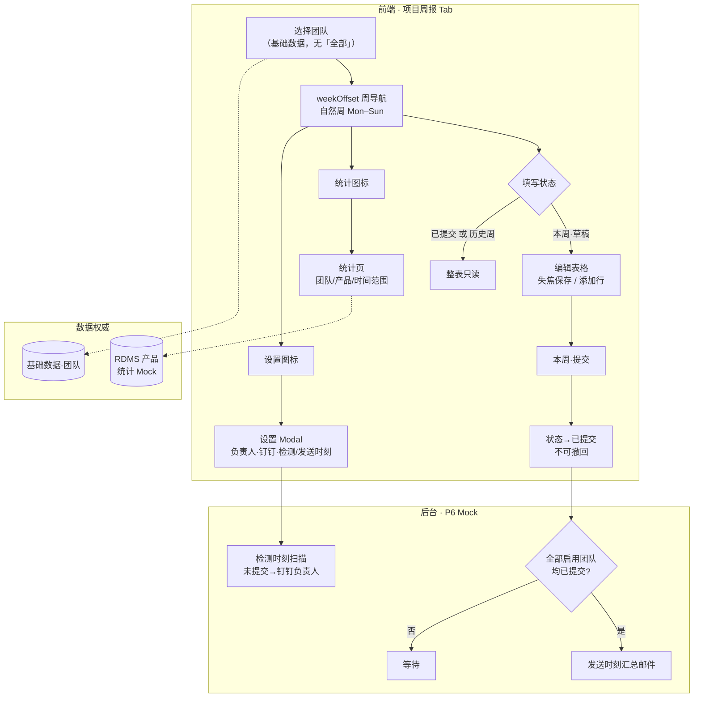
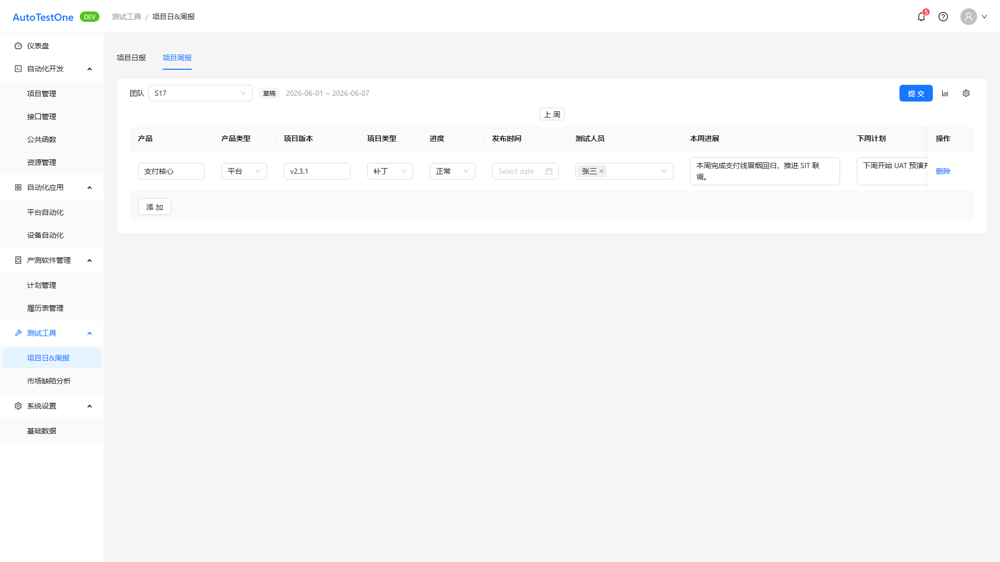
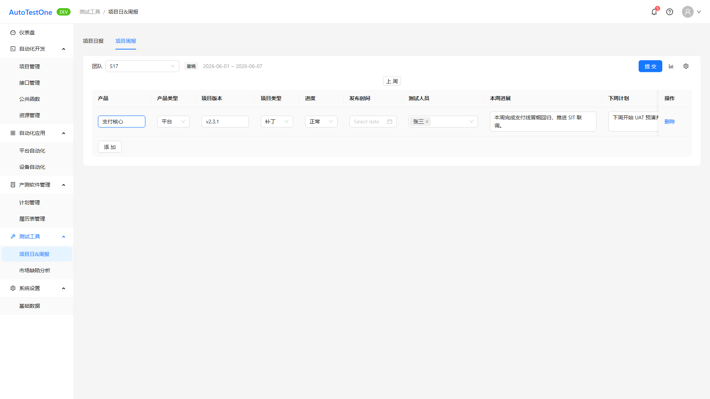
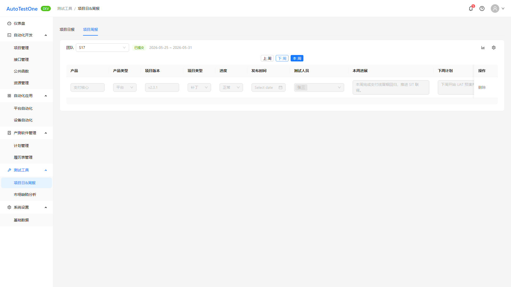
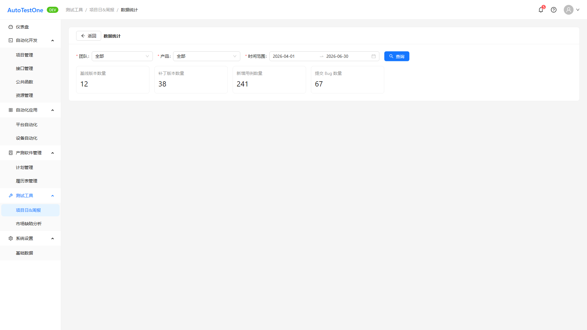

# 文档说明

> **文档类型**：需求规格说明书（SRS），即本仓库流程中的 **迭代级 PRD（交付研发与测试）**。经 **产品经理审核定稿** 后，供 **研发**（方案与实现）、**测试**（验收、用例与回归口径）、**AI**（spec-coding / 辅助实现）使用。  
> **交付物文件名**：`ATO_V1.0.1-P6-项目周报-需求规格说明书.md`（`{一级需求描述}` 与迭代需求清单「一级需求」列 **项目周报** 一致）。

> **《页面需求与交互规格》的定位**（`docs/prd/V1.0.1-P6/ATO_V1.0.1-P6-页面需求与交互规格.md`）：用于 **HTML 页面原型 / 线框落地**（§0.2、§3.1 周报 Tab、§3.3 统计）；**不是**迭代产品的唯一真源。可与本正文 **§ / REQ** 交叉对照；**研发、测试与实现验收口径以本 SRS 为准**。

> **本稿的定位**：承载 **一级需求「项目周报」** 的完整条文（REQ-V1.0.1-P6-017～025）；章节结构、编号层级与写法深度参照黄金范例 **`template/ATO_V1.0.1-P5-需求规格说明书-范例-市场缺陷分析.md`**。**文档粒度（必读）**：**一份 SRS 仅覆盖迭代清单中的一个一级需求**；本迭代「项目日报」须独立 SRS。详见 **附录 E**。

**章节引用约定**：正文中的 `## 1.1`、`§1.1.x` **仅在本文档内有效**；跨文档沟通请使用 **文件名 + REQ-ID** 或 **文件名 + §**（示例：`ATO_V1.0.1-P6-项目周报-需求规格说明书.md` + **REQ-V1.0.1-P6-018**），避免口头简称「看 1.1」在多份 SRS 并存时混淆。

**编号约定**（正文 `##` / `###` / `####` 与清单列对应）：

- `## 1.1` — 对应迭代清单 **一级需求**：**项目周报**
- `### 1.1.x {二级名}（REQ-xxx）` — 对应迭代清单 **二级需求** + 唯一 REQ（本一级需求 **三级列为 —**，采用 **方案 1**，见 `docs/prd/SRS生成规则-v1.md` §7.1）
- `#### 1.1.x.y` — **本稿不使用**（清单无三级需求列；**禁止**虚构 `####` 仅挂 REQ）

**页面聚合（本稿）**

| SRS § | REQ-ID | 页面/载体 |
|-------|--------|-----------|
| §1.1.1 | REQ-V1.0.1-P6-017 | `ProjectReportsPage` · Tab `?tab=weekly`（表尾「添加」、团队筛选、周导航） |
| §1.1.2 | REQ-V1.0.1-P6-018 | 同上（周报表格行内编辑、失焦保存） |
| §1.1.3 | REQ-V1.0.1-P6-019 | 同上（行「删除」） |
| §1.1.4 | REQ-V1.0.1-P6-020 | 同上（顶栏「提交」） |
| §1.1.5 | REQ-V1.0.1-P6-021 | **无独立 UI**（后台扫描 + 钉钉提醒；P6 经 §1.1.9 设置 Modal 配置 + Mock） |
| §1.1.6 | REQ-V1.0.1-P6-022 | **无独立 UI**（后台汇总邮件；P6 经 §1.1.9 配置发送时刻 + Mock） |
| §1.1.7 | REQ-V1.0.1-P6-023 | 同上 Tab（相对周偏移、历史周只读） |
| §1.1.8 | REQ-V1.0.1-P6-024 | `ProjectReportStatisticsPage` · `/tools/project-reports/statistics` |
| §1.1.9 | REQ-V1.0.1-P6-025 | 周报 Tab 页内 **「周报设置」Modal**（非子路由） |

**需求描述结构（固定小节，勿删节）**：各 REQ 条文节须依次包含 **`• **原型：**`**（在 **需求描述** 之前）、**`• **需求描述：**`** 下 **`1. 正常流程` → `2. 异常场景` → `3. 限制条件`**。无异常条目时 **保留 `2. 异常场景` 标题**，正文写 **「无」**。详见 **`docs/prd/SRS生成规则-v1.md`**。

**前置门禁**：**需求类型=新增**；**页面 PRD 已验收（2026-06-03）**；Playwright 截图 manifest **errors 为空**（2026-06-04；REQ-017～020、023～025 已嵌入 png）。

**文档状态**：**待评审草稿（AI 按 SRS 规则 v1 重生成 · 2026-06-04）**

**验收基线**（版本 V1.0.1-P6）

- **迭代级权威（研发 / 测试 / AI）**：**当前迭代本 SRS（定稿后）**。业务口径、验收勾选项、与 REQ-ID 对应的条文 **以实现与测试对本 SRS 为准**。  
- **REQ 覆盖（完整性）**：本稿覆盖一级需求「项目周报」在迭代清单中的 **REQ-V1.0.1-P6-017～025** 全部 9 条；无推迟/合并例外。  
- **页面交互规格（原型文档）**：`docs/prd/V1.0.1-P6/ATO_V1.0.1-P6-页面需求与交互规格.md` **已定稿（2026-06-03 验收）**；编写本 SRS 时已对照 **§0.2、§3.1、§3.3**。  
- **裁决规则**：当 **页面交互规格**、**原型代码**、**迭代清单附录 B/D/E** 与本 SRS **冲突**时：**默认以本 SRS（吸收 2026-06-03 验收稿与变更记录）为准**；清单旧条文（如周报团队含「全部」、产品 RDMS 下拉、双按钮「上周/本周」等）以 **变更记录 §5** 与 **页面 PRD §0.2** 为准，并应回写清单附录。  
- **外部系统 / 接口边界**：**团队**来自 **基础数据 → 团队管理**；统计页 **产品**来自 **RDMS**（P6 Mock）；周报 Tab **产品列**验收稿为 **文本 Input**（非 RDMS 下拉）；SMTP / 钉钉 / 汇总发送 P6 **Mock**；**禁止 silent drift**。

**文档生成依据 — 新增类**（需求类型=新增）

1. **迭代需求清单**：`docs/prd/V1.0.1-P6/ATO_V1.0.1-P6-需求清单.md`（REQ-017～025；附录 B §B.5、D、E；验收稿优先于清单 §6 旧附录冲突处）。  
2. **页面需求与交互规格（已验收）**：`docs/prd/V1.0.1-P6/ATO_V1.0.1-P6-页面需求与交互规格.md`（§0.2、§3.1、§3.3）。  
3. **Playwright 产出**：`docs/prd/V1.0.1-P6/assets/srs-screenshots/manifest.json`（REQ-017～020、023～025；errors 为空）。  
4. **验收变更记录**：`docs/prd/V1.0.1-P6/ATO_V1.0.1-P6-变更记录.md`（§5 项目周报 Tab、§6 统计、§7 后台）。  
5. **源码核对**：`src/pages/ProjectReportsPage.tsx`、`src/pages/ProjectReportStatisticsPage.tsx`、`src/types/projectReports.ts`、`src/mocks/projectReports.ts`（仅作可观测验收核对）。  
6. **`docs/requirements/`**：已按 §4.2 检索 **测试工具 / 项目日&周报 / 项目周报** — **NOT FOUND**（无历史全量文档；禁止臆造历史条文）。

**本稿绑定（交付前填写）**：版本 **V1.0.1-P6**；一级需求 **项目周报**；REQ 范围 **REQ-V1.0.1-P6-017～025**；路径 **`docs/prd/V1.0.1-P6/ATO_V1.0.1-P6-项目周报-需求规格说明书.md`**；页面交互规格：`docs/prd/V1.0.1-P6/ATO_V1.0.1-P6-页面需求与交互规格.md`（§0.2、§3.1、§3.3）；迭代清单：`docs/prd/V1.0.1-P6/ATO_V1.0.1-P6-需求清单.md`；主要实现：`ProjectReportsPage`、`ProjectReportStatisticsPage`。

---

# 1 需求说明

## 1.1 项目周报

### 模块概述

在 **测试工具 → 项目日&周报** 主入口的 **「项目周报」Tab** 中，各团队按 **自然周（周一至周日）** 维护项目维度周报行数据，支持 **草稿编辑、失焦保存、本周提交锁定**；管理员在页内 Modal 配置 **团队负责人与钉钉号、检测/发送每周时刻**；支持 **相对周偏移浏览历史周（只读）** 与 **跨团队/产品/时间范围的四项指标汇总统计**。后台在配置时刻执行 **未填钉钉提醒** 与 **全员提交后汇总邮件**（P6 为 Mock）。本 SRS **不涉及** 项目日报 Tab 的三阶段测试计划、日报生成/发送等能力（见独立 SRS「项目日报」）。

**解决的问题**：

- 多团队周报填写与汇总依赖分散表格，缺乏统一入口、提交约束与历史追溯。  
- 漏填、迟交难以自动督促；全员提交后的汇总邮件依赖人工。  
- 季度维度版本/用例/Bug 统计需人工聚合。

**目标用户**：

- 测试工程师、团队负责人（填写本团队周报、查看历史）  
- 团队负责人、管理员（数据统计、周报规则配置）

**入口**：

| 入口 | 路由/载体 |
|------|-----------|
| 项目周报 Tab | `/tools/project-reports?tab=weekly`（主框架 `ProjectReportsPage`） |
| 数据统计 | `/tools/project-reports/statistics`（`ProjectReportStatisticsPage`；自周报 Tab 右上角 **统计** 图标） |
| 周报设置 | 周报 Tab 右上角 **设置** 图标 → **页内 Modal**（**非**子路由） |
| 测试工具 Hub | `/tools` → 卡片「项目日&周报」 |

**模块业务逻辑说明**：

**说明**：

- **自然周**：`weekKey` 由当前日期 + `weekOffset`（`0`=本周，负数=历史周）计算 **周一至周日**，顶栏展示 `YYYY-MM-DD ~ YYYY-MM-DD`。  
- **可编辑性**：以 **`weeklyStatus === 'draft'`** 且 **非历史周已发布** 为准；P6 Mock 对 **早于本周** 的自然周强制 **`submitted`** → 只读（见 §1.1.7）。  
- **产品列**：验收稿为 **文本 Input**（清单 B.5 原定 RDMS 下拉，以变更记录为准）。  
- **REQ-021/022**：无独立页面；配置写入 **周报设置 Modal**，扫描/发送 **Mock**。

---

### 1.1.1 添加项目周报数据（REQ-V1.0.1-P6-017）

• **背景与动机：**

各团队需在统一表格中维护多条项目周报行，支持在表尾追加空行并录入默认值，解决周报填写分散、汇总困难的痛点。

• **用户场景：**

作为测试工程师，我在 **本周、本团队、草稿** 态下点击表尾 **「添加」**，表格增加一行空记录，随后填写各列并通过失焦保存持久化（见 REQ-018）。

• **需求类型：** 新增

• **优先级：** 低

• **输入/前置条件：**

1. 用户已登录主框架。  
2. 当前位于 **`/tools/project-reports?tab=weekly`**。  
3. 已选择 **团队**（基础数据启用团队，**无「全部」**；Select 前缀文案 **「团队」**）。  
4. 当前自然周 **`weeklyStatus === 'draft'`** 且 **`weekOffset === 0`（本周）** 或等价未发布周（非历史周 Mock 已提交态）。  
5. 表格处于可编辑态（非 REQ-023 历史周只读）。

• **原型：**

• **需求描述：**

1. **正常流程**

   1. 进入周报 Tab 后，系统按 **`teamId` + 自然周 `weekKey`** 加载行列表与 **草稿/已提交** 状态（`GET .../weekly-rows?team&week`）。  
   2. 顶栏 **两行布局**（验收稿）：  
      - **行 1**：团队 Select | 状态 Tag（草稿/已提交）| 周起止日期 |（本周草稿时）**提交** | **统计** 图标 | **设置** 图标  
      - **行 2（居中）**：周偏移导航（见 REQ-023）  
   3. 当表格可编辑时，表尾展示 **「添加」** 按钮。  
   4. 用户点击 **「添加」** → 表尾插入 **一行空记录**（`addWeeklyRow`）。  
   5. **添加行默认值**（附录 B.5 + 验收实现）：

      | 字段 | 默认值 |
      |------|--------|
      | 产品（`productName`） | 空（**文本 Input**，用户手输） |
      | 产品类型（`productType`） | `平台` |
      | 项目版本（`projectVersion`） | 空 |
      | 项目类型（`projectType`） | `补丁` |
      | 进度（`progress`） | `正常` |
      | 发布时间（`publishedAt`） | 空 |
      | 测试人员（`testerIds`） | `[]` |
      | 本周进展（`weeklyProgress`） | 空 |
      | 下周计划（`nextWeekPlan`） | 空 |
      | 备注（`remark`） | 空 |

   6. 新行插入后用户编辑各列，变更触发保存（见 REQ-018）。  
   7. **团队切换**：更换团队时 **`weekOffset` 重置为 `0`** 并重新拉取；默认团队为当前用户所属 **第一个** 团队（`mockCurrentUserTeamIds[0]`）。

2. **异常场景**

   a) **已提交或历史周只读时**  
      i. 触发条件：`weeklyStatus === 'submitted'` 或历史自然周（P6 Mock `isPastWeek`）。  
      ii. 系统反馈：**不展示** 表尾「添加」；API 拒绝时 Toast（如「已提交不可添加」）。  
      iii. 用户指引：仅在 **本周草稿** 可增行。

   b) **加载失败**  
      i. 触发条件：列表接口/Mock 异常。  
      ii. 系统反馈：`message.error`；表格结束 `loading`。  
      iii. 用户指引：刷新或联系管理员。

3. **限制条件**

   a) **无「全部」团队汇总**  
      i. 影响说明：验收 **移除** 清单初稿「选全部时只读汇总」；团队下拉 **仅** 基础数据启用团队，**不得** 含「全部」（变更记录 §5）。  

   b) **产品列非 RDMS 下拉（P6）**  
      i. 影响说明：B.5 原定 RDMS Select；验收为 **文本 Input**。生产对接 RDMS 须单独立变更。

• **补充说明：**

- 与 REQ-018～020、023 共用 `ProjectReportsPage` 周报表格载体。  
- 主 REQ（清单 §2.3）：字段/状态/邮件细则见附录 B §B.5、附录 D。

• **验收标准：**

- [ ] 路由 `/tools/project-reports?tab=weekly` 可进入；团队下拉 **无「全部」**，前缀 **「团队」**，数据来自基础数据团队。  
- [ ] **本周草稿** 态表尾有 **「添加」**，点击后新增一行且默认值符合上表。  
- [ ] **已提交** 或 **历史自然周** 态 **无**「添加」，且 API 不可增行。  
- [ ] 切换团队后 `weekOffset` 回到 **0** 并刷新该团队数据。

---

### 1.1.2 周报信息编辑（REQ-V1.0.1-P6-018）

• **背景与动机：**

周报以 **宽表** 承载多项目行，需支持快速录入与即时持久化；提交后整表锁定，避免归档数据被篡改（与 REQ-017 同源：周报填写与汇总痛点）。

• **用户场景：**

作为测试工程师，我在 **草稿** 态表格中修改单元格，控件 **失焦** 或 **值变更** 后数据自动保存；**已提交** 或 **历史周** 时整表不可再改。

• **需求类型：** 新增

• **优先级：** 低

• **输入/前置条件：**

1. 当前 **团队 + 自然周** 数据已加载。  
2. `weeklyStatus === 'draft'` 且当前周 **未** 处于历史周 Mock **已提交** 只读态（见 §1.1.7）。

• **原型：**

• **需求描述：**

1. **正常流程**

   1. 表格展示下列 **可编辑列**（列名即字段名）：

      | 列名 | 字段 | 控件 | 必填（提交前，附录 B.5） | 最大长度/枚举 |
      |------|------|------|--------------------------|---------------|
      | 产品 | `productName` | **文本 Input** | 是 | — |
      | 产品类型 | `productType` | Select | 是 | `平台` / `设备` |
      | 项目版本 | `projectVersion` | 文本 Input | 是 | 64 |
      | 项目类型 | `projectType` | Select | 是 | `补丁` / `基线` |
      | 进度 | `progress` | Select | 是 | `正常` / `已发布` / `延期` |
      | 发布时间 | `publishedAt` | DatePicker | 否 | — |
      | 测试人员 | `testerIds` | Select **多选** | 是（≥1 人） | 用户列表 |
      | 本周进展 | `weeklyProgress` | TextArea | 是 | 2000 |
      | 下周计划 | `nextWeekPlan` | TextArea | 是 | 2000 |
      | 备注事项 | `remark` | TextArea | 否 | 1000 |

   2. **保存时机**：单元格 **失焦（blur）** 或 Select/DatePicker **onChange** 后，若值相对上次有变化，调用行级保存（`PATCH .../weekly-rows/:id` / `patchWeeklyRow`）；成功 `message.success`（如「已保存（Mock）」）。  
   3. **交互形态（验收稿）**：行内控件 **常显**（非「双击进入编辑」）；与清单「双击单元格」表述差异时，以 **失焦保存** 为验收口径（见待评审 C06）。  
   4. `weeklyStatus === 'submitted'` 或历史周已发布时，**所有列 disabled**，保存接口返回「已提交不可编辑」。  
   5. 顶栏状态 Tag：**草稿**（灰）/ **已提交**（绿）。

2. **异常场景**

   a) **已提交后尝试编辑**  
      i. 触发条件：只读态操作或 `patchWeeklyRow` 拒绝。  
      ii. 系统反馈：控件 disabled；`message.error`（如「已提交不可编辑」）。  
      iii. 用户指引：提交后不可修改（**不支持撤回**，REQ-020）。

   b) **字段校验失败**  
      i. 触发条件：超长、非法枚举等。  
      ii. 系统反馈：清单约定 **单元格标红 + Tooltip**（P6 可部分实现）；**提交前** 须阻断（REQ-020）。  
      iii. 用户指引：修正后保存。

3. **限制条件**

   a) **提交后整表锁定**  
      i. 影响说明：附录 D.2 — 已提交 **禁止** 编辑表格。  

   b) **历史自然周**  
      i. 影响说明：P6 Mock 对早于本周的 `weekKey` 强制 `submitted` → 只读（REQ-023）。

• **补充说明：**

- 类型 `WeeklyReportRow` 见 `src/types/projectReports.ts`。  
- `testerIds` 存用户 id 数组，展示为用户名多选。

• **验收标准：**

- [ ] 草稿态各列可编辑，失焦/变更后持久化，刷新后仍保留。  
- [ ] 已提交态全表 disabled，无法保存变更。  
- [ ] 测试人员多选，提交校验要求 **≥1** 人（与 REQ-020 联动）。  
- [ ] 枚举与长度限制与上表一致。

---

### 1.1.3 周报信息删除（REQ-V1.0.1-P6-019）

• **背景与动机：**

草稿态允许删除误增行；已提交数据不可删，保证归档可信（与 REQ-017 同源：周报填写与汇总痛点）。

• **用户场景：**

作为测试工程师，我在 **草稿** 态点击行末 **「删除」**，二次确认后移除该行。

• **需求类型：** 新增

• **优先级：** 低

• **输入/前置条件：**

1. 当前周 **`weeklyStatus === 'draft'`** 且非历史周只读。  
2. 目标行存在于当前团队+周列表中。

• **原型：**

• **需求描述：**

1. **正常流程**

   1. 操作列（表格右侧）展示 **「删除」** 链接/按钮。  
   2. 用户点击 → `Modal.confirm`，文案 **「此操作不可恢复，是否继续？」**（通用二次确认，与 REQ-016 日报删除一致）。  
   3. 用户确认 → `deleteWeeklyRow`，成功后刷新列表并 Toast 成功。

2. **异常场景**

   a) **已提交态删除**  
      i. 触发条件：`weeklyStatus === 'submitted'` 或历史周已发布。  
      ii. 系统反馈：删除 **禁用**（`pointer-events: none` 或隐藏）；API 提示「已提交不可删除」。  
      iii. 用户指引：**任何人（含管理员）** 均不可删已提交行（清单已定）。

   b) **用户取消确认**  
      i. 触发条件：点击取消。  
      ii. 系统反馈：关闭弹窗，无变更。  
      iii. 用户指引：无。

3. **限制条件**

   a) **已提交不可删（含管理员）**  
      i. 影响说明：附录 D.2 状态×操作矩阵。

• **补充说明：**

无

• **验收标准：**

- [ ] 草稿态删除需二次确认，确认后行消失。  
- [ ] 已提交态无法删除（UI + API）。  
- [ ] 历史周只读态同已提交，不可删除。

---

### 1.1.4 周报信息提交（REQ-V1.0.1-P6-020）

• **背景与动机：**

团队完成填写后需一次性 **提交** 锁定本周数据，作为汇总邮件（REQ-022）与统计的前置条件（与 REQ-017 同源：周报填写与汇总痛点）。

• **用户场景：**

作为测试工程师，我在 **本周草稿** 态填完必填项后点击顶栏 **「提交」**，状态变为 **已提交** 且不可再改、不可撤回。

• **需求类型：** 新增

• **优先级：** 低

• **输入/前置条件：**

1. **`weekOffset === 0`**（当前自然周 / 本周）。  
2. **`weeklyStatus === 'draft'`**。  
3. 表格行数据已加载（零行是否允许提交见待评审 C02）。

• **原型：**

• **需求描述：**

1. **正常流程**

   1. 顶栏在 **本周且草稿** 时展示主按钮 **「提交」**（`type="primary"`）。  
   2. 用户点击 **「提交」** 前，系统校验 **当前团队本周所有行**（验收稿与实现对齐）：

      | 校验项 | 规则 |
      |--------|------|
      | 产品 | `productName` 去空格后非空 |
      | 项目版本 | `projectVersion` 去空格后非空 |
      | 测试人员 | `testerIds.length >= 1` |
      | 本周进展 | `weeklyProgress` 去空格后非空 |
      | 下周计划 | `nextWeekPlan` 去空格后非空 |

   3. 校验失败 → `message.error`（如「请先补齐周报必填项后再提交」），**阻断**提交。  
   4. 校验通过 → `submitWeekly` → **`weeklyStatus`：草稿 → 已提交**；Toast 提示已提交且 **不可撤回**；刷新后隐藏 **「提交」「添加」**，表格只读，删除禁用。  
   5. **不支持撤回**：提交后 **不提供**「撤回」；不可改回草稿（清单已定，除非另立变更需求）。

2. **异常场景**

   a) **非本周或已提交**  
      i. 触发条件：`weekOffset !== 0` 或 `submitted`。  
      ii. 系统反馈：**不展示**「提交」。  
      iii. 用户指引：仅 **本周草稿** 可提交。

   b) **提交接口失败**  
      i. 触发条件：网络/服务端错误。  
      ii. 系统反馈：错误 Toast，状态保持草稿。  
      iii. 用户指引：重试。

3. **限制条件**

   a) **清单 B.5 全量必填 vs 验收校验子集**  
      i. 影响说明：清单要求提交前 **B.5 全部必填列**（含产品类型、项目类型、进度等）；验收原型仅校验上表 5 项。定稿前由产品裁决（待评审 C01，**P0**）。  

   b) **提交后不可改回草稿**  
      i. 影响说明：无撤回；已提交行不可删（REQ-019）、不可编（REQ-018）。

• **补充说明：**

- 附录 D.2：草稿可提交；已提交禁止提交/编辑/删行。

• **验收标准：**

- [ ] 仅 **本周 + 草稿** 显示「提交」。  
- [ ] 任一行缺验收必填项时提交被阻断并提示。  
- [ ] 提交成功后 Tag 为 **已提交**，无「添加」，表格只读。  
- [ ] 提交后 **无** 撤回入口。

---

### 1.1.5 未填提醒（REQ-V1.0.1-P6-021）

• **背景与动机：**

降低团队漏填周报概率，在配置时刻自动向负责人发送 **钉钉** 提醒（与 REQ-017 同源：周报填写与汇总痛点）。

• **用户场景：**

作为团队周报负责人，若本团队 **当前自然周尚无已提交记录**，在 **周报收集检测时间** 触发时收到钉钉提醒（P6 Mock）。

• **需求类型：** 新增

• **优先级：** 低

• **输入/前置条件：**

1. 管理员已在 **周报设置 Modal**（REQ-025）配置 **团队↔负责人↔钉钉号** 及 **周报收集检测时间**。  
2. 后台调度已启用（生产）；P6 为 Mock 日志/占位。

• **原型：**

无

• **需求描述：**

1. **正常流程**

   1. 系统按 **附录 D + REQ-025** 配置的 **检测时刻**（**每周星期几 + HH:mm:ss**）触发扫描。  
   2. 扫描范围：**基础数据启用的全部团队**（与设置 `teamLeads` 中团队集合一致）。  
   3. **「未提交」定义**：该团队 **当前自然周** 无 **「已提交」** 记录（`weeklyStatus !== 'submitted'` 或等价后端判定）。  
   4. 对未提交团队 → 向配置的 **周报负责人钉钉号** 发送通知（P6：**Mock**，不对接真实钉钉 API）。  
   5. 前端 **无** 独立菜单页；配置入口仅 **设置 Modal → 周报收集检测时间**。

2. **异常场景**

   a) **钉钉发送失败**  
      i. 触发条件：生产接口失败。  
      ii. 系统反馈：任务失败日志/告警；P6 可 Mock 失败摘要。  
      iii. 用户指引：检查钉钉号与集成服务。

   b) **负责人/钉钉号未配置**  
      i. 触发条件：团队未在 `teamLeads` 中。  
      ii. 系统反馈：跳过该团队或记录配置缺失。  
      iii. 用户指引：管理员补全 **周报设置**。

3. **限制条件**

   a) **P6 不对接真实钉钉**  
      i. 影响说明：清单 §2.4；验收以配置持久化 + Mock 触发记录为准。

• **补充说明：**

- 与 REQ-025 字段 `collectionCheck: { weekday, time }` 绑定。  
- P6 实现状态：**部分实现**（设置可配；扫描 Mock）。

• **验收标准：**

- [ ] 设置 Modal 可配置 **周报收集检测时间**（星期 + `HH:mm:ss`）并保存。  
- [ ] 文档/接口说明「未提交」判定与扫描范围。  
- [ ] P6 不要求真实钉钉送达；须有 Mock 触发记录或开发说明。

---

### 1.1.6 周报汇总定时发送（REQ-V1.0.1-P6-022）

• **背景与动机：**

当 **全部启用团队** 均完成本周提交后，在统一 **发送时刻** 自动汇总并发送邮件，减少人工汇总（与 REQ-017 同源：周报填写与汇总痛点）。

• **用户场景：**

作为 **固定邮件组** 收件人（附录 C），当全部团队本周均已提交后，在 **周报定期发送时间** 收到汇总邮件（P6 Mock）。

• **需求类型：** 新增

• **优先级：** 低

• **输入/前置条件：**

1. **周报定期发送时间** 已在 REQ-025 配置。  
2. 基础数据 **全部启用团队** 本周均为 **已提交**。

• **原型：**

无

• **需求描述：**

1. **正常流程**

   1. 系统在 **发送时刻**（**每周星期几 + HH:mm:ss**）检查提交完成情况。  
   2. 若 **全部团队**（基础数据启用团队，与设置团队集合一致）均已 **已提交** → 生成汇总内容并 **发送邮件**至 **固定邮件组**（附录 C；P6 **Mock** 成功/失败记录）。  
   3. 若仍有团队未提交 → **不发送**（可记录跳过原因）。  
   4. 前端 **无** 发送记录页；配置入口为 **设置 Modal → 周报定期发送时间**。

2. **异常场景**

   a) **邮件发送失败**  
      i. 触发条件：SMTP 不可用。  
      ii. 系统反馈：任务失败日志；P6 Mock 可返回失败摘要。  
      iii. 用户指引：联系运维。

   b) **部分团队未提交**  
      i. 触发条件：未满足「全部已提交」。  
      ii. 系统反馈：不发送汇总邮件。  
      iii. 用户指引：结合 REQ-021 催促。

3. **限制条件**

   a) **P6 Mock 邮件**  
      i. 影响说明：不对接真实 SMTP。  

   b) **验收稿设置 Modal 不含邮件组 UI**  
      i. 影响说明：汇总 **收件人** 仍为附录 C「固定邮件组」，由后台或后续迭代维护（待评审 C07）。

• **补充说明：**

- 与 REQ-025 `scheduledSend: { weekday, time }` 绑定。  
- P6：**部分实现**（设置可配；发送 Mock）。

• **验收标准：**

- [ ] 设置 Modal 可配置 **周报定期发送时间** 并保存。  
- [ ] 文档明确「全部团队已提交」才发送的前置条件。  
- [ ] P6 Mock 发送记录或等价验收说明。

---

### 1.1.7 历史周报预览（REQ-V1.0.1-P6-023）

• **背景与动机：**

支持查看往周归档周报，只读浏览，不可再次提交或增删，便于复盘与对账（与 REQ-017 同源：周报填写与汇总痛点）。

• **用户场景：**

作为团队负责人，我通过 **相对周偏移** 查看上一自然周及更早历史；在历史周 **只读** 浏览后，用 **「本周」** 一键回到当前周。

• **需求类型：** 新增

• **优先级：** 低

• **输入/前置条件：**

1. 已选择团队。  
2. 用户通过顶栏 **周偏移导航** 调整 `weekOffset`（`0`=本周，`-1`=上一自然周，以此类推；**不可** `>0` 进入未来周）。

• **原型：**

• **需求描述：**

1. **正常流程**

   1. **自然周定义**：每一视图对应 **周一至周日** 的一个自然周；顶栏展示起止日期。  
   2. **周切换按钮**（`weekOffset`）：

      | 视图 | 展示按钮 |
      |------|----------|
      | 本周（`weekOffset === 0`） | 仅 **「上周」**（`weekOffset - 1`） |
      | 历史周（`weekOffset < 0`） | **「上周」**、**「下周」**（`+1`，上限 0）、**「本周」**（主按钮样式，`weekOffset → 0`） |

   3. 点击 **「上周」** → `weekOffset - 1`；**「下周」** → `weekOffset + 1`（不超过 0）。  
   4. **历史自然周（P6 Mock）**：对 **早于本周** 的 `weekKey`，服务端/Mock 将 `weeklyStatus` 视为 **`submitted`** → UI **只读**：隐藏 **「提交」「添加」**；表格 disabled；不可删行。  
   5. **本周**：状态由业务数据决定 — **`draft`** 可编辑、可提交、可增删行；**`submitted`** 只读。  
   6. 清单「上周 = 上一自然周」与本实现 **一致**（偏移 -1）。  
   7. 切换 **团队** 时 **`weekOffset` 重置为 0** 并重新加载。

2. **异常场景**

   a) **切换团队**  
      i. 触发条件：更换团队 Select。  
      ii. 系统反馈：`weekOffset → 0`。  
      iii. 用户指引：避免跨团队仍停留在历史周。

3. **限制条件**

   a) **历史周不可编辑**  
      i. 影响说明：P6 Mock 对 `isPastWeek(week)` 强制已提交；与「本周草稿可编辑」通过 **状态 + 周偏移** 联动区分（页面 PRD §0.2）。

• **补充说明：**

- 与 REQ-017～020 共用表格；只读时操作列删除禁用。

• **验收标准：**

- [ ] 默认 **本周**，周切换区 **仅「上周」**。  
- [ ] 历史周显示 **「上周」「下周」「本周」**；「本周」回到 `weekOffset=0`。  
- [ ] 历史周表格只读，无提交/添加；Mock 状态为已提交。  
- [ ] 本周草稿可编辑；本周已提交只读。

---

### 1.1.8 项目数据汇总统计（REQ-V1.0.1-P6-024）

• **背景与动机：**

按团队、产品、时间范围聚合 **基线/补丁版本、新增用例、提交 Bug** 四类指标，支撑季度复盘，降低人工统计成本（清单动机：历史周报汇总、季度统计人工成本高）。

• **用户场景：**

作为团队负责人或管理员，我从周报 Tab 点击 **统计** 图标进入统计页，使用默认 **最近一个自然季度** 查看四项指标，并可调整筛选后查询。

• **需求类型：** 新增

• **优先级：** 低

• **输入/前置条件：**

1. 用户可访问 **`/tools/project-reports/statistics`**（主框架）。  
2. 入口：周报 Tab 右上角 **统计** 图标（验收稿 **常显**）。

• **原型：**

• **需求描述：**

1. **正常流程**

   1. **路由**：`/tools/project-reports/statistics`；面包屑：**测试工具 / 项目日&周报 / 数据统计**。  
   2. 页头 **返回** → `/tools/project-reports?tab=weekly`。  
   3. **筛选区**（均为必填）：

      | 字段 | 控件 | 数据来源 | 默认值 | 说明 |
      |------|------|----------|--------|------|
      | 团队 | Select | 基础数据团队 | **`全部`** | 含 **「全部」**；选全部时按 **全部团队聚合**（附录 E.1） |
      | 产品 | Select | **RDMS**（P6 Mock） | **`全部`** | 含 **「全部」** |
      | 时间范围 | RangePicker | 用户选择 | **最近一个自然季度**（按当前日所在季度起止日预填） | 闭区间 `[开始, 结束]` |

   4. **进入页行为**：预填默认筛选并 **自动发起一次查询**；查询中 `loading`。  
   5. 用户修改筛选后点击 **「查询」** → 再次请求聚合。  
   6. **结果区**：同一次查询 **同时展示 4 项指标**（`Statistic` / Card，不分页）：

      | 指标名称 | 字段（Mock） | 口径说明（P6 可 Mock） |
      |----------|--------------|------------------------|
      | 基线版本数量 | `baselineVersionCount` | 维度与时间范围内 **基线类** 项目版本计数 |
      | 补丁版本数量 | `patchVersionCount` | **补丁类** 项目版本计数 |
      | 新增用例数量 | `newCaseCount` | 时间范围内 **新增** 用例条数 |
      | 提交 Bug 数量 | `submittedBugCount` | 时间范围内 **提交** 的缺陷/Bug 条数 |

   7. **无数据**：`Empty` 或 `message.info('无统计数据')`；有数据则四卡同屏。

2. **异常场景**

   a) **查询失败**  
      i. 触发条件：接口/Mock 异常。  
      ii. 系统反馈：`message.error`；结束 loading。  
      iii. 用户指引：重试。

   b) **必填未选**  
      i. 触发条件：Form 校验失败。  
      ii. 系统反馈：字段/Toast 提示。  
      iii. 用户指引：补全团队、产品、时间范围。

3. **限制条件**

   a) **P6 Mock 聚合**  
      i. 影响说明：指标数值可固定 Mock；统计口径与 API 映射下放实现（附录 E.4）。  

   b) **图表/导出**  
      i. 影响说明：附录 E.4 可下放 — P6 **不强制** 图表与 Excel。  

   c) **权限**  
      i. 影响说明：附录 D.3 — 统计面向 **团队负责人、管理员**；验收 **统计图标常显**（细粒度鉴权见待评审 C03）。

   d) **与周报 Tab 团队筛选差异**  
      i. 影响说明：周报 Tab **无「全部」**；统计页团队 **允许「全部」**（附录 E.1 已定）。

• **补充说明：**

- 类型 `StatisticsMetrics` 见 `src/types/projectReports.ts`。

• **验收标准：**

- [ ] 周报 Tab **统计** 图标 **常显**，点击进入统计路由。  
- [ ] 进入后默认 **最近自然季度** 且 **自动查询** 一次，展示 4 项指标。  
- [ ] 团队/产品/时间范围必填；均含 **「全部」**。  
- [ ] 查询可刷新；无数据有空态。  
- [ ] **返回** 回到 `?tab=weekly`。

---

### 1.1.9 周报基础信息设置（管理员）（REQ-V1.0.1-P6-025）

• **背景与动机：**

集中维护 **团队负责人与钉钉号**、**未填检测** 与 **汇总发送** 每周时刻，支撑 REQ-021/022 后台任务（与 REQ-017 同源：周报填写与汇总痛点）。

• **用户场景：**

作为管理员，我在周报 Tab 点击 **设置** 图标，在 Modal 中维护各团队负责人及两项每周定时配置并保存。

• **需求类型：** 新增

• **优先级：** 低

• **输入/前置条件：**

1. 周报 Tab 已加载。  
2. 清单附录 D.3：**管理员** 可执行设置（验收稿 **设置图标常显**；保存鉴权见待评审 C04）。

• **原型：**

• **需求描述：**

1. **正常流程**

   1. 点击 **设置** 图标（与 **统计** 同排，验收 **常显**）→ 打开 Modal，标题 **「周报设置」**；`maskClosable={false}`；建议宽度约 800px。  
   2. **团队及责任人配置**（`Form.List` · `teamLeads`）：

      | 列 | 字段 | 控件 | 必填 |
      |----|------|------|------|
      | 团队 | `teamId` | Select（基础数据团队） | 是 |
      | 负责人 | `leaderId` | Select（用户列表） | 是 |
      | 钉钉号 | `dingTalkId` | Input | 是 |

      - 支持 **添加一行** / 删除行（至少保留 1 行）。  
      - **团队不可重复**：同一 `teamId` 不得出现两次；失败提示 **「团队不能重复配置」**。  
      - 行内团队下拉：**过滤** 已被其它行选中的团队（当前行已选仍可选）。

   3. **时间配置**（均为 **每周星期几 + HH:mm:ss**）：

      | 配置项 | 字段 | 控件 |
      |--------|------|------|
      | 周报收集检测时间 | `collectionCheck.weekday` + `collectionCheck.time` | 星期 Select（`1=周一` … `7=周日`）+ `TimePicker` |
      | 周报定期发送时间 | `scheduledSend.weekday` + `scheduledSend.time` | 同上 |

   4. 点击 **保存** → 校验通过 → `saveWeeklySettings` → 成功 Toast 并关闭 Modal。  
   5. **不包含**（验收稿）：汇总邮件 **收件人/邮件组** UI（附录 C 仍为 **固定邮件组**，后台或后续迭代）。

2. **异常场景**

   a) **团队重复**  
      i. 触发条件：两行相同 `teamId`。  
      ii. 系统反馈：`message.error('团队不能重复配置')`。  
      iii. 用户指引：修改团队选择。

   b) **必填未填**  
      i. 触发条件：Form 校验失败。  
      ii. 系统反馈：字段级错误。  
      iii. 用户指引：补全团队/负责人/钉钉号/时间。

   c) **非管理员保存（若启用权限）**  
      i. 触发条件：角色无权限。  
      ii. 系统反馈：禁用保存或隐藏入口（产品择一）。  
      iii. 用户指引：联系管理员。

3. **限制条件**

   a) **非子路由**  
      i. 影响说明：设置 **不得** 占用独立路由；仅 Modal。  

   b) **与 REQ-021/022**  
      i. 影响说明：本 Modal 为 P6 **唯一** 可观测后台任务配置入口。

• **补充说明：**

- 数据结构 `WeeklySettings` 见页面 PRD §4.3、`src/mocks/projectReports.ts`。  
- 打开时 `getWeeklySettings` 回填；无团队行时默认 1 行空表单。

• **验收标准：**

- [ ] **设置** 图标 **常显**，打开 Modal 可编辑团队/负责人/钉钉号列表。  
- [ ] 团队重复时保存阻断并提示。  
- [ ] 两项时间均为 **星期 + HH:mm:ss**，保存后回显。  
- [ ] 添加行数不超过基础数据团队总数。  
- [ ] Modal 非独立路由；`maskClosable={false}`。

---

# 待评审和澄清

> 汇集 **Playwright 截图失败**、**依据不足**、**清单/页面 PRD/代码冲突**、**质量自检 P0** 等需产品或研发 **逐条裁决** 的事项。关闭后：将结论 **回写** 正文对应 REQ/§，并 **删除或清空** 本表。

| 序号 | 关联 REQ 或 § | 问题类型 | 问题描述 | 建议动作 | 优先级 |
|------|----------------|----------|----------|----------|--------|
| C01 | REQ-020 / B.5 | 口径差异 | 清单要求提交前校验 **B.5 全部必填列**；验收仅校验 **产品名、版本、测试人员≥1、进展、计划** | 确认定稿校验范围；扩展则更新原型与用例 | **P0** |
| C02 | REQ-020 | 边界 | **零行**数据时是否允许点击「提交」 | 确认允许空提交或要求至少一行 | P1 |
| C03 | REQ-024 / D.3 | 权限 | 附录 D.3 限定团队负责人/管理员可统计；验收 **统计图标常显** | 确认 UI 常显 + 接口鉴权策略 | P1 |
| C04 | REQ-025 / D.3 | 权限 | 清单 D.3 仅 **管理员** 可设置；验收 **设置图标常显** 且原型未鉴权 | 确认保存是否限制管理员 | P1 |
| C05 | REQ-017 / B.5 | 口径差异 | B.5 产品列为 **RDMS 下拉**；验收为 **文本 Input** | 确认 P6 维持文本或改 RDMS | P1 |
| C06 | REQ-018 | 交互 | 清单写 **双击** 编辑；验收为 **行内控件 + 失焦保存** | 确认以失焦保存为验收口径并回写清单 | P1 |
| C07 | REQ-022 / C | 配置缺失 | 汇总 **固定邮件组** 无设置 Modal 字段 | 确认后台配置或后续 UI | P1 |
| C08 | 模块概述 | 历史文档 | `docs/requirements/` **NOT FOUND** 项目周报模块 | 定稿后是否合入全量库 | P1 |
| C09 | REQ-021/022 | 验收 | 后台扫描/发送仅 Mock，无生产验收标准 | 补充接口契约或 P6 以配置+日志为准 | P1 |

---

# 附录

## 变更历史

| 版本 | 日期 | 变更类型 | 变更内容 | 变更原因 | 影响范围 |
|------|------|----------|----------|----------|----------|
| V1.0.1-P6 | 2026-06-04 | 规范 | 按 SRS 规则 v1 **§7.1 方案 1** 重生成：REQ 条文全部置于 `### 1.1.x（REQ-xxx）`；补全 **原型** 嵌入；文首 **页面聚合** 表；**待评审和澄清** 更名与 P0 标注；吸收 2026-06-03 验收变更 | 用户指令 + 清单/提示词对齐 | 全文结构、REQ-017～025 |
| V1.0.1-P6 | 2026-06-03 | 新增 | 初稿（REQ-017～025） | 迭代清单 + 原型验收 | 项目周报 Tab、统计、设置、后台 Mock |

**变更类型说明**：新增 / 优化 / 修复 / 删除 / 重构 / 规范。

---

## 附录A：用户角色说明

| 角色名称 | 角色描述 | 主要权限 | 使用场景 |
| -------- | -------- | -------- | -------- |
| 普通成员 | 测试工程师等 | 填写 **本团队** 周报行；查看历史周只读 | 周报表格编辑、提交（本周草稿） |
| 团队负责人 | 团队管理责任人 | 填写本团队周报；**统计**（附录 D.3） | 汇总查看、督促填写 |
| 管理员 | 系统配置人员 | 周报 **设置** Modal；统计 | 配置检测/发送时刻、团队负责人与钉钉号 |

> **说明**：附录 D.3 为骨架矩阵；**2026-06-03 验收** 对 **统计/设置图标常显** 有调整，以 **# 待评审和澄清** C03/C04 为准直至产品定稿。

---

## 附录B：术语表

| 术语 | 定义 | 业务说明 |
| ------ | ---- | -------- |
| 自然周 | 周一至周日 | `weekKey` / `weekOffset` 对齐 |
| weekOffset | 相对本周偏移 | `0` 本周，`-1` 上周 |
| 草稿 / 已提交 | 周报填写状态 | 草稿可编辑；已提交整表锁定 |
| 未提交（021） | 团队当周无已提交记录 | 用于钉钉提醒扫描 |
| 固定邮件组 | 汇总邮件收件人 | 附录 C；P6 无 Modal 配置 |
| RDMS | 第三方产品系统 | **统计页**产品下拉；周报 Tab 产品列 P6 为文本 |

---

## 附录C：参考文档

- **本迭代绑定**  
  - 页面需求与交互规格（已验收）：`docs/prd/V1.0.1-P6/ATO_V1.0.1-P6-页面需求与交互规格.md`（§0.2、§3.1、§3.3）  
  - 迭代需求清单：`docs/prd/V1.0.1-P6/ATO_V1.0.1-P6-需求清单.md`  
  - 变更记录：`docs/prd/V1.0.1-P6/ATO_V1.0.1-P6-变更记录.md`  
  - 原始页面需求设计：`prompt/page_design/AutoTestOne-V1.0.1-P6 原始页面需求设计.md`
- **工程契约**  
  - 信息架构与路由：`docs/spec/01-信息架构与路由.md`  
  - 页面契约：`docs/spec/04-页面契约.md`（页面 16～18）
- **SRS 结构**  
  - 模版：`template/需求规格说明书-模版.md`  
  - 黄金范例：`template/ATO_V1.0.1-P5-需求规格说明书-范例-市场缺陷分析.md`  
  - 生成规则：`docs/prd/SRS生成规则-v1.md`  
  - 提示词：`prompt/prompt_prd_writer/需求规格说明书-生成提示词.md`  
  - 截图 manifest：`docs/prd/V1.0.1-P6/assets/srs-screenshots/manifest.json`
- **实现核对**  
  - `src/pages/ProjectReportsPage.tsx`、`src/pages/ProjectReportStatisticsPage.tsx`  
  - `src/types/projectReports.ts`、`src/mocks/projectReports.ts`
- **全量需求库**：`docs/requirements/` — **本一级需求无归档文档（NOT FOUND）**

---

## 附录D：编写规范（引用黄金范例）

三级需求下 **子功能分述**、**前置条件与异常场景分工**、**算法与验收捆绑**、**章节编号与清单层级**、**D.6 跨文档引用与外部系统边界** 等细则，见 **`template/ATO_V1.0.1-P5-需求规格说明书-范例-市场缺陷分析.md`** 文末 **附录 D**。本稿采用 **§7.1 方案 1**：每个 REQ 独立 `### 1.1.x（REQ-xxx）`，**禁止** 虚构 `####`。

---

## 附录E：文档粒度规范（暂行）

### E.1 一份 SRS 仅允许对应一个一级需求

- 本文件 **仅** 覆盖迭代清单一级需求 **「项目周报」**（REQ-017～025）。  
- **「项目日报」**（REQ-010～016）须 **另立** `ATO_V1.0.1-P6-项目日报-需求规格说明书.md`。

### E.2 与全量需求库拆分的衔接

- 合入 `docs/requirements/` 时遵循 `.cursor/rules/requirements-module-split.mdc`；建议模块 **项目日&周报 / MOD-TOOL-PRPT**（清单 §2.2）。  
- 当前 `docs/requirements/` **无** 项目周报历史文档；合入时 **新建**，禁止与已替代「测试日报」静默合并除非产品明确。

---

**文档版本：** V1.0.1-P6  
**最后更新：** 2026-06-04  
**编写人：** AI（待评审草稿）  
**审核人：** （待产品经理 / 测试负责人填写）
