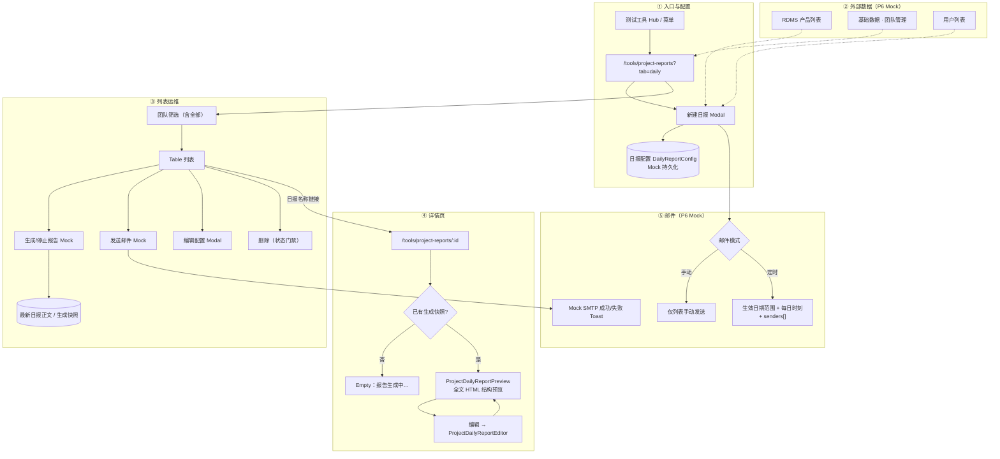
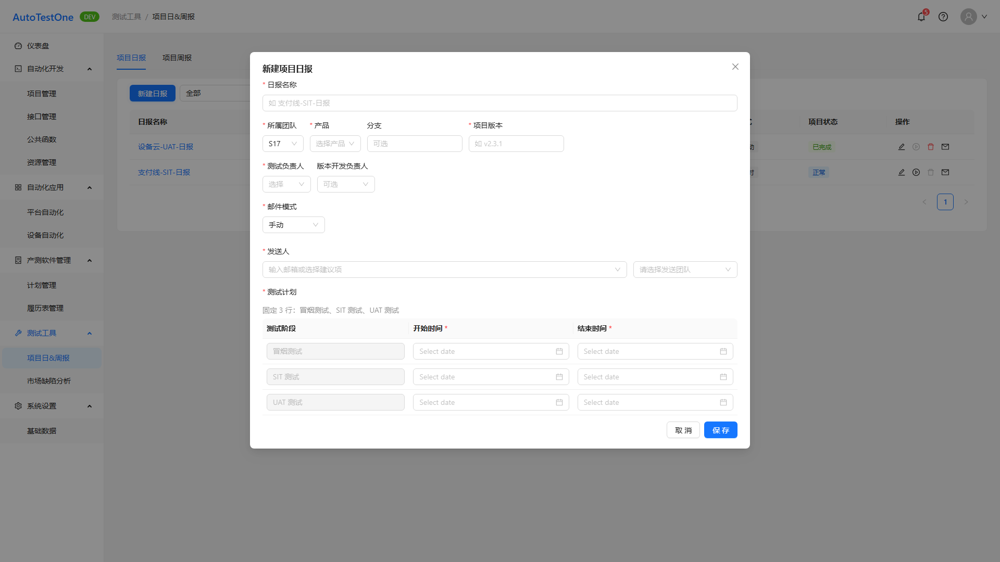
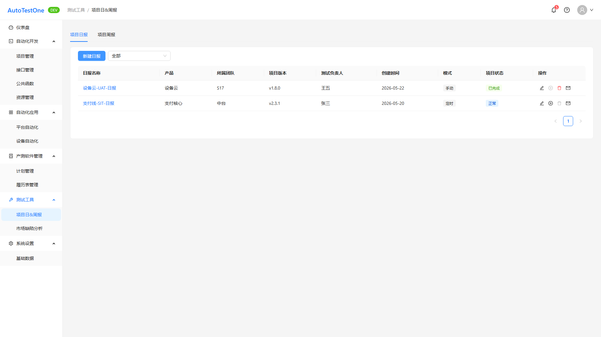
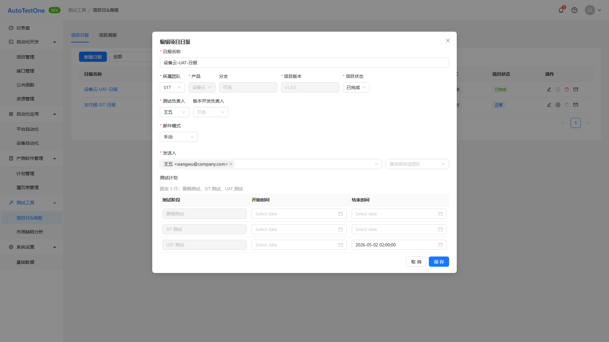
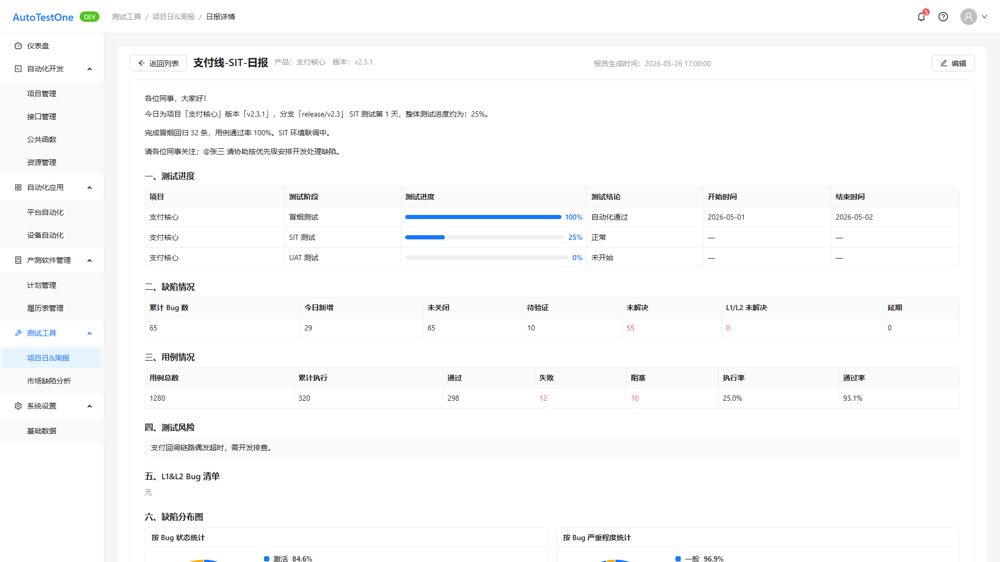
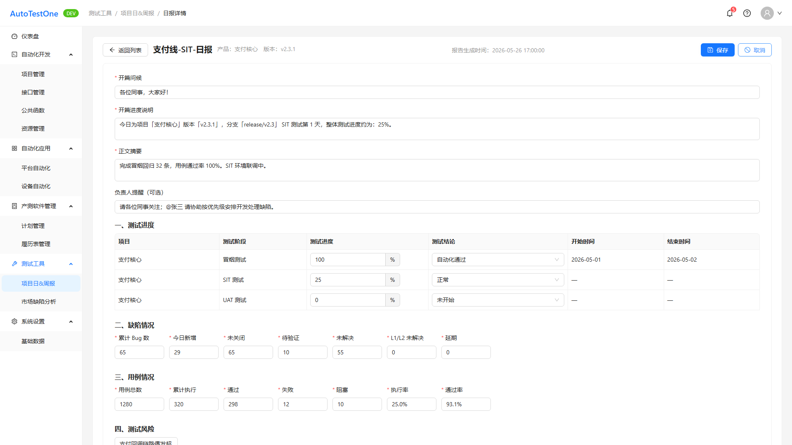
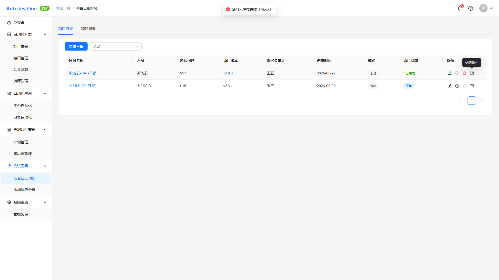
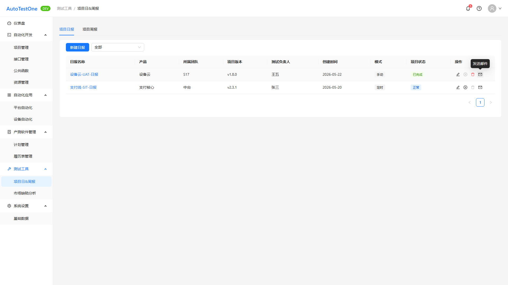

# 文档说明

> **文档类型**：需求规格说明书（SRS），即本仓库流程中的 **迭代级 PRD（交付研发与测试）**。经 **产品经理审核定稿** 后，供 **研发**（方案与实现）、**测试**（验收、用例与回归口径）、**AI**（spec-coding / 辅助实现）使用。  
> **交付物文件名**：`ATO_V1.0.1-P6-项目日报-需求规格说明书.md`（`{一级需求描述}` 与迭代需求清单「一级需求」列 **项目日报** 一致）。

> **《页面需求与交互规格》的定位**（`docs/prd/V1.0.1-P6/ATO_V1.0.1-P6-页面需求与交互规格.md`）：用于 **HTML 页面原型 / 线框落地**（布局、控件、§ 章节锚点）；**不是**迭代产品的唯一真源。可与本正文 **§ / REQ** 交叉对照；**研发、测试与实现验收口径以本 SRS 为准**。

> **本稿的定位**：承载 **一级需求「项目日报」** 的完整条文（REQ-V1.0.1-P6-010～016）；章节结构、编号层级与写法深度参照黄金范例 **`template/ATO_V1.0.1-P5-需求规格说明书-范例-市场缺陷分析.md`**。**文档粒度（必读）**：**一份 SRS 仅覆盖迭代清单中的一个一级需求**；本迭代「项目周报」等其它一级需求须另立 SRS。详见 **附录 E**。

**章节引用约定**：正文中的 `## 1.1`、`§1.1.x` **仅在本文档内有效**；跨文档沟通请使用 **文件名 + REQ-ID** 或 **文件名 + §**（示例：`ATO_V1.0.1-P6-项目日报-需求规格说明书.md` + **REQ-V1.0.1-P6-011**），避免口头简称「看 1.1」在多份 SRS 并存时混淆。

**编号约定**（正文 `##` / `###` / `####` 与清单列对应）：

- `## 1.1` — 对应迭代清单 **一级需求**：**项目日报**
- `### 1.1.x {二级名}（REQ-xxx）` — 对应迭代清单 **二级需求** + 唯一 REQ（本一级需求 **三级列为 —**，采用 **方案 1**，见 `docs/prd/SRS生成规则-v1.md` §7.1）
- `#### 1.1.x.y` — **本稿不使用**（清单无三级需求列）

**页面聚合（本稿）**

- 本一级需求对应 **两个路由页面**：**项目日&周报 · 项目日报 Tab**（`ProjectReportsPage`，§1.1.1～1.1.2、1.1.4～1.1.7 的列表/弹窗能力）与 **项目日报 — 详情**（`ProjectReportDetailPage`，§1.1.5～1.1.6 的预览/编辑）。  
- **REQ-V1.0.1-P6-011（日报列表）** 在验收稿中扩展 **报告生成/停止**（Mock），**不再**实现清单初稿附录 C 中的「启动/停止定时邮件」；定时邮件改由 **邮件模式=定时** + **senders[]** + 定时生效配置表达，发送结果 P6 **Mock**（见 §1.1.7、变更记录 §3）。  
- **REQ-V1.0.1-P6-015（日报发送）**：**手动发送入口仅列表**；详情页 **不提供** 发送按钮（验收稿 2026-06-03）。  
- **§ ↔ REQ**：§1.1.1→010、§1.1.2→011、§1.1.3→012、§1.1.4→013、§1.1.5→014、§1.1.6→015、§1.1.7→016。

**需求描述结构（固定小节，勿删节）**：各功能点须依次包含 **`• **原型：**`**（在 **需求描述** 之前）、**`• **需求描述：**`** 下 **`1. 正常流程` → `2. 异常场景` → `3. 限制条件`**。无异常条目时 **保留 `2. 异常场景` 标题**，正文写 **「无」**。详见 **`docs/prd/SRS生成规则-v1.md`**。

**前置门禁**：**需求类型=新增**；**页面 PRD 已验收（2026-06-03）**；Playwright 截图 manifest **errors 为空**（2026-06-04 全量复验）。

**文档状态**：**待评审草稿（AI 按 SRS 规则 v1 重生成 · 2026-06-04）**

**验收基线**（版本 V1.0.1-P6）

- **迭代级权威（研发 / 测试 / AI）**：**当前迭代本 SRS（定稿后）**。业务口径、验收勾选项、与 REQ-ID 对应的条文 **以实现与测试对本 SRS 为准**。  
- **REQ 覆盖（完整性）**：本稿覆盖一级需求「项目日报」在迭代清单中的 **REQ-V1.0.1-P6-010～016** 全部 7 条；无推迟/合并例外。  
- **页面交互规格（原型文档）**：`docs/prd/V1.0.1-P6/ATO_V1.0.1-P6-页面需求与交互规格.md` **已定稿（2026-06-03 验收）**；编写本 SRS 时已对照 **§0.2、§3.1、§3.2**。  
- **裁决规则**：当 **页面交互规格**、**原型代码**、**迭代清单附录 B/C/D** 与本 SRS **冲突**时：**默认以本 SRS（吸收 2026-06-03 验收稿）为准**；清单旧附录（如「已发布」状态、「4 阶段测试计划」「定时+手动」等）以 **变更记录** 与 **§0.2** 为准，并应回写清单附录。  
- **外部系统 / 接口边界**：以前端 **可观测行为** 与本文业务口径为准；**RDMS 产品列表、SMTP 发送** 在 P6 **Mock**；字段语义与生产接口契约以 **接口文档 / RDMS 数据字典** 为准；**禁止 silent drift**。

**文档生成依据 — 新增类**（需求类型=新增）

1. **迭代需求清单**：`docs/prd/V1.0.1-P6/ATO_V1.0.1-P6-需求清单.md`（REQ-010～016；验收稿优先于清单 §6 旧附录 B/C/D 冲突处）。  
2. **页面需求与交互规格（已验收）**：`docs/prd/V1.0.1-P6/ATO_V1.0.1-P6-页面需求与交互规格.md`（§0.2、§3.1、§3.2）。  
3. **Playwright 产出**：`docs/prd/V1.0.1-P6/assets/srs-screenshots/manifest.json`（REQ-010～016 共 8 张 png；errors 为空）。  
4. **验收变更记录**：`docs/prd/V1.0.1-P6/ATO_V1.0.1-P6-变更记录.md`（§3 项目日报 Tab、§4 详情）。  
5. **源码核对**：`src/pages/ProjectReportsPage.tsx`、`src/pages/ProjectReportDetailPage.tsx`、`src/components/ProjectDailyReportPreview.tsx`、`src/components/ProjectDailyReportEditor.tsx`、`src/types/projectReports.ts`、`src/mocks/projectReports.ts`（仅作可观测验收核对）。  
6. **`docs/requirements/`**：已按 §4.2 检索 **测试工具 / 项目日&周报 / 项目日报** — **NOT FOUND**（无历史全量文档；禁止臆造历史条文）。

**本稿绑定（交付前填写）**：版本 **V1.0.1-P6**；一级需求 **项目日报**；REQ 范围 **REQ-V1.0.1-P6-010～016**；路径 **`docs/prd/V1.0.1-P6/ATO_V1.0.1-P6-项目日报-需求规格说明书.md`**；页面交互规格：`docs/prd/V1.0.1-P6/ATO_V1.0.1-P6-页面需求与交互规格.md`（§0.2、§3.1、§3.2）；迭代清单：`docs/prd/V1.0.1-P6/ATO_V1.0.1-P6-需求清单.md`；主要实现：`ProjectReportsPage`、`ProjectReportDetailPage`、`ProjectDailyReportPreview`。

---

# 1 需求说明

## 1.1 项目日报

### 模块概述

项目日报能力支撑测试团队在 **统一测试工具入口** 下配置、生成、预览、编辑与发送 **按产品/版本维度** 的项目测试日报，替代原「测试日报」分散入口；与 **项目周报** 同属「项目日&周报」模块，但本 SRS **仅覆盖日报侧** 条文。

**解决的问题**：

- 日报配置分散、命名与产品版本口径不统一，难以按团队筛选与复用。  
- 日报正文生成与邮件发送缺乏可观测状态（生成中/已完成、发送结果）。  
- 原「测试日报」与新产品命名并存造成双入口。

**目标用户**：测试工程师、测试负责人、质量工程师（P6 页面 **不按角色隐藏** 日报写操作；权限细化可后续迭代）。

**入口**：

- 主框架菜单：**测试工具 → 项目日&周报** → 路由 **`/tools/project-reports?tab=daily`**（默认 Tab 为项目日报；`tab` 缺省或 `daily` 均进入日报 Tab）。  
- **测试工具 Hub**（`/tools`）：卡片「项目日&周报」进入上述路由；**须移除** 原「测试日报」入口（清单 §2.2）。  
- **日报详情**：点击列表 **日报名称** → **`/tools/project-reports/:id`**（`:id` = **日报配置 ID**，非历史正文 ID）。  
- **返回列表**：详情页「返回列表」→ **`/tools/project-reports?tab=daily`**。

**模块业务逻辑说明**：

以下描述 **配置 → 生成 → 预览/编辑 → 发送** 主链路；RDMS 产品、SMTP 发送在 P6 为 **Mock**，生产契约另文档定义。

**说明**：

- **产品**下拉数据权威源为 **RDMS**（P6：`listRdmsProducts()` Mock）。  
- **所属团队**来自 **系统设置 → 基础数据 → 团队管理**（P6：`mockTeams`）。  
- **日报名称唯一**：**同一产品**下不可重复（不同产品允许同名）。  
- **项目状态**：**正常 / 已完成 / 延期 / 暂停**（**非**「已发布」）；删除与生成按钮与之联动（见 §1.1.7、§1.1.2）。  
- **UAT 测试计划结束** 后系统可将项目状态解析为 **已完成**（`resolveDailyProjectStatus`，实现见 `src/utils/dailyReportStatus.ts`）。

---

### 1.1.1 新建项目日报（REQ-V1.0.1-P6-010）

• **背景与动机：**

在「项目日&周报」统一入口下，为某一 **产品 + 项目版本** 建立可复用的日报配置（含测试计划、负责人、邮件策略），支撑后续列表生成正文与发送邮件；避免原「测试日报」双入口与口径不一。

• **用户场景：**

作为测试负责人，我在项目日报 Tab 点击「新建日报」，填写产品、版本、三阶段测试计划时间与负责人后保存，期望列表出现新配置且同产品下日报名称不重复。

• **需求类型：** 新增

• **优先级：** 低（清单列；P6 已实现）

• **输入/前置条件：**

1. 用户已登录主框架。  
2. 当前位于 **`/tools/project-reports?tab=daily`**。  
3. RDMS 产品列表、团队列表、用户列表可加载（P6 Mock 可用）。

• **原型：**

• **需求描述：**

1. **正常流程**

   1. 用户点击工具栏 **「新建日报」**（按钮位于工具栏 **左侧**，与团队筛选同区）。  
   2. 系统打开 **新建日报** `Modal`（建议宽度 720px；`maskClosable={false}`）。  
   3. 用户填写下表字段并点击确认保存：

   | 字段 | 控件 | 必填 | 数据来源 / 默认值 | 备注 |
   | ---- | ---- | --- | ----------------- | ---- |
   | 日报名称 | `Input` | **是** | 手工 | **同产品下唯一**；保存冲突则阻断并提示 |
   | 所属团队 | `Select` | **是** | 基础数据 · 团队管理 | 新建默认当前用户第一所属团队 |
   | 产品 | `Select` | **是** | **RDMS**（P6 Mock） | 创建后 **不可改** |
   | 分支 | `Input` | 否 | 手工 | 创建后 **不可改** |
   | 项目版本 | `Input` | **是** | 手工 | 列表列同名；创建后 **不可改** |
   | 测试计划 | 固定 **3 行** `Table` 内嵌 | **是**（见下行） | 阶段名固定 | 阶段：**冒烟测试、SIT 测试、UAT 测试**；**禁止**增删行 |
   | 测试计划 · 开始时间 | 日期时间选择 | **是**（新建） | — | 每阶段必填 |
   | 测试计划 · 结束时间 | 日期时间选择 | **是**（新建） | — | 须 **≥** 开始时间 |
   | 测试负责人 | `Select` 用户 | **是** | 用户列表 | 可编辑（编辑弹窗） |
   | 版本开发负责人 | `Select` 用户 | 否 | 用户列表 | 可编辑 |
   | 邮件发送模式 | `Radio` / `Select` | **是** | 默认 **手动** | 枚举：**手动**、**定时**（**无**「定时+手动」） |
   | 定时 · 生效日期范围 | `RangePicker` | 模式=定时时 **是** | — | `rangeStart`～`rangeEnd` |
   | 定时 · 每日发送时刻 | `TimePicker` | 模式=定时时 **是** | — | 格式 `HH:mm:ss` |
   | 发送人 | `Select` tags **多选** | **是** | `senders[]` | 邮箱/邮件组；可从团队成员或邮件组建议 |

   4. **新建弹窗不含「项目状态」** 字段；保存后 **项目状态默认为「正常」**（可由编辑弹窗或测试计划解析变更）。  
   5. 校验通过后调用保存（P6：`createDailyConfig` Mock）；成功关闭弹窗、刷新列表、`message.success`。  
   6. 若同 **productId** 下 **name** 已存在 → 阻断保存，提示 **「日报名称已存在（同产品下需唯一）」**（或等价文案）。

2. **异常场景**

   a) **必填项未填 / 测试计划时间不完整**  
      i. 触发条件：Form 校验失败（含 `validateTestPlanRequired`）。  
      ii. 系统反馈：字段下提示或 `message.error` 首条（如「请填写「冒烟测试」的开始时间」）。  
      iii. 用户指引：补全三阶段起止时间后重试。

   b) **结束时间早于开始时间**  
      i. 触发条件：某阶段 `endAt < startAt`。  
      ii. 系统反馈：校验错误文案。  
      iii. 用户指引：调整时间。

   c) **日报名称同产品重复**  
      i. 触发条件：Mock/API 返回 `ok: false`（唯一性冲突）。  
      ii. 系统反馈：`message.error` 唯一性提示。  
      iii. 用户指引：修改名称或选择其它产品。

   d) **模式=定时但未填生效范围或每日时刻**  
      i. 触发条件：定时字段缺失。  
      ii. 系统反馈：Form 校验失败。  
      iii. 用户指引：补全定时配置。

3. **限制条件**

   a) **创建后不可编辑字段**  
      i. 影响说明：**日报名称、产品、分支、项目版本** 保存后 **不可在编辑弹窗中修改**（只读展示）。  
      ii. 关联：编辑规则见 **REQ-V1.0.1-P6-012**。

   b) **测试计划行数固定为 3**  
      i. 影响说明：**不含**「版本发布」阶段（相对清单初稿附录 B.1.1 的 4 行，以验收稿为准）。  
      ii. 常量：`DAILY_TEST_PLAN_PHASES`。

   c) **P6 外部系统**  
      i. 影响说明：RDMS 产品、SMTP **Mock**；不对接生产（清单 §2.4）。

• **补充说明：**

- 保存时可根据测试计划自动解析 **项目状态**（如 UAT 结束后 → **已完成**），与编辑弹窗手工选择取并集规则以实现为准（`resolveDailyProjectStatus`）。  
- 邮件 **定时** 语义：在 **生效日期闭区间** 内，按 **每日固定时刻** 触发发送（P6 仅 Mock 配置存储，不保证真实调度）。  
- 对照：`ATO_V1.0.1-P6-页面需求与交互规格.md` **§3.1** Modal — 新建；变更记录 **§3**。

• **验收标准：**

- [ ] 「新建日报」打开弹窗，字段与上表一致；**无**项目状态表单项。  
- [ ] 测试计划 **3 行**固定，新建时每行开始/结束 **必填** 且结束 ≥ 开始。  
- [ ] 同产品下重复日报名称保存失败并有明确提示。  
- [ ] 保存成功后列表可见新行，且产品/分支/版本与录入一致。  
- [ ] 模式=定时时必须配置生效日期范围、`senders[]` 非空（与 Form 规则一致）。

---

### 1.1.2 日报列表（REQ-V1.0.1-P6-011）

• **背景与动机：**

集中展示已配置的日报，支持按团队筛选、进入详情、触发生成与邮件发送；验收稿以 **图标操作列 + 生成态指示** 提升可观测性。

• **用户场景：**

作为测试工程师，我打开项目日报 Tab，按团队筛选后查看各配置的版本、负责人、邮件模式与项目状态，并对某行执行生成、发送或编辑。

• **需求类型：** 新增

• **优先级：** 低

• **输入/前置条件：**

1. 用户已登录，路由 **`/tools/project-reports?tab=daily`**。  
2. 列表数据可加载（`listDailyConfigs`）。

• **原型：**

• **需求描述：**

下列 **1** 为列表壳与工具栏；**2～5** 为行内子功能（与 REQ-012/015/016 边界见各节）。

1. **正常流程 — 工具栏与列表列**

   1. **工具栏（左侧）**  
      - **新建日报**：见 **REQ-V1.0.1-P6-010**。  
      - **团队筛选**：`Select`，选项 **「全部」** + 基础数据团队列表；默认 **全部**；筛选 `teamId` 匹配的配置。  
   2. **表格列**（均为 **展示列**，除日报名称为链接外不可行内编辑）：

   | 列名 | 字段 / 渲染 | 角色 | 说明 |
   | ---- | ----------- | ---- | ---- |
   | 日报名称 | `name` → 链接 | 展示 + **导航** | 点击进入 **`/tools/project-reports/:id`** |
   | 产品 | `productName` | 展示 | RDMS 产品名 |
   | 所属团队 | `teamName` | 展示 | 验收稿增列 |
   | 项目版本 | `projectVersion` | 展示 | **禁止**使用歧义列名「版本」 |
   | 测试负责人 | `testOwnerName` | 展示 | — |
   | 创建时间 | `createdAt` | 展示 | **仅日期** `YYYY-MM-DD` |
   | 模式 | `mode` | 展示 | `Tag`：**定时** / **手动** |
   | 项目状态 | `projectStatus` | 展示 | `Tag` 颜色：正常蓝 / 已完成绿 / 延期橙 / 暂停灰 |
   | 操作 | — | **操作列** | 见下文 **2～5** |

   3. 表格 **分页**（与工程惯例一致）；加载中 `loading`；无数据 `Empty`。

2. **正常流程 — 编辑（入口）**

   1. 操作列 **编辑** 图标（`EditOutlined`）+ Tooltip「编辑」。  
   2. 打开 **编辑日报** Modal（字段规则见 **REQ-V1.0.1-P6-012**）。

3. **正常流程 — 生成 / 停止报告（验收能力，无独立 REQ-ID）**

   1. 操作列 **生成** 图标（`PlayCircleOutlined`）；生成中切换为 **停止**（`StopOutlined`）+ Tooltip「停止」。  
   2. 点击 **生成**：行进入 **生成中** 状态，调用 `generateDailyReport(id)`（Mock）；行末显示 **Loading** 旋转图标。  
   3. 生成成功：行末显示 **✅**（`CheckCircleOutlined` 绿色）+ Tooltip「日报已生成」；`message.success`（Mock 文案）。  
   4. 点击 **停止**（仅生成中）：取消本次生成 UI 状态，`message.info` 已停止。  
   5. **项目状态 = 已完成** 且非生成中：**生成按钮 disabled**（不隐藏），Tooltip「项目已完成，不可生成」。  
   6. **说明**：此能力 **替代** 清单初稿列表「启动/停止定时邮件」；定时邮件不由该按钮控制（变更记录 §3）。

4. **正常流程 — 删除（入口）**

   1. 操作列 **删除** 图标；规则见 **REQ-V1.0.1-P6-016**。

5. **正常流程 — 发送邮件（入口）**

   1. 操作列 **发送邮件** 图标（`MailOutlined`）；规则见 **REQ-V1.0.1-P6-015**。

2. **异常场景**

   a) **列表加载失败**  
      i. 触发条件：`listDailyConfigs` 异常。  
      ii. 系统反馈：`message.error`。  
      iii. 用户指引：刷新页面重试。

   b) **生成失败**  
      i. 触发条件：`generateDailyReport` 抛错。  
      ii. 系统反馈：`message.error`；生成态回 **idle**。  
      iii. 用户指引：重试生成。

3. **限制条件**

   a) **不再提供「启动/停止定时」列表按钮**  
      i. 影响说明：定时发送由配置 **模式=定时** 表达（REQ-010/012）。  
      ii. 依据：变更记录 §3、页面 PRD §0.2。

   b) **DEV 角色切换器**  
      i. 影响说明：验收稿 **移除** 顶栏开发用角色切换；权限取自基础数据当前用户 Mock。

• **补充说明：**

- 列表 **不展示** 独立列「定时任务启停」；`timerEnabled` 由邮件模式与后端/Mock 维护。  
- 对照：页面 PRD **§3.1** Tab — 项目日报；`ProjectReportsPage` `dailyColumns`。

• **验收标准：**

- [ ] 工具栏左置「新建日报」+ 团队筛选（含全部）。  
- [ ] 列表 8 列 + 操作列字段名与上表一致；创建时间仅日期。  
- [ ] 日报名称链接跳转 `/tools/project-reports/:id`。  
- [ ] 生成/停止、Loading、✅ 与「已完成」禁用生成符合 §3 描述。  
- [ ] 无「启动/停止定时」旧按钮。

---

### 1.1.3 日报编辑（REQ-V1.0.1-P6-012）

• **背景与动机：**

项目推进过程中需调整团队、测试计划时间、负责人、邮件策略与 **项目状态**，但须保持产品/版本等主数据稳定。

• **用户场景：**

作为测试负责人，我在列表点击「编辑」，修改测试计划结束日期与邮件发送人后保存，列表行信息同步更新。

• **需求类型：** 新增

• **优先级：** 低

• **输入/前置条件：**

1. 列表存在目标配置行。  
2. 用户打开 **编辑** Modal（`mode=edit`）。

• **原型：**

• **需求描述：**

1. **正常流程**

   1. 列表操作列 **编辑** → 打开 **编辑日报** Modal（与新建共用壳，标题区分新建/编辑）。  
   2. **只读展示（不可编辑）**：**日报名称、产品、分支、项目版本**（灰显或 `disabled` 控件）。  
   3. **可编辑字段**：

   | 字段 | 控件 | 必填 | 说明 |
   | ---- | ---- | --- | ---- |
   | 所属团队 | `Select` | **是** | 可变更团队 |
   | 测试计划 | 固定 **3 行** | 行内时间选填规则与新建一致 | 仅 **开始/结束时间** 可编辑；**禁止**增删行 |
   | 测试负责人 | 用户选择 | **是** | — |
   | 版本开发负责人 | 用户选择 | 否 | — |
   | 邮件发送模式 | 手动 / 定时 | **是** | 同 REQ-010 |
   | 定时配置 | 生效范围 + 每日时刻 | 定时时必填 | 同 REQ-010 |
   | 发送人 | `senders[]` 多选 | **是** | — |
   | 项目状态 | `Select` | **是** | 枚举：**正常、已完成、延期、暂停** |

   4. 保存调用 `updateDailyConfig`；成功关闭弹窗并刷新列表。  
   5. **日报名称同产品唯一** 校验仍适用（若实现允许改名则冲突提示；当前实现名称只读，以 **产品+名称** 存储为准）。

2. **异常场景**

   a) **保存失败 / 唯一性冲突**  
      i. 触发条件：更新接口返回失败。  
      ii. 系统反馈：`message.error`。  
      iii. 用户指引：检查字段后重试。

   b) **测试计划时间非法**  
      i. 触发条件：结束早于开始。  
      ii. 系统反馈：Form 校验错误。  
      iii. 用户指引：修正时间。

3. **限制条件**

   a) **不可编辑字段与新建一致**  
      i. 影响说明：产品、分支、项目版本、日报名称 **创建后不可改**（B.3 验收稿口径）。

   b) **测试计划阶段名不可改**  
      i. 影响说明：仅时间列可编辑。

• **补充说明：**

- 编辑时可手工设置 **项目状态**；亦可在保存时由 `resolveDailyProjectStatus` 根据测试计划推导 **已完成**。  
- 对照：页面 PRD **§3.1** Modal — 编辑；清单 B.3（「已发布」已更名为 **已完成**）。

• **验收标准：**

- [ ] 编辑弹窗中名称/产品/分支/版本只读。  
- [ ] 可改团队、三阶段计划、负责人、邮件模式/定时、senders、项目状态。  
- [ ] 保存后列表列与详情头信息一致更新。

---

### 1.1.4 日报预览（REQ-V1.0.1-P6-013）

• **背景与动机：**

测试负责人需在独立页面查看 **已生成的完整日报报告**（含多章节与图表），而非仅三块纯文本；无生成记录时须有空态指引。

• **用户场景：**

作为测试工程师，我点击列表日报名称进入详情，查看带图表的完整 HTML 结构预览，并确认顶栏展示的 **报告生成时间**。

• **需求类型：** 新增

• **优先级：** 低

• **输入/前置条件：**

1. 有效日报配置 ID（路径参数 `:id` / `reportConfigId`）。  
2. 默认进入 **预览态**（`viewMode=preview`）。

• **原型：**

• **需求描述：**

1. **正常流程**

   1. 用户从列表点击 **日报名称** → 导航 **`/tools/project-reports/:id`**。  
   2. 页面加载配置（`getDailyConfig`）与 **最新生成快照**（`getGeneratedDailyReport` / `getLatestDailyBody`）。  
   3. **顶栏布局**（单 Card 内，非内容区整页副标题）：  
      - **左侧**：「返回列表」按钮；**标题**（日报名称 `Title level={4}`）+ 次要文案 **产品、项目版本**（`Typography.Text type="secondary"`）。  
      - **居中**：**报告生成时间** — 文案 `报告生成时间：{YYYY-MM-DD HH:mm:ss}`；无快照时为 **—**。  
      - **右侧**：**编辑** 按钮（见 REQ-014）；**无**「手动发送」按钮。  
   4. **预览内容区**：使用 **`ProjectDailyReportPreview`** 组件展示 **完整生成报告**（多章节：进展、缺陷、用例、风险、图表等 Mock 结构，贴近真实 HTML 日报）。  
   5. **数据规则**：  
      - 若配置 **从未生成** 成功正文/快照 → 展示 **`Empty`**，说明如 **「报告生成中，请稍后刷新」**（或等价；与页面 PRD §1.5 一致）。  
      - 若 **已有历史生成** → 展示 **最近一次** 生成快照（`DailyGeneratedReport`）。  
   6. 「返回列表」→ `navigate('/tools/project-reports?tab=daily')`。

2. **异常场景**

   a) **配置 ID 不存在**  
      i. 触发条件：`getDailyConfig` 返回空。  
      ii. 系统反馈：`Empty`「未找到日报配置」。  
      iii. 用户指引：返回列表。

   b) **加载失败**  
      i. 触发条件：接口/Mock 异常。  
      ii. 系统反馈：`message.error`。  
      iii. 用户指引：重试或返回。

3. **限制条件**

   a) **预览态不提供发送邮件**  
      i. 影响说明：发送仅 **列表** 操作列（REQ-015）。  
      ii. 依据：验收稿 §0.2、变更记录 §4。

   b) **相对清单附录 B.4 的扩展**  
      i. 影响说明：验收稿以 **全文报告预览** 替代仅「今日进展/风险/明日计划」三块；编辑态字段结构见 **REQ-014** 与 `ProjectDailyReportEditor`。

• **补充说明：**

- 面包屑须在 `MainLayout.buildBreadcrumbItems` 登记：**测试工具 / 项目日&周报 / 日报详情**。  
- 对照：页面 PRD **§3.2**；`ProjectReportDetailPage.tsx`、`ProjectDailyReportPreview.tsx`。

• **验收标准：**

- [ ] 路由 `/tools/project-reports/:id` 可打开且面包屑正确。  
- [ ] 顶栏含返回、标题+产品版本、居中生成时间、编辑；**无**发送按钮。  
- [ ] 有快照时渲染 `ProjectDailyReportPreview` 多章节内容。  
- [ ] 无快照时 Empty 文案符合约定。  
- [ ] 返回列表回到 `?tab=daily`。

---

### 1.1.5 日报修改（REQ-V1.0.1-P6-014）

• **背景与动机：**

生成后的日报正文可能需要人工润色（进展描述、风险、结论等），需在详情页提供结构化编辑并保存回快照。

• **用户场景：**

作为测试负责人，我在详情预览页点击「编辑」，修改报告各块内容后「保存」回到预览，或「取消」放弃修改。

• **需求类型：** 新增

• **优先级：** 低

• **输入/前置条件：**

1. 详情页已加载 **生成快照**（`generated` 非空）；无快照时 **编辑** 按钮 **disabled**。  
2. 当前为 **预览态**。

• **原型：**

• **需求描述：**

1. **正常流程**

   1. 预览态点击 **「编辑」** → `viewMode=edit`；使用 **`ProjectDailyReportEditor`** + `Form` 载入快照（`initReportEditForm`）。  
   2. 用户修改报告可编辑块（结构化字段，与 `DailyGeneratedReport` 模型一致；含进展、缺陷表、用例进度、风险等，以实现组件为准）。  
   3. 点击 **「保存」**：校验 `Form` → `saveGeneratedDailyReport`（Mock）→ 更新本地快照 → **回到预览态** → `message.success`。  
   4. 点击 **「取消」**：丢弃未保存修改，`resetFields` → 预览态 → `message.info` 未保存提示。  
   5. 保存中 **保存** 按钮 `loading`；取消在 saving 时 disabled。

2. **异常场景**

   a) **无生成快照点击编辑**  
      i. 触发条件：`generated == null`。  
      ii. 系统反馈：编辑按钮 **disabled**。  
      iii. 用户指引：先在列表 **生成** 报告。

   b) **保存校验失败**  
      i. 触发条件：必填块未填（以实现 `validateFields` 为准）。  
      ii. 系统反馈：字段提示或 `message.error`。  
      iii. 用户指引：补全后保存。

   c) **保存接口失败**  
      i. 触发条件：Mock 异常。  
      ii. 系统反馈：`message.error`。  
      iii. 用户指引：重试。

3. **限制条件**

   a) **详情页不修改日报配置主数据**  
      i. 影响说明：产品、版本、团队等须在 **列表编辑 Modal** 修改（REQ-012）。  
      ii. 本 REQ 仅修改 **生成报告快照** 正文。

   b) **相对清单 B.4 三块必填**  
      i. 影响说明：全文编辑模型扩展后，必填块以 `ProjectDailyReportEditor` 校验为准；定稿时须在测试中列出具体必填字段清单。

• **补充说明：**

- 保存成功后顶栏 **报告生成时间** 应反映最新快照时间（若实现更新 `generatedAt`）。  
- 对照：页面 PRD **§3.2** 关键交互 2～3；`ProjectDailyReportEditor.tsx`。

• **验收标准：**

- [ ] 有快照时可进入编辑态，展示 `ProjectDailyReportEditor`。  
- [ ] 保存成功回预览且内容持久化（Mock 可刷新验证）。  
- [ ] 取消不保存且回预览。  
- [ ] 无快照时编辑不可用。

---

### 1.1.6 日报发送（REQ-V1.0.1-P6-015）

• **背景与动机：**

支持按配置将当前/latest 日报正文发送至预设 **发送人** 列表；P6 用 Mock 验证交互，不对接真实 SMTP。

• **用户场景：**

作为测试负责人，我在列表点击「发送邮件」，期望 Toast 提示发送成功或失败原因。

• **需求类型：** 新增

• **优先级：** 低

• **输入/前置条件：**

1. 列表存在目标配置。  
2. 配置已维护 **`senders[]`**（新建/编辑时必填）。

• **原型：**

• **需求描述：**

1. **正常流程**

   1. **唯一入口**：项目日报 Tab 列表操作列 **发送邮件** 图标（`MailOutlined`）+ Tooltip「发送邮件」。  
   2. 用户点击 → 调用 `sendDailyReport(id)`（P6 Mock）。  
   3. 成功：`message.success`（如「邮件已发送（Mock）」）。  
   4. 失败：`message.error` 展示 Mock 返回 `message`。  
   5. **详情页不提供** 手动发送按钮（与验收稿一致；相对清单初稿「列表+详情两处」的修订）。

2. **异常场景**

   a) **发送失败（Mock 模拟失败）**  
      i. 触发条件：`ret.ok === false`。  
      ii. 系统反馈：`message.error`。  
      iii. 用户指引：检查 senders 或稍后重试。

3. **限制条件**

   a) **P6 不对接真实 SMTP**  
      i. 影响说明：仅验证触发与结果提示；生产契约另定。  
      ii. 依据：清单 §2.4、页面 PRD §1.5。

   b) **定时发送**  
      i. 影响说明：**手动** 发送不受「生成/停止」影响；**定时** 由模式=定时 + `timerSchedule` 配置，P6 调度 **Mock**（无列表启停按钮）。

   c) **收件人模型**  
      i. 影响说明：验收稿为 **`senders[]` 多邮箱/组**，非仅「固定邮件组」单字段（相对附录 C 修订）。

• **补充说明：**

- 清单附录 C「手动发送入口列表+详情」以 **本 SRS + 变更记录 §4** 为准（仅列表）。  
- 邮件 HTML 复杂排版下放后台模板（Out of Scope）。

• **验收标准：**

- [ ] 列表发送邮件图标可点击并 Toast 成功/失败。  
- [ ] 详情页 **无** 发送邮件按钮。  
- [ ] P6 无真实 SMTP 调用（Mock 即可通过）。

---

### 1.1.7 日报删除（REQ-V1.0.1-P6-016）

• **背景与动机：**

允许在版本结束或暂停后清理无用配置，但在项目仍在进行（正常/延期）时禁止删除以免误删活跃配置。

• **用户场景：**

作为测试负责人，我对已完成项目删除日报配置，系统二次确认后移除；对进行中项目尝试删除时被拒绝。

• **需求类型：** 新增

• **优先级：** 低

• **输入/前置条件：**

1. 用户在日报列表操作列点击 **删除**。  
2. 当前行 **项目状态** 决定可否删除。

• **原型：**

• **需求描述：**

1. **正常流程**

   1. **项目状态 × 删除矩阵**（验收稿；「已发布」已更名为 **已完成**）：

   | 项目状态 | 删除按钮 | 行为 |
   | -------- | -------- | ---- |
   | 正常 | **disabled** | 不可删；Tooltip 说明原因（如「当前项目状态不允许删除（正常/延期禁止）」） |
   | 延期 | **disabled** | 同上 |
   | 已完成 | **enabled** | 可删 |
   | 暂停 | **enabled** | 可删 |

   2. 可删时点击删除 → **`Modal.confirm`**：文案 **「此操作不可恢复，是否继续？」**（通用文案，REQ-016）。  
   3. 用户确认 → `deleteDailyConfig(id)`（Mock）→ 刷新列表 → `message.success`。

2. **异常场景**

   a) **删除接口失败**  
      i. 触发条件：Mock 异常。  
      ii. 系统反馈：`message.error`。  
      iii. 用户指引：重试。

3. **限制条件**

   a) **仅删除配置，不单独确认历史正文**  
      i. 影响说明：删除配置后详情路由应 404/空态（以实现为准）。  
      ii. 关联：生成快照/ORPHAN 策略下放实现阶段。

• **补充说明：**

- 实现参考：`isDeletable()` in `ProjectReportsPage.tsx`。  
- 对照：页面 PRD **§3.1** 删除规则；清单 D.1（状态名已更新）。

• **验收标准：**

- [ ] 正常/延期：删除 disabled 且有 Tooltip。  
- [ ] 已完成/暂停：确认框文案为通用不可恢复提示，确认后行消失。  
- [ ] 取消确认不删除。

---

# 待评审和澄清

> 汇集 **Playwright 截图失败**、**依据不足**、**清单/页面 PRD/代码冲突**、**质量自检 P0** 等需产品或研发 **逐条裁决** 的事项。关闭后：将结论 **回写** 正文对应 REQ/§，并 **删除或清空** 本表。

| 序号 | 关联 REQ 或 § | 问题类型 | 问题描述 | 建议动作 |
|------|----------------|----------|----------|----------|
| — | — | — | **当前无待澄清项**（REQ-010～016 截图齐全；验收稿 2026-06-03 已覆盖主路径） | 定稿时清空本表 |

---

# 附录

## 变更历史

| 版本 | 日期 | 变更类型 | 变更内容 | 变更原因 | 影响范围 |
| ---- | ---- | -------- | -------- | -------- | -------- |
| V1.0.1-P6 | 2026-06-04 | 规范 | 方案 1 章节层级：三级为空时 REQ 条文合并至 `### 1.1.x（REQ-xxx）`，删除虚构 `####` | SRS 规则 v1 §7.1 | §1.1.1～1.1.7、文首编号约定 |
| V1.0.1-P6 | 2026-06-04 | 规范 | 按 SRS 规则 v1 重生成：各 REQ 嵌入 Playwright 原型图；文档生成依据对齐新增类分流；「待评审和澄清」节 | v1 试点 | 全文 REQ 原型、文首 |
| V1.0.1-P6 | 2026-06-03 | 新增 | 初稿：一级需求「项目日报」SRS（REQ-010～016）；吸收 UI 验收稿与变更记录 | 门禁 A 通过后生成迭代 PRD | 全文 |

**变更类型说明**：新增 / 优化 / 修复 / 删除 / 重构 / 规范。

---

## 附录A：用户角色说明

| 角色名称 | 角色描述 | 主要权限 | 使用场景 |
| -------- | -------- | -------- | -------- |
| 测试工程师 | 执行测试、填写日报 | 登录；新建/编辑配置；列表生成、发送；详情编辑报告 | 日常项目日报运维 |
| 测试负责人 | 对版本质量负责 | 同上；维护 senders、定时策略 | 发送日报给项目组 |
| 质量工程师 / 管理者 | 查看进展与风险 | 登录；查看列表与详情预览 | 管理评审（P6 不按角色隐藏按钮） |

> P6 **不按角色隐藏** 日报写操作（页面 PRD §3.1）；上表为业务画像，非权限矩阵。

---

## 附录B：术语表

| 术语 | 定义 | 业务说明 |
| ---- | ---- | -------- |
| 日报配置 | `DailyReportConfig` | 列表一行；含产品、版本、团队、邮件模式等；`:id` 为配置 ID |
| 生成快照 | `DailyGeneratedReport` | 列表「生成」后可供详情预览/编辑的报告正文 |
| 项目状态 | 正常 / 已完成 / 延期 / 暂停 | 驱动删除、生成禁用；**非**「已发布」 |
| 邮件模式 | 手动 / 定时 | P6 **无**「定时+手动」组合 |
| senders[] | 发送人邮箱列表 | 手动发送与定时策略的目标集合（P6 Mock） |
| RDMS | 第三方产品数据源 | 产品下拉权威源；P6 Mock |
| Mock | 前端占位实现 | RDMS 产品、SMTP、报告生成均无生产对接 |

---

## 附录C：参考文档

- **本迭代绑定**  
  - 页面需求与交互规格（已验收）：`docs/prd/V1.0.1-P6/ATO_V1.0.1-P6-页面需求与交互规格.md`（§0.2、§3.1、§3.2）  
  - 迭代需求清单：`docs/prd/V1.0.1-P6/ATO_V1.0.1-P6-需求清单.md`  
  - 变更记录：`docs/prd/V1.0.1-P6/ATO_V1.0.1-P6-变更记录.md`  
  - 原始页面需求设计：`prompt/page_design/AutoTestOne-V1.0.1-P6 原始页面需求设计.md`
- **工程契约**  
  - 信息架构与路由：`docs/spec/01-信息架构与路由.md`  
  - 页面契约：`docs/spec/04-页面契约.md`（页面 16～17）
- **SRS 结构**  
  - 模版：`template/需求规格说明书-模版.md`  
  - 黄金范例：`template/ATO_V1.0.1-P5-需求规格说明书-范例-市场缺陷分析.md`  
  - 生成规则：`docs/prd/SRS生成规则-v1.md`  
  - Cursor 规则：`.cursor/rules/srs-from-iteration-backlog.mdc`  
  - 提示词：`prompt/prompt_prd_writer/需求规格说明书-生成提示词.md`  
  - 截图 manifest：`docs/prd/V1.0.1-P6/assets/srs-screenshots/manifest.json`
- **全量需求库**：`docs/requirements/` — **本一级需求无归档文档（NOT FOUND）**

---

## 附录D：编写规范（引用黄金范例）

三级需求下 **子功能分述**、**前置条件与异常场景分工**、**算法与验收捆绑**、**章节编号与清单层级**、**D.6 跨文档引用与外部系统边界** 等细则，见 **`template/ATO_V1.0.1-P5-需求规格说明书-范例-市场缺陷分析.md`** 文末 **附录 D**。本稿 **§1.1.2** 采用 **正常流程内 1～5 分节** 描述列表壳与多条行内操作（范例 D.2）。

---

## 附录E：文档粒度规范（暂行）

### E.1 一份 SRS 仅允许对应一个一级需求

- 本文件 **仅** 覆盖迭代清单一级需求 **「项目日报」**（REQ-010～016）。  
- **「项目周报」**（REQ-017～025）及统计页须 **另立** `ATO_V1.0.1-P6-项目周报-需求规格说明书.md`（文件名以产品为准）。

### E.2 与全量需求库拆分的衔接

- 合入 `docs/requirements/` 时遵循 `.cursor/rules/requirements-module-split.mdc`；建议模块 **项目日&周报 / MOD-TOOL-PRPT**（清单 §2.2）。  
- 当前 `docs/requirements/` **无** 项目日报历史文档；合入时 **新建**，禁止与已替代「测试日报」模块静默合并除非产品明确。

---

**文档版本：** V1.0.1-P6  
**最后更新：** 2026-06-04  
**编写人：** AI（待评审草稿）  
**审核人：** （待产品经理 / 测试负责人填写）
