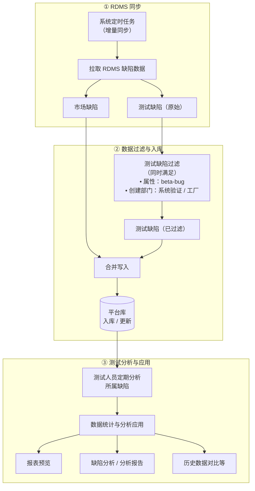

# 范例文档说明

> **文档类型**：需求规格说明书（SRS）**黄金范例**。  
> **页面 PRD 的价值**：同迭代的 **《页面需求与交互规格》**（`ATO_V{X.Y.Z}-页面需求与交互规格.md`）将业务与清单落实为 **可验收的界面、交互、状态与数据流**，是产品—研发对齐的 **权威技术基线**；其定稿条文直接支撑 **spec-coding** 的可实现性与联调口径。  
> **本范例与 SRS 的定位**：在「迭代需求清单 → SRS」链路上，约定章节结构、编号层级与写法深度，供 AI 生成与人工审核对齐；**面向软件开发工程师**，与已定稿页面 PRD、迭代清单一并，作为 **spec-coding** 场景下 **前后端方案设计、接口与组件拆分、编码实现与自测** 的 **重要依据**（实现仍须与仓库代码、页面契约同步迭代）。

**编号约定**（正文 `##` / `###` / `####` 与清单列对应）：

- `## 1.1` — 对应迭代清单 **一级需求**
- `### 1.1.x` — 对应迭代清单 **二级需求**（能力簇或子模块）
- `#### 1.1.x.y` — 对应迭代清单 **三级需求**（子场景、关键步骤等；无三级时本节可省略）

**验收基线**（版本通配，不绑定某一固定版本号）：

- **权威**：**当前迭代、已定稿**的页面级 PRD，路径形态为 **`docs/prd/V{X.Y.Z}/ATO_V{X.Y.Z}-页面需求与交互规格.md`**；其中 **`V{X.Y.Z}`** 与版本目录及 `ATO_` 后**文件名中的版本号**一致（含补丁版本，如 `V1.0.1-P5`）。
- **裁决规则**：当本范例的模版化叙述、迭代需求清单、**原型 / 页面代码**或历史备注与上述**已定稿页面 PRD** 冲突时，**以已定稿页面 PRD 条文为准**；歧义处应在 SRS 正文中显式引用 PRD 章节号（§）或表格。
- **本稿正文**：以下「本稿绑定」仅便于对照，不改变上述通配符规则。

**文档生成依据**（编写或机器生成与本范例同结构的 SRS 时，应 **同时** 打开并对照以下三类材料，并在交付物中可追溯引用）：

1. **迭代需求清单**：`docs/prd/V{X.Y.Z}/ATO_V{X.Y.Z}迭代需求清单.md`（文件名以仓库约定为准；重点为一级→二级→三级列与「需求说明 / 需求动机」）。
2. **迭代页面需求与交互规格**：同版本目录下的 **`ATO_V{X.Y.Z}-页面需求与交互规格.md`**（与上款 `V{X.Y.Z}` 一致；含布局、交互、状态枚举、Mock 边界与 § 章节）。
3. **原型页面与代码逻辑**：对应该迭代的前端实现与契约（典型路径：`src/pages/`、`src/components/`、`src/utils/`、`src/constants/`、`src/types/`、`src/mocks/`、`src/router/` 等），用于核对**可观测验收点**与控件形态；**业务口径仍以已定稿页面 PRD 为准**；代码与 PRD 不一致时按缺陷/变更流程处理，不得在未获定稿修订的前提下以代码覆盖 PRD。

**本稿绑定（对照用）**：版本 **V1.0.1-P5**；市场缺陷相关 **REQ-022～036**；页面 PRD：`docs/prd/V1.0.1-P5/ATO_V1.0.1-P5-页面需求与交互规格.md`；迭代清单：`docs/prd/V1.0.1-P5/ATO_V1.0.1-P5迭代需求清单.md`；代码主线示例：`MarketDefectAnalysis.tsx`、`MarketDefectListTab.tsx`、`MarketDefectAnalysisTasksTab.tsx`、`MarketDefectReportPage.tsx`、`MarketDefectReportDetailPage.tsx` 及关联 `components/`、`constants/`、`utils/`。

---

# 1 需求说明

## 1.1 市场缺陷分析

### 模块概述

本模块支持缺陷分析工作，包含对市场缺陷和相关测试缺陷数据的集中管理与分析流程：用户可以分析缺陷，发送缺陷分析报告邮件，以及导出分析报告。

**解决的问题**：替代人工导出 Excel、重复做月季报图表、历史口径难留存与对比等问题；支撑 **归因、改进闭环与管理视角统计**。

**目标用户**：测试工程师、质量工程师、测试/研发管理者（本迭代页面 PRD 约定 **不按角色隐藏写操作**，权限细化可后续迭代）。

**入口**：

- 主框架左侧菜单：**测试工具 → 市场缺陷分析** → 路由 `/tools/market-defects`（默认 Tab：**市场缺陷列表**）。
- 访问 `/tools` 时 **重定向** 至 `/tools/market-defects`（`replace`），兼容旧书签。
- **报表页**：`/tools/market-defects/report`（自列表 Tab 工具条「报表」进入）。
- **报告详情页**：`/tools/market-defects/reports/:reportId`（自「分析报告」Tab 报告名称链接等进入）。

**模块业务逻辑说明**：

以下用 **业务流程图** 描述从 RDMS 到分析应用的端到端链路；实现细节（调度周期、接口、字段枚举）以 **已定稿页面 PRD** 与 **RDMS 数据字典** 为准。

**说明**：

- **手动刷新**：列表「刷新」可在定时之外触发小范围同步，见下文 **#### 1.1.1.2（手动同步）** 与页面 PRD。  
- **创建部门口径（测试缺陷）**：与 RDMS **`创建部门`** 字段取值 **字面一致**，纳入同步的测试缺陷须为 **系统验证** 或 **工厂**（与流程图一致）。若 RDMS 后续扩展枚举，由数据对接/配置表维护，并同步修订本 SRS 与迭代清单 REQ-022。  
- **报表 / 分析报告 / 列表**：对应本模块内列表筛选、报表页、分析报告 Tab 与报告详情等能力，条文见页面 PRD **§3.3～§3.5**。

---

### 1.1.1 市场缺陷数据 RDMS 同步

本二级需求覆盖从 **RDMS** 拉取并刷新平台侧缺陷数据的机制，对应清单 **REQ-022、REQ-023**。

#### 1.1.1.1 定时同步（REQ-V1.0.1-P5-022）

• **背景与动机：**

将权威缺陷数据自动同步到平台，避免人工导出与重复统计；支持 **首次当季全量** 与 **之后每日增量 + 未关闭 Bug** 的持续同步，字段与列表展示一致。同步源口径：**RDMS 市场缺陷**、**测试 Bug**（属性 **beta-bug**，创建部门为 **系统验证**、**工厂** — 与 RDMS 字段字面一致）。

• **用户场景：**

作为质量人员，不需要每个月手动去RDMS导出缺陷数据。作为测试人员，每天都可以关注所属缺陷并进行分析，不用到每个月末集中投入时间分析

• **优先级：** 高

• **输入/前置条件：**

1. 平台与 RDMS 的地址、访问权限及接口均已配置并通过校验。
2. 列表字段模型已与 RDMS 字段映射（与 REQ-024 及页面 PRD 列口径一致）。

• **需求描述：**

1. **正常流程**

   1. 系统按策略执行首次全量与后续定时增量任务。  
   2. 同步完成后，列表查询可读到新数据（含未关闭 Bug 持续同步结果）。  
   3. 市场缺陷及测试缺陷同步时，字段信息以 RDMS 全量字段为准，列表展示时默认显示不可编辑范围内的对应字段。

2. **异常场景**

   a) **RDMS 不可用或超时**  
      i. 触发条件：接口超时、5xx、网络中断。  
      ii. 系统反馈：任务失败日志/监控告警（后端）；前端可在同步提示区展示失败摘要（若有）。  
      iii. 用户指引：稍后重试手动刷新；仍失败联系运维/RDMS 管理员。

3. **限制条件**

   a) **系统首次同步仅同步当季度数据**  
      i. 影响说明：避免测试人员重复分析历史数据，仅需关注当前季度。  
      ii. 扩展说明：后台可导入2026年已分析excel文档，无需平台端二次处理。

• **补充说明：**

- 具体 Cron、批大小、重试策略由 **接口/运维设计** 文档定义，本 SRS 只约束 **业务可见结果与字段一致性**。

• **验收标准：**

- [ ] 首次上线当季 **全量同步** 与之后 **每日定时增量** 策略可按环境配置并验证（或 Mock 验收用例通过）。  
- [ ] 同步后列表可展示与 RDMS 对齐的关键字段抽样一致（抽样规则在测试方案中定义）。  
- [ ] 失败场景有可追溯记录，不出现静默丢数。

---

#### 1.1.1.2 手动同步（列表刷新）（REQ-V1.0.1-P5-023）

• **背景与动机：**

定时同步后，当天仍可能有 bug 状态或信息发生变更。若测试人员当天需输出分析报告，可在列表中批量选择需关注的数据，点击「刷新」按钮，实时手动同步所选缺陷的数据与状态，满足用户对数据时效性的需求。

• **用户场景：**

作为测试工程师，我在列表中勾选刚关注的缺陷后点击「刷新」，希望触发一次 **针对选中行**（或 PRD 约定的批量范围）的同步刷新，以便尽快看到 RDMS 侧刚更新的状态。

• **优先级：** 高

• **输入/前置条件：**

1. 用户已登录。  
2. **至少勾选一行**（与页面 PRD：导出/刷新依赖行勾选 **一致**）。

• **需求描述：**

1. **正常流程**

   1. 用户在列表 Tab 勾选一行或多行。  
   2. 点击“刷新”按钮。
   3. 系统对选中范围发起同步/刷新请求。  
   4. 成功后更新对应行数据或整表刷新。

2. **异常场景**

   a) **未勾选行点击刷新**  
      i. 触发条件：`selectedRowKeys.length === 0`。  
      ii. 系统反馈：按钮 **disabled**（与页面 PRD §3.3 Tab1 工具条）。  
      iii. 用户指引：先勾选需刷新的行。

   b) **请求失败**  
      i. 触发条件：接口错误/超时。  
      ii. 系统反馈：`message.error` 或等价提示。  
      iii. 用户指引：重试；检查网络。

3. **限制条件**

   a) **市场缺陷列表-行勾选与导出**  
      i. 影响说明：刷新与导出共用「需勾选」规则。  
      ii. 关联逻辑：同一 `rowSelection` 状态。

• **补充说明：**

- 按钮文案为 **「刷新」**（不含「全局」二字，见页面 PRD §6 差异表）。

• **验收标准：**

- [ ] 无勾选时「刷新」「导出」均 **disabled**；有勾选后可用。  
- [ ] 失败有明确错误反馈；成功有成功反馈（Mock 可接受）。

---

### 1.1.2 市场缺陷列表

本二级需求覆盖 **列表展示、配置、过滤、编辑、详情、搜索、导出** 等，对应清单 **REQ-024～029、REQ-031**。其中 **时间维度（年/季/月）与单一搜索框** 为页面 PRD 相对 REQ-026/029 的 **验收细化**，以页面 PRD **§3.3 Tab1** 为准。

#### 1.1.2.1 列表

• **背景与动机：**

满足用户缺陷预览，数据过滤，数据分析需求

• **用户场景：**

作为质量分析人员，我打开列表即可看到缺陷 ID、来源、标题、创建日期、产品线、是否有效问题、实际归属团队、责任与流出原因、自动化覆盖相关等列，无需每次自定义。

• **优先级：** 高

• **输入/前置条件：**

1. 已进入 **市场缺陷列表** Tab。  
2. 同步RDMS数据已就绪。

• **需求描述：**

1. **正常流程**

   1. 表格按页面 PRD **§3.3 Tab1「列顺序」** 展示：缺陷 ID、缺陷来源、缺陷标题、创建日期、产品线、缺陷归属团队，是否有效问题、**实际归属团队**、**缺陷类型**、主要责任归属、主要责任人、流出原因、优化措施、优化责任人、**完成进度**（0～100，进度条）、自动化是否覆盖、是否可覆盖、不可覆盖原因、自动化未发现原因、操作列。  
   2. **只读 / 可编辑分区底色**：缺陷 ID～缺陷归属团队 **浅灰**；是否有效问题～完成进度 **浅蓝**；自动化相关列 **浅绿**（页面 PRD）。  
   3. **冻结列**：左三列（缺陷 ID、来源、标题）与 **操作列** 固定；中间横向滚动。  
   4. 分页 `showTotal` 展示 **全量条数、筛选后条数、本页起止、已勾选条数**（页面 PRD）。

2. **异常场景**

   a) **同步字段值为空**  
      i. 触发条件：RDMS 同步后某字段无值、空串或未映射到展示列。  
      ii. 系统反馈：对应单元格 **显示为空**（与表格空字段风格一致；**不**因空值报错、不闪烁占位异常）。  
      iii. 用户指引：一般无需操作；若业务上该字段应有值，联系数据对接或 RDMS 维护方。

   b) **列表单元格字符串过长**  
      i. 触发条件：缺陷标题、说明类字段等 **同步后的文本** 超出列设计宽度。  
      ii. 系统反馈：采用 **截断 / 省略号**（如 `ellipsis`）展示，列宽遵循 PRD 与表头布局，**不因长文本撑开列或破坏整表栅格**；完整内容可通过 **`Tooltip` / `title`** 悬停查看（与页面 PRD 可观测交互一致）。  
      iii. 用户指引：需要全文时悬停查看；导出等场景按字段全量规则另行约定。

   c) **筛选后整表无数据**  
      i. 触发条件：时间 / 表头筛选 / 搜索组合后结果集为空。  
      ii. 系统反馈：`Empty` 与引导。  
      iii. 用户指引：放宽筛选或调整时间范围。

3. **限制条件**

   a) **列表列与 RDMS 详情弹层**  
      i. 影响说明：列字段应与详情弹层可解释字段一致。  
      ii. 关联逻辑：同一 `MarketDefect` 模型。

• **补充说明：**

- 清单原文「操作栏：自动化复盘分析」与已定稿 PRD **已移除** 该按钮；以页面 PRD **§6** 为准。  
- 「计划完成时间」等若清单与 PRD 列不完全一致，以 **页面 PRD + 工程表头** 定稿为准。

• **验收标准：**

- [ ] 列顺序、冻结、底色分区、分页 `showTotal` 与页面 PRD §3.3 Tab1 一致。  
- [ ] 完成进度以 0～100 展示且可 Tooltip。  
- [ ] 同步字段为空时单元格 **空展示**，不因空值产生错误态或异常占位。  
- [ ] 长文本类列 **截断 / 省略号** 展示，列宽不被撑破；悬停可查看全文（与 PRD/工程一致）。

---

#### 1.1.2.2 列表展示字段设置（REQ-V1.0.1-P5-025）

• **背景与动机：**

不同角色关注字段不同，需支持列显隐与顺序配置。

• **用户场景：**

作为管理者，我仅关心责任归属与流出原因等列，希望通过列设置隐藏不常用列并保存个人视图。

• **优先级：** 低

• **输入/前置条件：**

1. 已进入列表 Tab。  
2. 列设置入口可用（页面 PRD：齿轮在 **表头「操作」列标题右侧**）。

• **需求描述：**

1. **正常流程**

   1. 用户点击列设置入口。  
   2. 在弹层/抽屉中调整列显隐、顺序（具体控件以 PRD 为准）。  
   3. 确认后表格即时生效；配置可持久化（实现期：本地存储或服务端）。

2. **异常场景**

   a) **至少保留一列数据列**  
      i. 触发条件：用户关闭全部列。  
      ii. 系统反馈：校验提示。  
      iii. 用户指引：至少保留一列。

3. **限制条件**

   a) **无** 或 与「导出列集合」策略一致时在导出需求中说明。

• **补充说明：**

- 入口位置以页面 PRD 为准（**不在**工具条主操作组末尾）。

• **验收标准：**

- [ ] 列设置入口位置与 PRD 一致。  
- [ ] 修改列后表格展示与配置一致（Mock 可接受）。

---

#### 1.1.2.3 列表信息过滤（REQ-V1.0.1-P5-026 + 时间维度）

• **背景与动机：**

快速缩小分析范围；支持按 **创建日期** 年/季/月 与表头筛选组合过滤。

• **用户场景：**

作为质量人员，我要看 **本季度某团队** 的有效/无效缺陷分布，希望用时间下拉与表头筛选快速得到子集。

• **优先级：** 高

• **输入/前置条件：**

1. 列表数据已加载。  
2. 年/季/月选项与「创建缺陷分析报告」数据范围选项 **同源常量**（页面 PRD / 工程约定）。

• **需求描述：**

1. **正常流程**

   1. **第一行工具条左侧**：年、季、月 `Select`；默认当前系统日期对应年/季/月；均可选 **「全部」**；变更后列表回到第 1 页。  
   2. **表头筛选**（与列绑定）：**是否有效问题**、**实际归属团队**、**主要责任归属** — `filterDropdown` + 重置；与搜索同一套过滤状态（页面 PRD）。  
   3. 过滤结果与分页联动。

2. **异常场景**

   a) **季/月组合非法**  
      i. 触发条件：如选 Q1 却选 6 月（若工程禁用则不存在）。  
      ii. 系统反馈：以工程联动规则为准（见 `getMarketDefectDataRangeMonthOptionsByQuarter` 一类逻辑）。  
      iii. 用户指引：按提示重选。

3. **限制条件**

   a) **市场缺陷报表页**  
      i. 影响说明：报表读取列表快照中的年/季/月及表头筛选初值。  
      ii. 关联逻辑：见 **§1.1.3** 与页面 PRD **§2.2**。

• **补充说明：**

- 清单 REQ-026 曾列「产品线」等顶部筛选；已定稿为 **表头 + 搜索** 分工，见页面 PRD **§6**。

• **验收标准：**

- [ ] 年/季/月与三列表头筛选与 PRD 行为一致。  
- [ ] 变更筛选后页码重置为 1。

---

#### 1.1.2.4 就地编辑（REQ-V1.0.1-P5-027）

• **背景与动机：**

支撑质量归因与改进闭环，对多列进行行内快速修订。

• **用户场景：**

作为缺陷复盘负责人，我在列表中双击某行的「流出原因」「优化措施」等字段，修改后立即生效，避免打开单独表单页。

• **优先级：** 高

• **输入/前置条件：**

1. 行处于非加载状态。  
2. 用户有写权限（本迭代 **不区分角色**，页面 PRD §1.5）。

• **需求描述：**

1. **正常流程**

   1. 自「是否有效问题」至「自动化未发现原因」（不含操作列）：**双击**进入编辑。  
   2. **优化措施**：`Input` 文本，**blur / Enter** 提交。  
   3. **完成进度**：数字 + 进度预览，**确定 / Enter** 提交，**取消 / Esc** 放弃。  
   4. **其余可编辑列**：`Select`，**选中即提交**并退出编辑。  
   5. **Esc** 可取消未保存编辑（与页面 PRD §3.3 Tab1 一致）。  
   6. 成功：`message.success`（Mock 可接受）。

2. **异常场景**

   a) **校验失败**  
      i. 触发条件：非法数字、必填为空等。  
      ii. 系统反馈：表单项错误提示。  
      iii. 用户指引：按提示修正。

   b) **提交接口失败**  
      i. 触发条件：409/500 等。  
      ii. 系统反馈：错误提示，保留编辑态或回滚（以后端契约为准）。  
      iii. 用户指引：重试。

3. **限制条件**

   a) **只读列**（缺陷 ID～产品线）  
      i. 影响说明：不可就地编辑。  
      ii. 关联逻辑：RDMS 权威字段只读展示。

• **补充说明：**

- 可编辑列集合以页面 PRD 为准；清单列出的字段若有增减，以 **字段表评审** 更新。

• **验收标准：**

- [ ] 双击编辑行为与控件类型（Input/Select/进度）符合页面 PRD。  
- [ ] 成功/失败反馈明确。

---

#### 1.1.2.5 缺陷详情（REQ-V1.0.1-P5-028）

• **背景与动机：**

点击缺陷 ID 查看与 RDMS Bug 详情页 **信息等价** 的内容，减少外跳。

• **用户场景：**

作为分析人员，我点击缺陷 ID，希望在弹框中阅读完整描述、状态、附件元数据等（字段以 RDMS 为准）。

• **优先级：** 中

• **输入/前置条件：**

1. 列表已展示该缺陷 ID。

• **需求描述：**

1. **正常流程**

   1. 用户点击 **缺陷 ID** 链接。  
   2. 打开 `Modal` 展示详情（首版工程为 **Mock HTML 结构**，**不**嵌入生产环境 RDMS `iframe`，见页面 PRD **§6**）。  
   3. 关闭弹层返回列表。

2. **异常场景**

   a) **RDMS 查询失败**  
      i. 触发条件：接口报错或缺陷已删除。  
      ii. 系统反馈：错误提示或「未找到」。  
      iii. 用户指引：核对 ID 或到 RDMS 核查。

3. **限制条件**

   a) **安全与合规**  
      i. 影响说明：首版不加载外域生产 URL。  
      ii. 关联逻辑：后续对接真实 RDMS 时再评审嵌入策略。

• **补充说明：**

- P5 Mock 阶段验收以 **结构完整、可关闭、无脚本错误** 为主。

• **验收标准：**

- [ ] 点击缺陷 ID 必出弹层；关闭无残留遮罩。  
- [ ] 失败路径有提示。

---

#### 1.1.2.6 缺陷信息查询（REQ-V1.0.1-P5-029）

• **背景与动机：**

基于当前列表结果集，支持 **多字段子串** 搜索，快速定位单条或多条缺陷。

• **用户场景：**

作为用户，我在搜索框输入标题关键字或责任人姓名片段，按 **Enter** 或点击搜索触发过滤。

• **优先级：** 高

• **输入/前置条件：**

1. 列表数据已加载。

• **需求描述：**

1. **正常流程**

   1. 工具条第二行右侧 **单一** `Input.Search`。  
   2. 占位说明覆盖：缺陷 ID、标题、各列文本、`createdAt` 等（**多字段**匹配，**不得**仅以缺陷 ID 为唯一维度，页面 PRD）。  
   3. 支持 **Enter** 触发。

2. **异常场景**

   a) **无匹配**  
      i. 触发条件：关键词无结果。  
      ii. 系统反馈：`Empty`。  
      iii. 用户指引：修改关键词或清空搜索。

3. **限制条件**

   a) **报表数据集**  
      i. 影响说明：报表页读取快照中的 `search.text`。  
      ii. 关联逻辑：见 §1.1.3。

• **验收标准：**

- [ ] 搜索框占位与多字段匹配行为与页面 PRD 一致。  
- [ ] Enter 可触发查询。

---

#### 1.1.2.7 市场缺陷数据导出（REQ-V1.0.1-P5-031）

• **背景与动机：**

支持线下分析与留档。

• **用户场景：**

作为分析人员，我勾选关注的缺陷后导出为 Excel（默认），选择导出范围与编码 UTF-8。

• **优先级：** 中

• **输入/前置条件：**

1. **至少勾选一行**（与刷新同规则）。

• **需求描述：**

1. **正常流程**

   1. 点击「导出」打开 `Modal`：文件类型（默认 Excel）、导出范围（全部或按时间、实际归属团队等——与 PRD/实现一致）。  
   2. 确认后下载文件（Mock 可仅 Toast）。

2. **异常场景**

   a) **未勾选**  
      i. 触发条件：无选中行。  
      ii. 系统反馈：导出按钮 **disabled**。

   b) **导出超时**  
      i. 触发条件：数据量过大。  
      ii. 系统反馈：进度或失败重试提示（实现期）。

3. **限制条件**

   a) **导出范围与时间筛选**  
      i. 影响说明：导出集应与当前列表过滤条件一致或有明确范围选项。  
      ii. 关联逻辑：避免导出与所见不一致。

• **补充说明：**

- 默认编码 **UTF-8**（清单要求）。

• **验收标准：**

- [ ] 无勾选不可导出；有勾选可完成流程（Mock 可接受）。  
- [ ] 弹窗字段与清单/PRD 一致。

---

#### 1.1.2.8 列表其他工具操作（保存 / 报表跳转）

• **背景与动机：**

列表首行提供 **保存**（列表级变更落库占位）与 **报表** 入口，与页面 PRD 工具条布局一致。

• **用户场景：**

用户调整筛选后点击「报表」进入统计页；或就地编辑批量后点击「保存」一次性提交（若产品定义合并保存；当前工程可为 Mock）。

• **优先级：** 中（保存若仅为 Mock 则标中/低由产品定）

• **输入/前置条件：**

1. 「报表」：应先有可序列化的列表状态（页面 PRD：写入 `sessionStorage` 再 `navigate`）。

• **需求描述：**

1. **正常流程**

   1. 点击「报表」：写入快照 → 跳转 `/tools/market-defects/report`。  
   2. 点击「保存」：Mock `message` 或真实批量保存（实现期）。

2. **异常场景**

   a) **快照写入失败**  
      i. 触发条件：`sessionStorage` 不可用（隐私模式限制等）。  
      ii. 系统反馈：提示用户允许存储或改用其它传递方案（迭代项）。

3. **限制条件**

   a) **报表页**  
      i. 影响说明：依赖快照字段完整。  
      ii. 关联逻辑：见 §1.1.3。

• **验收标准：**

- [ ] 点击「报表」后报表页可读到时间维度；无快照时报表页提示返回列表（页面 PRD §3.4）。

---

### 1.1.3 市场缺陷数据统计及报表展示（REQ-V1.0.1-P5-030）

• **背景与动机：**

支撑管理视角统计；从列表当前结果集出发，按多种维度生成 **图 + 表** 的 Mock 报表（首版不接 `@ant-design/charts`）。

• **用户场景：**

作为管理者，我在列表筛选「未关闭」后进入报表页，勾选若干报表类型并生成，查看饼图/柱状图与占比表。

• **优先级：** 中

• **输入/前置条件：**

1. 已从列表写入 **`sessionStorage`** 快照（键名 **`ato:market-defects:list-snapshot`**，与 `MARKET_DEFECTS_LIST_SNAPSHOT_STORAGE_KEY` 一致）。  
2. 快照 JSON 字段含：`filters.year` / `quarter` / `month`、`filters.valid` / `actualTeam` / `mainResponsibilityAttribution`、`search.text`、`page` / `pageSize`、`updatedAt`（页面 PRD **§7.1-4**）。

• **需求描述：**

1. **正常流程**

   1. 进入报表页：左侧 **数据范围** 只读展示列表同年/季/月；**实际归属团队**、**是否有效问题** 可覆盖快照默认（「全部」表示沿用快照）。  
   2. 左侧 **报表类型**：纵向 `Checkbox.Group`；支持全选/取消全选；点击「生成报表」。  
   3. 报表类型 **枚举顺序** 与页面 PRD **§3.4** 及常量 `MARKET_DEFECT_REPORT_TYPE_OPTIONS` 一致（含 **按产品线**、**按实际归属团队**、**按是否自动化覆盖** 文案、**按自动化不可覆盖原因** 等 **11** 项）。  
   4. 右侧 **Tabs**：默认、饼图、柱状图、折线图；生成后每块 **Card** 内 **左约 2/3 图 + 右约 1/3 表**；展示顺序与左侧 Checkbox **固序一致**（不随勾选先后变）。  
   5. `Alert` **注** 文案与页面 PRD §3.4 一致（说明数据集来源于列表检索结果）。  
   6. **返回**列表：恢复时间/表头筛选/搜索/分页（有快照时）。

2. **异常场景**

   a) **无快照进入**  
      i. 触发条件：直开报表 URL。  
      ii. 系统反馈：提示返回列表先检索。  
      iii. 用户指引：从列表点「报表」。

   b) **折线图 Tab 无可用维度**  
      i. 触发条件：未配置折线。  
      ii. 系统反馈：`Empty` 说明（页面 PRD）。

3. **限制条件**

   a) **市场缺陷列表**  
      i. 影响说明：统计集 = 列表过滤逻辑 `filterDefectsForReport`（工程）对齐结果。  
      ii. 关联逻辑：见页面 PRD **§2.2**。

• **补充说明：**

- REQ-030 清单原文与 PRD 脚注差异（增补维度、文案「按是否自动化覆盖」）以 **页面 PRD §3.4** 为准。

• **验收标准：**

- [ ] 11 类报表维度顺序与生成块顺序一致。  
- [ ] 右侧内容区内部滚动、左侧 `sticky` 与 PRD 一致。  
- [ ] 快照缺失时有阻断提示。

---

### 1.1.4 市场缺陷分析报告

本二级需求为 **能力簇名称**，对应 UI **「分析报告」** Tab 与 **报告详情** 子路由；三级条目对应 **REQ-032～036**。

#### 1.1.4.1 创建缺陷分析报告任务（REQ-V1.0.1-P5-032）

• **背景与动机：**

将分析参数固化为 **可追踪任务**，输出 HTML 分析报告（及后续详情页预览/导出/邮件）。

• **用户场景：**

作为质量负责人，我点击「创建缺陷分析报告」，填写报告名称、归属团队、数据范围、RDMS 产品、三方负责人并提交，生成一条 **进行中** 任务并最终 **已完成**。

• **优先级：** 高

• **输入/前置条件：**

1. 在 **分析报告** Tab。  
2. 团队、RDMS 产品等选项来自 Mock/基础数据（`mockTeams` 等与页面 PRD 一致）。

• **需求描述：**

1. **正常流程**

   1. 点击 **「创建缺陷分析报告」** 打开 `Modal`。  
   2. 表单字段（带 * 必填，页面 PRD §3.3 Tab2）：报告名称*；报告归属团队*；数据范围（年/季/月/实际归属团队）；**RDMS 产品 ID** *（多选至少一项）；**产品负责人 / 开发负责人 / 测试负责人** *。  
   3. **不在弹窗勾选报表类型**；后台固定 **`MARKET_DEFECT_ANALYSIS_REPORT_FIXED_TYPES`**。  
   4. 确认创建 → 列表出现新任务（Mock）。

2. **异常场景**

   a) **RDMS 产品未选**  
      i. 触发条件：多选为空。  
      ii. 系统反馈：表单校验错误。  
      iii. 用户指引：至少选一项。

3. **限制条件**

   a) **市场缺陷列表数据范围常量**  
      i. 影响说明：年季月选项应与列表一致。  
      ii. 关联逻辑：共用常量函数。

• **验收标准：**

- [ ] 必填校验齐全；创建后任务出现在 Tab2 列表。  
- [ ] 无「报表类型」弹窗勾选项。

---

#### 1.1.4.2 分析任务列表与状态操作（REQ-V1.0.1-P5-033）

• **背景与动机：**

任务化管理与复用：查看状态、重新生成、发邮件、删除等。

• **用户场景：**

我在列表中看到任务状态为 **进行中 / 已完成 / 异常**，仅在允许状态下点击重新生成或邮件。

• **优先级：** 高

• **输入/前置条件：**

1. Tab2 已加载 Mock 列表。

• **需求描述：**

1. **正常流程**

   1. 列包含：报告名称（`Link` 至详情）、报告归属团队、创建人、创建时间、**有效缺陷总数**、**产品缺陷泄露率**、测试缺陷泄漏率、状态等（页面 PRD / `AnalysisReportTask`）。  
   2. 工具条：**报告归属团队** 筛选（`mockTeams` +「全部」）。  
   3. 操作列 **仅图标 + Tooltip**：编辑（打开编辑 Modal）、重新生成、发送邮件、删除。  
   4. **状态联动**（页面 PRD **§1.5**）：进行中 — 重新生成/邮件/删除均 **disabled** 及对应 Tooltip；已完成或异常 — 可重新生成并将状态置 **进行中**；异常 — 邮件 **disabled**（Tooltip「异常状态不可发送邮件」）；已完成 — 邮件可用。  
   5. 删除非进行中：`Modal.confirm` 推荐文案 **「此操作不可恢复，是否继续？」**。

2. **异常场景**

   a) **进行中删除**  
      i. 触发条件：点击删除。  
      ii. 系统反馈：按钮 **disabled**。  
      iii. 用户指引：待任务结束再删。

3. **限制条件**

   a) **报告详情**  
      i. 影响说明：报告名称链接进入详情。  
      ii. 关联逻辑：路由 `/tools/market-defects/reports/:reportId`。

• **补充说明：**

- 清单原文「报告导出在任务列表」与定稿 PRD **不一致** — **导出在报告详情顶栏**（见下节）。

• **验收标准：**

- [ ] 状态与按钮 disabled 规则与页面 PRD §1.5、§3.3 Tab2 完全一致。

---

#### 1.1.4.3 报告详情编辑与保存（REQ-V1.0.1-P5-034）

• **背景与动机：**

报告发布后仍可在授权前提下修订说明性文字与改进表。

• **用户场景：**

我打开详情默认只读，点「编辑」修改 HTML 预览块中的指定字段与改进表行，点「保存」落库。

• **优先级：** 高

• **输入/前置条件：**

1. 从 Tab2 点击报告名称进入详情。  
2. 页面 PRD：编辑可用性 **不与任务状态联动禁用**（与 Tab2 删除/邮件策略分离）。

• **需求描述：**

1. **正常流程**

   1. 顶栏（页面 PRD §3.5）：**返回** + **「报告详情-{报告名}」**；`extra`：**导出**、**编辑/保存** 互斥、**发送邮件**。  
   2. 副标题在 **报告预览 / 报告编辑** 间切换。  
   3. 编辑态可改：测试 bug 总数相关、共性问题说明、两条黄色提示全文、改进项-测试表（增删行）等（见页面 PRD §3.5）。  
   4. **保存**：Mock Toast 成功并回预览态（页面 PRD **§2.3**）。

2. **异常场景**

   a) **保存失败**  
      i. 触发条件：接口错误。  
      ii. 系统反馈：`message.error`，保留编辑态（页面 PRD）。

3. **限制条件**

   a) **缺陷数据分布图**  
      i. 影响说明：分布图区 **只读**，不随 HTML 编辑态切换。  
      ii. 关联逻辑：与 §1.1.3 统计块同构展示。

• **验收标准：**

- [ ] 编辑/保存状态机与 PRD §2.3、§3.5 一致。  
- [ ] 分布图区只读。

---

#### 1.1.4.4 报告导出（REQ-V1.0.1-P5-035）

• **背景与动机：**

对外汇报与归档：从详情导出 **Word `.doc`**。

• **用户场景：**

我在报告详情点击「导出」，浏览器下载含主表、说明、改进表及嵌入图表 PNG 的 `.doc` 文件。

• **优先级：** 高

• **输入/前置条件：**

1. 已进入报告详情。  
2. 浏览器允许下载。

• **需求描述：**

1. **正常流程**

   1. 点击 **导出**：拼装 HTML（UTF-8 **BOM**）+ MIME **`application/msword`**，触发 **`.doc`** 下载；文件名 **`报告-{reportName}.doc`**（非法字符替换 `_`）。  
   2. 内容包含主表、PS、共性问题、黄条、改进表、各分布块数据表及 **Canvas → PNG data URL** 嵌入图（页面 PRD §3.5）。

2. **异常场景**

   a) **图表生成失败**  
      i. 触发条件：Canvas 异常。  
      ii. 系统反馈：降级为无图或错误提示（实现期细化）。

3. **限制条件**

   a) **任务列表**  
      i. 影响说明：**不提供**行内「报告导出」为主路径。  
      ii. 关联逻辑：与清单修正及 PRD 对齐。

• **验收标准：**

- [ ] 导出入口仅在详情顶栏；文件可下载打开（Word/WPS 兼容为测试项）。

---

#### 1.1.4.5 报告邮件发送（REQ-V1.0.1-P5-036）

• **背景与动机：**

将报告推送给协作方。

• **用户场景：**

任务已完成，我点击「发送邮件」，选择收件人与团队，确认发送（首版 Mock Toast）。

• **优先级：** 高

• **输入/前置条件：**

1. 任务状态为 **已完成**（Tab2 与详情均遵守页面 PRD **§1.5** 禁用规则）。  
2. 使用共用组件 **`MarketDefectSendMailModal`**。

• **需求描述：**

1. **正常流程**

   1. 打开发件弹层：**发件人** 只读；**收件人** 多选可搜（`mockUsers`，展示 `姓名 <邮箱>`）；**团队选择** 单行 `Select`（`mockTeams.name`）；默认值：若当前报告归属团队存在于 `mockTeams` 则预填团队。  
   2. **确认发送** / **取消**；首版 **Toast 模拟成功**（页面 PRD §1.5）。

2. **异常场景**

   a) **异常状态发信**  
      i. 触发条件：任务异常。  
      ii. 系统反馈：发送邮件按钮 **disabled**，Tooltip 说明。

3. **限制条件**

   a) **Tab2 与详情**  
      i. 影响说明：共用同一弹层组件，字段一致。  
      ii. 关联逻辑：减少重复实现。

• **补充说明：**

- 清单原文「发件人、抄送、邮件主题」与定稿 **不一致** — 以页面 PRD **§1.5** 为准。

• **验收标准：**

- [ ] 进行中/异常不可发信；已完成可发信。  
- [ ] 弹层字段与 PRD 一致。

---

# 附录

## 变更历史

> **说明**：本文档采用「全量文档 + 版本标记」策略。每次更新在表顶追加记录。

| 版本 | 日期 | 变更类型 | 变更内容 | 变更原因 | 影响范围 |
| ------ | ---------- | ---- | -------- | ---- | ---- |
| V1.0.1-P5 | 2026-05-13 | 优化 | 列表默认：异常场景改为「同步字段空 / 长文本截断 / 筛选无行」 | 与展示口径一致 | §1.1.2.1 |
| V1.0.1-P5 | 2026-05-13 | 优化 | REQ-022 定时同步：删除限制条件 b)「无」占位行 | 精简 | §1.1.1.1 |
| V1.0.1-P5 | 2026-05-13 | 优化 | REQ-022 定时同步：删除异常场景 b/c（字段映射失败、全量耗时） | 精简异常枚举 | §1.1.1.1 |
| V1.0.1-P5 | 2026-05-13 | 优化 | 同步口径：创建部门统一为「系统验证」「工厂」；删除与「系统测试」歧义表述 | 与 RDMS 及业务定稿一致 | REQ-022、模块概述 |
| V1.0.1-P5 | 2026-05-13 | 优化 | 模块业务逻辑说明改为 Mermaid 业务流程图（RDMS→过滤入库→分析应用） | 可读性与业务口径表达 | 模块概述 |
| V1.0.1-P5 | 2026-05-13 | 优化 | 范例说明：突出页面 PRD 价值及 SRS 对工程师 spec-coding 依据 | 对齐研发使用场景 | 范例文档元信息 |
| V1.0.1-P5 | 2026-05-13 | 优化 | 范例说明：删除「需求层级口径」段 | 精简元信息 | 范例文档元信息 |
| V1.0.1-P5 | 2026-05-13 | 优化 | 范例说明置顶；验收基线改为版本通配路径；补充文档生成依据（清单、页面 PRD、代码） | 与生成流程及多迭代复用对齐 | 范例文档元信息 |
| V1.0.1-P5 | 2026-05-13 | 新增 | 市场缺陷分析 SRS 黄金范例初稿（REQ-022～036，层级与清单同步更正） | 支撑 AI 生成流程与人工审核基线 | 测试工具-缺陷分析 |

**变更类型说明**：（同模版：新增 / 优化 / 修复 / 删除 / 重构）

---

## 附录A：用户角色说明

| 角色名称 | 角色描述 | 主要权限 | 使用场景 |
| ----- | ------ | ------ | -------- |
| 测试工程师 | 维护用例与缺陷协同 | 登录、查看/编辑列表归因字段、导出 | 日常缺陷复盘、数据校对 |
| 质量工程师 / 管理者 | 关注统计与报告 | 登录、筛选、生成报表、创建分析报告、导出/邮件 | 月季报、管理评审 |
| 研发负责人 | 接收报告与改进项 | 只读或邮件接收（流程外） | 改进闭环跟踪 |

> 本迭代 UI **不按角色禁用写操作**（页面 PRD §1.5）；上表为 **业务角色画像**，非权限矩阵。

---

## 附录B：术语表

| 术语 | 定义 | 业务说明 |
| ----- | ---- | ---------- |
| RDMS | 外部缺陷管理系统 | 权威缺陷数据源；详情弹层对齐其 Bug 详情语义 |
| 市场缺陷 | 外场/市场相关缺陷记录 | 与测试 Bug 等来源并列统计，口径以后台为准 |
| Beta-Bug | RDMS 缺陷属性 | 同步源过滤条件之一（见 REQ-022） |
| 列表快照 | `sessionStorage` 中的 JSON | 列表 → 报表传递检索状态；键名见工程常量 |
| 分析报告任务 | `AnalysisReportTask` | Tab2 列表行；含状态机与泄漏率等展示字段 |

---

## 附录C：参考文档

- **通配路径（任意迭代）**  
  - 页面 PRD：`docs/prd/V{X.Y.Z}/ATO_V{X.Y.Z}-页面需求与交互规格.md`  
  - 迭代需求清单：`docs/prd/V{X.Y.Z}/ATO_V{X.Y.Z}迭代需求清单.md`  
  - 原型 / 代码：与当期路由、页面契约对应的 `src/pages/` 等（见文首「文档生成依据」）。
- **本稿绑定（V1.0.1-P5）**  
  - 页面需求与交互规格（已定稿）：`docs/prd/V1.0.1-P5/ATO_V1.0.1-P5-页面需求与交互规格.md`  
  - 迭代需求清单：`docs/prd/V1.0.1-P5/ATO_V1.0.1-P5迭代需求清单.md`  
  - 原始页面需求设计：`prompt/page_design/AutoTestOne-V1.0.1-P5 原始页面需求设计.md`
- **SRS 结构模版**：`template/需求规格说明书-模版.md`
- **业务模块拆分**：`.cursor/rules/requirements-module-split.mdc`（缺陷分析模块）

---

**文档版本：** V1.0.1-P5  
**最后更新：** 2026-05-13（创建部门口径：系统验证 / 工厂）  
**编写人：** AI（范例稿，供审核）  
**审核人：** （待业务方/测试负责人填写）
