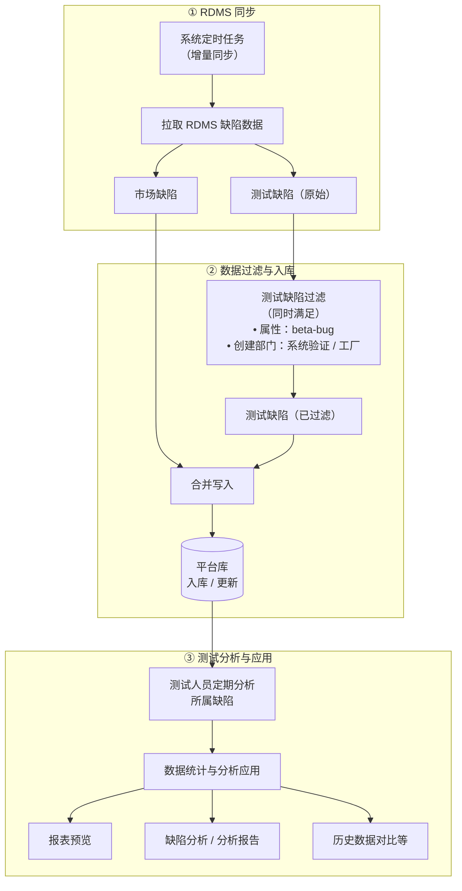

# 范例文档说明

> **文档类型**：需求规格说明书（SRS）**黄金范例**（文件名含 `-范例-市场缺陷分析`；同结构正式交付物命名为 **`ATO_V1.0.1-P5-市场缺陷分析-需求规格说明书.md`**，无 `-范例-`）。在本仓库流程中，**同结构的交付物即迭代级 PRD**：经 **产品经理审核定稿** 后，供 **研发**（方案与实现）、**测试**（验收、用例与回归口径）、**AI**（spec-coding / 辅助实现）使用。  
> **《页面需求与交互规格》的定位**（`ATO_V{X.Y.Z}-页面需求与交互规格.md`，路径示例 `docs/prd/V{X.Y.Z}/…`）：产品用于 **HTML 页面原型 / 线框落地** 的输入（布局、控件、§ 章节锚点）；**不是**替代上述 SRS 的「迭代产品唯一真源」。原型文档方便与本正文 **§ / REQ** 交叉对照，但 **研发、测试与实现验收口径以本需求规格说明书为准**。  
> **本范例的定位**：在「迭代需求清单 → 需求规格说明书（迭代 PRD）」链路上，约定章节结构、编号层级与写法深度；与迭代清单、（按流程取舍的）页面需求与交互规格、代码仓库一并用于 **方案拆分、编码、自测与测试设计**。**文档粒度（必读）**：**一份 SRS 仅覆盖迭代清单中的一个一级需求**；同一迭代多个一级需求须拆成多份 SRS。详见文末 **附录 E**。

**章节引用约定**：正文中的 `## 1.1`、`§1.1.x` **仅在本文档内有效**；跨文档沟通请使用 **文件名 + REQ-ID** 或 **文件名 + §**（示例：`ATO_V1.0.1-P5-市场缺陷分析-需求规格说明书.md` + **REQ-028**），避免口头简称「看 1.1」在多份 SRS 并存时混淆。

**编号约定**（正文 `##` / `###` / `####` 与清单列对应）：

- `## 1.1` — 对应迭代清单 **一级需求**
- `### 1.1.x` — 对应迭代清单 **二级需求**（能力簇或子模块）
- `#### 1.1.x.y` — 对应迭代清单 **三级需求**（子场景、关键步骤等；无三级时本节可省略）

**页面聚合（本稿 §1.1.2 补充说明）**

- 除 **§1.1.2** 仍以 **`####`** 聚合列表 Tab 内 **024～027** 等外，市场缺陷模块清单 **二级需求** 与 **`### 1.1.x`** 对应：**§1.1.1** 同步（022/023）；**§1.1.3～§1.1.7** 分别为缺陷详情（028）、缺陷信息查询（029）、报表统计（030）、数据导出（031）、分析报告能力簇（032～036）。  
- **§1.1.2** 仍将「市场缺陷列表」Tab 内 **024～027** 及 **工具条「保存」（§1.1.2.5，无独立 REQ-ID）** 以 **`#### 1.1.2.y`** 编排；**从列表点「报表」** 入口、快照与报表页逻辑见 **§1.1.5**；**REQ-031（导出）** 已单独成章 **§1.1.6**。

**需求描述结构（固定小节，勿删节）**：各功能点「• **需求描述：**」下须 **依次** 包含 **`1. **正常流程**` → `2. **异常场景**` → `3. **限制条件**`**。若当前能力无独立异常项，**仍须保留 `2. **异常场景**` 标题**，正文可 **留空**（不得整节删除，以免生成/审阅时缺字段）。**更完整的范例衍生写法**（含三级需求拆子功能、前置条件与异常分工等）见文末 **附录 D**，供编写提示词与 Cursor 规则时引用。

**验收基线**（版本通配，不绑定某一固定版本号）：

- **迭代级权威（研发 / 测试 / AI）**：**当前迭代已定稿的需求规格说明书**（与本范例同结构之交付物）。业务口径、验收勾选项、与 REQ-ID 对应的条文 **以实现与测试对本 SRS 为准**。  
- **REQ 覆盖（完整性）**：本稿所对应 **一级需求** 在迭代清单中的 **全部 REQ**，须在本 SRS 内有 **可定位条文**，或 **显式说明**（不适用、推迟至某迭代、合并至其他 REQ 等）并 **可追溯**；定稿前禁止清单内 REQ 无交代。  
- **页面交互规格（原型文档）**：路径形态 **`docs/prd/V{X.Y.Z}/ATO_V{X.Y.Z}-页面需求与交互规格.md`**。**凡本迭代已走 HTML 原型路径且已定稿页面交互规格者**，编写或修订本 SRS 时 **须对照**（§ 锚点、布局与控件形态）；**不得以「可选文档」为由跳过**。**不自动凌驾于**已定稿的需求规格说明书。无原型阶段，或未产出 / 未定稿该文档的迭代可缺省。  
- **裁决规则**：当 **页面交互规格**、**原型代码**、**迭代清单** 与本 SRS **冲突**时：**默认以已定稿的需求规格说明书（迭代 PRD）为准**，并 **回写**页面交互规格或升版 SRS（按变更流程）；若团队临时决议以原型为准，须在 SRS 或变更记录中 **显式记载**。歧义处可在正文引用页面文档 § 仅作 **对照索引**，不替代 SRS 条文。  
- **外部系统 / 接口边界**：以前端 **可观测行为**（页面交互、提示、禁用态、列表与报表展示）与本文业务口径为准；**RDMS 字段语义、同步与过滤口径、接口契约** 以 **接口文档、RDMS 数据字典或后台权威定义** 为准。若本 SRS 与后台可实现性冲突，按变更流程 **修订 SRS 或调整接口**；**禁止**在实现中 **silent drift**（未留痕偏离条文）。  
- **本稿正文**：以下「本稿绑定」仅便于对照路径与版本号。

**文档生成依据**（编写或机器生成与本范例同结构的 **需求规格说明书 / 迭代 PRD** 时，应 **同时** 打开并对照以下材料，并在交付物中可追溯引用）：

1. **迭代需求清单**：`docs/prd/V{X.Y.Z}/ATO_V{X.Y.Z}迭代需求清单.md`（文件名以仓库约定为准；重点为一级→二级→三级列与「需求说明 / 需求动机」）。
2. **迭代页面需求与交互规格**（按流程取舍）：同版本目录下的 **`ATO_V{X.Y.Z}-页面需求与交互规格.md`** — 与上文 **验收基线** 中「页面交互规格」**同口径**：**已定稿** 则编写 / 修订本 SRS 时 **须对照**（§ 与控件形态）；**未走 HTML 原型路径** 或 **未产出 / 未定稿** 该文档的迭代可缺省。可将 § 写入 SRS 正文作索引，**条文与验收以 SRS 为准**。
3. **原型页面与代码逻辑**：对应该迭代的前端实现（典型路径：`src/pages/`、`src/components/`、`src/utils/`、`src/constants/`、`src/types/`、`src/mocks/`、`src/router/` 等），用于核对 **可观测验收点**；**业务与验收口径以已定稿的需求规格说明书为准**；代码与 SRS 不一致时按缺陷/变更流程处理（修订 SRS 或修正代码）。

**本稿绑定（对照用）**：版本 **V1.0.1-P5**；市场缺陷相关 **REQ-022～036**；若落盘为正式迭代 PRD，建议路径 **`docs/prd/V1.0.1-P5/ATO_V1.0.1-P5-市场缺陷分析-需求规格说明书.md`**；页面交互规格（原型）：`docs/prd/V1.0.1-P5/ATO_V1.0.1-P5-页面需求与交互规格.md`；迭代清单：`docs/prd/V1.0.1-P5/ATO_V1.0.1-P5迭代需求清单.md`；代码主线示例：`MarketDefectAnalysis.tsx`、`MarketDefectListTab.tsx`、`MarketDefectAnalysisTasksTab.tsx`、`MarketDefectReportPage.tsx`、`MarketDefectReportDetailPage.tsx` 及关联 `components/`、`constants/`、`utils/`。

---

# 1 需求说明

## 1.1 市场缺陷分析

### 模块概述

本模块支持缺陷分析工作，包含对市场缺陷和相关测试缺陷数据的集中管理与分析流程：用户可以分析缺陷，发送缺陷分析报告邮件，以及导出分析报告。

**解决的问题**：替代人工导出 Excel、重复做月季报图表、历史口径难留存与对比等问题；支撑 **归因、改进闭环与管理视角统计**。

**目标用户**：测试工程师、质量工程师、测试/研发管理者（本迭代页面 PRD 约定 **不按角色隐藏写操作**，权限细化可后续迭代）。

**入口**：

- 主框架左侧菜单：**测试工具 → 市场缺陷分析** → 路由 `/tools/market-defects`（默认 Tab：**市场缺陷列表**）。
- 访问 `/tools` 时 **重定向** 至 `/tools/market-defects`（`replace`），兼容旧书签。
- **报表页**：`/tools/market-defects/report`（自列表 Tab 工具条「报表」进入）。
- **报告详情页**：`/tools/market-defects/reports/:reportId`（自「分析报告」Tab 报告名称链接等进入）。

**模块业务逻辑说明**：

以下用 **业务流程图** 描述从 RDMS 到分析应用的端到端链路；实现细节（调度周期、接口、字段枚举）以 **已定稿的本需求规格说明书（迭代 PRD）** 与 **RDMS 数据字典** 为准；**控件布局与 § 锚点** 可对照 **页面需求与交互规格（原型文档）**。

**说明**：

- **手动刷新**：列表「刷新」可在定时之外触发小范围同步，见下文 **#### 1.1.1.2（手动同步）** 与页面 PRD。  
- **创建部门口径（测试缺陷）**：与 RDMS **`创建部门`** 字段取值 **字面一致**，纳入同步的测试缺陷须为 **系统验证** 或 **工厂**（与流程图一致）。若 RDMS 后续扩展枚举，由数据对接/配置表维护，并同步修订本 SRS 与迭代清单 REQ-022。  
- **报表 / 分析报告 / 列表**：对应本模块内列表筛选、报表页、分析报告 Tab 与报告详情等能力，条文见页面 PRD **§3.3～§3.5**。

---

### 1.1.1 市场缺陷数据 RDMS 同步

本二级需求覆盖从 **RDMS** 拉取并刷新平台侧缺陷数据的机制，对应清单 **REQ-022、REQ-023**。

#### 1.1.1.1 定时同步（REQ-V1.0.1-P5-022）

• **背景与动机：**

将权威缺陷数据自动同步到平台，避免人工导出与重复统计；支持 **首次当季全量** 与 **之后每日增量 + 未关闭 Bug** 的持续同步，字段与列表展示一致。同步源口径：**RDMS 市场缺陷**、**测试 Bug**（属性 **beta-bug**，创建部门为 **系统验证**、**工厂** — 与 RDMS 字段字面一致）。

• **用户场景：**

作为质量人员，不需要每个月手动去RDMS导出缺陷数据。作为测试人员，每天都可以关注所属缺陷并进行分析，不用到每个月末集中投入时间分析

• **优先级：** 高

• **输入/前置条件：**

1. 平台与 RDMS 的地址、访问权限及接口均已配置并通过校验。
2. 列表字段模型已与 RDMS 字段映射（与 REQ-024 及页面 PRD 列口径一致）。

• **需求描述：**

1. **正常流程**

   1. 系统按策略执行首次全量与后续定时增量任务。  
   2. 同步完成后，列表查询可读到新数据（含未关闭 Bug 持续同步结果）。  
   3. 市场缺陷及测试缺陷同步时，字段信息以 RDMS 全量字段为准，列表展示时默认显示不可编辑范围内的对应字段。

2. **异常场景**

   a) **RDMS 不可用或超时**  
      i. 触发条件：接口超时、5xx、网络中断。  
      ii. 系统反馈：任务失败日志/监控告警（后端）；前端可在同步提示区展示失败摘要（若有）。  
      iii. 用户指引：稍后重试手动刷新；仍失败联系运维/RDMS 管理员。

3. **限制条件**

   a) **系统首次同步仅同步当季度数据**  
      i. 影响说明：避免测试人员重复分析历史数据，仅需关注当前季度。  
      ii. 扩展说明：后台可导入2026年已分析excel文档，无需平台端二次处理。

• **补充说明：**

- 具体 Cron、批大小、重试策略由 **接口/运维设计** 文档定义，本 SRS 只约束 **业务可见结果与字段一致性**。

• **验收标准：**

- [ ] 首次上线当季 **全量同步** 与之后 **每日定时增量** 策略可按环境配置并验证（或 Mock 验收用例通过）。  
- [ ] 同步后列表可展示与 RDMS 对齐的关键字段抽样一致（抽样规则在测试方案中定义）。  
- [ ] 失败场景有可追溯记录，不出现静默丢数。

---

#### 1.1.1.2 手动同步（列表刷新）（REQ-V1.0.1-P5-023）

• **背景与动机：**

定时同步后，当天仍可能有 bug 状态或信息发生变更。若测试人员当天需输出分析报告，可在列表中批量选择需关注的数据，点击「刷新」按钮，实时手动同步所选缺陷的数据与状态，满足用户对数据时效性的需求。

• **用户场景：**

作为测试工程师，我在列表中勾选刚关注的缺陷后点击「刷新」，希望触发一次 **针对选中行**（或 PRD 约定的批量范围）的同步刷新，以便尽快看到 RDMS 侧刚更新的状态。

• **优先级：** 高

• **输入/前置条件：**

1. 用户已登录。  
2. **至少勾选一行**（与页面 PRD：导出/刷新依赖行勾选 **一致**）。

• **需求描述：**

1. **正常流程**

   1. 用户在列表 Tab 勾选一行或多行。  
   2. 点击“刷新”按钮。
   3. 系统对选中范围发起同步/刷新请求。  
   4. 成功后更新对应行数据或整表刷新。

2. **异常场景**

   a) **未勾选行点击刷新**  
      i. 触发条件：`selectedRowKeys.length === 0`。  
      ii. 系统反馈：按钮 **disabled**（与页面 PRD §3.3 Tab1 工具条）。  
      iii. 用户指引：先勾选需刷新的行。

   b) **请求失败**  
      i. 触发条件：接口错误/超时。  
      ii. 系统反馈：`message.error` 或等价提示。  
      iii. 用户指引：重试；检查网络。

3. **限制条件**

   a) **市场缺陷列表-行勾选与导出**  
      i. 影响说明：刷新与导出共用「需勾选」规则。  
      ii. 关联逻辑：同一 `rowSelection` 状态。

• **补充说明：**

- 按钮文案为 **「刷新」**（不含「全局」二字，见页面 PRD §6 差异表）。

• **验收标准：**

- [ ] 无勾选时「刷新」「导出」均 **disabled**；有勾选后可用。  
- [ ] 失败有明确错误反馈；成功有成功反馈（Mock 可接受）。

---

### 1.1.2 市场缺陷列表

本节 **`####`** 覆盖列表 Tab 内 **列表展示与配置、过滤、编辑、工具条「保存」（仅列表刷新，§1.1.2.5）** 等，对应清单 **REQ-024～027**（另含 §1.1.2.5 无 REQ-ID 段落）。**从列表进入报表** 见 **§1.1.5**。**REQ-028（缺陷详情）**、**REQ-029（缺陷信息查询）** 见 **§1.1.3**、**§1.1.4**；**REQ-030（报表）** 见 **§1.1.5**；**REQ-031（导出）** 见 **§1.1.6**。  
其中 **时间维度（年/季/月）与表头筛选** 与页面 PRD **§3.3 Tab1** 对齐。**REQ-029 查询能力** 在本范例中 **收窄** 为「缺陷 ID 精确 + 缺陷描述模糊」且 **优先级低**（见 **§1.1.4**）；若与页面 PRD 中「多字段子串」表述不一致，以 **§1.1.4** 为准并回写 PRD。

#### 1.1.2.1 列表

• **背景与动机：**

满足用户缺陷预览，数据过滤，数据分析需求

• **用户场景：**

作为质量分析人员，我打开列表即可看到缺陷 ID、来源、标题、创建日期、产品线、是否有效问题、实际归属团队、责任与流出原因、自动化覆盖相关等列，无需每次自定义。

• **优先级：** 高

• **输入/前置条件：**

1. 已进入 **市场缺陷列表** Tab。  
2. 同步RDMS数据已就绪。

• **需求描述：**

1. **正常流程**

   1. 表格按页面 PRD **§3.3 Tab1「列顺序」** 展示：缺陷 ID、缺陷来源、缺陷标题、创建日期、产品线、缺陷归属团队，是否有效问题、**实际归属团队**、**缺陷类型**、主要责任归属、主要责任人、流出原因、优化措施、优化责任人、**完成进度**（0～100，进度条）、自动化是否覆盖、是否可覆盖、不可覆盖原因、自动化未发现原因、操作列。  
   2. **只读 / 可编辑分区底色**：缺陷 ID～缺陷归属团队 **浅灰**；是否有效问题～完成进度 **浅蓝**；自动化相关列 **浅绿**（页面 PRD）。  
   3. **冻结列**：左三列（缺陷 ID、来源、标题）与 **操作列** 固定；中间横向滚动。  
   4. 分页 `showTotal` 展示 **全量条数、筛选后条数、本页起止、已勾选条数**（页面 PRD）。

2. **异常场景**

   a) **同步字段值为空**  
      i. 触发条件：RDMS 同步后某字段无值、空串或未映射到展示列。  
      ii. 系统反馈：对应单元格 **显示为空**（与表格空字段风格一致；**不**因空值报错、不闪烁占位异常）。  
      iii. 用户指引：一般无需操作；若业务上该字段应有值，联系数据对接或 RDMS 维护方。

   b) **列表单元格字符串过长**  
      i. 触发条件：缺陷标题、说明类字段等 **同步后的文本** 超出列设计宽度。  
      ii. 系统反馈：采用 **截断 / 省略号**（如 `ellipsis`）展示，列宽遵循 PRD 与表头布局，**不因长文本撑开列或破坏整表栅格**；完整内容可通过 **`Tooltip` / `title`** 悬停查看（与页面 PRD 可观测交互一致）。  
      iii. 用户指引：需要全文时悬停查看；导出等场景按字段全量规则另行约定。

   c) **筛选后整表无数据**  
      i. 触发条件：时间 / 表头筛选 / 搜索组合后结果集为空。  
      ii. 系统反馈：`Empty` 与引导。  
      iii. 用户指引：放宽筛选或调整时间范围。

3. **限制条件**

   a) **列表列与 RDMS 详情弹层**  
      i. 影响说明：列字段应与详情弹层可解释字段一致。  
      ii. 关联逻辑：同一 `MarketDefect` 模型。

• **补充说明：**

- 清单原文「操作栏：自动化复盘分析」与已定稿 PRD **已移除** 该按钮；以页面 PRD **§6** 为准。  
- 「计划完成时间」等若清单与 PRD 列不完全一致，以 **页面 PRD + 工程表头** 定稿为准。

• **验收标准：**

- [ ] 列顺序、冻结、底色分区、分页 `showTotal` 与页面 PRD §3.3 Tab1 一致。  
- [ ] 完成进度以 0～100 展示且可 Tooltip。  
- [ ] 同步字段为空时单元格 **空展示**，不因空值产生错误态或异常占位。  
- [ ] 长文本类列 **截断 / 省略号** 展示，列宽不被撑破；悬停可查看全文（与 PRD/工程一致）。

---

#### 1.1.2.2 列表展示字段设置（REQ-V1.0.1-P5-025）

> **实现状态**：**暂不实现**（本迭代不交付；需求条目与 PRD 描述仍保留，供后续迭代启用。下文保留 **需求骨架**，便于生成 SRS 时对齐 REQ-025 与「延期」写法。）

• **背景与动机：**

不同角色关注字段不同，需支持列显隐与顺序配置。

• **用户场景：**

作为管理者，我仅关心责任归属与流出原因等列，希望通过列设置隐藏不常用列并保存个人视图。

• **优先级：** 低

• **输入/前置条件：**

1. 已进入列表 Tab。  
2. 列设置入口可用（页面 PRD：齿轮在 **表头「操作」列标题右侧**）。

• **需求描述：**

1. **正常流程**

   1. 用户点击列设置入口。  
   2. 在弹层/抽屉中调整列显隐、顺序（具体控件以 PRD 为准）。  
   3. 确认后表格即时生效；配置可持久化（实现期：本地存储或服务端）。

2. **异常场景**

   a) **至少保留一列数据列**  
      i. 触发条件：用户关闭全部列。  
      ii. 系统反馈：校验提示。  
      iii. 用户指引：至少保留一列。

3. **限制条件**

   a) **无** 或 与「导出列集合」策略一致时在导出需求中说明。

• **补充说明：**

- 入口位置以页面 PRD 为准（**不在**工具条主操作组末尾）。

• **验收标准：**

- [ ] **暂不验收**：本迭代 **不交付** 本能力；启用前不要求通过下列功能项。  
- [ ] **后续启用时**（规划）：列设置入口位置、显隐与顺序调整、确认后即时生效及持久化策略等，均以 **已定稿页面 PRD** 为准并补全本清单勾选项。

---

#### 1.1.2.3 列表信息过滤（REQ-V1.0.1-P5-026 + 时间维度）

• **背景与动机：**

满足用户快速、方便过滤需要展示的列表内容，方便进行查看、编辑，以及后续的报表分析

• **用户场景：**

作为测试人员或管理人员，我要按需（时间，归属等各个维度）查看、编辑缺陷信息，可以通过过滤功能快速的实现

• **优先级：** 高

• **输入/前置条件：**

1. 列表数据已加载。

• **需求描述：**

1. **正常流程**

   1. **时间过滤**：位于 **页面内容区** 列表 **左上方**；年、季、月 `Select`；默认当前系统日期对应年/季/月；均可选 **「全部」**；变更后，**第 1 页** 列表数据须 **同步更新**（与当前时间过滤条件一致）。  
      **季度与月份联动**：选定 **具体季度**（如 Q2）时，**月份** 下拉选项 **仅** 为该季度所含月份（如 **4、5、6 月**），用户 **无法** 选出与季度矛盾的月份，故 **不存在**「季/月非法组合」交互异常。仅当季度为 **「全部」** 时，月份方可选择 **当年 1～12 月** 或 **「全部」**（选项集合随季度变更即时联动，与工程 `getMarketDefectDataRangeMonthOptionsByQuarter` 等逻辑一致）。  
   2. **表头筛选**（与列绑定）：**是否有效问题**、**缺陷归属团队**、**实际归属团队**、**主要责任归属** — `filterDropdown` + 重置；与搜索同一套过滤状态（页面 PRD）。  
   3. 过滤结果与分页联动。

2. **异常场景**

3. **限制条件**

   a) **市场缺陷报表页**  
      i. 影响说明：报表读取列表快照中的年/季/月及表头筛选初值。  
      ii. 关联逻辑：见 **§1.1.5** 与页面 PRD **§2.2**。

• **补充说明：**

- 清单 REQ-026 曾列「产品线」等顶部筛选；已定稿为 **表头 + 搜索** 分工，见页面 PRD **§6**。  
- 表头筛选若包含 **缺陷归属团队**，跳转报表时 **`sessionStorage` 快照**须一并携带该维度（字段名与页面 PRD **§7.1**、类型 `MarketDefectListSnapshot` 对齐）。

• **验收标准：**

- [ ] **时间过滤**（年/季/月）：默认值、**「全部」**、变更后第 1 页同步刷新，与 PRD 一致。  
- [ ] **表头筛选**：**是否有效问题**、**缺陷归属团队**、**实际归属团队**、**主要责任归属** 等列具备 `filterDropdown`（或等价交互）、**重置** 可用；筛选项与数据枚举一致；变更任一项后列表按条件过滤、**与同一套搜索/分页状态联动**（见页面 PRD）。  
- [ ] 变更**时间过滤**或**表头筛选**后，页码重置为第 1 页且列表数据与当前筛选条件一致。  
- [ ] 季度与月份 **联动绑定**：具体季度下月份选项范围正确；季度为「全部」时月份可选范围符合约定。

---

#### 1.1.2.4 列表编辑（REQ-V1.0.1-P5-027）

• **背景与动机：**

支持测试人员在数据筛选后，直接在列表中对可编辑字段进行修改与编辑操作。

• **用户场景：**

作为缺陷复盘负责人，我在列表中双击某行的「流出原因」「优化措施」等字段，在单元格内确认后即 **提交保存**，无需单独表单页。

• **优先级：** 高

• **输入/前置条件：**

1. 行处于非加载状态。  
2. 用户有写权限（本迭代 **不区分角色**，页面 PRD §1.5）。

• **需求描述：**

1. **正常流程**

   1. 自「是否有效问题」至「自动化未发现原因」（不含操作列）：**双击**进入编辑。  
   2. **优化措施**：`Input` 文本，**blur / Enter** 确认行内修改并退出编辑；确认时 **立即向服务端提交**（单字段/单行更新，接口契约以实现为准）。  
   3. **完成进度**：数字 + 进度预览，**确定 / Enter** **提交**并退出；**取消** 放弃本次对该字段的修改（**不提供 Esc 快捷键取消**，与本节下文一致）。  
   4. **`Select` 类可编辑列**：选中选项后 **退出单元格编辑态**（收起下拉）；选项变更 **立即提交**（同上行内编辑落库语义）。可选项：**实际归属团队** 来自 **基础数据 · 团队管理**（团队名称）；**主要责任人**、**优化责任人** 来自 **基础数据 · 用户管理**（用户姓名）——**上述两类不在 SRS 中逐项枚举**，开发与验收以 **基础数据源 / 接口返回全量** 为准；Mock 阶段可与 **`src/mocks/data.ts`** 的 `mockTeams`、`mockUsers` 对齐自测。**其余字段** 为业务侧固定或配置枚举，下表第三列给出 **中文枚举**（与 **`src/constants/marketDefectMockOptions.ts`** 及页面 Mock 一致）。**整表按当前筛选重新拉取 / 重算** 不由单元格提交触发，见「限制条件」b）及 **§1.1.2.5** 工具条「保存」。  
      | 列表字段（列标题） | 可选项来源 | 中文枚举 / 说明 |
      | --- | --- | --- |
      | 是否有效问题 | 业务固定枚举（`MARKET_DEFECT_YES_NO_OPTIONS`） | **是**、**否** |
      | 实际归属团队 | **基础数据 · 团队数据**（团队名称）；Mock：`mockTeams` | **不枚举**，与团队基础数据全量一致 |
      | 缺陷类型 | 业务枚举（`MARKET_DEFECT_TYPE_OPTIONS`） | **功能问题**、**性能问题**、**兼容问题**、**安全问题**、**需求问题**、**重复问题** |
      | 主要责任归属 | 业务枚举（`MARKET_DEFECT_MAIN_RESP_ATTRIBUTION_OPTIONS`） | **产品**、**开发**、**测试**、**运维** |
      | 主要责任人 | **基础数据 · 用户数据**（用户姓名）；Mock：`mockUsers` | **不枚举**，与用户基础数据全量一致 |
      | 流出原因 | 业务枚举（`MARKET_DEFECT_LEAKAGE_REASON_OPTIONS`） | **需求导入缺失或错误**、**设计实现缺失或错误**、**用例设计缺失或错误**、**验证方案缺失或错误**、**环境配置问题**、**产品使用问题**、**升级部署执行异常** |
      | 优化责任人 | **基础数据 · 用户数据**（用户姓名）；与「主要责任人」同源 | **不枚举**，与用户基础数据全量一致 |
      | 自动化是否覆盖 | 业务固定枚举（`MARKET_DEFECT_YES_NO_OPTIONS`） | **是**、**否** |
      | 是否可覆盖 | 业务固定枚举（`MARKET_DEFECT_YES_NO_OPTIONS`） | **是**、**否** |
      | 不可覆盖原因 | 业务枚举（`MARKET_DEFECT_UNCOVERED_REASON_OPTIONS`） | **—**、**无**、**现网证书链差异不可在测试环境完全模拟**、**历史版本字段与现网不一致** |
      | 自动化未发现原因 | 业务枚举（`MARKET_DEFECT_AUTO_MISS_REASON_OPTIONS`） | **—**、**无**、**脚本未调度夜间压测**、**视觉回归未包含该弹窗状态**、**安全扫描规则未覆盖该接口**、**未覆盖弱网双击提交**、**实车路测样本不足** |
      
      业务枚举列若有增减或文案变更，须在迭代评审中同步更新本表与 `marketDefectMockOptions.ts`。  
   5. **列表右上方「保存」**：**不**承担「将行内修改批量提交」——行内修改已在上一款 **确认时即提交**。该按钮语义为 **触发整表数据刷新**，见 **§1.1.2.5**。  

2. **异常场景**

   a) **校验失败**  
      i. 触发条件：非法数字、必填为空等。  
      ii. 系统反馈：表单项错误提示。  
      iii. 用户指引：按提示修正。

   b) **提交接口失败**  
      i. 触发条件：409/500 等。  
      ii. 系统反馈：错误提示，保留编辑态或回滚（以后端契约为准）。  
      iii. 用户指引：重试。

3. **限制条件**

   a) **只读列**（缺陷 ID～缺陷归属团队，与 §1.1.2.1 底色分区一致）  
      i. 影响说明：不可就地编辑。  
      ii. 关联逻辑：RDMS 权威字段只读展示。

   b) **未点击工具条「保存」前不因编辑触发整表按筛选即时重筛**  
      i. 影响说明：用户在表头等筛选条件下查看列表；若在行内修改了会影响筛选匹配的字段（例如表头筛选 **实际归属团队 = S17**，将该行改为 **中台**），在 **单元格已提交成功** 之后、用户 **未** 点击列表右上方 **「保存」** 触发整表刷新之前，列表 **不得** 仅因本次提交而 **立即** 按当前筛选条件整表重算并 **隐藏/剔除** 该行，以免尚未核对就失去了上下文（可与前端「本地行补丁」策略一致）。  
      ii. 关联逻辑：**服务端持久化** 在 **单元格确认** 时完成；**整表按当前时间过滤、表头筛选、搜索、分页等条件重新拉取 / 重算** 在用户点击工具条 **「保存」** 时执行（§1.1.2.5），刷新后若与筛选不符，行不再出现属预期。  
      iii. 用户指引：需与权威数据或筛选结果对齐时，点击工具条 **「保存」** 触发刷新。

• **补充说明：**

- 可编辑列集合以页面 PRD 为准；清单列出的字段若有增减，以 **字段表评审** 更新。  
- 若已定稿页面 PRD 仍描述为「工具条保存才落库」或「待保存草稿」，须以 **本节「单元格确认即提交 + 工具条保存仅整表刷新」（§1.1.2.5）** 为准回写 PRD，避免与验收冲突。

• **验收标准：**

- [ ] 双击编辑行为与控件类型（Input/Select/进度）符合页面 PRD。  
- [ ] **团队 / 用户来源列**：下拉选项与 **基础数据**（Mock：`mockTeams` / `mockUsers`）或线上接口全量一致，**不要求**与本表第三列逐项对照。  
- [ ] **业务枚举列**：下拉与上表第三列及 **`marketDefectMockOptions`** 一致，无缺项、错绑。  
- [ ] 成功/失败反馈明确。  
- [ ] 单元格确认后变更已 **提交**（成功/失败反馈明确）；修改会影响筛选匹配的字段后，在点击工具条「保存」触发整表刷新前，列表 **不因整表即时重筛而无故丢掉当前行上下文**（与限制条件 b）一致）。  
- [ ] 点击工具条 **「保存」** 后执行 **整表刷新**，展示结果与当前时间过滤、表头筛选、搜索、分页一致（见 §1.1.2.5）。

---

#### 1.1.2.5 列表保存（工具条「保存」——整表刷新）

• **背景与动机：**

列表工具条提供 **「保存」** 按钮。其与 **§1.1.2.4 列表编辑** 的关系为：**行内编辑在单元格确认时已提交服务端**，本按钮 **不负责** 再将修改「批量提交」。用户点击 **「保存」** 用于 **主动触发一次列表数据刷新**（按当前检索条件重新拉取或等价整表重算），以便与后端权威状态对齐或刷新筛选结果展示。

• **用户场景：**

作为用户，我在列表中完成若干单元格编辑并已各自提交后，仍希望 **统一刷新整张表**；或调整筛选条件后期望 **立刻重新加载列表**，点击工具条「保存」触发刷新。

• **优先级：** 中（Mock 阶段可为 Toast + `refetch`，实现期对齐接口）

• **输入/前置条件：**

1. 已在列表 Tab（当前路由与市场缺陷列表上下文一致）。

• **需求描述：**

1. **正常流程**

   1. 用户点击工具条 **「保存」**。  
   2. 系统按 **当前时间维度、表头筛选、搜索关键字、分页** 等与 §1.1.2.3 / §1.1.4 一致的请求参数 **重新请求列表数据**（或工程约定的等价刷新语义）。  
   3. 刷新过程中列表区域呈现 **加载态**；成功后更新表格数据并 **`message.success`** 或可配置的轻提示（Mock 可接受）；失败见异常场景。

2. **异常场景**

   a) **刷新请求失败**  
      i. 触发条件：网络错误、接口 4xx/5xx。  
      ii. 系统反馈：错误提示；列表保留刷新前数据或可配置清空策略（以实现 / PRD 为准）。  
      iii. 用户指引：检查后重试。

3. **限制条件**

   a) **与列表编辑的职责划分**  
      i. 影响说明：**不得**将本按钮定义为「批量提交行内草稿」的主路径；批提交若存在须另行约定（与本范例语义冲突时以本节为准）。  
      ii. 关联逻辑：**§1.1.2.4**。

   b) **报表入口**  
      i. 影响说明：**勿在本节约定「报表」按钮**；从列表进入报表页、快照写入 `sessionStorage` 与路由跳转见 **§1.1.5（REQ-030）** 及页面 PRD **§3.3 Tab1 / §3.4**。  
      ii. 关联逻辑：报表数据集快照字段须与列表检索状态对齐。

• **验收标准：**

- [ ] 点击「保存」必触发列表 **重新加载**（网络请求或可观测的数据刷新）。  
- [ ] 刷新后表格内容与当前筛选条件一致；加载中与失败状态符合页面 PRD。

---

### 1.1.3 缺陷详情（REQ-V1.0.1-P5-028）

• **背景与动机：**

点击缺陷 ID 查看与 RDMS Bug 详情页 **信息等价** 的内容，减少外跳。

• **用户场景：**

作为分析人员，我点击缺陷 ID，希望在弹框中阅读完整描述、状态、附件元数据等（字段以 RDMS 为准），以便对缺陷进行分析。

• **优先级：** 中

• **输入/前置条件：**

1. 列表已展示该缺陷 ID。

• **需求描述：**

1. **正常流程**

   1. 用户点击 **缺陷 ID** 链接。  
   2. 打开 `Modal` 展示详情（首版工程为 **Mock HTML 结构**，**不**嵌入生产环境 RDMS `iframe`，见页面 PRD **§6**）。  
   3. 关闭弹层返回列表。

2. **异常场景**

   a) **RDMS 查询失败**  
      i. 触发条件：接口报错或缺陷已删除。  
      ii. 系统反馈：错误提示或「未找到」。  
      iii. 用户指引：核对 ID 或到 RDMS 核查。

3. **限制条件**

   a) **安全与合规**  
      i. 影响说明：首版不加载外域生产 URL。  
      ii. 关联逻辑：后续对接真实 RDMS 时再评审嵌入策略。

• **补充说明：**

- P5 Mock 阶段验收以 **结构完整、可关闭、无脚本错误** 为主。

• **验收标准：**

- [ ] 点击缺陷 ID 必出弹层；关闭无残留遮罩。  
- [ ] 失败路径有提示。

---

### 1.1.4 缺陷信息查询（REQ-V1.0.1-P5-029）

• **背景与动机：**

在时间过滤与表头筛选已能满足大部分检索场景的前提下，搜索框作为 **低频补充**：仅在 **当前列表结果集**（已应用时间与表头筛选后的数据）内，支持 **缺陷 ID 精确查询** 或 **缺陷描述模糊查询**，用于快速收窄到单条或少量缺陷。

• **用户场景：**

作为用户，我已用时间与表头筛选缩小范围；仍需用搜索框输入 **完整缺陷 ID** 唯一定位，或输入 **描述关键字** 做模糊查找。

• **优先级：** 低（主路径依赖 §1.1.2.3 **时间过滤 + 表头筛选**）

• **输入/前置条件：**

1. 列表数据已加载。

• **需求描述：**

1. **正常流程**

   1. 工具条 **单一** `Input.Search`（位置与页面 PRD Tab1 工具条一致）。  
   2. **查询语义（仅此两种，不支持其它列的多字段子串）**：  
      - **缺陷 ID — 精确**：输入内容与缺陷 ID **全字匹配**（或按产品约定「去首尾空格后完全相等」）；命中 0 或 1 条为主路径，多条同号冲突按数据治理规则处理。  
      - **缺陷描述 — 模糊**：当判定输入 **不是**「仅缺陷 ID 查询」时，按 **缺陷描述** 字段做 **子串 / 包含** 匹配（缺陷描述若与列表列「缺陷标题」等同义映射，以实现与 RDMS 字段对齐为准）。  
   3. 占位文案须明示：**「缺陷 ID 精确 / 缺陷描述模糊」**（文案可微调，语义不变）。  
   4. 支持 **Enter** 触发检索；清空搜索框则撤销搜索条件，列表回到「仅时间 + 表头筛选」结果。

2. **异常场景**

   a) **无匹配**  
      i. 触发条件：关键词无结果。  
      ii. 系统反馈：`Empty`。  
      iii. 用户指引：修改关键词或清空搜索。

3. **限制条件**

   a) **报表数据集**  
      i. 影响说明：报表页快照中的 `search.text` 与本节语义一致（仍为一个字符串）。  
      ii. 关联逻辑：见 §1.1.5。

• **补充说明：**

- **不要求** 匹配责任人姓名、创建时间字符串或其它列表列的多字段子串；此类需求改走筛选或导出后再分析。

• **验收标准：**

- [ ] 仅验证 **缺陷 ID 精确** 与 **缺陷描述模糊** 两类行为；**不**验收「全列子串」等多字段检索。  
- [ ] Enter 可触发查询；清空搜索恢复仅时间与表头筛选下的列表。

---

### 1.1.5 市场缺陷数据统计及报表展示（REQ-V1.0.1-P5-030）

• **背景与动机：**

支撑用户按统计维度查看缺陷分布；从 **当前生效的数据范围**（列表快照 **或** 默认时间 + 「全部」类筛选项）界定统计集合，按多种维度生成 **图 + 表** 的报表（首版不接 `@ant-design/charts`）。

• **用户场景：**

作为用户，我可 **直接打开报表页**，或在列表做过筛选后 **再进入报表**；勾选报表类型并生成，查看饼图/柱状图与占比表。**不要求**先在列表勾选缺陷行或先做筛选。

• **优先级：** 中

• **输入/前置条件：**

1. **时间维度（年 / 季 / 月）** 在报表页 **默认必有**（取值来源于 **应用默认常量**、或与最近一次 **列表会话快照** 合并后以页面 PRD **§3.4 / §7.1** 为准），**不得**出现「无时间配置」而不可展示数据范围的情形。  
2. **列表快照（可选）**：用户从列表点「报表」时，可将当前列表检索状态写入 **`sessionStorage`**（键名 **`ato:market-defects:list-snapshot`**，与 `MARKET_DEFECTS_LIST_SNAPSHOT_STORAGE_KEY` 一致），便于报表左侧继承同年/季/月及表头筛选语义。**直开报表 URL 时若无快照**，仍以上述 **默认时间维度 + 「全部」类筛选项（或未筛选语义）** 进入交互，**不**视为异常、**不**阻断页面。快照 JSON 字段形态（含 **是否有效问题**、**缺陷归属团队**（若有）、**实际归属团队**、**主要责任归属**、`search.text`、`page` / `pageSize` 等）以页面 PRD **§7.1-4** 与类型定义为准。

• **需求描述：**

1. **正常流程**

   1. 进入报表页：左侧 **数据范围** **首行只读展示时间（年 / 季 / 月）**——**有列表快照时**与快照一致；**无快照时**展示应用约定的 **默认时间组合**（须非空）。**实际归属团队**、**是否有效问题** 下拉默认 **「全部」**，可与快照初值合并（「全部」表示不额外收窄）；用户在列表是否勾选行、是否施加表头筛选 **均不作为**能否进入本页的门槛。  
   2. 左侧 **报表类型**：纵向 `Checkbox.Group`；选项 **固定顺序**（与页面 PRD **§3.4**、常量 **`MARKET_DEFECT_REPORT_TYPE_OPTIONS`** 完全一致，**不可拖拽重排**）；支持 **全选 / 取消全选**。可选类型 **枚举如下（共 11 项，自上而下即生成块顺序）**：  
      1. 总缺陷数  
      2. 按是否有效  
      3. 按产品线  
      4. 按实际归属团队  
      5. 按缺陷类型  
      6. 按责任归属  
      7. 按流出原因  
      8. 按是否自动化覆盖  
      9. 按自动化未覆盖原因  
      10. 按自动化未发现原因  
      11. 按自动化不可覆盖原因  
   3. 用户点击 **「生成报表」**：  
      - **未勾选任何类型**：提示至少选择一种报表类型（如 `message.warning`），**不**刷新右侧结果区，保持生成前空态或上次结果（以实现为准）。  
      - **已勾选至少一项**：基于 **当前生效的数据范围**（时间 + 报表页左侧 **实际归属团队 / 是否有效问题** 覆盖项；若存在列表快照则与其检索语义对齐，若无快照则按默认全集或未筛选语义）得到 **统计用缺陷集合**（工程参考 `filterDefectsForReport`）；仅针对 **已勾选** 的类型，按上款 **固定枚举顺序** 生成报表块集合（块顺序 **不随勾选先后变化**）。成功后给出成功反馈（Mock 可在 Toast 中带 **已选维度数量**、**纳入统计的缺陷条数** 等摘要）。  
   4. **生成后的右侧输出（「默认」Tab）**：  
      - 顶部 **`Alert`** 文案与页面 PRD **§3.4** 一致（标明统计口径：**若有列表快照则对应列表检索边界；若无快照则说明基于默认数据范围 / 全集**，二者表述以 PRD 定稿为准）。  
      - 下方可滚动内容区内，按 **上述枚举顺序** 仅渲染 **已勾选类型** 对应的报表块：每一块为 **`Card`**，**标题**为该报表类型文案；**主体布局**为 **左侧约 2/3 预留图区 + 右侧约 1/3 占比/明细表**（Mock 阶段为占位图 + `Table`，首版不接 `@ant-design/charts` 时仍以 PRD / 代码可观测形态为准）。  
   5. **「饼图」「柱状图」Tab**：与「默认」Tab 共用同一次生成结果；在同一批报表块上切换 **饼图 / 柱状图** 可视化形态（块顺序仍与枚举固序一致）。  
   6. **「折线图」Tab**：当前迭代为占位能力——若所选维度未配置折线数据，展示 **`Empty`** 及说明文案（与页面 PRD / 工程一致）；**不**因此而清空其它 Tab 已生成内容。  
   7. **返回**列表：若会话中存在列表快照则恢复对应时间 / 表头筛选 / 搜索 / 分页；若无快照则回到列表默认态（以实现 / PRD 为准）。

2. **异常场景**

   a) **折线图 Tab 无可用维度**  
      i. 触发条件：未配置折线。  
      ii. 系统反馈：`Empty` 说明（页面 PRD）。

3. **限制条件**

   a) **市场缺陷列表**  
      i. 影响说明：统计集 = 列表过滤逻辑 `filterDefectsForReport`（工程）对齐结果。  
      ii. 关联逻辑：见页面 PRD **§2.2**。

• **补充说明：**

- REQ-030 清单原文与 PRD 脚注差异（增补维度、文案「按是否自动化覆盖」）以 **页面 PRD §3.4** 为准。  
- **列表工具条分工**：用户在 **市场缺陷列表** Tab 点击 **「报表」**，按页面 PRD **§3.3 Tab1 / §3.4** **可选**写入 **`sessionStorage`** 快照（键名见上文前置条件）并跳转 **`/tools/market-defects/report`**，用于 **延续**列表检索边界；**进入报表页并非必须先经列表**，亦 **不因缺少快照而阻断**。**工具条「保存」仅触发列表整表刷新**，见 **§1.1.2.5**，**不是**报表入口、也不写入报表快照。

• **验收标准：**

- [ ] 11 类报表维度顺序与生成块顺序一致。  
- [ ] 右侧内容区内部滚动、左侧 `sticky` 与 PRD 一致。  
- [ ] **直开报表路由**：仍具备 **有效默认时间维度展示**，可勾选类型并完成「生成报表」全流程；**无**「必须先回列表检索」类阻断。  
- [ ] **报表数据实时性**：首次「生成报表」后，若在列表或其它入口 **修改了纳入统计范围的缺陷数据**（含就地编辑落库等），用户 **再次点击「生成报表」**（未改勾选亦可再次生成）时，统计结果须基于 **服务端 / 数据库最新数据** 重新聚合展示，**不得**沿用仅存在于前一次生成时刻的前端缓存或过期快照而不刷新。

---

### 1.1.6 市场缺陷数据导出（REQ-V1.0.1-P5-031）

• **背景与动机：**

支持线下分析与留档。

• **用户场景：**

作为分析人员，我勾选关注的缺陷后导出为 Excel（默认），选择导出范围与编码 UTF-8。

• **优先级：** 低

• **输入/前置条件：**

1. **至少勾选一行**（与刷新同规则）。

• **需求描述：**

1. **正常流程**

   1. 点击「导出」打开 `Modal`：文件类型（默认 Excel）、导出范围（全部或按时间、实际归属团队等——与 PRD/实现一致）。  
   2. 确认后下载文件（Mock 可仅 Toast）。

2. **异常场景**

   a) **未勾选**  
      i. 触发条件：无选中行。  
      ii. 系统反馈：导出按钮 **disabled**。

   b) **导出超时**  
      i. 触发条件：数据量过大。  
      ii. 系统反馈：进度或失败重试提示（实现期）。

3. **限制条件**

   a) **导出范围与时间筛选**  
      i. 影响说明：导出集应与当前列表过滤条件一致或有明确范围选项。  
      ii. 关联逻辑：避免导出与所见不一致。

• **补充说明：**

- 默认编码 **UTF-8**（清单要求）。

• **验收标准：**

- [ ] 无勾选不可导出；有勾选可完成流程（Mock 可接受）。  
- [ ] 弹窗字段与清单/PRD 一致。

---

### 1.1.7 市场缺陷分析报告

本二级需求为 **能力簇名称**，对应 UI **「分析报告」** Tab 与 **报告详情** 子路由；三级条目对应 **REQ-032～036**。

#### 1.1.7.1 创建缺陷分析报告（REQ-V1.0.1-P5-032）

• **背景与动机：**

将分析参数固化为 **可追踪任务**，输出 HTML 分析报告（及后续详情页预览/导出/邮件）。

• **用户场景：**

作为质量负责人，我点击「创建缺陷分析报告」，填写报告名称、归属团队、数据范围、RDMS 产品、三方负责人并提交，生成一条 **进行中** 任务并最终 **已完成**。

• **优先级：** 高

• **输入/前置条件：**

1. 在 **分析报告** Tab。  
2. 缺陷列表数据已分析完成。

• **需求描述：**

1. **正常流程**

   1. 点击 **「创建缺陷分析报告」** 打开 `Modal`。  
   2. 表单字段（带 * 必填，页面 PRD §3.3 Tab2）：报告名称*；报告归属团队*；数据范围*（年/季/月/实际归属团队，必填）；**RDMS 产品 ID** *（多选至少一项）；**产品负责人 / 开发负责人 / 测试负责人** *。 
   3. **不在弹窗勾选报表类型**；后台固定 **`MARKET_DEFECT_ANALYSIS_REPORT_FIXED_TYPES`**。  
   4. 确认创建 → 列表出现新任务（Mock）。

2. **异常场景**

   a) **RDMS 产品未选**  
      i. 触发条件：多选为空。  
      ii. 系统反馈：表单校验错误。  
      iii. 用户指引：至少选一项。

3. **限制条件**

   a) **市场缺陷列表数据范围常量**  
      i. 影响说明：年季月选项应与列表一致。  
      ii. 关联逻辑：共用常量函数。

• **补充说明：**

- **RDMS 产品 ID**：创建弹窗中的 **RDMS 产品 ID**（多选至少一项）用于 **锚定统计所依据的产品边界**。系统须能根据所选 **产品 ID**，在生成报告及后台统计时从 **RDMS（或与之对齐的缺陷权威源）** 拉取/汇总 **该产品下由测试提交的 Bug 总量** 等指标，为报告正文中的 **数据统计、泄漏率与其它派生计算** 提供 **可核对的权威数据基础**；具体接口形态、字段命名与枚举来源以页面 PRD 及接口契约为准。

• **验收标准：**

- [ ] 必填校验齐全；创建后任务出现在 Tab2 列表。  
- [ ] 无「报表类型」弹窗勾选项。  
- [ ] **RDMS 产品 ID**：多选必选校验生效；选项与提交载荷中的产品 ID 集合可追溯、与接口契约（如字段名、多选序列化）一致。  
- [ ] **与 RDMS 数据一致性**：在 **接口契约验收**（含 **YApi** 等进行的用例分析、联调与结论确认）完成后，对报告任务产出中的 **汇总类指标**（尤其依赖「所选 RDMS 产品 ID」从 RDMS 统计的 **测试提交 Bug 数量** 等）执行比对，结果须与 **RDMS 同源口径**一致，或符合 PRD/数据说明中明示的 **允许误差与四舍五入规则**。

---

#### 1.1.7.2 分析任务列表与操作（REQ-V1.0.1-P5-033）

• **背景与动机：**

任务化管理与复用：查看状态、编辑、重新生成、发邮件、删除等。

• **用户场景：**

我在列表中可以看到任务的状态为 **进行中 / 已完成 / 异常**，在允许的状态下可以点击重新生成、邮件或编辑任务。

• **优先级：** 高

• **输入/前置条件：**

1. 已有分析报告任务。

• **需求描述：**

本子需求为三级条目 **REQ-033**；列表 **操作列** 含多项子功能时，在 **「正常流程」** 内按下述 **2～5** 分节说明（**1** 为列表壳与全局可用性）。

1. **正常流程**

   **1. 列表展示与筛选**

   - **列**：报告名称（`Link` 至详情）、报告归属团队、创建人、创建时间、**有效缺陷总数**、**产品缺陷泄漏率**、**测试缺陷泄露率**、状态等（页面 PRD / `AnalysisReportTask`）。  
   - **工具条**：**报告归属团队** 筛选（`mockTeams` +「全部」）。  
   - **操作列**：**仅图标 + Tooltip** 四个入口；交互细则见下列 **2（编辑）**、**3（重新生成）**、**4（邮件发送）**、**5（删除）**。

   **全局状态与按钮可用性**（页面 PRD **§1.5**，下列 **3～5** 优先服从本款）：**进行中** — 「重新生成」「发送邮件」「删除」均 **disabled** 并配 Tooltip；**已完成** 或 **异常** — 允许「重新生成」，任务重新进入 **进行中**；**异常** — 「发送邮件」**disabled**（Tooltip「异常状态不可发送邮件」）；**已完成** — 「发送邮件」可用。「编辑」是否与状态联动禁用以页面 PRD **§3.3 Tab2** 为准（若未另述，可与任务状态解耦）。

   **2. 编辑**

   - 点击操作列 **编辑** 图标（Tooltip「编辑」等，以 PRD 为准）：打开 **编辑 `Modal`**，可编辑字段集合、校验与落库接口与页面 PRD **§3.3 Tab2** 一致（可与创建表单字段对齐或为子集）。  
   - 用户确认保存：关闭 Modal，`message.success`（Mock）或等价反馈，并刷新列表对应行。

   **3. 重新生成**

   - 在 **已完成** 或 **异常** 状态下可用；**进行中** 下按钮 **disabled**（见全局规则）。  
   - 点击后：任务状态置 **进行中**，触发后台按任务参数 **重新生成 HTML 报告**（轮询或推送以实现为准）；完成后列表状态变为 **已完成** 或 **异常**（页面 PRD **§1.5**、§3.3 Tab2）。

   **4. 邮件发送**

   - 在 **已完成** 状态下可用；**进行中 / 异常** 下 **disabled**（见全局规则）。  
   - 点击 Tab2 操作列 **「发送邮件」** 打开 **`MarketDefectSendMailModal`**。**弹层字段、校验、确认 / 取消与详情页入口共用同一套交互**，条文 **不重述**，统一见 **§1.1.7.5（REQ-036）** 及页面 PRD **§1.5**。

   **5. 删除**

   - **进行中**：「删除」**disabled**，**不**弹出确认框。  
   - **非进行中**：点击「删除」→ **`Modal.confirm`**，推荐文案 **「此操作不可恢复，是否继续？」**；确认后调用删除接口，成功后从列表移除并反馈。

2. **异常场景**

   a) **进行中删除**  
      i. 触发条件：点击删除。  
      ii. 系统反馈：按钮 **disabled**。  
      iii. 用户指引：待任务结束再删。

3. **限制条件**

   a) **报告详情**  
      i. 影响说明：报告名称链接进入详情。  
      ii. 关联逻辑：路由 `/tools/market-defects/reports/:reportId`。

• **补充说明：**

- 清单原文「报告导出在任务列表」与定稿 PRD **不一致** — **导出在报告详情顶栏**（见下节）。  
- **列表列「产品缺陷泄漏率」「测试缺陷泄露率」口径**（与创建任务所选 **RDMS 产品 ID** 边界对齐；分子分母均为该产品范围内的 Bug 统计）：  
  - **产品缺陷泄漏率**（百分比）**=** **产品总有效 Bug 数** **÷** **产品总提交 Bug 数** **× 100%**。  
  - **测试缺陷泄露率**（百分比）**=** **产品归属测试的有效 Bug 数** **÷** **产品总提交 Bug 数** **× 100%**。  
  其中「有效」「归属测试」「总提交」等判定字段与 RDMS / 后端枚举定义须一致；**产品总提交 Bug 数为 0** 时的展示（如 **`—`**、`0%`、或不展示百分号）及小数位数、舍入规则以页面 PRD / 数据字典为准。

• **验收标准：**

- [ ] 状态与按钮 disabled 规则与页面 PRD §1.5、§3.3 Tab2 完全一致。  
- [ ] **泄漏率准确性**：在同一 **RDMS 产品 ID**、同一时间切片与同等过滤口径下，列表中的 **产品缺陷泄漏率**、**测试缺陷泄露率** 与按补充说明公式 **手工复核**（或由 RDMS / 统计接口返回的原子计数代入）一致；百分比格式、边界（分母为 0）与 PRD 一致。

---

#### 1.1.7.3 报告详情、编辑与保存（REQ-V1.0.1-P5-034）

• **背景与动机：**

用户需要在发送报告前，先进行人工审核、检查和必要的修改，确保报告内容准确无误；报告发布后，仍可在授权前提下修订说明性文字与改进表。

• **用户场景：**

我打开详情默认只读，点「编辑」修改 HTML 预览块中的指定字段与改进表行，点「保存」落库。

• **优先级：** 高

• **输入/前置条件：**

1. 从 Tab2 点击报告名称进入详情。  
2. **分析报告已完成**（任务状态 **已完成**；**进行中 / 异常** 下进入详情的行为见「异常场景」）。

• **需求描述：**

本子需求为三级条目 **REQ-034**；报告详情路由内包含 **详情（预览）**、**编辑**、**保存** 等子功能时，在 **「正常流程」** 内按下述 **2～4** 分节说明（**1** 为页面壳与模式切换）。

1. **正常流程**

   **1. 页面壳与预览 / 编辑模式切换**

   - **顶栏**（页面 PRD **§3.5**）：**返回** + **「报告详情-{报告名}」**；`extra`：**导出**、**编辑 / 保存**（互斥展示）、**发送邮件**。  
   - **副标题**：随当前模式在 **报告预览** 与 **报告编辑** 间切换；具体进入编辑见下列 **3（编辑）**，保存后回到预览见 **4（保存）**。

   **2. 详情（报告预览）**

   - 默认进入 **只读预览态**：展示任务生成的 HTML 报告主体区块（页面 PRD **§3.5**）；**缺陷数据分布图** 等区域 **只读**（与「限制条件」a）一致）。  
   - 预览态下顶栏 **导出**、**发送邮件**（与 Tab2 列表 **同一 REQ-036 / §1.1.7.5**，共用 **`MarketDefectSendMailModal`**）等可用性以页面 PRD **§3.5**、**§1.5** 为准；**编辑** 可点且进入下列 **3**。

   **3. 编辑**

   - 点击顶栏 **「编辑」**：切换为 **报告编辑** 模式（副标题与状态机见页面 PRD **§2.3**、§3.5）；与 **导出 / 发送邮件** 等按钮的互斥关系以 PRD 为准。  
   - **可编辑范围**：测试 Bug 总数相关字段、共性问题说明、两条黄色提示全文、改进项-测试表（支持增删行）等（完整字段表见页面 PRD **§3.5**）。

   **4. 保存**

   - 在编辑模式下点击 **「保存」**：提交当前编辑内容并 **落库**（接口契约以实现为准）；成功后 **Mock Toast** 或等价反馈，并 **返回报告预览态**（页面 PRD **§2.3**）；顶栏按钮恢复预览态组合。

2. **异常场景**

   a) **保存失败**  
      i. 触发条件：接口错误。  
      ii. 系统反馈：`message.error`，保留编辑态（页面 PRD）。

   b) **分析未完成即进入详情**  
      i. 触发条件：任务状态为 **进行中**，用户点击报告名称进入详情页。  
      ii. 系统反馈：页面提示 **「报告分析中」**（或 PRD 约定的等价占位/阻断交互，不得与「已完成」下的可编辑详情混用）。

   c) **分析异常即进入详情**  
      i. 触发条件：任务状态为 **异常**，用户点击报告名称进入详情页。  
      ii. 系统反馈：页面提示 **「报告生成异常，请重新生成」**（文案以 PRD 为准，需与 Tab2「重新生成」操作指引一致）。

3. **限制条件**

   a) **缺陷数据分布图**  
      i. 影响说明：分布图区 **只读**，不随 HTML 编辑态切换。  
      ii. 关联逻辑：与 §1.1.5 统计块同构展示。

• **验收标准：**

- [ ] 编辑/保存状态机与 PRD §2.3、§3.5 一致。  
- [ ] 分布图区只读。

---

#### 1.1.7.4 报告导出（REQ-V1.0.1-P5-035）

• **背景与动机：**

对外汇报与归档：从详情导出 **Word `.doc`**。

• **用户场景：**

我在报告详情点击「导出」，浏览器下载含主表、说明、改进表及嵌入图表 PNG 的 `.doc` 文件。

• **优先级：** 低

• **输入/前置条件：**

1. 已进入报告详情。  
2. 浏览器允许下载。

• **需求描述：**

1. **正常流程**

   1. 点击 **导出**：拼装 HTML（UTF-8 **BOM**）+ MIME **`application/msword`**，触发 **`.doc`** 下载；文件名 **`报告-{reportName}.doc`**（非法字符替换 `_`）。  
   2. 内容包含主表、PS、共性问题、黄条、改进表、各分布块数据表及 **Canvas → PNG data URL** 嵌入图（页面 PRD §3.5）。

2. **异常场景**

   a) **图表生成失败**  
      i. 触发条件：Canvas 异常。  
      ii. 系统反馈：降级为无图或错误提示（实现期细化）。

3. **限制条件**

   a) **任务列表**  
      i. 影响说明：**不提供**行内「报告导出」为主路径。  
      ii. 关联逻辑：与清单修正及 PRD 对齐。

• **验收标准：**

- [ ] 导出入口仅在详情顶栏；文件可下载打开（Word/WPS 兼容为测试项）。  
- [ ] **内容完整度**：导出 `.doc` 须包含与页面 PRD **§3.5** 及详情预览一致的 **主表、说明性段落（PS / 共性问题 / 黄色提示等）、改进项表、各缺陷分布数据表** 等模块；与同一报告在详情页可见内容比对 **无系统性缺段、无空白占位代替应有数据**（允许的格式差异以 PRD 为准）。  
- [ ] **版式与可读性**：在 Word / WPS 中打开后，**标题层级、表格行列、段落换行与页边距** 整体可读；表格不断裂至不可读、关键列不被裁切；具体美观基线可与 PRD 附图或签字样稿比对。  
- [ ] **图表**：详情页中以 Canvas 生成的 **分布图 / 统计图** 须在文档中以 **嵌入 PNG（data URL）** 等形式呈现，**图像清晰可辨**，与导出前预览 **语义一致**（图题、顺序与数据块对应）；若触发「图表生成失败」类异常，行为符合本节「异常场景」a）（降级或提示可追溯）。

---

#### 1.1.7.5 报告邮件发送（REQ-V1.0.1-P5-036）

• **背景与动机：**

分析、人工审核确认后，满足用户要进行分析报告邮件发送相关方的需求。

• **用户场景：**

任务已完成，我从 **「分析报告」Tab2 列表操作栏** 或 **报告详情顶栏** 点击「发送邮件」，选择收件人与团队，确认发送（首版 Mock Toast）。

• **优先级：** 高

• **输入/前置条件：**

1. 任务状态满足 **可发信** 规则（**进行中 / 异常** 禁用等）：Tab2 入口见 **§1.1.7.2**「全局状态」；详情顶栏入口见页面 PRD **§3.5**、**§1.5**。  
2. 两处入口共用 **`MarketDefectSendMailModal`**（见下文）。

• **需求描述：**

本子需求（REQ-036）承载 **邮件发送能力本体**：**同一 Modal、同一字段与同一校验**。列表入口与详情入口 **仅为路由差异**，不在本节分列两套条文。

1. **正常流程**

   1. **入口（二选一，等价）**  
      - **列表**：**分析报告** Tab2，任务行操作列 **发送邮件**（可用性 **§1.1.7.2**）。  
      - **详情**：报告详情页顶栏 **发送邮件**（预览态下可用性页面 PRD **§3.5**；与 **编辑** 等按钮互斥关系同 PRD）。  
   2. **弹层**：打开 **`MarketDefectSendMailModal`**。**发件人** 只读；**收件人** 多选可搜（`mockUsers`，展示 `姓名 <邮箱>`）；**团队选择** 单行 `Select`（`mockTeams.name`）；默认值：若当前报告归属团队存在于 `mockTeams` 则预填团队。字段全集、校验文案与无障碍细节 **以已定稿页面 PRD §1.5 为准**（SRS 不复制 PRD 条文）。  
   3. **确认发送** / **取消**；首版 **Toast 模拟成功**（页面 PRD §1.5）。

2. **异常场景**

   a) **异常状态发信**  
      i. 触发条件：任务异常。  
      ii. 系统反馈：发送邮件按钮 **disabled**，Tooltip 说明。

3. **限制条件**

   a) **双入口同一能力**  
      i. 影响说明：**分析报告 Tab2 操作栏「发送邮件」** 与 **报告详情顶栏「发送邮件」** 为 **同一业务功能**（REQ-036），仅 **入口位置**不同；须共用 **`MarketDefectSendMailModal`**，禁止两套并行实现导致字段分叉。  
      ii. 关联逻辑：**§1.1.7.2**（列表侧禁用与点击）；**§1.1.7.3**（详情侧顶栏与预览态）。

• **补充说明：**

- **入口合一**：详情页的「发送邮件」与「分析报告」Tab 列表操作栏的「发送邮件」为 **同一套 REQ-036 / Modal**，验收 **任选其一入口覆盖全文即可**，另一入口做 **冒烟** 即可（两端均应可达）。  
- 清单原文「发件人、抄送、邮件主题」与定稿 **不一致** — 以页面 PRD **§1.5** 为准。

• **验收标准：**

- [ ] 进行中/异常不可发信；已完成可发信。  
- [ ] 弹层字段与 PRD 一致。

---

# 附录

## 变更历史

> **说明**：本文档采用「全量文档 + 版本标记」策略。每次更新在表顶追加记录。

| 版本 | 日期 | 变更类型 | 变更内容 | 变更原因 | 影响范围 |
| ------ | ---------- | ---- | -------- | ---- | ---- |
| V1.0.1-P5 | 2026-05-13 | 规范 | 文首：章节引用约定；页面交互规格与文档生成依据**强约束**（已定稿则须对照）；**外部系统/接口边界**（RDMS、禁止 silent drift） | 强烈建议项 5～7 | 范例文档说明、验收基线、文档生成依据、附录 D.6 |
| V1.0.1-P5 | 2026-05-13 | 规范 | 文首：读者含研发/测试/AI；REQ 覆盖门禁；附录 E 前置摘要；页面 PRD 按流程取舍；验收基线补强 | 与模版 / 工程口径对齐 | 范例文档说明、验收基线、文档生成依据 |
| V1.0.1-P5 | 2026-05-13 | 规范 | 附录E：文档粒度——**一份 SRS 仅覆盖一个一级需求**；多一级需求须拆多文件 | 流程硬约束 | 附录E、命名与评审口径 |
| V1.0.1-P5 | 2026-05-13 | 优化 | REQ-031：升格 §1.1.6；分析报告顺延 §1.1.7（`#### 1.1.7.*`）；列表工具 **`#### 1.1.2.5`** | 二级导出独立成章 | §1.1.2、§1.1.6～§1.1.7 |
| V1.0.1-P5 | 2026-05-13 | 优化 | REQ-028/029：升格为 §1.1.3、§1.1.4；REQ-030 保持 §1.1.5；原分析报告 §1.1.6→现 §1.1.7 | 二级对应 `###` | §1.1.2～§1.1.7、范例说明 |
| V1.0.1-P5 | 2026-05-13 | 优化 | REQ-029：搜索收窄为缺陷 ID 精确 + 缺陷描述模糊；优先级低 | 与产品口径一致 | §1.1.4、§1.1.2 引言 |
| V1.0.1-P5 | 2026-05-13 | 优化 | §1.1.2.4～§1.1.2.5：单元格确认即提交；工具条「保存」仅整表刷新；§1.1.2.5 不写报表；§1.1.5 补充列表工具条分工 | 保存≠提交 | §1.1.2.4、§1.1.2.5、§1.1.5 |
| V1.0.1-P5 | 2026-05-13 | 优化 | §1.1.2.3 验收标准：拆分时间过滤与表头筛选勾选项 | 补全表头筛选验收点 | §1.1.2.3 |
| V1.0.1-P5 | 2026-05-13 | 优化 | 文首+模版：需求描述须保留「异常场景」节，无内容可空；§1.1.2.3 补回空异常场景 | 结构约束 | 范例说明、§1.1.2.3、需求规格说明书-模版 |
| V1.0.1-P5 | 2026-05-13 | 优化 | §1.1.2.3：删除「季/月非法组合」异常；改为季度-月份联动说明 | 与控件绑定一致 | §1.1.2.3 |
| V1.0.1-P5 | 2026-05-13 | 优化 | §1.1.2.3 / §1.1.5：时间过滤与表头「缺陷归属团队」；快照字段表述对齐 | 与列表口径一致 | §1.1.2.3、§1.1.5 |
| V1.0.1-P5 | 2026-05-13 | 优化 | §1.1.2.3：删除前置条件「年季月与创建分析报告同源常量」 | 精简 | §1.1.2.3 |
| V1.0.1-P5 | 2026-05-13 | 优化 | §1.1.2.2 列设置：标注「暂不实现」保留骨架 | REQ-025 本迭代不交付 | §1.1.2.2 |
| V1.0.1-P5 | 2026-05-13 | 优化 | 列表默认：异常场景改为「同步字段空 / 长文本截断 / 筛选无行」 | 与展示口径一致 | §1.1.2.1 |
| V1.0.1-P5 | 2026-05-13 | 优化 | REQ-022 定时同步：删除限制条件 b)「无」占位行 | 精简 | §1.1.1.1 |
| V1.0.1-P5 | 2026-05-13 | 优化 | REQ-022 定时同步：删除异常场景 b/c（字段映射失败、全量耗时） | 精简异常枚举 | §1.1.1.1 |
| V1.0.1-P5 | 2026-05-13 | 优化 | 同步口径：创建部门统一为「系统验证」「工厂」；删除与「系统测试」歧义表述 | 与 RDMS 及业务定稿一致 | REQ-022、模块概述 |
| V1.0.1-P5 | 2026-05-13 | 优化 | 模块业务逻辑说明改为 Mermaid 业务流程图（RDMS→过滤入库→分析应用） | 可读性与业务口径表达 | 模块概述 |
| V1.0.1-P5 | 2026-05-13 | 优化 | 范例说明：突出页面 PRD 价值及 SRS 对工程师 spec-coding 依据 | 对齐研发使用场景 | 范例文档元信息 |
| V1.0.1-P5 | 2026-05-13 | 优化 | 范例说明：删除「需求层级口径」段 | 精简元信息 | 范例文档元信息 |
| V1.0.1-P5 | 2026-05-13 | 优化 | 范例说明置顶；验收基线改为版本通配路径；补充文档生成依据（清单、页面 PRD、代码） | 与生成流程及多迭代复用对齐 | 范例文档元信息 |
| V1.0.1-P5 | 2026-05-13 | 新增 | 市场缺陷分析 SRS 黄金范例初稿（REQ-022～036，层级与清单同步更正） | 支撑 AI 生成流程与人工审核基线 | 测试工具-缺陷分析 |

**变更类型说明**：（同模版：新增 / 优化 / 修复 / 删除 / 重构）

---

## 附录A：用户角色说明

| 角色名称 | 角色描述 | 主要权限 | 使用场景 |
| ----- | ------ | ------ | -------- |
| 测试工程师 | 维护用例与缺陷协同 | 登录、查看/编辑列表归因字段、导出 | 日常缺陷复盘、数据校对 |
| 质量工程师 / 管理者 | 关注统计与报告 | 登录、筛选、生成报表、创建分析报告、导出/邮件 | 月季报、管理评审 |
| 研发负责人 | 接收报告与改进项 | 只读或邮件接收（流程外） | 改进闭环跟踪 |

> 本迭代 UI **不按角色禁用写操作**（页面 PRD §1.5）；上表为 **业务角色画像**，非权限矩阵。

---

## 附录B：术语表

| 术语 | 定义 | 业务说明 |
| ----- | ---- | ---------- |
| RDMS | 外部缺陷管理系统 | 权威缺陷数据源；详情弹层对齐其 Bug 详情语义 |
| 市场缺陷 | 外场/市场相关缺陷记录 | 与测试 Bug 等来源并列统计，口径以后台为准 |
| Beta-Bug | RDMS 缺陷属性 | 同步源过滤条件之一（见 REQ-022） |
| 列表快照 | `sessionStorage` 中的 JSON | 列表 → 报表传递检索状态；键名见工程常量 |
| 分析报告任务 | `AnalysisReportTask` | Tab2 列表行；含状态机与泄漏率等展示字段 |

---

## 附录C：参考文档

- **通配路径（任意迭代）**  
  - 页面需求与交互规格（HTML 原型 / § 对照）：`docs/prd/V{X.Y.Z}/ATO_V{X.Y.Z}-页面需求与交互规格.md`  
  - 迭代需求清单：`docs/prd/V{X.Y.Z}/ATO_V{X.Y.Z}迭代需求清单.md`  
  - 原型 / 代码：与当期路由、页面契约对应的 `src/pages/` 等（见文首「文档生成依据」）。
- **本稿绑定（V1.0.1-P5）**  
  - 页面需求与交互规格（已定稿）：`docs/prd/V1.0.1-P5/ATO_V1.0.1-P5-页面需求与交互规格.md`  
  - 迭代需求清单：`docs/prd/V1.0.1-P5/ATO_V1.0.1-P5迭代需求清单.md`  
  - 原始页面需求设计：`prompt/page_design/AutoTestOne-V1.0.1-P5 原始页面需求设计.md`
- **SRS 结构模版**：`template/需求规格说明书-模版.md`
- **业务模块拆分**：`.cursor/rules/requirements-module-split.mdc`（缺陷分析模块）

---

## 附录D：范例衍生的编写规范（提示词 / Cursor 规则复用）

> **用途**：记录在打磨本范例时沉淀的 **通用要求**，便于后续基于本范例撰写 **SRS 生成提示词**、`.cursor/rules` 或人工审核清单时 **直接引用**；下文 **不替代**正文各 REQ 的技术条文。

### D.1 需求描述必备骨架（小节标题不可删，允许正文为空）

- 每一功能点的「• **需求描述：**」下 **必须** 依次包含编号小节：**`1. **正常流程**`** → **`2. **异常场景**`** → **`3. **限制条件`**`，**禁止**删掉任一整节。
- 当下没有可列的异常项时，**仍保留** **`2. **异常场景`** 二级标题**，正文可 **留空**、填「无」或仅保留占位说明——**不得**省略该标题，以免模板校验、AI 生成或评审漏字段。（与文首「需求描述结构」及 `template/需求规格说明书-模版.md` 对齐。）

### D.2 三级需求（`####`）含有多个「子功能」时的「正常流程」写法

- 同一 **REQ / #### 小节** 内需并列描述多条用户路径（例如 **详情 / 编辑 / 保存**，或列表 **编辑 / 重新生成 / 邮件 / 删除**）时：
  - 在 **`1. **正常流程`** 内部使用 **加粗编号小节**：**`1.`** 写 **页面壳、列表壳或全局规则**（顶栏、列、工具条、全局禁用与 Tooltip 等与 PRD §x.x 对齐者）；**`2.`、`3.`、`4.`…** 各自对应 **一条子功能**（入口控件、成功路径、与它条的边界）。
  - 在「• **需求描述：**」开篇可增加 **一句话导读**：标明 REQ-ID，并写明「下列 **2～n** 为子功能分述」。**范例**：§**1.1.7.2**（列表操作四项）、§**1.1.7.3**（详情 / 编辑 / 保存）。
- **异常场景**：仍可统一放在 **`2. **异常场景`** 下用 **a) b)…** 枚举；若某子功能的异常特别多，可在该子功能的「正常流程」小节末用括号指向异常条款 id。

### D.3 「输入/前置条件」与「异常场景」的分工

- **输入/前置条件**：仅描述 **主路径 / 默认可用能力** 成立所需状态（例：详情页 REQ 默认约定 **分析报告已完成**）。
- **异常场景**：描述用户 **在非主路径状态下仍可触发操作** 时的系统反馈（例：**进行中 / 异常** 仍进入详情 → 提示「报告分析中」「报告生成异常…」）。避免把分支反馈全部堆在前置条件段落。

### D.4 算法、口径与验收的捆绑写法

- **计算公式、分子分母定义、字段语义**（如泄漏率、与 RDMS 对齐的统计边界）：写在 **「补充说明」**，并在 **「验收标准」** 增加可执行的 **准确性 / 与权威源一致** 勾选条。**范例**：§**1.1.7.2** 产品缺陷泄漏率、测试缺陷泄漏率。

### D.5 章节编号与迭代清单层级

- **`##` / `###` / `####`** 与清单 **一级 / 二级 / 三级需求** 的对应关系，以及 **§1.1.2** 类「页面聚合」例外，以文首 **「编号约定」「页面聚合」** 为准；新生成 SRS 应 **默认严格映射**；若采用聚合编排，须在文首或该 `###` 下 **显式声明**，避免层级歧义。

### D.6 跨文档引用、页面 PRD 输入与外部系统边界（与文首「章节引用约定」「验收基线」一致）

- **章节号**：`## 1.1`、`§1.1.x` **仅在本文档内有效**；评审、缺陷单、提示词中跨 SRS 引用须使用 **文件名 + REQ-ID** 或 **文件名 + §**，避免口头「看 1.1」歧义。
- **页面需求与交互规格**：本迭代 **已走 HTML 原型路径且已定稿** 该文档时，编写 / 修订 SRS **须对照** § 与控件形态，**不得以「可选」为由跳过**；未定稿或未产出时可缺省（与文首「文档生成依据」第 2 条同口径）。
- **外部系统 / 接口**：前端可观测行为与业务条文以本 SRS 为准；**RDMS 字段、同步过滤、接口契约** 以接口文档与数据字典为准；与后台冲突时走变更，**禁止 silent drift**。

---

## 附录E：文档粒度规范（暂行）

> **适用范围**：本仓库《需求规格说明书》（迭代 PRD）的编制与评审；与交付文件名 `ATO_V{X.Y.Z}-{一级需求描述}-需求规格说明书.md`（见 `使用指导.md`）一致。

### E.1 一份 SRS 仅允许对应一个一级需求

- **严格要求**：**一份**需求规格说明书（迭代 PRD）**只能覆盖迭代需求清单中的某一个一级需求**，及其下属的二级、三级需求。**禁止**在同一份 SRS 正文中并列承载 **多个不同一级需求** 的产品条文。
- **迭代内多个一级需求**：须 **拆成多份 SRS 文件**，每份独立命名、独立定稿；文件名中 `{一级需求描述}` 与该份文档唯一对应的一级需求一致（与清单「一级需求」列对齐；非法路径字符替换为 `_`）。
- **本范例**：仅对应清单中的 **「市场缺陷分析」** 一级需求（REQ-022～036），符合本约束。

### E.2 与全量需求库拆分的衔接

- 合入 `docs/requirements/` 时仍遵循 `.cursor/rules/requirements-module-split.mdc` 等业务域规则；**SRS 按一级需求拆分** 与 **全量库按业务域归档** 的对应关系，以评审通过的映射为准。

---

**文档版本：** V1.0.1-P5  
**最后更新：** 2026-05-13（章节引用约定；页面 PRD 已定稿须对照；外部系统/接口边界与 silent drift；附录 D.6；文首读者与 REQ 覆盖、附录 E；创建部门口径：系统验证 / 工厂）  
**编写人：** AI（范例稿，供审核）  
**审核人：** （待业务方/测试负责人填写）
