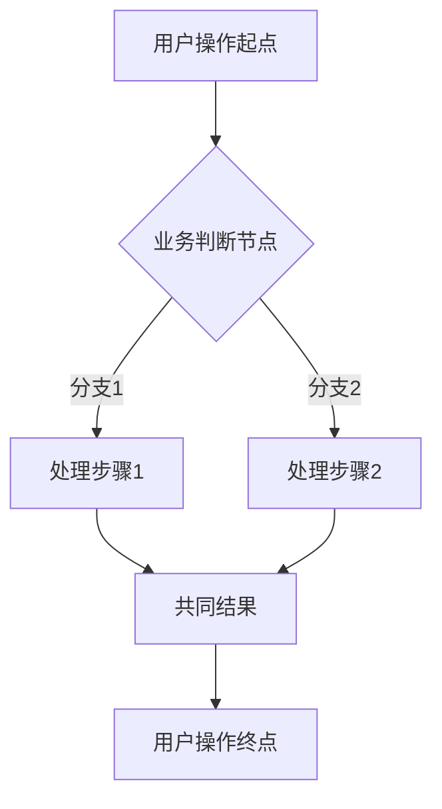

# 产品业务需求规格说明书

> **文档命名**：`[功能模块名称]_需求文档.md`  
> **存放位置**：`docs/requirements/`  
> **适用场景**：面向产品经理、业务方、测试人员的业务视角需求文档  
> **生成来源**：基于 `docs/prd/` 前端技术PRD转换而成

---

# 1 需求说明

## 1.1 [功能模块名称]

### 模块概述

[描述该功能模块的整体业务价值和主要作用，说明模块解决的问题和目标用户群体]

**与其他模块的关联关系**：
- [说明该模块与系统中其他模块的业务关联]

```mermaid
flowchart TD
    A[用户进入{功能模块名称}] --> B{业务流程判断}
    B -->|条件1| C[业务操作1]
    B -->|条件2| D[业务操作2]
    C --> E[结果展示/跳转]
    D --> E
    E --> F[结束/进入下一模块]
```

---

### 1.1.1 [一级功能名称]

#### 功能概述

[描述该一级功能的业务作用和用户价值]

• **整体业务流程图**



• **用户场景：**

[描述具体用户角色在什么业务场景下使用该功能，用户的动机和目标是什么]

示例：`作为{用户角色}，在{具体业务场景}下，需要{达成什么目标}，以便{获得什么业务价值}`

• **功能描述：**

[使用业务语言简洁描述功能作用，避免技术术语，说明功能解决了什么业务问题]

• **优先级：** 高/中/低

• **输入/前置条件：**

[根据页面类型选择对应模板]

- **列表页面**：`用户登录后，从左侧菜单进入【{模块名称}】-【{页面名称}】页面`
- **新增页面**：`用户登录后，在【{列表页面}】点击【添加】按钮，进入【{添加页面}】`
- **编辑页面**：`用户登录后，在【{列表页面}】点击【编辑】按钮，进入【{编辑页面}】`
- **详情页面**：`用户登录后，在【{列表页面}】点击【{字段名称}】，进入【{详情页面}】`
- **Tab页面**：`用户登录后，在【{详情页面}】点击【{Tab名称}】Tab`

• **需求描述：**

1. **功能逻辑说明**

   [必须结合PRD和原始需求文档，详细阐述业务逻辑和处理流程]

   a) 业务流程图
   
   ```mermaid
   flowchart TD
       A[用户进入页面] --> B[页面初始化]
       B --> C{数据加载判断}
       C -->|有数据| D[展示数据列表]
       C -->|无数据| E[展示空状态]
       D --> F[用户操作]
       F --> G{操作类型判断}
       G -->|查询| H[筛选/搜索]
       G -->|新增| I[打开新增弹窗]
       G -->|编辑| J[打开编辑弹窗]
       G -->|删除| K[二次确认弹窗]
       H --> D
       I --> L[表单校验]
       J --> L
       L -->|校验通过| M[保存数据]
       L -->|校验失败| N[提示错误信息]
       M --> D
       N --> L
       K -->|确认| O[执行删除]
       K -->|取消| D
       O --> D
   ```

   b) 业务规则说明
      i. [核心业务规则1的详细说明]
      ii. [核心业务规则2的详细说明]
      iii. [状态流转规则]

   c) 数据流转过程
      i. [数据从哪里获取]
      ii. [数据经过什么处理]
      iii. [数据展示到哪里]

2. **界面布局与交互**

   a) 页面整体布局
      i. [描述页面区域划分：搜索区、操作区、数据展示区等]
      ii. [各区域的位置和作用说明]

   b) 搜索/筛选区
      i. [筛选字段列表及说明]
      ii. [筛选触发方式：点击筛选按钮/即时筛选/回车触发]
      iii. [默认值设置：如"全部"或特定选项]

   c) 操作区
      i. [主要操作按钮及说明]
      ii. [按钮权限控制说明]

   d) 数据展示区
      i. [列表字段及说明：字段名称、含义、展示格式]
      ii. [排序规则]
      iii. [分页规则：每页条数、分页组件位置]
      iv. [空状态展示]

3. **新增/编辑功能**

   a) 触发方式
      i. [点击什么按钮/区域触发]
      ii. [弹窗/新页面的打开方式]

   b) 表单字段及校验规则
      i. [字段名称、类型、是否必填、默认值、校验规则]
      
      | 字段名称 | 字段类型 | 是否必填 | 默认值 | 校验规则 | 业务说明 |
      |---------|---------|---------|-------|---------|---------|
      | [字段1] | [文本/数字/日期/枚举等] | 是/否 | [默认值] | [长度/格式/范围] | [业务含义] |
      | [字段2] | [文本/数字/日期/枚举等] | 是/否 | [默认值] | [长度/格式/范围] | [业务含义] |

   c) 提交后的反馈
      i. [成功提示方式及文案]
      ii. [失败提示方式及文案]
      iii. [保存后页面刷新/跳转逻辑]

4. **删除/危险操作**

   a) 触发方式
      i. [删除按钮位置及触发方式]
      ii. [是否需要二次确认：固定文案"此操作不可恢复，是否继续？"]

   b) 删除后的影响
      i. [删除成功后列表刷新方式]
      ii. [删除失败的处理方式]
      iii. [关联数据的处理逻辑]

5. **数据处理规则**

   a) 字段验证规则
      i. [各字段的数据格式要求]
      ii. [字符长度限制]
      iii. [特殊字符限制]

   b) 必填/选填说明
      i. [必填字段列表]
      ii. [选填字段列表]

   c) 默认值设置
      i. [各字段默认值说明]

6. **异常场景**

   [必填：列举可能出现的异常情况和处理方案]

   a) [异常场景1：网络异常]
      i. 触发条件：网络中断或请求超时
      ii. 系统反馈：显示加载失败提示，提供重试按钮
      iii. 用户指引：点击重试按钮重新加载数据

   b) [异常场景2：权限不足]
      i. 触发条件：用户无操作权限
      ii. 系统反馈：操作按钮置灰或隐藏，点击时提示权限不足
      iii. 用户指引：联系管理员申请权限

   c) [异常场景3：数据异常]
      i. 触发条件：数据格式错误/数据缺失
      ii. 系统反馈：表单校验提示具体错误信息
      iii. 用户指引：根据提示修正输入内容

   d) [异常场景4：业务规则冲突]
      i. 触发条件：[具体业务冲突条件]
      ii. 系统反馈：[错误提示方式及文案]
      iii. 用户指引：[用户应该如何处理]

7. **影响范围**

   [必填：说明此功能对其他页面/模块的影响，如无则写"无"]

   [注意：仅描述其他页面因本功能而产生的关联影响]

   a) [一级菜单]-[二级菜单]-[页面名称]
      i. 影响说明：[具体影响描述]
      ii. 关联逻辑：[与本功能的业务关联]

   b) [一级菜单]-[二级菜单]-[页面名称]
      i. 影响说明：[具体影响描述]
      ii. 关联逻辑：[与本功能的业务关联]

• **输出/后置条件：**

[操作完成后用户看到的结果或系统状态变化，如无可空]

- [描述操作成功后的页面状态]
- [描述数据变化对用户的影响]

• **性能指标：**

[如有性能要求则填写，如无可空]

- 页面加载时间：<= [X] 秒
- 列表查询响应时间：<= [X] 秒
- 表单提交响应时间：<= [X] 秒
- 支持的最大数据量：[X] 条记录

• **补充说明：**

[其他需要特别说明的事项，如无可空]

- [补充事项1]
- [补充事项2]

---

#### 1.1.1.1 [二级功能名称]

• **用户场景：** [描述用户场景]

• **功能描述：** [简洁描述功能]

• **优先级：** 高/中/低

• **输入/前置条件：** [前置条件]

• **需求描述：**

1. **功能逻辑说明**

   [详细业务逻辑说明]

2. **界面描述**

   a) [界面元素1]
   b) [界面元素2]

3. **业务规则**

   a) [规则1]
   b) [规则2]

4. **异常场景**

   a) [异常场景1]
   b) [异常场景2]

5. **影响范围**

   [影响范围说明，无则写"无"]

• **输出/后置条件：** [后置条件]

• **性能指标：** [性能指标]

• **补充说明：** [补充说明]

---

##### 1.1.1.1.1 [三级功能名称]

[三级功能内容结构同上，按需使用]

---

## 1.2 [另一个功能模块]

[按上述结构继续编写其他功能模块...]

---

# 附录

## 变更历史

> **说明**：本文档采用「全量文档 + 版本标记」策略，始终维护最新完整需求。  
> 每次迭代更新时，在表格顶部追加新的变更记录，便于追溯功能演进过程。

| 版本 | 日期 | 变更类型 | 变更内容 | 变更原因 | 影响范围 |
|------|------|---------|---------|---------|---------|
| V1.0.0 | YYYY-MM-DD | 初始版本 | 功能模块初始实现 | - | - |

**变更类型说明**：
- **新增**：新增功能点或页面
- **优化**：对现有功能的改进（交互、性能、体验等）
- **修复**：修复问题或缺陷
- **删除**：移除已废弃功能
- **重构**：业务逻辑调整（非技术重构）

---

## 附录A：用户角色说明

| 角色名称 | 角色描述 | 主要权限 | 使用场景 |
|---------|---------|---------|---------|
| [角色1] | [角色描述] | [主要权限] | [典型使用场景] |
| [角色2] | [角色描述] | [主要权限] | [典型使用场景] |

## 附录B：术语表

| 术语 | 定义 | 业务说明 |
|-----|------|---------|
| [术语1] | [定义] | [业务场景中的含义] |
| [术语2] | [定义] | [业务场景中的含义] |

## 附录C：参考文档

- **前端技术PRD**：`docs/prd/ATO_V[X.Y.Z]-页面需求与交互规格.md`
- **原始需求文档**：`prompt/AutoTestOne-V[X.Y.Z]-原始页面需求设计.md`
- **变更记录**：`docs/prd/ATO_V[X.Y.Z]-变更记录.md`
- **生成规则**：`.cursor/rules/prd-to-requirements.mdc`（约束文档结构和必填项）

---

**文档版本：** V[X.Y.Z]  
**最后更新：** [YYYY-MM-DD]  
**编写人：** [产品经理/AI]  
**审核人：** [业务方/测试负责人]
