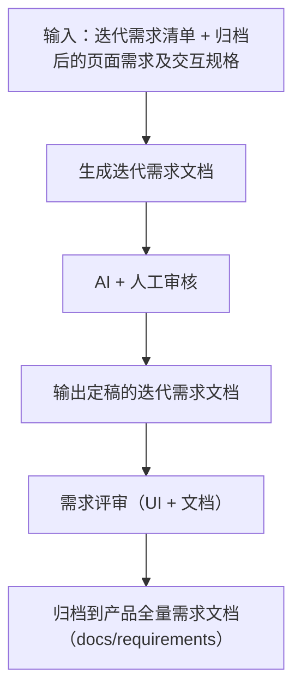

# AutoTestOne UI - 使用指导

> 基于 Cursor AI 的前端页面原型开发，用于替代传统原型进行需求澄清。

---

## 项目概述

**产品名称**：AutoTestOne（ATO）自动化测试平台  
**技术栈**：React + TypeScript + Ant Design + Vite  
**开发模式**：Spec-Driven Development（基于文档的前端开发）

**核心目标**：
- 通过 AI 生成可交互的前端页面替代静态原型
- 快速验证需求、澄清交互细节
- 建立可维护的需求-设计-开发链路

---

## 文档体系结构

```
docs/
├── prd/                           # 迭代评审区（PRD、评审稿、变更记录）
│   ├── PRD生成与验收清单.md               # 生成后评审清单
│   ├── ATO_V1.0.0-变更记录-示例.md        # 【示例】变更记录格式模板
│   ├── V1.0.0/                            # 版本目录（示例）
│   │   ├── ATO_V1.0.0-页面需求与交互规格.md
│   │   ├── ATO_V1.0.0_需求文档.md
│   │   └── ATO-V1.0.0-{功能模块名称}_需求文档.md
│   ├── V1.0.1/                            # 版本目录（示例）
│   │   ├── ATO_V1.0.1-页面需求与交互规格.md
│   │   └── ATO_V1.0.1-变更记录.md
│   └── ...
│
├── requirements/                  # 全量业务需求区（仅存放已评审并明确指令合入内容）
│   ├── 系统设置/
│   ├── 自动化开发/
│   ├── 版本用例开发/
│   ├── 自动化应用/
│   ├── 测试工具/
│   └── README.md
│
└── spec/                          # 工程活文档（随迭代更新）
    ├── intake/                    # Spec 启动元输入（冻结，只读）
    │   ├── ATO_V1.0.0-输入包_00-总控入口.md
    │   ├── ATO_V1.0.0-输入包_01-需求输入包.md
    │   ├── ATO_V1.0.0-输入包_02-UI交互输入包.md
    │   └── ATO_V1.0.0-输入包_03-Spec工程输入包.md
    ├── 01-信息架构与路由.md         # 页面清单、路由、跳转关系
    ├── 02-数据模型.md              # 类型定义、API 契约
    ├── 03-组件规范.md              # 视觉规范、复用组件
    ├── 04-页面契约.md              # 逐页详细设计
    ├── UI-UE走查清单.md            # 页面收尾：美观与规范逐项核对（配 ui-ux-polish 规则）
    ├── 05-状态枚举与颜色.md         # 状态映射
    ├── 06-开发进度.md              # 进度追踪、技术债务
    ├── AI-新增页面提示词模板.md      # 给 Cursor 的标准输入
    └── 99-文档同步检查清单.md      # 更新操作指南

src/
├── layouts/       # 主框架 / 新窗口等布局
├── router/        # 路由表（AppRoutes）
├── constants/     # 路由等常量（与 docs/spec/01 对齐）
├── services/      # HTTP 基座（接 API 时扩展）
├── utils/         # 工具（如 formatDateTime）
├── components/    # 可复用业务组件（随开发补充）
├── pages/         # 页面组件
├── mocks/         # Mock 数据
├── types/         # TypeScript 类型
└── hooks/         # 自定义 Hooks（见 hooks/README.md）

prompt/                            # 通用 Cursor 提示词、原始需求稿等
├── 原始需求转前端PRD提示词.md         # 原始需求 → 前端 PRD 任务提示词（含 AI 自检清单）
├── 前端PRD转产品需求文档提示词.md     # 前端 PRD → 产品需求文档（含双门禁与标准调用模板）
├── prompt_optimization_requirements/ # 需求文档优化规则包（拆分/结构/列表/详情/组件等）
├── 聚合生成当前有效规格.md           # 3-5 迭代后聚合基线+变更记录
├── AutoTestOne-V*-原始页面需求设计.md
└── README.md

template/                          # 页面 PRD 空白模版
└── 页面需求与交互规格-模版.md

.cursor/rules/                     # Cursor 项目规则（按需匹配文件生效）
│   （含 prd-from-raw.mdc、prd-to-requirements.mdc、requirements-module-split.mdc、page-jsdoc.mdc、ui-ux-polish.mdc 等）
```

### 原始需求 → 交互规格（提示词 + 规则 + 双验收）

若迭代从 **`prompt/AutoTestOne-V*-原始页面需求设计.md`** 开始，建议固定走：

**第一步：生成 PRD + AI 自检**
1. 打开 **`prompt/原始需求转前端PRD提示词.md`**，按「输入准备」`@` 引用：原始需求 + 范例 PRD + 模版 + 上一版（如有）
2. 粘贴「任务正文」整段到 Cursor，AI 生成 PRD 初稿
3. **AI 自检（强制）**：按提示词内【强制自检流程】逐项检查，输出【AI 自检结果】

**第二步：人工验收（强制）**
4. 使用 **`docs/prd/PRD生成与验收清单.md`** 进行人工评审，全部勾选后才视为**定稿**
5. 未通过项 → 修改 → 回到第一步重新自检

**第三步：同步与开发**
6. 定稿后同步 `docs/spec/`（04-页面契约、02-数据模型等）
7. 进入页面开发

**依赖规则**：**`.cursor/rules/prd-from-raw.mdc`**（编辑 `docs/prd`、`prompt`、模版时可在 Cursor 中勾选 **prd-from-raw** 规则）

详见 **`docs/prd/README.md`**。

---

## 版本管理策略

### 版本号规则

```
V1.0.0（基线版本）
   │
   ├── 迭代 1 开发期 → V1.1.0（交付）
   │
   ├── 迭代 2 开发期 → V1.2.0（交付）
   │
   └── ...
```

- **小版本号（X.X.0）**：跟随迭代周期更新
- **迭代期间**：版本号保持不变，修改记录在 CHANGELOG
- **迭代交付**：归档当前版本快照，版本号 +1

### 基线冻结原则

| 文档类型 | 版本策略 | 说明 |
|---------|---------|------|
| `docs/spec/intake/ATO_V1.0.0-输入包_*.md` | 冻结 | Spec 启动元输入基线，作为历史参考 |
| `docs/prd/V1.0.0/ATO_V1.0.0-页面需求与交互规格.md` | 冻结 | V1.0.0 页面 PRD 基线 |
| `docs/prd/V1.X.X/ATO_V1.X.X-页面需求与交互规格.md` | 迭代新增 | 每次迭代新建，描述增量需求 |
| `docs/spec/*.md` | 活文档 | 随迭代持续更新，反映最新设计 |

---

## 开发工作流程

### V1.0.0 初始化流程（已完成）

```
docs/spec/intake/ 四个输入包 ──→ Cursor 产出 Spec ──→ 初始化项目 ──→ 开发页面
      （元输入基线）              （docs/spec/）      （技术栈）      （项目管理）
```

### V1.0.1+ 迭代流程（PRD 驱动）

```
prompt/AutoTestOne-V1.0.1-原始页面需求设计.md
              │
              ▼
    ┌─────────────────────────────┐
    │  Step 1: 生成 PRD + AI 自检 │  ← 粘贴「原始需求转前端PRD提示词」任务正文
    │  （原始需求 → PRD 初稿）    │     AI 按清单自检并报告结果
    └─────────────┬───────────────┘
                  │
                  ▼
    ┌─────────────────────────────┐
    │  Step 2: 人工验收（强制）   │  ← 使用 PRD生成与验收清单.md
    │  全部勾选 → 定稿            │     未通过 → 修改 → 重新自检
    └─────────────┬───────────────┘
                  │
                  ▼
    ┌─────────────────────────────┐
    │  Step 3: 更新 Spec          │  ← 同步 docs/spec/ 活文档
    │  （04-页面契约/02-数据模型等）│
    └─────────────┬───────────────┘
                  │
                  ▼
    ┌─────────────────────────────┐
    │  Step 4: 开发计划           │  ← 页面优先级、依赖、工时
    └─────────────┬───────────────┘
                  │
                  ▼
    ┌─────────────────────────────┐
    │  Step 5: 逐页开发           │  ← AI-新增页面提示词模板
    │  （开发 → 运行验证 → 修改） │
    └─────────────┬───────────────┘
                  │
                  ▼
    ┌─────────────────────────────┐
    │  Step 6: 迭代归档           │  ← 全部验收通过后归档
    └─────────────────────────────┘
```

### 详细步骤说明

#### Step 1: 生成 PRD + AI 自检

**操作**：
1. 打开 `prompt/原始需求转前端PRD提示词.md`，按「输入准备」`@` 引用文件：
   - 原始需求：`prompt/AutoTestOne-V1.0.1-原始页面需求设计.md`
   - 结构范例：`docs/prd/V1.0.0/ATO_V1.0.0-页面需求与交互规格.md`
   - 章节模版：`template/页面需求与交互规格-模版.md`
   - 上一版 PRD（如有）
2. 粘贴「任务正文」整段到 Cursor

**AI 执行**：
- 从原始需求文件名提取版本号（如 V1.0.1）
- 输出到 `docs/prd/V1.0.1/ATO_V1.0.1-页面需求与交互规格.md`
- 按【强制自检流程】逐项检查（产品侧 6 项 + 前端侧 5 项 + 原始稿对齐 2 项）
- 输出【AI 自检结果】

**门禁**：自检未全部通过 → 必须修复后再交付

---

#### Step 2: 人工验收（强制）

**输入**：AI 生成的 PRD 初稿 + 【AI 自检结果】

**操作**：
1. 打开 `docs/prd/PRD生成与验收清单.md`
2. 逐项勾选（产品侧 6 项 + 前端侧 5 项 + 原始稿对齐 2 项 + 定稿动作）
3. **全部勾选** → 标记为「定稿」
4. **未通过项** → 修改 PRD → 回到 Step 1（重新自检）

**门禁**：未经过人工验收清单确认 → 明确标注「待评审草稿」，不得进入 Step 3

---

#### Step 3: 更新 Spec

**触发时机**：PRD 人工验收通过后

**更新文档**：
1. **04-页面契约.md**：新增页面章节、标记已有页面变更
2. **02-数据模型.md**：如有字段变更，同步更新类型定义
3. **06-开发进度.md**：规划迭代目标、开发顺序

**原则**：
- 保留历史设计记录（标注"V1.0.0 设计"和"V1.0.1 变更"）
- 不删除内容，只追加或标记废弃

---

#### Step 4: 开发计划

**输出内容**：
- 页面开发优先级（P0/P1/P2）
- 页面间依赖关系
- 预计开发工时
- 技术风险点

---

#### Step 5: 逐页开发（代码先行 → 反向更新文档）

本流程采用「**代码实现 → 验收优化 → 文档记录**」模式，适应原型驱动开发。

**单页开发循环**：

```
AI 生成代码初稿 ──→ 运行验证 ──→ 交互验收优化 ──→ 代码定稿
                                            ↓
                                    JSDoc 注释记录变更
                                            ↓
                                    填写「变更记录」文档
```

**关键动作**：

1. **代码定稿后写注释**：在 `src/pages/*.tsx` 顶部添加 JSDoc：
   ```typescript
   /**
    * @page 项目管理
    * @version V1.0.0
    * @base ATO_V1.0.0-页面需求与交互规格.md 第 4.2 节
    * @changes
    *   - V1.0.0: 初始实现（详细列出功能点）
    *   - V1.0.1: 优化团队筛选（原因：团队太多）
    */
   ```
   参考：`src/pages/ProjectList.tsx` 顶部注释

   **Cursor 自动约束**：编辑 `src/pages/**/*.tsx` 时会匹配项目规则 `.cursor/rules/page-jsdoc.mdc`，AI 应补全/维护上述 JSDoc。

2. **每迭代写「变更记录」**：
   - 新建 `docs/prd/V{X.Y.Z}/ATO_V{X.Y.Z}-变更记录.md`
   - 仅记录「与上一版相比的变化」，不写完整设计
   - 模板：`docs/prd/ATO_V1.0.0-变更记录-示例.md`（位于 prd 根目录）

3. **定期聚合**（3-5 迭代后）：
   - 使用 `prompt/聚合生成当前有效规格.md`
   - 生成 `docs/prd/V1.0.x/ATO_V1.0.x-当前有效规格.md`（完整可读）

**文档关系**：
- 基线 `ATO_V1.0.0-页面需求与交互规格.md`（冻结，记录最初设计）
- 增量 `ATO_V1.0.1-变更记录.md`（仅差异）
- 聚合 `ATO_V1.0.x-当前有效规格.md`（基线+增量合并，可读）
- 代码注释（实时最新，开发时参考）

---

#### Step 6: 生成产品需求说明书（⚠️ 统一生成）

**触发时机**：**用户明确指令后**（不要在单页面完成后立即生成）

**原因**：
- 多页面间存在业务逻辑关联（如：项目管理 → 项目详情 → 版本用例开发）
- 需统一视角描述用户完整操作流程
- 识别跨页面的影响范围

**操作**：
1. 等待用户发送统一生成指令（指定需要生成的页面列表）
2. 使用 `prompt/前端PRD转产品需求文档提示词.md`
3. `@` 引用：PRD + 变更记录 + 原始需求 + 代码注释
4. 默认在 `docs/prd/{版本号}/` 生成按功能模块拆分的评审稿：`ATO-{版本号}-{功能模块名称}_需求文档.md`
5. 仅在收到“允许合入全量（docs/requirements）”明确指令后，才同步到 `docs/requirements/` 对应业务域目录
5. 确保页面间逻辑一致性和流程连贯性

**目录规范**：
- 前端技术PRD（版本拆分）→ `docs/prd/`（基线+变更记录+聚合规格）
- 产品需求文档（全量策略）→ `docs/requirements/`（单文件始终最新）

**维护策略（全量文档 + 版本标记）**：

| 维度 | 策略 | 说明 |
|------|------|------|
| **主文档** | 按业务域维护全量 | `docs/requirements/{业务域}/` 下维护模块文档，始终保持最新完整版本 |
| **变更追溯** | 文档内表格 | 「变更历史」章节记录每次迭代的改动点（版本/日期/类型/内容/原因/影响） |
| **技术追溯** | 交叉引用 | 业务文档内的变更记录与 `docs/prd/变更记录.md` 技术细节对应 |
| **里程碑归档** | 可选 | 仅大版本（如V1→V2）时复制到 `docs/versions/V{x}/requirements/` |

**更新流程**：
1. 新迭代生成时，AI 读取现有 `docs/requirements/{业务域}/` 下对应模块文档的「变更历史」
2. 在顶部追加新迭代的变更记录
3. 更新需求描述章节中的相关功能点
4. 保持文档整体结构不变

**优势**：
- 业务方/测试人员无需判断看哪个版本（始终打开唯一文档）
- 文档内变更历史表格提供可追溯性
- 与 `docs/prd/` 的技术变更记录形成互补

---

#### Step 7: 迭代归档与基线重构

**触发时机**：所有页面验收通过、产品需求说明书生成完成，或积累 3-5 个迭代后

**常规归档内容**：
- 复制 `docs/spec/` → `docs/versions/V1.0.x/`
- 复制 `docs/prd/V1.0.x/ATO_V1.0.x-变更记录.md` → `docs/versions/V1.0.x/prd/`
- 复制 `docs/requirements/{业务域}/` 下已发布模块文档 → `docs/versions/V1.0.x/requirements/`
- 更新 `VERSION` 文件
- 生成 CHANGELOG

**基线重构（每 3-5 迭代）**：

```
V1.0.0（基线）→ V1.0.1 → V1.0.2 → V1.0.3 → V1.0.4 → V1.0.5
                                      ↓
                            聚合为「ATO_V1.0.5-当前有效规格.md」
                                      ↓
                            人工清理历史包袱
                                      ↓
                            重命名为「ATO_V1.1.0-页面需求与交互规格.md」（新基线，冻结）
                                      ↓
                            删除/归档 V1.0.1~V1.0.5 变更记录
                                      ↓
                            从 V1.1.1 开始新的变更记录循环
```

**重构动作**：
1. 执行「聚合生成当前有效规格」任务
2. 人工清理：删除已废弃交互、合并重复差异说明
3. 重命名新基线，冻结不再修改
4. 旧变更记录归档到 `docs/versions/`

---

## 你的职责 vs AI 的职责

### 你的职责

| 任务 | 说明 |
|------|------|
| 编写原始需求 | 每次迭代新建 `prompt/AutoTestOne-V*-原始页面需求设计.md`（可自由叙事） |
| **人工验收 PRD（强制）** | 使用 `docs/prd/PRD生成与验收清单.md` 逐项评审，全部勾选后才定稿 |
| 验收页面 | 运行验证、提出修改意见 |
| 需求澄清 | 解释业务逻辑、确认交互细节 |
| 决策确认 | 技术方案二选一、需求取舍、确定待定项 |

### AI 的职责

| 任务 | 说明 |
|------|------|
| **生成 PRD + AI 自检（强制）** | 从原始需求生成 `docs/prd/V*/ATO_V*-页面需求与交互规格.md`，并按清单自检输出结果 |
| Spec 更新 | PRD 定稿后同步 `docs/spec/` 活文档（04-页面契约、02-数据模型等） |
| 代码生成 | 基于 Spec 生成页面代码 |
| 问题诊断 | 运行报错、样式问题排查 |
| 方案建议 | 技术实现方案推荐 |

---

## 快速开始

### 启动开发服务器

```bash
npm install
npm run dev
```

访问 `http://localhost:5173/`

### 开始新迭代（示例：V1.0.1）

1. **创建需求文档**  
   新建 `docs/prd/V1.0.1/ATO_V1.0.1-页面需求与交互规格.md`，描述迭代目标（可复制 `template/页面需求与交互规格-模版.md`）

2. **给 Cursor 输入**  
   ```markdown
   基于 docs/prd/V1.0.1/ATO_V1.0.1-页面需求与交互规格.md，执行迭代流程：
   1. 评审变更点
   2. 更新 docs/spec/ 活文档
   3. 制定开发计划
   4. 开始第一页开发
   ```

3. **逐页验收**  
   运行 → 验证 → 反馈修改意见 → 验收通过

4. **迭代归档**  
   全部验收通过后，归档版本快照

---

## 项目状态

**当前版本**：V1.0.0（基线）  
**已开发页面**：项目管理（页面 2）  
**待开发页面**：9 个页面（见 `docs/spec/06-开发进度.md`）

---

## 附录

### 文档规范速查

| 文档 | 用途 | 更新频率 | 版本策略 |
|------|------|---------|---------|
| `docs/prd/VX.X.X/ATO_VX.X.X-页面需求与交互规格.md` | 页面 PRD / 需求源头 | 每迭代新建 | 版本目录管理，评审区默认输出 |
| `docs/requirements/{业务域}/` | 产品需求（业务视角） | 仅评审通过且收到合入指令后更新 | 全量库，按业务域管理 |
| `docs/prd/VX.X.X/ATO_VX.X.X-变更记录.md` | 迭代变更详情 | 每迭代新建 | 增量记录，3-5次聚合 |
| 01-信息架构与路由.md | 页面清单 | 新增页面时 | 活文档，持续更新 |
| 02-数据模型.md | 类型定义 | 字段变更时 | 活文档，持续更新 |
| 03-组件规范.md | 组件复用 | 新增组件时 | 活文档，持续更新 |
| 04-页面契约.md | 逐页设计 | 每页开发前 | 活文档，持续更新 |
| 05-状态枚举与颜色.md | 状态定义 | 状态变更时 | 活文档，持续更新 |
| 06-开发进度.md | 进度追踪 | 持续更新 | 活文档 |

### 核心约束（禁止违反）

- 时间格式统一：`YYYY-MM-DD HH:mm`
- 列表页必须包含：标题、主按钮、筛选/搜索、数据区、分页
- 删除操作必须有二次确认（文案："此操作不可恢复，是否继续？"）
- 状态必须用 Tag 展示，颜色符合规范
- 筛选下拉默认值必须是 `ALL` 或 `全部`
- 搜索框必须支持回车触发

---

## PRD 文档生成流程及需求（最新门禁版）

> 本节为对现有流程的补充与收敛，聚焦「原始需求 -> 前端 PRD -> 产品需求文档 -> 全量合入」。
> 若与旧流程描述存在冲突，以本节为准执行。

### 流程图（迭代需求文档生成与归档）



### 一、目标与分层

- `docs/prd/`：迭代评审区（基线、增量、评审稿、变更记录）。
- `docs/requirements/`：全量业务需求区（仅存放评审通过并明确指令合入后的文档）。
- 拆分粒度统一按「功能模块」，不是按页面数量机械拆分。

### 二、关键规则文件（执行前必须引用）

- `.cursor/rules/prd-from-raw.mdc`：原始需求 -> 前端 PRD。
- `.cursor/rules/prd-to-requirements.mdc`：前端 PRD -> 产品需求文档。
- `.cursor/rules/requirements-module-split.mdc`：功能模块拆分唯一依据（含子页面/子功能归属）。
- `prompt/前端PRD转产品需求文档提示词.md`：业务文档生成任务正文与门禁。
- `prompt/prompt_optimization_requirements/` 目录：结构与优化增强规则包。

### 三、标准流程（必须按顺序）

1. 产出或更新前端 PRD（评审稿）  
   - 输出到：`docs/prd/V{X.Y.Z}/`。
   - 路径规范：禁止写入 `docs/prd/` 根目录平铺路径。

2. 生成产品需求文档（评审稿）  
   - 默认输出到：`docs/prd/V{X.Y.Z}/`。
   - 文件命名：`ATO-V{X.Y.Z}-{功能模块名称}_需求文档.md`。
   - 拆分依据：必须引用 `.cursor/rules/requirements-module-split.mdc`。
   - 子页面/子功能必须纳入同一模块文档（如：测试运行包含任务详情）。

3. 评审与修订  
   - 按质量门禁清单逐项检查（结构完整、流程图、异常场景、影响范围、字段规则）。
   - 未通过前持续修订，保持在 `docs/prd/V{X.Y.Z}/`。

4. 合入全量需求库（强门禁）  
   - 仅当收到明确指令：**允许合入全量（docs/requirements）**。
   - 合入后按业务域目录存放：`系统设置/自动化开发/版本用例开发/自动化应用/测试工具`。

### 四、硬门禁（必须同时满足）

- 未收到“统一生成”指令：不得批量生成产品需求文档。
- 未收到“允许合入全量（docs/requirements）”指令：不得写入 `docs/requirements/`。
- 任何拆分动作必须引用 `.cursor/rules/requirements-module-split.mdc`。
- 变更历史放在附录，不放文档顶部。
- 参考路径必须使用版本目录：`docs/prd/V{X.Y.Z}/...`。

### 五、交付物清单（按阶段）

- 迭代评审阶段：
  - `docs/prd/V{X.Y.Z}/ATO_V{X.Y.Z}-页面需求与交互规格.md`
  - `docs/prd/V{X.Y.Z}/ATO_V{X.Y.Z}-变更记录.md`（如有）
  - `docs/prd/V{X.Y.Z}/ATO-V{X.Y.Z}-{功能模块名称}_需求文档.md`（按模块拆分）

- 全量合入阶段（需明确指令）：
  - `docs/requirements/{业务域}/...` 下更新对应模块文档（保持全量最新）。

---

**最后更新**：2026-03-20  
**维护者**：AI + 你
