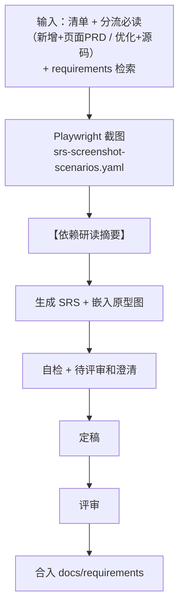

# AutoTestOne UI - 使用指导

> 基于 Cursor AI 的 **Spec-Driven 需求工程**：从迭代需求清单生成 **页面交互规格与可交互 HTML 原型**（替代静态原型、澄清交互），并产出 **迭代《需求规格说明书》（SRS）** 供研发 spec-coding 与测试验收；定稿后可合入全量需求库。

---

## 项目概述

**产品名称**：AutoTestOne（ATO）自动化测试平台  
**技术栈**：React + TypeScript + Ant Design + Vite  
**开发模式**：Spec-Driven Development（文档驱动：迭代清单 → 页面交互规格 → 原型 → 需求规格说明书 → 工程实现）

**核心目标**：
- 从迭代需求清单经 AI 辅助生成 **《页面需求与交互规格》** 与可交互前端原型，快速验证需求、澄清交互细节
- 从已定稿清单（及按门禁的页面规格）生成 **《需求规格说明书》（SRS）**，作为研发方案设计与 spec-coding 的迭代级主输入
- 建立可维护的 **清单 → 页面规格 → 原型 → SRS → Spec/代码 → 全量需求库** 闭环链路

---

## 从迭代需求清单到全量需求库：项目闭合主流程

> **读前说明**：本节约定 **从「迭代需求清单」到「定稿迭代 PRD（需求规格说明书）」再合入 `docs/requirements/`** 的 **完整闭环**；与下文各节为 **总述 vs 子步骤** 关系。**页面 PRD**（《页面需求与交互规格》）从清单经原始稿到定稿与 Spec 同步，以 **「开发工作流程」→ 详细步骤 Step 0～3** 为唯一展开处；**SRS** 的操作细则、流程图、硬门禁与交付物清单以 **Step 6** 为唯一展开处。若与旧表述冲突，**以本节对文档角色的定义为准**。

### 文档类型与真源（避免混淆）

| 交付物 | 典型路径 | 用途与读者 | 与开发的关系 |
|--------|----------|------------|--------------|
| **迭代需求清单** | `docs/prd/V{X.Y.Z}/ATO_V{X.Y.Z}迭代需求清单.md` | 产品规划；REQ 与一/二/三级需求追溯 | 全链路的 **输入源** |
| **原始页面需求设计** | `prompt/page_design/AutoTestOne-V* 原始页面需求设计.md` | 从清单展开为 **新增页** 的草图与信息架构 | **仅本迭代有新增页面时** 才需生成/大改；无新增页可跳过 |
| **页面需求与交互规格** | `docs/prd/V{X.Y.Z}/ATO_V{X.Y.Z}-页面需求与交互规格.md` | 支撑 **HTML 页面原型** 的版式、控件、**§ 章节锚点** | **不**作为「交付研发的唯一迭代级 PRD」；与实现冲突时以 **需求规格说明书** 为准，并回写本文件 |
| **需求规格说明书（= 本流程中的「迭代 PRD」）** | `docs/prd/V{X.Y.Z}/ATO_V{X.Y.Z}-{一级需求描述}-需求规格说明书.md`（`{一级需求描述}` 与迭代清单「一级需求」列一致；路径非法字符替换为 `_`）。结构见 `template/需求规格说明书-模版.md`，质量参照 `template/ATO_V1.0.1-P5-需求规格说明书-范例-市场缺陷分析.md`（范例文件名另含 `-范例-`，正式交付物不带） | 供 **研发与 AI 做方案设计、spec-coding、自测** 的 **迭代级主输入** | **定稿后** 实现与验收口径 **以此为准** |
| **全量需求库** | `docs/requirements/{业务域}/…` | 多迭代沉淀后的业务全量需求 | **仅**评审通过且收到 **明确合入指令** 后合并更新 |

### 闭合流程（须按顺序执行）

1. **编制迭代需求清单**  
   按 **`template/迭代需求清单-模版.md`** 填写（含 §2.1 页面增量、§8 自检等）；**「需求说明」** 尽量达到验收级（字段、规则、例外）。  
   **从 Excel 粘贴生成时**：使用 **`prompt/迭代需求清单-从Excel生成与质量检测.md`**（规则 **`.cursor/rules/iteration-backlog-from-excel.mdc`**），**一次**完成清单 MD 与同目录 **`ATO_{版本}-需求清单-质量检测报告.md`**；处理报告中的 P0/确认项后再将清单标为「已确认」。

2. **（条件）生成原始页面需求设计**  
   基于 **迭代需求清单 + 对应提示词与规则**（如 `prompt/page_design/原始页面需求设计-生成提示词.md`、`.cursor/rules/raw-page-design-from-v100-template.mdc`）。**仅生成本迭代「新增页面」相关章节**；若本迭代 **无新增页面**，**无须**生成或仅需极小修订原文稿。

3. **人工验收** `prompt/page_design/` 下原始页面需求设计稿。

4. **生成《页面需求与交互规格》**  
   使用 `prompt/page_design/原始需求转前端PRD提示词.md` 与 `.cursor/rules/prd-from-raw.mdc` 等，产出 `docs/prd/V{X.Y.Z}/ATO_V{X.Y.Z}-页面需求与交互规格.md`，并完成 **AI 自检 + `docs/prd/页面PRD生成与验收清单.md` 人工验收**（详见下文「原始需求 → 交互规格」）。

5. **HTML 页面原型开发**  
   产品与/或前端 **依据《页面需求与交互规格》** 完成可点击原型（替代静态示意图，便于澄清）。

6. **人工验收原型，并反向更新文档**  
   根据验收结论修订 **`页面需求与交互规格`**，并同步有必要时的 **`迭代需求清单`**（REQ 说明、优先级等），保证 **原型 ↔ 清单 ↔ 交互规格** 一致。

7. **生成《需求规格说明书》（迭代 PRD，交付研发）**  
   使用 **`prompt/prompt_prd_writer/需求规格说明书-生成提示词.md`**、**`docs/prd/SRS生成规则-v1.md`** 与 **`.cursor/rules/srs-from-iteration-backlog.mdc`**。**先 Playwright 截图**（`npm run srs:screenshots`），再输出 **【依赖研读摘要】** 并撰写 SRS。按清单 **需求类型** 分流：**新增** 须页面 PRD 已验收；**优化** 不读页面 PRD。质量待决项写入 SRS **# 待评审和澄清**（不单独出检测报告）。

8. **需求澄清、评审与定稿**  
   针对 **《需求规格说明书》** 组织澄清与评审：先 **【SRS 自检结果】**，再用 **`docs/prd/SRS生成与验收清单.md`** **双轨验收** — **L2 产品定稿**（§A～H）→ **L3 spec-coding 就绪**（§J，研发签署）。**L2 通过 ≠ 可单独启动 AI 编码**。

9. **（强门禁）合并至全量需求文档**  
   仅在收到 **明确指令**（如「允许合入全量（docs/requirements）」）后，按 `.cursor/rules/requirements-module-split.mdc` 等规则，将本迭代定稿内容 **合并入** `docs/requirements/` 对应业务域模块文档。

10. **迭代闭环结束**；下一迭代从新的或更新的 **迭代需求清单** 回到步骤 1。

### 与本文件其他章节的关系

| 本节步骤 | 在下文中的展开位置 |
|----------|---------------------|
| 2 | **「开发工作流程」→ 详细步骤：Step 0**（迭代需求清单 → 原始页面需求设计；有新增页时） |
| 4 | **「开发工作流程」→ 详细步骤：Step 1～3**（原始需求 →《页面需求与交互规格》+ 人工验收 + Spec 同步） |
| 5～6 | **「迭代流程（PRD 驱动）」** 中 Step 3～5（Spec/开发）可与原型并行或衔接，以已定稿 **页面需求与交互规格** 为准驱动工程 |
| 7～9 | **「开发工作流程」** 中 **Step 6**（需求规格说明书产出、硬门禁与交付物）及上文闭合主流程步骤 **8～9**（评审定稿、合入全量） |

---

## 文档体系结构

```
docs/
├── prd/                           # 迭代评审区（清单、页面交互规格、需求规格说明书、评审稿、变更记录）
│   ├── 页面PRD生成与验收清单.md           # 《页面需求与交互规格》生成后评审清单
│   ├── SRS生成与验收清单.md               # 《需求规格说明书》生成后评审清单
│   ├── ATO_V1.0.0-变更记录-示例.md        # 【示例】变更记录格式模板
│   ├── V1.0.0/                            # 版本目录（示例）
│   │   ├── ATO_V1.0.0-迭代需求清单.md          # （示例）迭代规划起点
│   │   ├── ATO_V1.0.0-页面需求与交互规格.md     # HTML 原型 / § 锚点
│   │   ├── ATO_V1.0.0-{一级需求描述}-需求规格说明书.md  # 迭代 PRD（命名见闭合主流程表格）
│   │   ├── ATO_V1.0.0_需求文档.md
│   │   └── ATO-V1.0.0-{业务模块名称}_需求文档.md
│   ├── V1.0.1/                            # 版本目录（示例）
│   │   ├── ATO_V1.0.1-页面需求与交互规格.md
│   │   └── ATO_V1.0.1-变更记录.md
│   └── ...
│
├── requirements/                  # 全量业务需求区（仅存放已评审并明确指令合入内容）
│   ├── 系统设置/
│   ├── 自动化开发/
│   ├── 版本用例开发/
│   ├── 自动化应用/
│   ├── 测试工具/
│   └── README.md
│
└── spec/                          # 工程活文档（随迭代更新）
    ├── intake/                    # Spec 启动元输入（冻结，只读）
    │   ├── ATO_V1.0.0-输入包_00-总控入口.md
    │   ├── ATO_V1.0.0-输入包_01-需求输入包.md
    │   ├── ATO_V1.0.0-输入包_02-UI交互输入包.md
    │   └── ATO_V1.0.0-输入包_03-Spec工程输入包.md
    ├── 01-信息架构与路由.md         # 页面清单、路由、跳转关系
    ├── 02-数据模型.md              # 类型定义、API 契约
    ├── 03-组件规范.md              # 视觉规范、复用组件
    ├── 04-页面契约.md              # 逐页详细设计
    ├── UI-UE走查清单.md            # 页面收尾：美观与规范逐项核对（配 ui-ux-polish 规则）
    ├── 05-状态枚举与颜色.md         # 状态映射
    ├── 06-开发进度.md              # 进度追踪、技术债务
    ├── AI-新增页面提示词模板.md      # 给 Cursor 的标准输入
    └── 99-文档同步检查清单.md      # 更新操作指南

src/
├── layouts/       # 主框架 / 新窗口等布局
├── router/        # 路由表（AppRoutes）
├── constants/     # 路由等常量（与 docs/spec/01 对齐）
├── services/      # HTTP 基座（接 API 时扩展）
├── utils/         # 工具（如 formatDateTime）
├── components/    # 可复用业务组件（随开发补充）
├── pages/         # 页面组件
├── mocks/         # Mock 数据
├── types/         # TypeScript 类型
└── hooks/         # 自定义 Hooks（见 hooks/README.md）

prompt/                            # 通用 Cursor 提示词、原始需求稿等
├── page_design/                   # 页面设计：原始需求稿、原始需求 → 前端 PRD
│   ├── AutoTestOne-V*-原始页面需求设计.md
│   ├── 原始页面需求设计-生成提示词.md
│   └── 原始需求转前端PRD提示词.md   # 原始需求 → 前端 PRD（含 AI 自检清单）
├── prompt_prd_writer/             # 迭代 SRS、聚合有效规格（见 README）
│   ├── 需求规格说明书-生成提示词.md   # 迭代清单 →《需求规格说明书》（SRS；含 §4 全量库定位与【依赖研读摘要】门禁）
│   └── 聚合生成当前有效规格.md       # 3-5 迭代后聚合基线+变更记录
├── prompt_optimization_requirements/ # 需求文档优化规则包（拆分/结构/列表/详情/组件等）
└── README.md

template/                          # 模版与黄金范例
├── 页面需求与交互规格-模版.md       # → 页面原型 / § 锚点（步骤 4）
├── 需求规格说明书-模版.md           # → 迭代 PRD / 交付研发（步骤 7）；正式稿文件名 `ATO_V{V}-{一级需求描述}-需求规格说明书.md`
└── ATO_V1.0.1-P5-需求规格说明书-范例-市场缺陷分析.md  # 黄金范例（`-范例-` 后缀；正式交付物不含）

.cursor/rules/                     # Cursor 项目规则（按需匹配文件生效）
│   （含 prd-from-raw.mdc、srs-from-iteration-backlog.mdc、prd-to-requirements.mdc、requirements-module-split.mdc、page-jsdoc.mdc、ato-ui-layout.mdc、ui-ux-polish.mdc 等）
│   skills/ato-ui-develop/          # ATO 原型页 UI 统一开发（Step 5 UI 门禁）
```

各版本目录 `docs/prd/V*/` 下常见 **`ATO_{版本}-迭代需求清单.md`**。从清单到 **`prompt/page_design/AutoTestOne-V*-原始页面需求设计.md`** 再到 **`docs/prd/V*/ATO_*-页面需求与交互规格.md`** 的门禁、操作步骤与双验收，**统一见下文「开发工作流程」→「详细步骤说明」**（**Step 0**：有新增页时；**Step 1～3**：生成/验收页面 PRD、同步 Spec）。目录与角色补充说明见 **`docs/prd/README.md`**。

---

## 版本管理策略

### 版本号规则

```
V1.0.0（基线版本）
   │
   ├── 迭代 1 开发期 → V1.1.0（交付）
   │
   ├── 迭代 2 开发期 → V1.2.0（交付）
   │
   └── ...
```

- **小版本号（X.X.0）**：跟随迭代周期更新
- **迭代期间**：版本号保持不变，修改记录在 CHANGELOG
- **迭代交付**：归档当前版本快照，版本号 +1

### 基线冻结原则

| 文档类型 | 版本策略 | 说明 |
|---------|---------|------|
| `docs/spec/intake/ATO_V1.0.0-输入包_*.md` | 冻结 | Spec 启动元输入基线，作为历史参考 |
| `docs/prd/V1.0.0/ATO_V1.0.0-页面需求与交互规格.md` | 冻结 | V1.0.0 页面 PRD 基线 |
| `docs/prd/V1.X.X/ATO_V1.X.X-页面需求与交互规格.md` | 迭代新增 | 每次迭代新建，描述增量需求 |
| `docs/spec/*.md` | 活文档 | 随迭代持续更新，反映最新设计 |

---

## 开发工作流程

### V1.0.0 初始化流程（已完成）

```
docs/spec/intake/ 四个输入包 ──→ Cursor 产出 Spec ──→ 初始化项目 ──→ 开发页面
      （元输入基线）              （docs/spec/）      （技术栈）      （项目管理）
```

### 迭代流程（PRD 驱动）

> **适用范围**：凡在 **`docs/prd/V{版本号}/`** 下开展的迭代（含 **V1.0.0、V1.0.1、V1.0.1-P5、V2.x** 等任意版本号写法），**均采用本节同一套 PRD 驱动工程路径**；与主版本号或补丁后缀无关。上文 **「V1.0.0 初始化流程」** 仅指项目 **首次** Spec/工程初始化，**不**表示「只有 V1.0.1 之后才走 PRD」。
>
> **总流程索引**：端到端步骤见上文 **「从迭代需求清单到全量需求库：项目闭合主流程」**。本节为 **页面交互规格定稿之后** 的工程侧常规路径（Spec → 开发）；**需求规格说明书（迭代 PRD）** 的生成与评审见该节步骤 **7～9**。

```
docs/prd/V*/ATO_*迭代需求清单.md
              │（无新增页可跳过）按门禁产出原始设计
              ▼
prompt/page_design/AutoTestOne-V*-原始页面需求设计.md（以 @ 为准）
              │（须满足下文 Step 0 门禁）
              ▼
    ┌─────────────────────────────┐
    │  Step 1: 生成 PRD + AI 自检 │  ← 粘贴「原始需求转前端PRD提示词」任务正文
    │  （原始需求 → PRD 初稿）    │     AI 按清单自检并报告结果
    └─────────────┬───────────────┘
                  │
                  ▼
    ┌─────────────────────────────┐
    │  Step 2: 人工验收（强制）   │  ← 使用 页面PRD生成与验收清单.md
    │  全部勾选 → 定稿            │     未通过 → 修改 → 重新自检
    └─────────────┬───────────────┘
                  │
                  ▼
    ┌─────────────────────────────┐
    │  Step 3: 更新 Spec          │  ← 同步 docs/spec/ 活文档
    │  （04-页面契约/02-数据模型等）│
    └─────────────┬───────────────┘
                  │
                  ▼
    ┌─────────────────────────────┐
    │  Step 4: 开发计划           │  ← 页面优先级、依赖、工时
    └─────────────┬───────────────┘
                  │
                  ▼
    ┌─────────────────────────────┐
    │  Step 5: 逐页开发           │  ← AI-新增页面提示词模板
    │  （开发 → 运行验证 → 修改） │
    └─────────────┬───────────────┘
                  │
                  ▼
    ┌─────────────────────────────┐
    │  Step 6: 迭代归档           │  ← 全部验收通过后归档
    └─────────────────────────────┘
```

### 详细步骤说明

#### Step 0: 迭代需求清单 → 原始页面需求设计（条件；须先于 Step 1）

**适用**：当本迭代 **有新增或实质性改版页面**，须从 **`docs/prd/V{版本}/ATO_{版本}迭代需求清单.md`**（或团队约定的等价路径）生成或修订 **`prompt/page_design/AutoTestOne-V{版本} 原始页面需求设计.md`**。**无新增页**：按闭合主流程可跳过本步或仅做小修订；若仍改交互，仍建议对照清单相关行。

当执行本步时，**必须**遵守下列门禁；否则后续《页面需求与交互规格》/实现易出现「仅引用 REQ 编号、清单条文未落地」类偏差。

| 门禁项 | 要求 |
|--------|------|
| **权威提示词** | 按 **`prompt/page_design/原始页面需求设计-生成提示词.md`** 执行（含 **§1 第 4～6 步**、**§1.5 留痕**、**§4 清单硬对齐**、**§6 自检**）。用户发起任务时可粘贴该文件 **§7「粘贴模板」** 并替换版本号与清单路径。 |
| **权威规则** | 在 Cursor 中匹配 **`prompt/page_design/**/*.md`** 时启用 **`.cursor/rules/raw-page-design-from-v100-template.mdc`**（含金样板结构 + **「迭代需求清单对齐（强制）」**）。 |
| **金样板** | 章节骨架须与 **`prompt/page_design/AutoTestOne-V1.0.0 原始页面需求设计.md`** 标题字面一致；禁止擅自新增 `### 0.2` 等与金样板冲突的约束编号（除非已走金样板修订流程）。 |
| **精读清单** | 写 **`## 3 页面设计（简要）` 每一个 `###` 页面前**，须已 **Read** 清单表格中与本页相关的 **「需求说明」**（及同行其它列，以清单实际表头为准）；**禁止**仅用「见 REQ-xxx」代替条文。 |
| **按页串行** | 推荐：**一页**「精读 → 写入口/目标/结构/关键交互 → 自检」完成后再写下一页，禁止未读清单即批量生成多页。 |
| **留痕** | 按提示词 **§1.5**：在对话中输出 `[清单精读] …` 一行，或在正文该页下增加 **「清单依据（摘录）」** 子列表。 |
| **自检** | 交付前完成提示词 **§6** 自检表（含 **「清单条文落地」** 等项），不通过不得声称定稿。 |
| **编辑 prompt 的规则** | 修改 **`prompt/**`** 或 **`.cursor/rules/**`** 前，须先 **Read** 全局 **`prompt-optimizer`** 技能（见 `.cursor/rules/prompt-change-requires-optimizer.mdc`）。 |

**与 Step 1 衔接**：原始设计定稿或修订后，进入 **Step 1**。若原始稿对某能力仍以指针式写「以清单 REQ-xx 为准」，**Step 1** 须 **`@` 并 Read** 同版本 **`ATO_{版本}迭代需求清单.md`** 将「需求说明」展开写入《页面需求与交互规格》（见 **`.cursor/rules/prd-from-raw.mdc`**「迭代需求清单（补读门禁）」及 **`prompt/page_design/原始需求转前端PRD提示词.md`**「输入准备」）。

---

#### Step 1: 生成 PRD + AI 自检

**依赖规则**：编辑 `docs/prd`、`prompt`、模版时可在 Cursor 中勾选 **`.cursor/rules/prd-from-raw.mdc`**。更多说明见 **`docs/prd/README.md`**。

**操作**：

1. 打开 `prompt/page_design/原始需求转前端PRD提示词.md`，按「输入准备」`@` 引用文件：
   - 原始需求：常见为 `prompt/page_design/AutoTestOne-V1.0.1-P5 原始页面需求设计.md`（**以 @ 为准**）
   - **迭代需求清单**（**条件必选**）：当原始稿对某页仍以「以清单 REQ-xx 为准」等指针表述、未展开字段/交互时，**必须 @** `docs/prd/{版本号}/ATO_{版本号}迭代需求清单.md`，将「需求说明」条文展开写入 PRD（详见提示词与 **prd-from-raw** 规则）
   - 结构范例：`docs/prd/V1.0.0/ATO_V1.0.0-页面需求与交互规格.md`（**缺失时按提示词「结构深度范例（降级）」执行**）
   - 章节模版：`template/页面需求与交互规格-模版.md`
   - 上一版 PRD（如有）
2. 粘贴「任务正文」整段到 Cursor

**AI 执行**：
- 从原始需求文件名提取**版本号段**（`AutoTestOne-` 与 `原始页面需求设计` 之间，**含** `-P5` 等后缀，如 `V1.0.1-P5`）
- 输出到 `docs/prd/{版本号}/ATO_{版本号}-页面需求与交互规格.md`（示例：`docs/prd/V1.0.1-P5/ATO_V1.0.1-P5-页面需求与交互规格.md`）
- 按【强制自检流程】逐项检查（产品侧 6 项 + 前端侧 5 项 + **原始稿对齐 3 项**〔含迭代需求清单补读〕）
- 输出【AI 自检结果】

**门禁**：自检未全部通过 → 必须修复后再交付

---

#### Step 2: 人工验收（强制）

**输入**：AI 生成的 PRD 初稿 + 【AI 自检结果】

**操作**：
1. 打开 `docs/prd/页面PRD生成与验收清单.md`
2. 逐项勾选（产品侧 6 项 + 前端侧 5 项 + 原始稿对齐 3 项 + 定稿动作）
3. **全部勾选** → 标记为「定稿」
4. **未通过项** → 修改 PRD → 回到 Step 1（重新自检）

**门禁**：未经过人工验收清单确认 → 明确标注「待评审草稿」，不得进入 Step 3

---

#### Step 3: 更新 Spec

**触发时机**：PRD 人工验收通过后

**更新文档**：
1. **04-页面契约.md**：新增页面章节、标记已有页面变更
2. **02-数据模型.md**：如有字段变更，同步更新类型定义
3. **06-开发进度.md**：规划迭代目标、开发顺序

**原则**：
- 保留历史设计记录（标注"V1.0.0 设计"和"V1.0.1 变更"）
- 不删除内容，只追加或标记废弃

---

#### Step 4: 开发计划

**输出内容**：
- 页面开发优先级（P0/P1/P2）
- 页面间依赖关系
- 预计开发工时
- 技术风险点

---

#### Step 5: 逐页开发（代码先行 → 反向更新文档）

**标准提示词**：`prompt/page_design/页面开发-ato-ui提示词.md`（`@` Skill + 契约后粘贴 §3 任务正文）。

本流程采用「**代码实现 → 验收优化 → 文档记录**」模式，适应原型驱动开发。

**单页开发循环**：

```
AI 生成代码初稿 ──→ 运行验证（功能）──→ ato-ui-develop UI 走查 ──→ 代码定稿
                              ↓                    ↓
                        交互验收优化          【ATO UI 走查结果】
                              ↓                    ↓
                        JSDoc 注释记录变更 ← 填写「变更记录」文档
```

**UI 门禁（强制）**：启用 **`.cursor/skills/ato-ui-develop/`**（Token + 页面壳 + `docs/spec/UI-UE走查清单.md`）。新页须用规定 Shell（或等价参照页骨架）；未输出走查报告 → **不得**标记该页 Step 5 完成。规则：`.cursor/rules/ato-ui-layout.mdc`。

**关键动作**：

1. **代码定稿后写注释**：在 `src/pages/*.tsx` 顶部添加 JSDoc：
   ```typescript
   /**
    * @page 项目管理
    * @version V1.0.0
    * @base ATO_V1.0.0-页面需求与交互规格.md 第 4.2 节
    * @changes
    *   - V1.0.0: 初始实现（详细列出功能点）
    *   - V1.0.1: 优化团队筛选（原因：团队太多）
    */
   ```
   参考：`src/pages/ProjectList.tsx` 顶部注释

   **Cursor 自动约束**：编辑 `src/pages/**/*.tsx` 时会匹配项目规则 `.cursor/rules/page-jsdoc.mdc`，AI 应补全/维护上述 JSDoc。

2. **每迭代写「变更记录」**：
   - 新建 `docs/prd/V{X.Y.Z}/ATO_V{X.Y.Z}-变更记录.md`
   - 仅记录「与上一版相比的变化」，不写完整设计
   - 模板：`docs/prd/ATO_V1.0.0-变更记录-示例.md`（位于 prd 根目录）

3. **定期聚合**（3-5 迭代后）：
   - 使用 `prompt/prompt_prd_writer/聚合生成当前有效规格.md`
   - 生成 `docs/prd/V1.0.x/ATO_V1.0.x-当前有效规格.md`（完整可读）

**文档关系**：
- 基线 `ATO_V1.0.0-页面需求与交互规格.md`（冻结，记录最初设计）
- 增量 `ATO_V1.0.1-变更记录.md`（仅差异）
- 聚合 `ATO_V1.0.x-当前有效规格.md`（基线+增量合并，可读）
- 代码注释（实时最新，开发时参考）

---

#### Step 6: 生成《需求规格说明书》（迭代 PRD，与闭合主流程步骤 7 一致）

> **规则真源**：`docs/prd/SRS生成规则-v1.md`  
> **与闭合主流程的关系**：交付研发的 **迭代级主输入** 为 **`docs/prd/V*/…-{一级需求}-需求规格说明书.md`**（**一份 SRS 仅对应一个一级需求**）。

**触发时机**：已定稿 **迭代需求清单**；按清单 **「需求类型」** 分流 — **新增** 还须 **页面 PRD 已验收**；**优化** 不读页面 PRD。详见 **`prompt/prompt_prd_writer/需求规格说明书-生成提示词.md`** §3。

**输入 → 截图 → 研读 → SRS → 定稿 → 合入（示意）**：


```mermaid
flowchart TB
    A["输入：清单 + 分流必读\n（新增+页面PRD / 优化+源码）\n+ requirements 检索"]
    P["Playwright 截图\nsrs-screenshot-scenarios.yaml"]
    AS["【依赖研读摘要】"]
    B["生成 SRS + 嵌入原型图"]
    C["自检 + 待评审和澄清"]
    D["定稿"]
    E["评审"]
    F["合入 docs/requirements"]

    A --> P --> AS --> B --> C --> D --> E --> F
```

**Agent Skill（推荐）**：启用 **`.cursor/skills/srs-design/`**（`srs-design` Skill），按 **Phase 0 → Phase 1（单一级需求一轮）→ Phase 2** 编排；固定输出 **【依赖研读摘要】→【动机对齐表】→【SRS 自检结果】**；可选 `node .cursor/skills/srs-design/scripts/verify-srs.mjs <SRS路径>` 做机械校验。

**操作**：

1. 声明 **需求类型=新增|优化**；Read 模版、黄金范例、清单；**新增类** Read 页面 PRD；按 §4.2 检索 `docs/requirements/`；Read 对应 `src/`。  
2. **先图后文**：`npm run srs:screenshots -- --version V1.0.1-P6`（见 `scripts/srs-screenshots/README.md`）。  
3. 输出 **【依赖研读摘要】** → 撰写 SRS → **# 待评审和澄清**（问题标 **P0/P1**）→ **【SRS 自检】** → 清单 **L2** → 清单 **L3**（spec-coding 前）。

**硬门禁（定稿）**：

- 未完成 **需求类型声明**、**Playwright（UI=是）**、**【依赖研读摘要】**、**【SRS 自检】**、清单 **L2**：不得标 **L2 产品定稿**。  
- Playwright 非 0 退出 → 写入 **待评审和澄清（P0）**，不得 L2 通过。  
- **AI spec-coding**：须清单 **L3** 通过或 **L3 降级** 已登记外部真源（见 `SRS生成与验收清单.md` §J）。  
- 未收到合入指令：不得写入 `docs/requirements/`。

**全量合入 `docs/requirements/`**（对应上表「合入」）：仅在收到上述明确指令后执行；拆分依据 **`.cursor/rules/requirements-module-split.mdc`**；业务向全量文档形态仍受 **`.cursor/rules/prd-to-requirements.mdc`** 约束（与 SRS 为不同交付物，勿混为唯一真源）。合入后业务域目录示例：`系统设置`、`自动化开发`、`版本用例开发`、`自动化应用`、`测试工具` 等（以全量库实际为准）。

**目录规范**：

- **页面需求与交互规格（原型）** → `docs/prd/V*/ATO_*-页面需求与交互规格.md`
- **需求规格说明书（迭代 PRD）** → `docs/prd/V*/ATO_*-{一级需求}-需求规格说明书.md`
- **全量业务需求库** → `docs/requirements/{业务域}/`（仅合入后）

**本阶段交付物（评审区 / 可选评审稿 / 合入后）**：

- `docs/prd/V{X.Y.Z}/ATO_{V}迭代需求清单.md`
- `prompt/page_design/AutoTestOne-V{X.Y.Z} 原始页面需求设计.md`（**有新增页时**）
- `docs/prd/V{X.Y.Z}/ATO_{V}-页面需求与交互规格.md`（**原型 / § 锚点**）
- **`docs/prd/V{X.Y.Z}/ATO_{V}-{一级需求描述}-需求规格说明书.md`**（**迭代 PRD，交付研发**）
- `docs/prd/V{X.Y.Z}/ATO_{V}-变更记录.md`（如有）
- `docs/prd/V{X.Y.Z}/ATO-V{X.Y.Z}-{业务模块名称}_需求文档.md`（可选：按业务模块拆分的评审稿）
- 全量合入阶段（需明确指令）：`docs/requirements/{业务域}/...` 下更新对应模块文档

**维护策略（全量文档 + 版本标记）**：

| 维度 | 策略 | 说明 |
|------|------|------|
| **主文档** | 按业务域维护全量 | `docs/requirements/{业务域}/` 下维护模块文档，始终保持最新完整版本 |
| **变更追溯** | 文档内表格 | 「变更历史」章节记录每次迭代的改动点（版本/日期/类型/内容/原因/影响） |
| **技术追溯** | 交叉引用 | 业务文档内的变更记录与 `docs/prd/` 下迭代变更记录、SRS 对应 REQ 交叉对照 |
| **里程碑归档** | 可选 | 仅大版本（如V1→V2）时复制到 `docs/versions/V{x}/requirements/` |

**更新流程**：

1. 新迭代以 **《需求规格说明书》** 为评审区主稿定稿后，再按合入指令更新 `docs/requirements/`。
2. 在对应全量文档顶部追加「变更历史」行，并同步功能条文。
3. 保持全量文档整体结构稳定。

**优势**：

- 研发/测试以 **SRS** 为迭代验收口径，避免与页面线稿混源。
- 全量库仍服务业务域长期维护；与 `docs/prd/` 技术迭代物形成互补。

---

#### Step 7: 迭代归档与基线重构

**触发时机**：所有页面验收通过、《需求规格说明书》已定稿，或积累 3-5 个迭代后

**常规归档内容**：
- 复制 `docs/spec/` → `docs/versions/V1.0.x/`
- 复制 `docs/prd/V1.0.x/ATO_V1.0.x-变更记录.md` → `docs/versions/V1.0.x/prd/`
- 复制 `docs/requirements/{业务域}/` 下已发布模块文档 → `docs/versions/V1.0.x/requirements/`
- 更新 `VERSION` 文件
- 生成 CHANGELOG

**基线重构（每 3-5 迭代）**：

```
V1.0.0（基线）→ V1.0.1 → V1.0.2 → V1.0.3 → V1.0.4 → V1.0.5
                                      ↓
                            聚合为「ATO_V1.0.5-当前有效规格.md」
                                      ↓
                            人工清理历史包袱
                                      ↓
                            重命名为「ATO_V1.1.0-页面需求与交互规格.md」（新基线，冻结）
                                      ↓
                            删除/归档 V1.0.1~V1.0.5 变更记录
                                      ↓
                            从 V1.1.1 开始新的变更记录循环
```

**重构动作**：
1. 执行「聚合生成当前有效规格」任务
2. 人工清理：删除已废弃交互、合并重复差异说明
3. 重命名新基线，冻结不再修改
4. 旧变更记录归档到 `docs/versions/`

---

## 你的职责 vs AI 的职责

### 你的职责

| 任务 | 说明 |
|------|------|
| 编写 / 维护 **迭代需求清单** | 模版 `template/迭代需求清单-模版.md`；Excel 入口 `prompt/迭代需求清单-从Excel生成与质量检测.md` + 同目录 `…-质量检测报告.md` |
| 编写 / 从清单生成原始需求 | 每次迭代在 `prompt/page_design/` 维护 `AutoTestOne-V*-原始页面需求设计.md`（**仅新增页**）；若从清单生成，**必须**走 **「迭代需求清单 → 原始页面需求设计」门禁** |
| **人工验收** 《页面需求与交互规格》 | 使用 `docs/prd/页面PRD生成与验收清单.md` 逐项评审，全部勾选后才定稿 |
| **牵头产出《需求规格说明书》（迭代 PRD）** | 确认 **【依赖研读摘要】**；清单 **L2 产品定稿**（产品/测试勾选 §A～H） |
| **SRS → spec-coding 门禁** | 研发勾选清单 **L3**（§J）或登记 **L3 降级**；未 L3 不得仅以 SRS 启动大规模 AI 改码 |
| 验收页面 | 运行验证、提出修改意见 |
| 需求澄清 | 解释业务逻辑、确认交互细节 |
| 决策确认 | 技术方案二选一、需求取舍、确定待定项 |

### AI 的职责

| 任务 | 说明 |
|------|------|
| **生成《页面需求与交互规格》+ AI 自检** | 从原始需求生成 `docs/prd/V*/ATO_V*-页面需求与交互规格.md`，并按清单自检输出结果 |
| **协助生成《需求规格说明书》** | 按 `prompt/prompt_prd_writer/需求规格说明书-生成提示词.md`（**§4**）与 `.cursor/rules/srs-from-iteration-backlog.mdc`，结合模版、黄金范例、清单、**页面交互规格（文件存在则必读）**、**`docs/requirements/` 历史模块文档（若存在）**、`src/` 核对；**先**输出 **【依赖研读摘要】**（§4.3）**再**写正文，并完成 **【SRS 自检】** |
| Spec 更新 | 《页面需求与交互规格》定稿后同步 `docs/spec/` 活文档（04-页面契约、02-数据模型等） |
| 代码生成 | 基于 Spec 生成页面代码 |
| 问题诊断 | 运行报错、样式问题排查 |
| 方案建议 | 技术实现方案推荐 |

---

## 快速开始

### 启动开发服务器

```bash
npm install
npm run dev
```

访问 `http://localhost:5173/`

### 开始新迭代（示例：V1.0.1）

1. **创建需求文档**  
   新建 `docs/prd/V1.0.1/ATO_V1.0.1-页面需求与交互规格.md`，描述迭代目标（可复制 `template/页面需求与交互规格-模版.md`）

2. **给 Cursor 输入**  
   ```markdown
   基于 docs/prd/V1.0.1/ATO_V1.0.1-页面需求与交互规格.md，执行迭代流程：
   1. 评审变更点
   2. 更新 docs/spec/ 活文档
   3. 制定开发计划
   4. 开始第一页开发
   ```

3. **逐页验收**  
   运行 → 验证 → 反馈修改意见 → 验收通过

4. **迭代归档**  
   全部验收通过后，归档版本快照

---

## 项目状态

**当前版本**：V1.0.0（基线）  
**已开发页面**：项目管理（页面 2）  
**待开发页面**：9 个页面（见 `docs/spec/06-开发进度.md`）

---

## 附录

### 文档规范速查

| 文档 | 用途 | 更新频率 | 版本策略 |
|------|------|---------|---------|
| `docs/prd/VX.X.X/ATO_VX.X.X-迭代需求清单.md` | 迭代规划与 REQ 追溯 | 每迭代新建/更新 | 版本目录 |
| `docs/prd/VX.X.X/ATO_VX.X.X-页面需求与交互规格.md` | **HTML 原型** 与交互 § | 每迭代新建/修订 | 版本目录，评审区输出 |
| `docs/prd/VX.X.X/ATO_VX.X.X-{一级需求描述}-需求规格说明书.md` | **迭代 PRD**，交付研发 / AI | 定稿后少改 | 与模版/黄金范例同构；`{一级需求描述}` 对齐清单「一级需求」 |
| `docs/requirements/{业务域}/` | 全量业务需求（合入后）；其下 **`{业务模块}/{业务域}-{业务模块}-{一级需求}_需求文档.md`** 在已存在时，为 **SRS 生成前须 Read** 的存量口径（定位见 **`需求规格说明书-生成提示词.md` §4.2**） | 仅评审通过且收到合入指令后更新 | 全量库，按业务域管理；业务域目录可为 `NN`+业务域（见 `scripts/reorder_requirements_top_dirs.py`） |
| `docs/prd/VX.X.X/ATO_VX.X.X-变更记录.md` | 迭代变更详情 | 每迭代新建 | 增量记录，3-5次聚合 |
| 01-信息架构与路由.md | 页面清单 | 新增页面时 | 活文档，持续更新 |
| 02-数据模型.md | 类型定义 | 字段变更时 | 活文档，持续更新 |
| 03-组件规范.md | 组件复用 | 新增组件时 | 活文档，持续更新 |
| 04-页面契约.md | 逐页设计 | 每页开发前 | 活文档，持续更新 |
| 05-状态枚举与颜色.md | 状态定义 | 状态变更时 | 活文档，持续更新 |
| 06-开发进度.md | 进度追踪 | 持续更新 | 活文档 |

> **页面 PRD（《页面需求与交互规格》）**：清单 → 原始稿 → 生成/验收/同步 Spec 见 **「开发工作流程」→ 详细步骤 Step 0～3**（与闭合主流程步骤 2～4 一致；不在附录重复展开）。**《需求规格说明书》产出与合入**：流程图、须引用规则、硬门禁与阶段交付物清单见 **Step 6**（与闭合主流程步骤 7～9 一致）。

### 核心约束（禁止违反）

- 时间格式统一：`YYYY-MM-DD HH:mm`
- 列表页必须包含：标题、主按钮、筛选/搜索、数据区、分页
- 删除操作必须有二次确认（文案："此操作不可恢复，是否继续？"）
- 状态必须用 Tag 展示，颜色符合规范
- 筛选下拉默认值必须是 `ALL` 或 `全部`
- 搜索框必须支持回车触发

---

**最后更新**：2026-05-14（将原 **「PRD 文档生成流程及需求」** 合并至 **Step 6**；将 **文档体系结构** 中原「原始需求→交互规格 / 清单→原始稿」长文合并为 **Step 0** + **Step 1** 依赖说明指针；SRS 依赖 **`需求规格说明书-生成提示词.md` §4**、**`srs-from-iteration-backlog.mdc`**；**「迭代流程（PRD 驱动）」** 适用于 **`docs/prd/V*/` 下任意版本**）  
**维护者**：AI + 你
